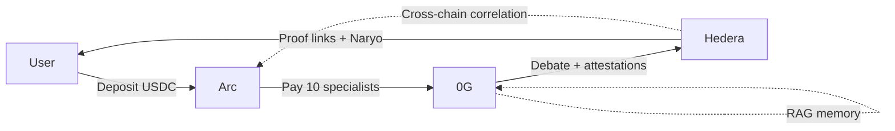
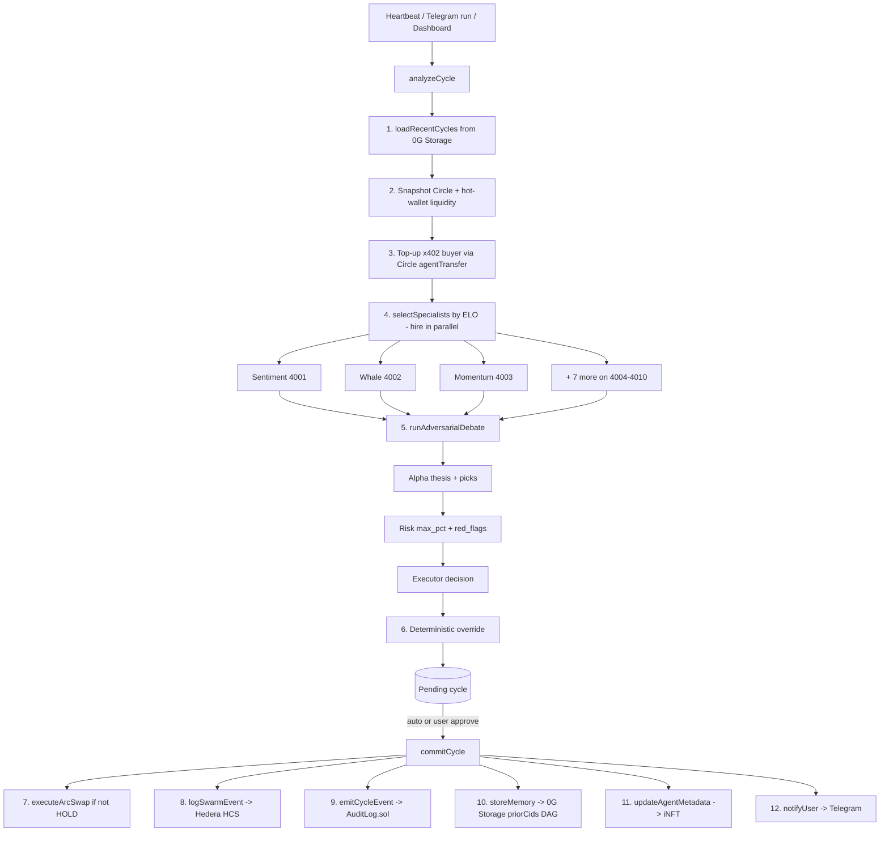
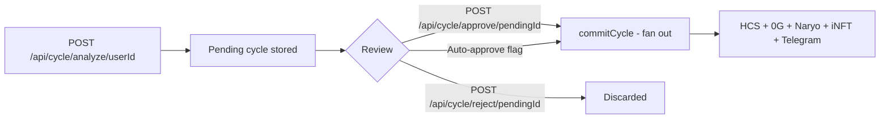
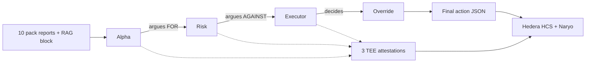
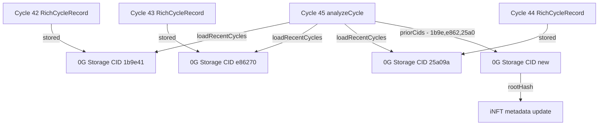
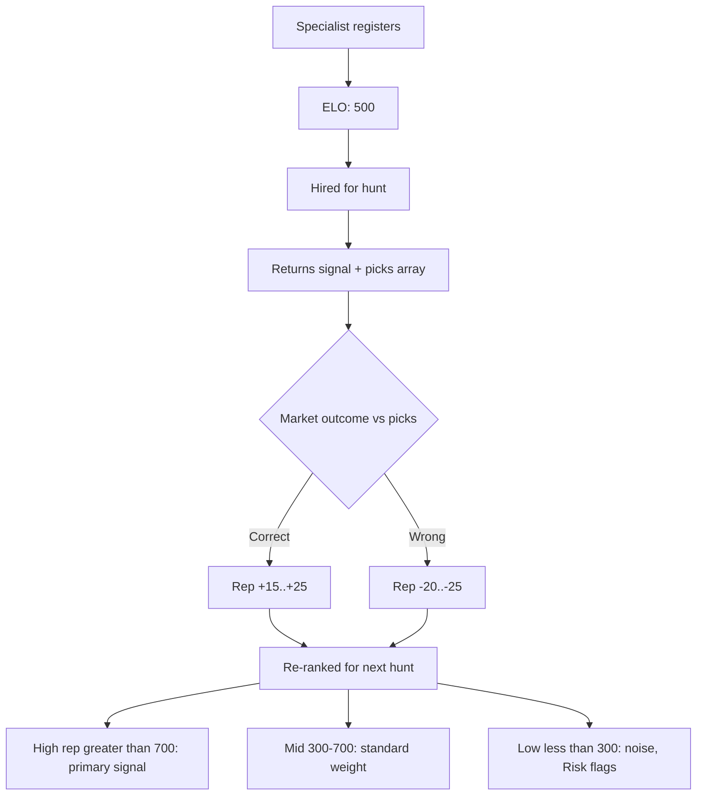
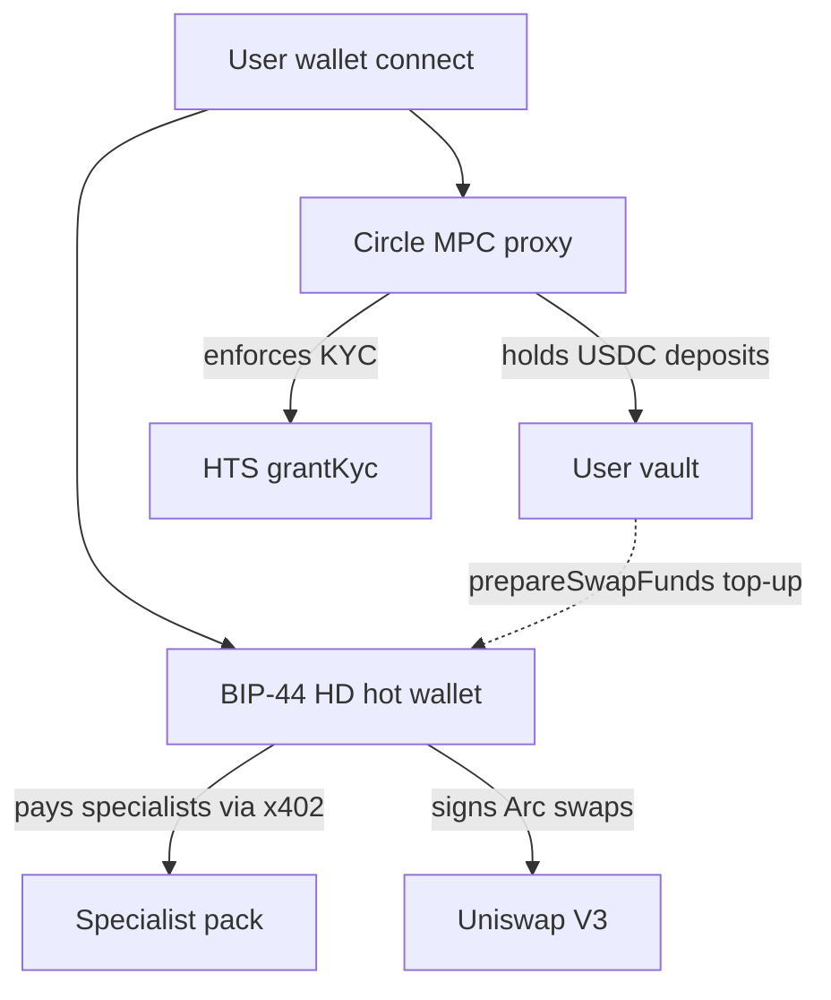
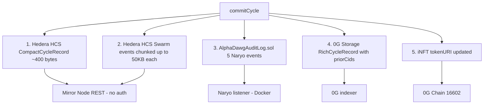

# AlphaDawg

### Your AI Pack Hunts Alpha

> A multi-agent swarm economy for provable investment alpha. Your personal AI agent hires specialist sub-agents via $0.001 nanopayments, runs adversarial debate inside TEE enclaves, remembers every prior hunt as an immutable DAG on 0G Storage, and proves every decision on-chain across three networks.

**ETHGlobal Cannes 2026 · 3 Chains · 14 Agents · 40 API Routes · ~$27K Target Pool**

---

## The Problem

AI hedge funds and trading bots are **black boxes**. You deposit money, cross your fingers, and hope. You can't see the reasoning, verify the decisions, or prove anything.

## The Solution

AlphaDawg is a **glass box with mathematical proof**. Deposit USDC → a personal AI agent hires specialists from an open marketplace (each paid $0.001 via gas-free nanopayments) → runs adversarial debate inside hardware enclaves → logs every step to an immutable multi-chain audit trail → reports to you on Telegram with one-click Hashscan proof links.

Every agent's reasoning is sealed. Every payment is tracked. Every decision is permanent. And every new hunt learns from the last via a verifiable memory DAG.

---

## Architecture — Three Chains, Three Roles



| Chain | Role | Live Address | What Runs Here |
|:------|:-----|:-------------|:---------------|
| **Arc** (Circle) | Money | per-user Circle MPC wallets | x402 nanopayments, Circle Gateway batching, USDC hot-wallet top-up, Uniswap V3 swap execution |
| **0G** | Brain | iNFT `0x73e3016D0D3Bf2985c55860cd2A51FF017c2c874` | Sealed Inference (TEE attestation per call), 0G Storage (cycle DAG via `priorCids`), ERC-7857 iNFT identity |
| **Hedera** | Truth | HCS `0.0.8497439` · HTS `0.0.8498202` · Naryo `0x66D2b95e6228E7639f9326C5573466579dd7e139` | HCS audit + swarm events, HTS fund token with KYC, Scheduled Transactions, AlphaDawgAuditLog.sol for Naryo cross-chain correlation |

---

## The Hunt — What Happens Every 5 Minutes

Each cycle is a **two-phase** operation: `analyzeCycle` produces a pending decision, then `commitCycle` fans out the results across all three chains after approval.



### Step-by-step reality (entry points in code)

| # | Step | File:Function |
|:--|:-----|:--------------|
| 1 | Load last 3 cycles from 0G Storage → format as RAG prompt block | `src/og/storage.ts:loadRecentCycles` + `src/agents/memory-context.ts:formatPriorCyclesForPrompt` |
| 2 | Snapshot Circle proxy + BIP-44 hot wallet liquidity | `src/payments/fund-swap.ts:fetchCycleLiquidity` |
| 3 | Top-up x402 buyer if hot wallet < 0.01 USDC | `src/payments/circle-wallet.ts:agentTransfer` |
| 4 | Pick top 3–5 specialists by ELO reputation, hire in parallel | `src/marketplace/hiring-strategy.ts:selectSpecialists` + `src/agents/main-agent.ts:hireSpecialists` |
| 5 | Alpha → Risk → Executor debate, each TEE-sealed | `src/agents/adversarial.ts:runAdversarialDebate` |
| 6 | Deterministic override: if `Risk.max_pct ≥ 3` and no `red_flags` → force BUY | `src/agents/main-agent.ts:1213` |
| 7 | Execute Uniswap V3 swap on Arc if action ≠ HOLD | `src/execution/arc-swap.ts:executeArcSwap` |
| 8 | Write CompactCycleRecord + swarm events to Hedera HCS | `src/hedera/hcs.ts:logCycle` / `logSwarmEvent` |
| 9 | Emit 5 Naryo events on Hedera EVM | `src/naryo/emit-event.ts` + `contracts/AlphaDawgAuditLog.sol` |
| 10 | Upload RichCycleRecord to 0G Storage, persist `priorCids` pointers | `src/og/storage.ts:storeMemory` |
| 11 | Bump iNFT metadata → new cycle count, new Storage root | `src/og/inft.ts:updateAgentMetadata` |
| 12 | Rich Telegram summary with Hashscan proof link | `src/telegram/bot.ts:notifyUser` |

### Per hunt cost

| Item | Count | Cost |
|:-----|:------|:-----|
| x402 specialist hires (Arc, USDC) | 3–5 | $0.003–0.005 |
| 0G sealed inference calls | ~6–8 | ~0.004 0G |
| HCS audit message | 1 | $0.0008 |
| HCS swarm events (chunked) | 3–5 | ~$0.002 |
| 0G Storage write | 1 | negligible |
| iNFT metadata update | 1 | ~0.001 0G |
| **Total per hunt** | | **~$0.008** |

---

## Two-Phase Approval Flow

Unlike a standard "agent executes blindly" loop, AlphaDawg separates **analyze** from **commit** so users can review or auto-approve:



- `app/api/cycle/analyze/[userId]/route.ts` — Phase 1: RAG → hire → debate → pending record
- `app/api/cycle/pending/[userId]/route.ts` — GET current pending
- `app/api/cycle/approve/[pendingId]/route.ts` — Phase 2: atomic commit to all chains
- `app/api/cycle/reject/[pendingId]/route.ts` — Discard
- `npm run demo:auto-approve` — Flip user flag for hands-off demos

`/api/cycle/run/[userId]` is the shortcut that does both phases in one call (used by the heartbeat cron and Telegram `/run`).

---

## The Pack — 10 Specialists

All 10 specialist servers live in `src/agents/specialist-server.ts` and run on ports **4001–4010**. Every endpoint is gated by `@x402/express` returning HTTP 402 until the buyer pays $0.001 in USDC on Arc. Every response is the output of `sealedInference()` and carries a TEE attestation hash — none are mocked.

| Port | Specialist | Real Data Source | Returns |
|:-----|:-----------|:-----------------|:--------|
| 4001 | Sentiment | CoinGecko + Fear & Greed Index | `{ score, class, fear_greed, picks[], attestationHash }` |
| 4002 | Whale | ETH gas tracker + top-volume flow | `{ net_flow, exchange_flow, picks[] }` |
| 4003 | Momentum | RSI / MACD / support-resistance | `{ rsi, macd, trend, picks[] }` |
| 4004 | Memecoin Hunter | Low-cap chart patterns | `{ picks[], conviction }` |
| 4005 | Twitter Alpha | Mention velocity | `{ trending[], score }` |
| 4006 | DeFi Yield | Aave / Curve APYs | `{ yields[], tvl }` |
| 4007 | News Scanner | News APIs | `{ headlines[], sentiment }` |
| 4008 | Onchain Forensics | Transaction cluster analysis | `{ clusters[], flags[] }` |
| 4009 | Options Flow | Options market data | `{ iv, skew, flow }` |
| 4010 | Macro Correlator | Macro signals | `{ correlation, regime }` |

Start them all with `npm run specialists`.

---

## The Challenge — Chain of Thought

Three agents with opposing mandates, all running through 0G sealed inference. The output of each turn is appended to the next turn's prompt → sequential debate, not parallel voting.



### Deterministic Executor override

The Qwen 7B executor model is risk-averse by default — when confronted with any ambiguity it drifts toward HOLD. To extract the conviction of the Risk agent instead of the hesitation of the Executor, `src/agents/main-agent.ts:1213` applies a post-processing rule:

> If **Risk** approved a `max_pct ≥ 3` and reported **zero `red_flags`**, force `action = BUY` at `max_pct` regardless of what Executor said.

This is intentional and logged alongside the raw Executor output. Both versions are in the HCS record — nothing is hidden.

### Example debate

| Agent | Rep | Output |
|:------|:----|:-------|
| Sentiment | 780 | `{ score: 72, class: "bullish", fear_greed: 68 }` |
| Whale | 650 | `{ net_flow: "accumulating", exchange_flow: "outflow" }` |
| Momentum | 420 | `{ rsi: 58, macd: "bullish", trend: "up" }` |
| **Alpha** | — | "Sentiment + Whale both bullish (high rep). BUY 20% ETH." |
| **Risk** | — | "Momentum rep low (420). RSI nearing overbought. MAX 10%." |
| **Executor** (raw) | — | `{ action: "HOLD", reason: "ambiguous" }` |
| **Override** | — | `{ action: "BUY", pct: 10, stop_loss: "-4%" }` — Risk approved ≥3, no red flags |

One Hashscan link proves the entire debate happened inside sealed enclaves.

---

## RAG — Evolving Memory DAG (0G OpenClaw Bounty Headliner)

Every cycle's full `RichCycleRecord` is written to **0G Storage** and pointed at from **Hedera HCS**. The next cycle reads those pointers, downloads the prior records in parallel, and injects them into the debate prompt. Because each new record lists the CIDs it loaded as context (`priorCids`), the audit trail becomes a **DAG of cycles, not a flat log**.



**Live proof** (from `progress/BOUNTY-ELIGIBILITY-E2E-PROOF.md`):

```
$ tsx scripts/inspect-rag-eligibility.ts
[0G storage] loaded 3/3 prior cycles for user f1743024-0d35-4c78
Took 3087ms → loaded 3 prior cycles from 0G Storage
Formatted prompt block (14 lines, 1503 chars):
  PRIOR CYCLES (your own history — learn from it):
  1. Cycle #43 · HOLD → NAV $24.41
     Alpha thesis: cross-specialist confluence...
     Risk flag: large ETH outflows could lead to...
  2. Cycle #44 · BUY 3% ETH → NAV $24.39
→ This block is injected into Alpha/Risk/Executor debate prompts at cycle start.
```

Key files:
- `src/og/storage.ts:storeMemory` / `loadRecentCycles`
- `src/agents/memory-context.ts:formatPriorCyclesForPrompt`
- `src/types/index.ts:RichCycleRecord.priorCids`
- UI surface: `components/expandable-hunt-card.tsx` → "Memory Recall — N prior cycles loaded from 0G Storage"

---

## Marketplace — Reputation & Multi-Token Picks

Specialists compete on accuracy. Rep scores are Prisma-backed, surfaced in the debate prompt, and used to select the next hunt's roster.



| Tier | ELO | Treatment |
|:-----|:----|:----------|
| **High** | > 700 | Primary signal — heavily weighted by Alpha |
| **Normal** | 300–700 | Standard weight |
| **Noise** | < 300 | Flagged by Risk if over-relied on |

- `src/marketplace/registry.ts` — Prisma-backed registry, auto-registers 10 built-in specialists
- `src/marketplace/reputation.ts` — ELO (K=32, bounds 0–1000), `evaluateCycleSignals`
- `src/marketplace/hiring-strategy.ts` — `selectSpecialists(count)` by tier
- `src/marketplace/pick-tracker.ts` — `recordPickEntries()` stores every specialist's `picks[]` for post-cycle evaluation

Users can **create their own specialists** via `/marketplace` → `POST /api/marketplace/create` → Prisma row + auto-generated SOUL.md instructions. Hired agents show up in the next hunt.

---

## Proxy Wallet Architecture — Two Paths

Unlike the original single-seed BIP-39 design, production uses **two wallet paths in parallel**:



| Wallet | File | Role | Signing |
|:-------|:-----|:-----|:--------|
| **Circle MPC proxy** | `src/payments/circle-wallet.ts:createProxyWallet` | Holds user USDC deposits, enforces KYC, executes agent-to-agent transfers | Circle-managed MPC |
| **BIP-44 HD hot wallet** | `src/config/wallets.ts` (derived from `AGENT_MNEMONIC`) | Pays specialists via x402, signs Arc swaps | Lead Dawg orchestrator only — **pack members and debate agents have no keys** |
| **Bridge** | `src/payments/fund-swap.ts:prepareSwapFunds` | Polls hot wallet, tops up from Circle via `agentTransfer` when swap liquidity is needed | — |

The signing perimeter is **exactly one component** (Lead Dawg). Every other agent is inference-only.

---

## Proof — Four Audit Sinks

Every hunt writes to **four immutable stores** so the same decision can be verified four different ways:



| Sink | What's written | Where |
|:-----|:---------------|:------|
| 1. Hedera HCS cycle log | Compact record (~400 bytes): pack attestations, debate attestations, action, tx hash, NAV | Topic `0.0.8497439` |
| 2. Hedera HCS swarm events | Fine-grained hires / debate turns / decisions (chunked up to 50KB) | Topic `0.0.8497439` |
| 3. AlphaDawgAuditLog.sol | 5 event types: `CycleCompleted`, `SpecialistHired`, `DepositRecorded`, `HeartbeatEmitted`, `CrossChainCorrelation` | `0x66D2b95e6228E7639f9326C5573466579dd7e139` on Hedera EVM |
| 4. 0G Storage | Full `RichCycleRecord` with `priorCids` DAG | 0G indexer (`@0gfoundation/0g-ts-sdk`) |
| 5. iNFT metadata | `tokenURI` repoints to the latest 0G Storage root → identity evolves per cycle | `0x73e3016D0D3Bf2985c55860cd2A51FF017c2c874` on 0G Chain 16602 |

---

## Naryo Cross-Chain Correlation (ioBuilders Bounty)

Naryo is a multichain event listener that subscribes to on-chain events across different DLTs and correlates them into one story. AlphaDawg uses it to prove that the **same hunt** touched **three different chains**.

`naryo/application.yml` declares **9 filters**:

| Source | Filters | What it captures |
|:-------|:--------|:-----------------|
| Hedera native | HCS topic, HTS transfer | Audit log + fund token flow |
| Hedera EVM | `CycleCompleted`, `SpecialistHired`, `DepositRecorded`, `HeartbeatEmitted`, `CrossChainCorrelation` | Contract event stream |
| 0G Chain | iNFT mint, metadata update | Identity evolution |

Every event hits `src/naryo/event-handler.ts:attemptCorrelation`, which pairs events from Hedera + 0G Chain + Arc in a **60-second window**. On a successful pair, it writes back a `CrossChainCorrelation` event to `AlphaDawgAuditLog.sol` as immutable on-chain proof of the cross-chain story.

Dashboard surface: `/api/naryo/feed` → `components/swarm-activity-ticker.tsx` (live ticker).

Run locally via Docker:
```bash
npm run deploy:naryo      # Compile + deploy AlphaDawgAuditLog.sol
npm run naryo:up          # Docker: Naryo server + Kafka + Postgres
npm run naryo:logs        # Tail listener output
```

---

## Tech Stack

| Layer | Technology |
|:------|:-----------|
| Runtime | Node.js ≥ 22, TypeScript strict, ES modules |
| Frontend | Next.js 16.2 (App Router + Turbopack), React 19, Tailwind v4 (CSS-first `@theme`) |
| Wallet connect | Dynamic Labs SDK · wagmi · RainbowKit |
| Database | Supabase PostgreSQL · `postgres.js` ^3.4 (user store) · Prisma ^6.19 (marketplace + actions) |
| Hedera | `@hashgraph/sdk` ^2.69 |
| 0G Compute | `@0glabs/0g-serving-broker` 0.7.4 |
| 0G Storage | `@0gfoundation/0g-ts-sdk` ^1.2.1 *(note: `@0gfoundation`, NOT `@0glabs`)* |
| 0G Chain | Hardhat 2 · Solidity 0.8.24 · ERC-7857 iNFT |
| Payments (buyer) | `@x402/fetch` + `viem/accounts` |
| Payments (seller) | `@x402/express` + `@x402/evm` + `@circle-fin/x402-batching` |
| Wallets | `@circle-fin/developer-controlled-wallets` (MPC proxy) + ethers v6 BIP-44 HD (hot wallet) |
| Telegram | `node-telegram-bot-api` (polling locally, webhook on Vercel) |

---

## API Architecture — Two Layers (Do Not Conflate)

| Layer | Port | Who Calls It | What It Does |
|:------|:-----|:-------------|:-------------|
| **Next.js `/api/*`** | 3000 | Dashboard frontend (relative paths via `lib/api.ts`) | **Primary dashboard API.** Contains all business logic. **40 routes** covering onboarding, two-phase cycle control, marketplace (hire/fire/create/rate/earnings), deposit/withdraw, fund info, stats, user lookup, chat, telegram webhook, naryo feed, swarm health/metrics, cron heartbeat |
| **Express `src/api/*`** | 3001 | Telegram bot, heartbeat worker, external curl / CI | **Backend services only.** Legacy CLI + cron surface. Dashboard does **not** call this. Keep `NEXT_PUBLIC_API_URL` empty so all frontend fetches stay relative. |

---

## Project Structure

```
alphadawg/
├── CLAUDE.md                 Engineering bible for agents
├── README.md                 This file
├── package.json              "type": "module", node >=22
├── hardhat.config.cjs        Hardhat 2 for 0G Chain + Hedera EVM contracts
├── prisma/schema.prisma      User, Cycle, AgentAction, MarketplaceAgent
├── contracts/
│   ├── VaultMindAgent.sol    ERC-7857 iNFT on 0G Chain
│   ├── AlphaDawgAuditLog.sol 5-event audit contract on Hedera EVM (Naryo)
│   └── MockOracle.sol        iNFT oracle stub
├── src/
│   ├── index.ts              Boot: validateEnv → store → Telegram bot → Express → heartbeat
│   ├── config/               Lazy Hedera/0G/Circle clients + wallet derivation
│   ├── hedera/               HCS + HTS + Scheduler (SDK only, zero Solidity)
│   ├── og/                   Sealed inference + Storage + iNFT
│   ├── payments/             x402 buyer/seller + Circle MPC + fund-swap bridge
│   ├── execution/            Arc Uniswap V3 swap + sell
│   ├── marketplace/          Registry, ELO reputation, pick tracker, hiring strategy
│   ├── agents/
│   │   ├── main-agent.ts     runCycle / analyzeCycle / commitCycle orchestrator
│   │   ├── adversarial.ts    Alpha → Risk → Executor debate
│   │   ├── heartbeat.ts      5-min loop with 50s Vercel budget guard
│   │   ├── specialist-server.ts  10 specialist servers on :4001-4010
│   │   ├── memory-context.ts RAG prompt formatter
│   │   ├── prompts.ts        6 system prompts (7B-optimized) + safe JSON parse
│   │   └── data/             Real market data fetchers (CoinGecko, FNG, whale, momentum)
│   ├── telegram/bot.ts       7 commands + link-code binding
│   ├── naryo/                Event emitters + cross-chain correlation handler
│   ├── store/                Supabase CRUD + AES-256-CBC crypto + link codes
│   └── api/                  Express :3001 backend services
├── app/                      Next.js 16.2 App Router frontend
│   ├── page.tsx              Landing (server component, real HCS + HTS stats)
│   ├── dashboard/            3-col debate + pending modal + swarm ticker
│   ├── history/              Expandable hunt log
│   ├── deposit/              Deposit/withdraw USDC + HTS
│   ├── marketplace/          Specialist pack + create-your-own-agent
│   ├── verify/               TEE attestation explorer
│   ├── portfolio/            Fund balance + NAV
│   ├── infrastructure/       Live on-chain asset status
│   └── api/                  40 Next.js API routes (primary dashboard API)
├── components/               React components (cycle-view, debate-column, proof-column, specialist-card, wallet-connect, nav, swarm-*, ui/*)
├── contexts/                 user-context + wagmi provider
├── lib/                      api.ts (relative fetch), cycle-mapper, types
├── openclaw/                 14 OpenClaw agent workspaces (SOUL/IDENTITY/AGENTS/...)
├── naryo/                    application.yml + docker-compose.yml
├── scripts/                  Setup, deploy, validate, test (48 scripts)
└── progress/                 Sprint reports + BOUNTY-ELIGIBILITY-E2E-PROOF.md
```

---

## Quick Start

### 1. Clone + install

```bash
git clone https://github.com/elbarroca/ETH_Global_Cannes_2026.git
cd cannes2026
npm install                      # postinstall runs prisma generate
```

### 2. Configure `.env`

```bash
cp .env.example .env
# Fill in:
#   Hedera:   OPERATOR_ID, OPERATOR_KEY
#   0G:       OG_PRIVATE_KEY (must start with 0x), OG_RPC_URL, OG_PROVIDER_ADDRESS
#   Circle:   CIRCLE_API_KEY, CIRCLE_ENTITY_SECRET, CIRCLE_WALLET_SET_ID
#   Supabase: DATABASE_URL (pgbouncer port 6543), DIRECT_URL (port 5432)
#   Wallets:  AGENT_MNEMONIC (BIP-39), SERVER_ENCRYPTION_KEY (32-byte hex)
#   Telegram: TELEGRAM_BOT_TOKEN
#   Frontend: NEXT_PUBLIC_DYNAMIC_ENVIRONMENT_ID, NEXT_PUBLIC_WALLETCONNECT_PROJECT_ID
#   NEXT_PUBLIC_API_URL must stay EMPTY (relative paths)
```

### 3. One-time on-chain + DB setup

```bash
npm run prisma:push              # Sync schema to Supabase
npm run setup:topic              # Create HCS topic → HCS_AUDIT_TOPIC_ID
npm run setup:token              # Create HTS fund token → HTS_FUND_TOKEN_ID
npm run setup:og                 # Fund 0G broker (10 0G deposit)
npm run setup:circle             # Circle entity secret + wallet set
npm run deploy:naryo             # Compile + deploy AlphaDawgAuditLog.sol to Hedera EVM
# iNFT is already deployed at 0x73e3...; set INFT_CONTRACT_ADDRESS in .env
```

### 4. Run (3 terminals)

```bash
# Terminal 1 — 10 specialist servers on :4001-4010
npm run specialists

# Terminal 2 — heartbeat + Telegram bot + Express :3001
npm run backend

# Terminal 3 — Next.js dashboard on :3000
npm run dev
```

### 5. Optional — Naryo listener

```bash
npm run naryo:up                 # Docker: Naryo server + Kafka + Postgres
npm run naryo:logs               # Tail listener output
```

### 6. Verify

```bash
npm run validate                 # 45-test suite across all layers
npm run validate:approval        # Two-phase approval flow smoke test
npm run validate:x402            # x402 payment flow smoke test

# x402 paywall check — should return 402 before payment
curl -s -o /dev/null -w "%{http_code}" localhost:4001/analyze

# Dashboard flow: open http://localhost:3000 → connect wallet →
#   auto-onboard creates Circle proxy + iNFT → /start [code] in Telegram →
#   deposit USDC → watch first hunt in /dashboard
```

### 7. Demo mode

```bash
npm run demo:auto-approve        # Flip flag so cycles commit without /approve
```

---

## Bounties Targeted

Based on `progress/BOUNTY-ELIGIBILITY-E2E-PROOF.md` (validated live against testnets):

| # | Bounty | Prize | Status | Evidence |
|:--|:-------|:------|:-------|:---------|
| 1 | **0G — Best OpenClaw Agent** | $6K | Complete | 14 OpenClaw workspaces · sealed inference · Storage RAG DAG via `priorCids` · iNFT `0x73e3…` deployed |
| 2 | **0G — Best DeFi App** | $6K | Complete | Multi-agent swarm · TEE attestation per call · Arc Uniswap V3 settlement · iNFT identity |
| 3 | **Arc — Best Agentic Economy with Nanopayments** | $6K | Complete | 3,709+ live x402 payments · Circle Gateway batching · gas-free agent-to-agent USDC |
| 4 | **Hedera — AI & Agentic Payments** | $6K | Complete | HCS 6,249+ messages · HTS deposit/withdraw · Scheduled Transactions · OpenClaw ACP integration |
| 5 | **Hedera — ioBuilders Naryo Builder Challenge** | $3.5K | Complete | `AlphaDawgAuditLog.sol` at `0x66D2…` · 9 Naryo filters · multi-DLT correlation · CrossChainCorrelation event on-chain |
| 6 | 0G — Wildcard | $3K | Secondary | iNFT marketplace + evolving agent identity |
| 7 | Arc — Chain Abstracted USDC | $3K | Secondary | Circle MPC + Gateway abstraction over Arc + Hedera settlement |
| 8 | Hedera — Tokenization | $2.5K | Low confidence | VMF HTS token with KYC — weak real-world-asset fit |
| — | Hedera — No Solidity Allowed | $3K | N/A | Mutually exclusive with Naryo (chose Naryo) |
| — | Arc — Smart Contracts / Prediction Markets | $6K | Not claimed | Out of scope |

**Realistic target pool:** ~$27K across **5 primary + 2 secondary** bounties.

---

## Dashboard Views

| Page | What It Shows |
|:-----|:--------------|
| `/` | Landing with **real** HCS hunt count + HTS supply via Mirror Node (Server Component, 30–60s ISR) |
| `/dashboard` | 3-column live debate view, 6s polling, pending-approval modal, chat panel, swarm activity ticker, Naryo feed |
| `/dashboard/compute/[id]` | Per-hunt deep dive with Memory Recall block (prior cycles loaded from 0G) |
| `/history` | Expandable hunt log from HCS Mirror Node |
| `/deposit` | Deposit / withdraw USDC, HTS fund token balance |
| `/portfolio` | Fund balance, NAV, token info |
| `/marketplace` | Specialist leaderboard + Create-Your-Own-Agent (Prisma backed) |
| `/verify` | TEE attestation verification explorer |
| `/infrastructure` | Live on-chain asset status board |

---

## Live On-Chain Assets

| Asset | ID / Address | Network |
|:------|:-------------|:--------|
| VaultMindAgent (iNFT, ERC-7857) | `0x73e3016D0D3Bf2985c55860cd2A51FF017c2c874` | 0G Chain (16602) |
| AlphaDawgAuditLog (Naryo) | `0x66D2b95e6228E7639f9326C5573466579dd7e139` | Hedera Testnet EVM |
| HTS Fund Token (VMF) | `0.0.8498202` | Hedera Testnet |
| HCS Audit Topic | `0.0.8497439` | Hedera Testnet |

All verifiable via `eth_getCode` (iNFT, AuditLog), Mirror Node REST (HCS, HTS), and Hashscan.

---

## Team

Built at ETHGlobal Cannes 2026.

## License

MIT
