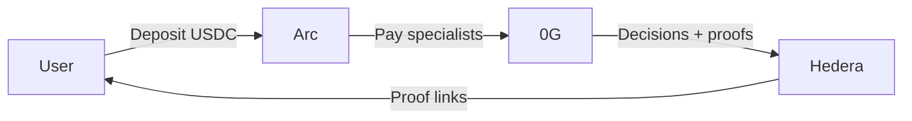
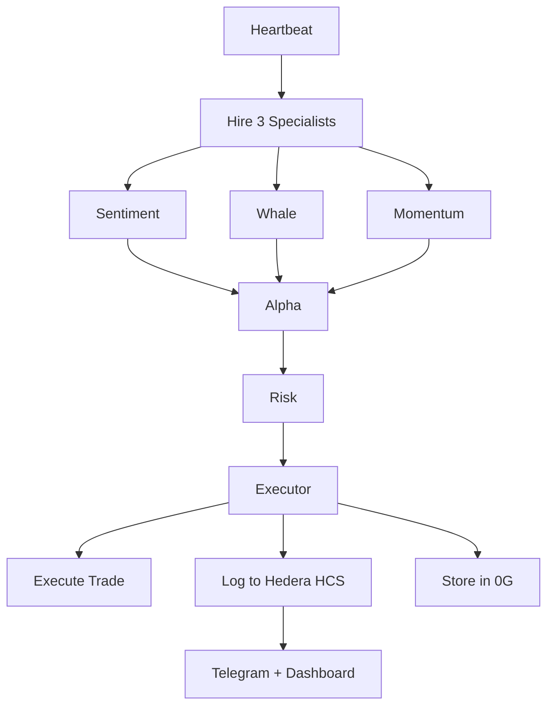
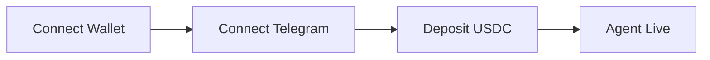
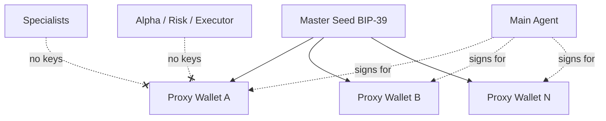
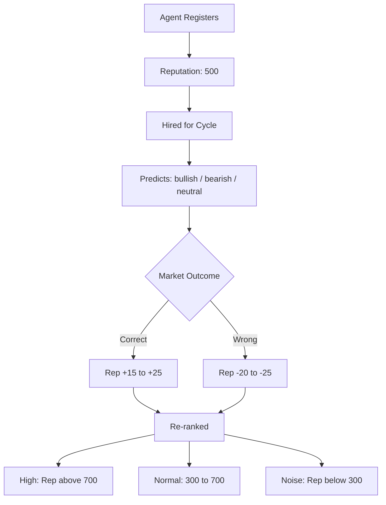
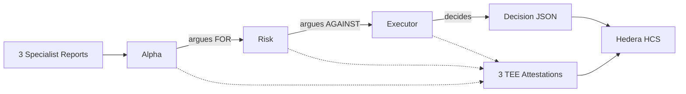
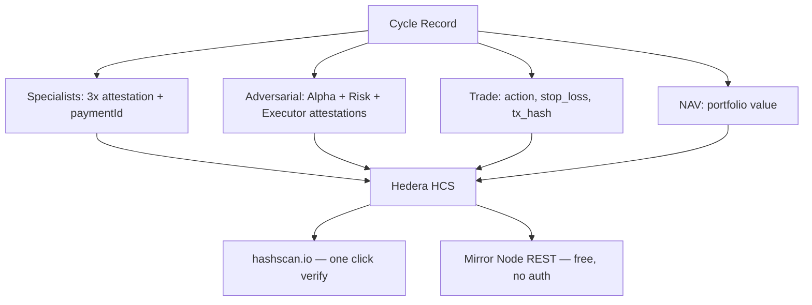
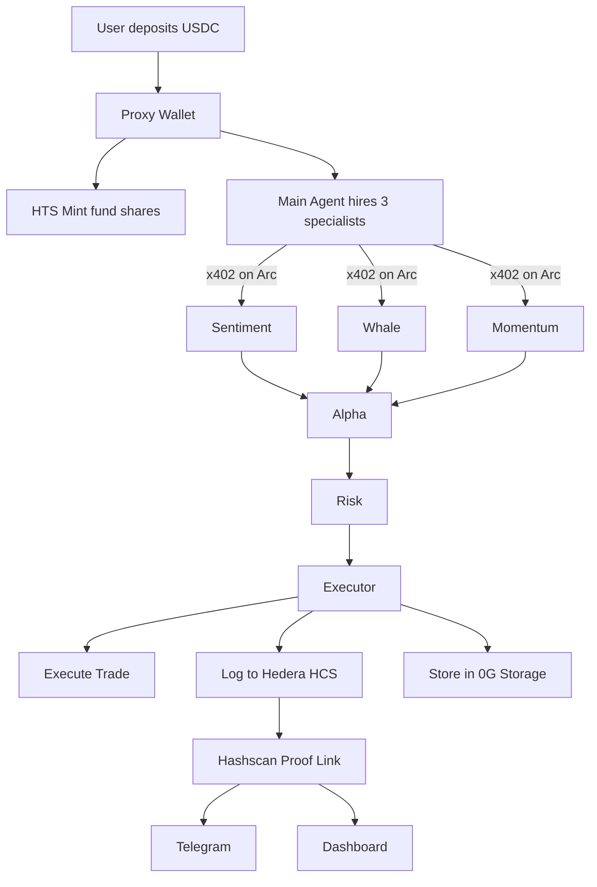

# VaultMind

### The Agent Economy for Provable Investment Alpha

> Your personal AI agent hires specialists, debates every trade adversarially, and proves every decision on-chain. Zero black boxes. Full mathematical proof.

**ETHGlobal Cannes 2026 · 3 Chains · 7 Agents · 7 Bounties · $17,250**

---

## The Problem

AI hedge funds and trading bots are **black boxes**. You deposit money, cross your fingers, and hope. You can't see the reasoning. You can't verify the decisions. You can't prove anything.

## The Solution

VaultMind is a **glass box with mathematical proof**.

You deposit USDC. A personal AI agent:

1. **Hires specialist sub-agents** from an open marketplace — paying each $0.001 via gas-free nanopayments
2. **Runs adversarial debate** — Alpha argues FOR, Risk argues AGAINST, Executor decides — all inside tamper-proof hardware enclaves
3. **Logs every decision** to an immutable audit trail — one click verifies everything on-chain
4. **Reports to you** on Telegram with proof links

Every agent's reasoning is sealed. Every payment is tracked. Every decision is permanent.

---

## Architecture — Three Chains, Three Roles



| Chain | Role | Components |
|:------|:-----|:-----------|
| **Arc** (Circle) | Money | x402 nanopayments ($0.001/specialist), USDC deposits, gas-free agent-to-agent commerce |
| **0G** | Brain | Sealed Inference (TEE), Storage (agent memory), Chain (iNFT identity), Compute marketplace |
| **Hedera** | Truth | HCS (immutable audit), HTS (fund tokens + KYC + fees), Scheduled Tx, Mirror Node |

---

## The Cycle — What Happens Every 5 Minutes



### Step 1 — Hire Specialists ($0.003 total)

The Main Agent queries the Marketplace for the top 3 specialists by reputation, then hires each via x402 nanopayment:

| Specialist | Request | Payment | Returns |
|:-----------|:--------|:--------|:--------|
| Sentiment | `GET /analyze` → `402` | $0.001 via Arc | `{ analysis, attestationHash, paymentId }` |
| Whale | `GET /analyze` → `402` | $0.001 via Arc | `{ analysis, attestationHash, paymentId }` |
| Momentum | `GET /analyze` → `402` | $0.001 via Arc | `{ analysis, attestationHash, paymentId }` |

### Step 2 — Adversarial Debate (TEE sealed)

All three specialist reports are fed into a sequential debate inside hardware enclaves:

| Agent | Role | Output |
|:------|:-----|:-------|
| **Alpha** | Opportunity Finder | `"BUY 20% ETH"` + TEE attestation |
| **Risk** | Paranoid Manager | `"MAX 10%, funding rates high"` + TEE attestation |
| **Executor** | Final Decision Maker | `"BUY 12% ETH, SL -4%"` + TEE attestation |

### Step 3-4 — Execute + Log

Parse Executor decision → Log cycle record to Hedera HCS (~400 bytes) → `freeze` → `sign` → `execute`

### Step 5-6 — Remember + Notify

Store memory to 0G Storage → Send summary + Hashscan proof link to Telegram

### Per Cycle Cost

| Item | Count | Cost |
|:-----|:------|:-----|
| Specialist hires (x402) | 3 | $0.003 |
| 0G inference calls | 6 | ~0.003 0G |
| HCS message | 1 | $0.0008 |
| 0G Storage write | 1 | negligible |
| **Total** | | **~$0.004** |

---

## User Onboarding — Dynamic, Zero Hardcoding

No chat IDs in config files. No wallet addresses baked in. Every user onboards dynamically:



| Step | Action | Detail |
|:-----|:-------|:-------|
| 1. Connect Wallet | User visits dashboard, connects MetaMask/WalletConnect | Backend creates `UserRecord` in memory |
| 2. Connect Telegram | Dashboard shows unique deep-link `t.me/VaultMindBot?start={wallet}` | Bot captures `chat.id`, binds to wallet. No hardcoded IDs. |
| 3. Deposit USDC | User deposits to HD-derived proxy wallet | Fund shares (HTS) minted proportionally. First cycle triggers immediately. |

---

## Proxy Wallet Architecture

Only the Main Agent orchestrator holds the signing key. Specialists and adversarial agents are **inference-only** — they never touch private keys.



| Component | Key Access | Role |
|:----------|:-----------|:-----|
| **Master Seed** (BIP-39) | Root | Stored in `.env`, derives all wallets |
| **Proxy Wallet A** (`m/44'/60'/0'/0/0`) | Derived | User A's isolated funds |
| **Proxy Wallet B** (`m/44'/60'/0'/0/1`) | Derived | User B's isolated funds |
| **Proxy Wallet N** (`m/44'/60'/0'/0/N`) | Derived | User N's isolated funds |
| **Main Agent** | Signs for all wallets | ONLY component with signing access |
| Specialists | No keys | Inference only |
| Alpha / Risk / Executor | No keys | Inference only |

---

## Marketplace — Reputation System

Specialists compete on accuracy. Good agents rise. Bad agents sink. The adversarial layer weights signals by reputation.



**How it works:**

1. Agent registers with endpoint, price, and tags → starts at **reputation 500**
2. Hired each cycle → predicts bullish / bearish / neutral
3. After market outcome: **correct** = +15 to +25 rep, **wrong** = -20 to -25 rep
4. Re-ranked for next cycle based on new score

**Reputation tiers:**

| Tier | Score | Treatment |
|:-----|:------|:----------|
| **High** | > 700 | Primary signal — heavily weighted by Alpha |
| **Normal** | 300–700 | Standard weight |
| **Noise** | < 300 | Mentioned but not trusted — Risk flags over-reliance |

The adversarial layer sees reputation scores alongside each specialist's analysis:

- **Alpha** weights high-rep specialists heavily when building bullish thesis
- **Risk** flags if Alpha is over-relying on low-rep specialists
- **Executor** cross-references: do high-rep and low-rep agents agree or disagree?

Reputation history is stored in **0G Storage** (Merkle-verified, can't be faked) and deltas are logged in **Hedera HCS** alongside cycle records.

---

## Adversarial Debate — Chain of Thought

This is the core product. Three agents with opposing mandates, all running in TEE enclaves.



Each agent produces a TEE attestation hash. All 3 hashes + the final decision are logged in one atomic HCS message.

### Example Debate

| Agent | Output |
|:------|:-------|
| **Sentiment** (rep: 780) | `{ score: 72, class: "bullish", fear_greed: 68 }` |
| **Whale** (rep: 650) | `{ net_flow: "accumulating", exchange_flow: "outflow" }` |
| **Momentum** (rep: 420) | `{ rsi: 58, macd: "bullish", trend: "up" }` |
| **Alpha** | "Sentiment + Whale both bullish (high rep). BUY 20% ETH." |
| **Risk** | "Momentum agent has low rep (420). RSI approaching overbought. MAX 10%." |
| **Executor** | `{ action: "BUY", asset: "ETH", pct: 12, stop_loss: "-4%" }` |

One Hashscan link proves the entire debate happened inside sealed enclaves.

---

## Proof — What Gets Logged to Hedera

Every cycle produces one compact HCS message (~400 bytes):



---

## Tech Stack

| Layer | Technology | Version |
|:------|:-----------|:--------|
| Runtime | Node.js | >= 22 |
| Language | TypeScript (strict) | ES modules |
| Frontend | Next.js 16.2 | App Router, Turbopack, React 19 |
| Styling | Tailwind CSS v4 | Utility-first |
| Hedera | `@hashgraph/sdk` | ^2.69.0 |
| 0G Compute | `@0glabs/0g-serving-broker` | latest |
| 0G Storage | `@0glabs/0g-ts-sdk` | latest |
| Payments (seller) | `@x402/express` + `@x402/evm` | v2+ |
| Payments (buyer) | `@x402/fetch` + `viem` | latest |
| Ethereum | ethers v6 | -- |
| Telegram | node-telegram-bot-api | latest |

---

## Project Structure

```
vaultmind/
├── src/
│   ├── config/              Chain clients + wallet derivation
│   │   ├── hedera.ts        Client.forTestnet().setOperator()
│   │   ├── og-compute.ts    createZGComputeNetworkBroker()
│   │   ├── og-storage.ts    Indexer init
│   │   ├── arc.ts           viem account for x402
│   │   └── wallets.ts       HD proxy wallet derivation
│   │
│   ├── state/               In-memory dynamic state
│   │   └── user-store.ts    Map-based UserStore (N users)
│   │
│   ├── marketplace/         Specialist economy
│   │   ├── registry.ts      Registration + discovery
│   │   └── reputation.ts    ELO scoring + accuracy
│   │
│   ├── hedera/              Truth layer
│   │   ├── hcs.ts           logCycle(), getHistory()
│   │   ├── hts.ts           Fund token (mint/burn/fees)
│   │   └── scheduler.ts     Scheduled Transactions
│   │
│   ├── og/                  Brain layer
│   │   ├── inference.ts     sealedInference() — core function
│   │   ├── storage.ts       Agent memory (upload/download)
│   │   └── verify.ts        TEE attestation verification
│   │
│   ├── payments/            Money layer
│   │   ├── x402-server.ts   Specialist paywall (seller)
│   │   └── x402-client.ts   Agent payment client (buyer)
│   │
│   ├── agents/              The swarm
│   │   ├── main-agent.ts    Per-user cycle orchestrator
│   │   ├── cycle-runner.ts  Async interval manager
│   │   ├── adversarial.ts   Alpha → Risk → Executor
│   │   ├── specialist-server.ts  3 Express apps
│   │   └── prompts.ts       6 system prompts (7B-optimized)
│   │
│   ├── telegram/bot.ts      Dynamic Telegram binding
│   ├── dashboard/           Next.js 16.2 App Router
│   └── index.ts             Boot
│
├── openclaw/                7 OpenClaw agent workspaces
│   ├── main-agent/          SOUL.md + AGENTS.md + HEARTBEAT.md
│   ├── sentiment-agent/     SOUL.md
│   ├── whale-agent/         SOUL.md
│   ├── momentum-agent/      SOUL.md
│   ├── alpha-agent/         SOUL.md
│   ├── risk-agent/          SOUL.md
│   └── executor-agent/      SOUL.md
│
└── scripts/                 One-time setup
    ├── setup-topic.ts       HCS audit topic
    ├── setup-token.ts       HTS fund token
    └── setup-og-account.ts  0G broker funding
```

---

## Quick Start

### 1. Install

```bash
git clone https://github.com/your-org/vaultmind.git
cd vaultmind
npm install
```

### 2. Configure

```bash
cp .env.example .env
# Fill in: Hedera operator, 0G keys, Telegram bot token, master seed
```

### 3. One-Time Setup

```bash
npx ts-node scripts/setup-topic.ts       # → HCS_AUDIT_TOPIC_ID
npx ts-node scripts/setup-token.ts       # → HTS_FUND_TOKEN_ID
npx ts-node scripts/setup-og-account.ts  # → Funds 0G broker
```

### 4. Run

```bash
# Terminal 1: Start specialist marketplace
npx ts-node src/agents/specialist-server.ts

# Terminal 2: Start the full system
npx ts-node src/index.ts

# Terminal 3: Start dashboard
npm run dev
```

### 5. Verify

```bash
curl -s -o /dev/null -w "%{http_code}" localhost:4001/analyze  # → 402
# Visit dashboard → connect wallet → connect Telegram → deposit → watch cycles
```

---

## Bounties Targeted

| Bounty | Prize | What We Use |
|:-------|:------|:------------|
| **Arc** | $6K | Nanopayments, agent-to-agent USDC, gas-free marketplace |
| **Hedera AI** | $6K | HTS fund token, HCS audit trail, Scheduled Tx, HCS-14 identity |
| **0G DeFi** | $6K | Sealed Inference, TEE attestation, Storage memory, Chain settlement |
| **0G OpenClaw** | $6K | 7 SOUL.md agents, iNFT identity, 0G full stack |
| **No Solidity** | $3K | 4 native services, zero .sol files, SDK only |
| **Tokenization** | $2.5K | HTS compliance, KYC + freeze, custom 1% fee |
| **Naryo** | $3.5K | Multichain events, Hedera EVM, Mirror Node |
| **Total** | **$17,250** | |

---

## Data Flow — End to End



---

## Security Model

| Component | Access Level | Why |
|:----------|:-------------|:----|
| Main Agent (orchestrator) | Master seed, signs transactions | Only component that moves money |
| Specialist agents | Inference only, no keys | Receive data, return analysis |
| Alpha / Risk / Executor | Inference only, no keys | Receive data, return decisions |
| User proxy wallets | Derived from master, isolated per user | Funds can't cross between users |
| 0G Sealed Inference | TEE enclave, hardware-isolated | Nobody sees data during processing |
| HCS Audit Trail | Append-only, submit-key protected | Only our agent can write |

---

## Dashboard Views

| Page | What It Shows |
|:-----|:--------------|
| **Landing** | Connect wallet button, global stats (users, cycles, hires) |
| **Onboard** | 3-step progress: Wallet → Telegram → Deposit |
| **Dashboard** | 3-column live debate view (specialists / debate / proof) |
| **Marketplace** | Specialist leaderboard, reputation scores, accuracy history |
| **History** | Past cycles from Mirror Node REST API |
| **Invest** | Deposit/withdraw USDC, fund share balance |

---

## Testing

```bash
npx ts-node scripts/setup-topic.ts         # Hedera HCS
npx ts-node scripts/setup-token.ts         # Hedera HTS
npx ts-node scripts/setup-og-account.ts    # 0G broker
npx ts-node src/og/test-inference.ts       # 0G inference + TEE
npx ts-node src/agents/specialist-server.ts # Start specialists
curl localhost:4001/analyze                 # → HTTP 402
npx ts-node src/index.ts                   # Full cycle
```

---

## Architecture Decisions

| Decision | Chosen | Why |
|:---------|:-------|:----|
| Payment rail | x402 on Arc | Only viable gas-free micropayment infra |
| AI inference | 0G Sealed Inference | TEE attestation = provable AI |
| Audit trail | Hedera HCS | $0.0008/msg, no Solidity, sub-second finality |
| Fund token | Hedera HTS (SDK) | Native KYC/freeze/fees, zero contracts |
| Agent framework | OpenClaw | SOUL.md personalities, Telegram native |
| User state | In-memory Map | Zero deps, swappable to Redis |
| Chat IDs | Dynamic Telegram deep-link | N users, no hardcoding |
| Wallets | HD-derived proxy wallets | One seed, isolated per user |
| Marketplace | Open registry + ELO reputation | Self-correcting quality |

---

## Team

Built at ETHGlobal Cannes 2026 in 48 hours.

---

## License

MIT
