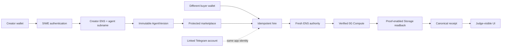

# AlphaDawg

> Authenticated agent commerce with verifiable execution.

**ETHGlobal Lisbon 2026 Continuity · Local evidence only · Release blocked**

AlphaDawg turns an agent marketplace transaction into a fail-closed,
evidence-backed journey. A creator authenticates with a wallet, binds an
immutable agent version to canonical ENS authority, publishes it, and a
different authenticated buyer hires it. Delivery is accepted only after fresh
ENS checks, verified 0G execution, proof-enabled Storage readback, and one
canonical receipt.

The target path is:

`creator wallet → ENS authority → immutable agent version → publication → external hire → verified 0G execution → receipt → browser evidence`

## Protected journey


```mermaid
flowchart LR
    Creator["Creator wallet"] --> SIWE["SIWE authentication"]
    SIWE --> ENS["Creator ENS + agent subname"]
    ENS --> Version["Immutable AgentVersion"]
    Version --> Market["Protected marketplace"]
    Buyer["Different buyer wallet"] --> Hire["Idempotent hire"]
    Market --> Hire
    Hire --> Fresh["Fresh ENS authority"]
    Fresh --> Compute["Verified 0G Compute"]
    Compute --> Storage["Proof-enabled Storage readback"]
    Storage --> Receipt["Canonical receipt"]
    Receipt --> UI["Judge-visible UI"]
    Telegram["Linked Telegram account"] -. "same app identity" .-> Hire
```

## What is protected

| Boundary | Guarantee |
|---|---|
| Identity | SIWE establishes the app user; Telegram and reverse resolution never replace wallet authority. |
| Agent state | Published versions are immutable and server-owned. Changes create a new version. |
| ENS | Creator and agent names are normalized, hierarchy-checked, and re-resolved before execution and delivery. |
| Commerce | Quotes use integer atomic amounts; self-hire, stale versions, duplicate work, and cross-user access fail explicitly. |
| Execution | Missing, malformed, stale, or tampered 0G output, proof, or readback produces no accepted delivery. |
| Receipt | Delivery has one canonical receipt and one mutually exclusive financial outcome. |

## Current gate

The live source of truth is the [Lisbon Claim Matrix](docs/lisbon/CLAIM-MATRIX.md),
not this summary.

- `LOCAL_BUILD_AUTHORIZED`: deterministic local files, tests, loopback services,
  disposable databases, and atomic commits are allowed.
- A0-A3 have accepted local evidence; live 0G execution remains `NOT_RUN`.
- A4 retains an accepted stable ENS base, but the ENSv2 owner layer is
  `AUDIT_FIX` pending a narrowed schema-v1 Unicode compatibility repair,
  immutable-SHA re-audit, and Kernel publication handoff.
- A5 remains local-only and audit-gated. A6 Uniswap scope is conditional and
  unopened.
- `RELEASE_BLOCKED` and `LIVE_EFFECT_BLOCKED` remain in force. Production
  readiness is rejected currently; expected winnings are unproven with floor
  `$0`.

Fixtures, local integrations, inherited Cannes assets, configured credentials,
and UI badges are not live sponsor proof.

## Code map

| Area | Paths |
|---|---|
| Authentication and commerce kernel | `src/auth/`, `src/kernel/`, `src/worker/` |
| ENS authority | `src/ens/` |
| 0G execution and verification | `src/og/`, `tools/0g-storage-verifier/` |
| Product UI and browser evidence | `app/`, `components/`, `tests/playwright/` |
| Telegram and protected cycle wiring | `src/telegram/`, `src/agents/` |
| Deterministic evidence | `tests/`, `docs/lisbon/evidence/` |

The inherited marketplace, OpenClaw, Hedera, Circle, Arc, and Naryo paths are
non-authoritative unless a current sprint explicitly admits them.

## Local setup

Requires Node.js 22+ and npm.

```bash
npm ci
cp .env.example .env.local
npm run dev
```

Use only local or explicitly authorized values. Never commit `.env.local` or
treat available credentials as permission for a sponsor call, managed
migration, signature, transaction, deployment, or spend.

Core checks:

```bash
npm run lint
npm run typecheck
npm test
npm run build
```

The complete migration, integration, browser, resilience, Go verifier, secret,
and release floor is defined in [GOALS.md](docs/lisbon/GOALS.md).

## Control center

| Document | Purpose |
|---|---|
| [GOALS.md](docs/lisbon/GOALS.md) | Canonical outcome, authority, evidence, and release contract |
| [SPRINTS.md](docs/lisbon/SPRINTS.md) | Ordered acceptance cards |
| [CLAIM-MATRIX.md](docs/lisbon/CLAIM-MATRIX.md) | Current fail-closed claim state |
| [EVIDENCE.md](docs/lisbon/EVIDENCE.md) | Append-only evidence ledger |
| [EXTERNAL-EFFECTS.md](docs/lisbon/EXTERNAL-EFFECTS.md) | Exact authorization for external actions |
| [C0-A4-CONTINUATION.md](docs/lisbon/prompts/C0-A4-CONTINUATION.md) | Current coordinator launch contract |

Previous Cannes code and evidence are reusable prior work, not Lisbon
eligibility, release evidence, production proof, or a prize forecast. Only
`RELEASE_VALIDATED` on one unchanged SHA is a successful terminal state.
