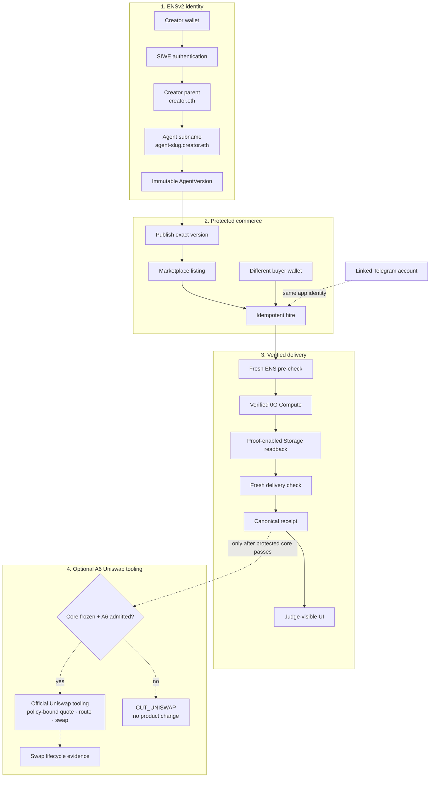

# AlphaDawg

### Own the agent. Verify the work. Trust the receipt.

> A protected marketplace where authenticated creators publish immutable AI
> agents, external buyers hire an exact version, and delivery requires fresh
> ENS authority plus verified 0G execution.

**ETHGlobal Lisbon 2026 Continuity · Local evidence only · Release blocked**

---

## The Problem

AI agents can recommend, trade, and coordinate, but most agent marketplaces
cannot prove four basic facts:

1. **Who controls the agent?** A connected wallet or display name is not proof
   of authority over an agent identity.
2. **What was hired?** Mutable instructions make it impossible to know which
   version produced a result.
3. **What actually ran?** A model response or success badge is not verified
   execution or durable delivery.
4. **What was authorized?** A swap transaction alone does not prove the agent's
   policy, route, limits, or approval.

## The Solution

AlphaDawg turns each claim into an explicit gate. The creator authenticates
with SIWE, binds an immutable agent version to a canonical ENS creator name and
deterministic agent subname, then publishes that exact version to the protected
marketplace. A different authenticated buyer hires it through an idempotent
job. Delivery is accepted only after fresh ENS checks, verified 0G Compute,
proof-enabled Storage readback, and one canonical receipt.

The required path is:

`creator wallet → ENSv2 agent subname → immutable version → marketplace → external hire → verified 0G delivery → canonical receipt → browser evidence`

Uniswap is an optional A6 extension. It enters only after the protected core is
frozen, repeatable, currently eligible, and explicitly admitted.

---

## Architecture — Identity, Commerce, Proof, Optional Swap


```mermaid
flowchart TB
    subgraph Identity["1. ENSv2 identity"]
        direction LR
        Creator["Creator wallet"] --> SIWE["SIWE authentication"]
        SIWE --> Parent["Creator parent<br/>creator.eth"]
        Parent --> Agent["Agent subname<br/>agent-slug.creator.eth"]
        Agent --> Version["Immutable AgentVersion"]
    end

    subgraph Commerce["2. Protected commerce"]
        direction LR
        Publish["Publish exact version"] --> Market["Marketplace listing"]
        Market --> Hire["Idempotent hire"]
        Buyer["Different buyer wallet"] --> Hire
    end

    subgraph Delivery["3. Verified delivery"]
        direction LR
        PreENS["Fresh ENS pre-check"] --> Compute["Verified 0G Compute"]
        Compute --> Storage["Proof-enabled Storage readback"]
        Storage --> PostENS["Fresh delivery check"]
        PostENS --> Receipt["Canonical receipt"]
        Receipt --> UI["Judge-visible UI"]
    end

    Version --> Publish
    Hire --> PreENS
    Telegram["Linked Telegram account"] -. "same app identity" .-> Hire

    subgraph Optional["4. Optional A6 Uniswap tooling"]
        direction LR
        Gate{"Core frozen + A6 admitted?"}
        Gate -. "yes" .-> Swap["Official Uniswap tooling<br/>policy-bound quote · route · swap"]
        Swap -.-> SwapProof["Swap lifecycle evidence"]
        Gate -. "no" .-> Cut["CUT_UNISWAP<br/>no product change"]
    end

    Receipt -. "only after protected core passes" .-> Gate
```

Solid arrows are the required commerce path. Dashed arrows are linked or
conditional capabilities; they are not current live proof.

| Role | Component | What it proves |
|---|---|---|
| Identity | ENSv2 creator parent + deterministic agent subname | Who owns or is authorized to operate the named agent |
| Version | Immutable `AgentVersion` | The exact instructions, capability, service, price, policy, and owner hired |
| Commerce | Protected marketplace + different-buyer job | Who published, who hired, and which version was selected |
| Execution | 0G Compute + proof-enabled Storage readback | The accepted output matches the stored delivery |
| Receipt | Canonical terminal receipt | One delivery and one mutually exclusive financial outcome |
| Optional swap | Official Uniswap tooling after A6 admission | A policy-bound quote, route, swap, and lifecycle record |

---

## The Run — What Happens End to End

1. **Authenticate:** SIWE establishes the app user. Telegram and reverse ENS
   resolution never replace wallet authority.
2. **Bind the name:** the creator selects a parent such as `creator.eth`; the
   system derives a deterministic subname such as `agent-slug.creator.eth`.
3. **Freeze the version:** instructions, capability, service, price, payout,
   policy, chain, owner, and name binding become one immutable version.
4. **Publish:** only that protected version becomes visible and hireable in the
   marketplace.
5. **Hire:** a different authenticated buyer accepts an integer-atomic quote
   and submits one idempotent job.
6. **Recheck authority:** ENS is resolved immediately before the first 0G
   effect. Missing, stale, transferred, or inconsistent authority stops work.
7. **Execute and read back:** 0G output, proof, and Storage readback must match
   the immutable job and version.
8. **Deliver:** ENS is checked again before one canonical receipt is accepted
   and shown in the UI.
9. **Optionally swap:** only an admitted A6 flow may add policy-bound Uniswap
   tooling. Otherwise the system records `CUT_UNISWAP` and changes nothing.

## ENSv2 — A Human Name With Machine Authority

The creator name and agent label are normalized separately. The agent subname
is deterministic and bound to the immutable version, so renaming, transfer,
role drift, resolver drift, broken parent links, or stale records cannot silently
change what the buyer hired.

Current evidence is local fixture/integration evidence. Direct ENSv2 live writes
and claims remain blocked until the official deployment packet and an exact
external-effect authorization exist.

## Marketplace — One Protected Listing

The protected marketplace lists only an immutable published version. A draft,
legacy marketplace row, unresolved ENS name, unavailable runtime, or self-hire
cannot satisfy the journey. Duplicate submissions converge on one job and one
effect identity.

## Proof — ENS + 0G + Receipt

Fresh ENS checks answer **who is authorized**. Verified 0G Compute and Storage
readback answer **what ran and what was delivered**. The canonical receipt binds
those facts to the exact buyer, job, version, hashes, and terminal outcome.

A fixture, installed SDK, HTTP `200`, request ID, or green UI badge is not live
sponsor proof.

## Uniswap — Optional Agent Swap Tooling

Current state: `U0_ADMITTED_CONDITIONAL_NOT_OPEN`.

The minimal safe setup, if A6 opens, is:

1. use official, reusable Uniswap SDK/tooling rather than treating the inherited
   Arc custom-router path as evidence;
2. have the agent produce a typed swap intent, never an unconstrained command;
3. validate chain, assets, integer amount, slippage, route, deadline, and policy
   before any signature;
4. require exact effect authorization before signing or broadcasting; and
5. bind quote, route, transaction, final outcome, and failure state into the
   same evidence lifecycle.

If eligibility, time reserve, safety, or proof is insufficient, A6 returns
`CUT_UNISWAP` without product changes. No live Uniswap request, signature, or
transaction is currently authorized.

---

## Current Gate

The [Lisbon Claim Matrix](docs/lisbon/CLAIM-MATRIX.md) is the source of truth.

- `LOCAL_BUILD_AUTHORIZED`: deterministic local files, tests, loopback services,
  disposable databases, and atomic commits are allowed.
- A0-A3 have accepted local evidence; live 0G execution remains `NOT_RUN`.
- A4 retains an accepted stable ENS base, but the ENSv2 owner layer is
  `AUDIT_FIX` pending schema-v1 Unicode compatibility repair, immutable-SHA
  re-audit, and the Kernel publication handoff.
- A5 remains local-only and audit-gated. A6 Uniswap remains conditional and
  unopened.
- `RELEASE_BLOCKED` and `LIVE_EFFECT_BLOCKED` remain in force. Production
  readiness is rejected currently; expected winnings are unproven with floor
  `$0`.

## Project Structure

| Area | Paths |
|---|---|
| Authentication and commerce kernel | `src/auth/`, `src/kernel/`, `src/worker/` |
| ENS authority | `src/ens/` |
| 0G execution and verification | `src/og/`, `tools/0g-storage-verifier/` |
| Product UI and browser evidence | `app/`, `components/`, `tests/playwright/` |
| Telegram and protected cycle wiring | `src/telegram/`, `src/agents/` |
| Evidence and controls | `tests/`, `docs/lisbon/` |

Inherited OpenClaw, Hedera, Circle, Arc, Naryo, and legacy marketplace paths are
non-authoritative unless a current sprint explicitly admits them.

## Tech Stack

| Layer | Technology |
|---|---|
| Web | Next.js 16, React 19, TypeScript |
| Data | Neon PostgreSQL, Prisma |
| Identity | SIWE, viem, ENS Universal Resolver + ENSv2 readiness fixtures |
| Execution | 0G Compute, Storage, pinned Go proof verifier |
| UI verification | Playwright Chromium |
| Optional swap | Uniswap tooling only after A6 admission |

## Quick Start

Requires Node.js 22+ and npm.

```bash
npm ci
cp .env.example .env.local
npm run dev
```

Core checks:

```bash
npm run lint
npm run typecheck
npm test
npm run build
```

Never commit `.env.local` or treat configured credentials as permission for a
sponsor call, managed migration, signature, transaction, deployment, or spend.
The complete migration, integration, browser, resilience, Go verifier, secret,
and release floor is defined in [GOALS.md](docs/lisbon/GOALS.md).

## Control Center

| Document | Purpose |
|---|---|
| [GOALS.md](docs/lisbon/GOALS.md) | Canonical outcome, authority, evidence, and release contract |
| [SPRINTS.md](docs/lisbon/SPRINTS.md) | Ordered acceptance cards |
| [CLAIM-MATRIX.md](docs/lisbon/CLAIM-MATRIX.md) | Current fail-closed claim state |
| [EVIDENCE.md](docs/lisbon/EVIDENCE.md) | Append-only evidence ledger |
| [EXTERNAL-EFFECTS.md](docs/lisbon/EXTERNAL-EFFECTS.md) | Exact authorization for external actions |
| [C0-A4-CONTINUATION.md](docs/lisbon/prompts/C0-A4-CONTINUATION.md) | Current coordinator launch contract |

Previous Cannes code and evidence are reusable prior work, not Lisbon
eligibility, release evidence, production proof, or a prize forecast. Only
`RELEASE_VALIDATED` on one unchanged SHA is a successful terminal state.
