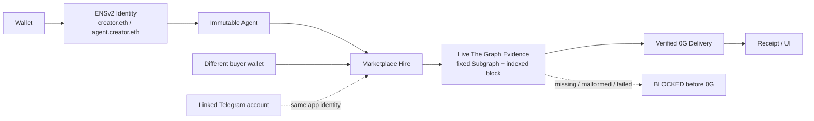

# AlphaDawg

### Own the agent. Verify the work. Trust the receipt.

> A protected marketplace where authenticated creators publish immutable AI
> agents, external buyers hire an exact version, and delivery requires fresh
> ENS authority plus verified 0G execution.

**ETHGlobal Lisbon 2026 Continuity · Local evidence only · Release blocked**

---

## The Problem

AI agents can recommend, trade, and coordinate, but most agent marketplaces
cannot prove four basic facts:

1. **Who controls the agent?** A connected wallet or display name is not proof
   of authority over an agent identity.
2. **What was hired?** Mutable instructions make it impossible to know which
   version produced a result.
3. **What actually ran?** A model response or success badge is not verified
   execution or durable delivery.
4. **What was authorized?** A swap transaction alone does not prove the agent's
   policy, route, limits, or approval.

## The Solution

AlphaDawg turns each claim into an explicit gate. The creator authenticates
with SIWE, binds an immutable agent version to a canonical ENS creator name and
deterministic agent subname, then publishes that exact version to the protected
marketplace. A different authenticated buyer hires it through an idempotent
job. Delivery is accepted only after fresh ENS checks, verified 0G Compute,
proof-enabled Storage readback, and one canonical receipt.

The protected journey is simple:

`wallet → ENSv2 identity → immutable agent → marketplace hire → verified 0G delivery → receipt/UI`

A different buyer performs the hire. Telegram can reach the same protected
flow, but neither a buyer wallet nor Telegram can replace creator authority.

---

## Architecture — Seven Protected Stages


```mermaid
flowchart LR
    Wallet["Wallet"] --> Identity["ENSv2 Identity<br/>creator.eth / agent.creator.eth"]
    Identity --> Agent["Immutable Agent"]
    Agent --> Hire["Marketplace Hire"]
    Hire --> Graph["Live The Graph Evidence<br/>fixed Subgraph + indexed block"]
    Graph --> Delivery["Verified 0G Delivery"]
    Delivery --> Result["Receipt / UI"]

    Buyer["Different buyer wallet"] --> Hire
    Telegram["Linked Telegram account"] -. "same app identity" .-> Hire

    Graph -. "missing / malformed / failed" .-> Blocked["BLOCKED before 0G"]
```

Solid arrows are the protected product path. Dashed arrows are secondary or
pre-gated paths; they are not implementation, eligibility, or live proof.

| Role | Component | What it proves |
|---|---|---|
| Identity | ENSv2 creator parent + deterministic agent subname | Who owns or is authorized to operate the named agent |
| Version | Immutable `AgentVersion` | The exact instructions, capability, service, price, policy, and owner hired |
| Commerce | Protected marketplace + different-buyer job | Who published, who hired, and which version was selected |
| Data | Fixed The Graph Subgraph operations | Which deployment and indexed Ethereum block supplied the liquidity evidence |
| Execution | 0G Compute + proof-enabled Storage readback | The accepted output matches the stored delivery |
| Receipt | Canonical terminal receipt | One delivery and one mutually exclusive financial outcome |

---

## The Run — What Happens End to End

1. **Authenticate:** SIWE establishes the app user. Telegram and reverse ENS
   resolution never replace wallet authority.
2. **Bind the name:** the creator selects a parent such as `creator.eth`; the
   system derives a deterministic subname such as `agent-slug.creator.eth`.
3. **Freeze the version:** instructions, capability, service, price, payout,
   policy, chain, owner, and name binding become one immutable version.
4. **Publish:** only that protected version becomes visible and hireable in the
   marketplace.
5. **Hire:** a different authenticated buyer accepts an integer-atomic quote
   and submits one idempotent job.
6. **Recheck authority:** ENS is resolved immediately before the first 0G
   effect. Missing, stale, transferred, or inconsistent authority stops work.
7. **Execute and read back:** 0G output, proof, and Storage readback must match
   the immutable job and version.
8. **Deliver:** ENS is checked again before one canonical receipt is accepted
   and shown in the UI.
9. **Prove the source:** the proof UI shows Graph Subgraph, deployment, indexed
   block, context hashes, 0G reasoning/Storage evidence, and the receipt.

## ENSv2 — A Human Name With Machine Authority

The creator name and agent label are normalized separately. The agent subname
is deterministic and bound to the immutable version, so renaming, transfer,
role drift, resolver drift, broken parent links, or stale records cannot silently
change what the buyer hired.

Current evidence is local fixture/integration evidence. Direct ENSv2 live writes
and claims remain blocked until the official deployment packet and an exact
external-effect authorization exist.

## Marketplace — One Protected Listing

The protected marketplace lists only an immutable published version. A draft,
legacy marketplace row, unresolved ENS name, unavailable runtime, or self-hire
cannot satisfy the journey. Duplicate submissions converge on one job and one
effect identity.

## Proof — ENS + 0G + Receipt

Fresh ENS checks answer **who is authorized**. Verified 0G Compute and Storage
readback answer **what ran and what was delivered**. The canonical receipt binds
those facts to the exact buyer, job, version, hashes, and terminal outcome.

A fixture, installed SDK, HTTP `200`, request ID, or green UI badge is not live
sponsor proof.

## The Graph — Load-Bearing Liquidity Evidence

`liquidity-scout` uses The Graph before job admission. The server supports only:

- `pinned-deployment-lookup`: `_meta`, deployment, indexed block, and indexing-error state.
- `liquidity-volume-snapshot`: ETH price, factory totals, and the five highest-TVL pools with pair, fee tier, TVL, volume, fees, liquidity, and transaction count.

The endpoint pattern is `POST https://gateway.thegraph.com/api/subgraphs/id/<SUBGRAPH_ID>` with a server-only bearer `THE_GRAPH_API_KEY`. Primary Subgraph: `8e4dRt4P4WHXnKbEq7STaQfU2g99WZ5S4w39f2PcUTjD`; one fallback: `AXJd5my1nV3MMeoX2FPoxnE7hqqDHiSYEazARyd4xLMj`. No user can supply an endpoint, ID, credential, tool, or GraphQL document.

Redirects, non-2xx responses, GraphQL/indexing errors, missing block identity, malformed/oversized responses, timeout, and abort produce `BLOCKED` before 0G work. A configured key displays `CONFIGURED`, never live. Only successful job evidence proves live use.

Implementation base: `17458454933500132dbd2fdc3659bec9e6972491`. Lisbon Graph changelog: fixed native-fetch provider and evidence kernel (`3db3d19`), judge-facing catalog/proof UI (`744eb96`), recovery evidence (`fe019a4`), and audited UI remediation (`96d0f23`). Uniswap code is preserved as optional and unclaimed.

## Bounty Fit — Plain English

| Track | What AlphaDawg is designed to demonstrate | Honest state |
|---|---|---|
| ENS | A creator controls a parent name, each agent gets a deterministic subname, and authority is checked again before execution and delivery. | Local evidence exists, but the Kernel publication handoff is `AUDIT_FIX`; no live ENS or eligibility claim. |
| 0G | Compute produces the result, Storage preserves it, and proof-enabled readback must match before delivery is accepted. | Deterministic local evidence exists; live 0G execution is `NOT_RUN`. |
| The Graph | A fixed Ethereum Uniswap V3 Subgraph supplies block-bound liquidity evidence before 0G reasoning. | Kernel/UI and mocked causal-removal evidence pass locally; live query remains authorization-gated and `NOT_RUN`. |

---

## Current Gate

The [Lisbon Claim Matrix](docs/lisbon/CLAIM-MATRIX.md) is the source of truth.

- `LOCAL_BUILD_AUTHORIZED`: deterministic local files, tests, loopback services,
  disposable databases, and atomic commits are allowed.
- A0-A3 have accepted local evidence; live 0G execution remains `NOT_RUN`.
- A4 W3 schema-v1 compatibility is `PASS_TO_NEXT_GATE`, but the Kernel
  publication handoff audit returned `FIX`; current `A4_ACCEPTED` remains
  closed.
- A5's Kernel lifecycle audit returned `FIX`; A5 remains local-only and is not
  accepted.
- `G1_GRAPH_LIVE_ACCEPTED` replaces mandatory A6. Local Graph implementation is
  frozen; live Graph/0G/ENS evidence and causal replays remain blocked.
- `RELEASE_BLOCKED` and `LIVE_EFFECT_BLOCKED` remain in force. Production
  readiness is rejected currently; expected winnings are unproven with floor
  `$0`.

## Project Structure

| Area | Paths |
|---|---|
| Authentication and commerce kernel | `src/auth/`, `src/kernel/`, `src/worker/` |
| ENS authority | `src/ens/` |
| 0G execution and verification | `src/og/`, `tools/0g-storage-verifier/` |
| Product UI and browser evidence | `app/`, `components/`, `tests/playwright/` |
| Telegram and protected cycle wiring | `src/telegram/`, `src/agents/` |
| Evidence and controls | `tests/`, `docs/lisbon/` |

Inherited OpenClaw, Hedera, Circle, Arc, Naryo, and legacy marketplace paths are
non-authoritative unless a current sprint explicitly admits them.

## Tech Stack

| Layer | Technology |
|---|---|
| Web | Next.js 16, React 19, TypeScript |
| Data | Neon PostgreSQL, Prisma |
| Identity | SIWE, viem, ENS Universal Resolver + ENSv2 readiness fixtures |
| Live blockchain data | The Graph Gateway, fixed Ethereum Uniswap V3 Subgraphs |
| Execution | 0G Compute, Storage, pinned Go proof verifier |
| UI verification | Playwright Chromium |
| Optional tooling | Existing Uniswap path, preserved and unclaimed |

## Quick Start

Requires Node.js 22+ and npm.

```bash
npm ci
cp .env.example .env.local
npm run dev
```

Core checks:

```bash
npm run lint
npm run typecheck
npm test
npm run build
```

Never commit `.env.local` or treat configured credentials as permission for a
sponsor call, managed migration, signature, transaction, deployment, or spend.
The complete migration, integration, browser, resilience, Go verifier, secret,
and release floor is defined in [GOALS.md](docs/lisbon/GOALS.md).

## Control Center

| Document | Purpose |
|---|---|
| [GOALS.md](docs/lisbon/GOALS.md) | Canonical outcome, authority, evidence, and release contract |
| [SPRINTS.md](docs/lisbon/SPRINTS.md) | Ordered acceptance cards |
| [CLAIM-MATRIX.md](docs/lisbon/CLAIM-MATRIX.md) | Current fail-closed claim state |
| [EVIDENCE.md](docs/lisbon/EVIDENCE.md) | Append-only evidence ledger |
| [EXTERNAL-EFFECTS.md](docs/lisbon/EXTERNAL-EFFECTS.md) | Exact authorization for external actions |
| [C0-A4-CONTINUATION.md](docs/lisbon/prompts/C0-A4-CONTINUATION.md) | Current coordinator launch contract |

Previous Cannes code and evidence are reusable prior work, not Lisbon
eligibility, release evidence, production proof, or a prize forecast. Only
`RELEASE_VALIDATED` on one unchanged SHA is a successful terminal state.
