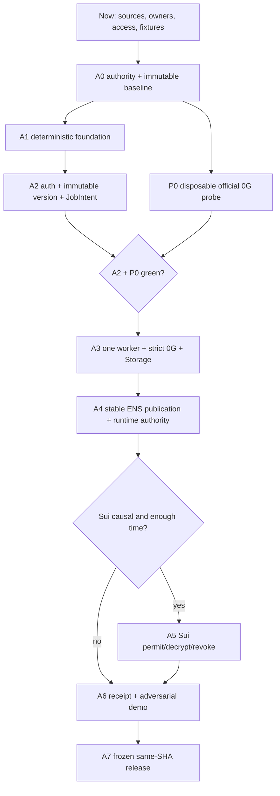

# AlphaDawg Lisbon Kickoff H0 Runbook

> [!warning] Start authority
> At 2026-07-23 18:06:32 WEST the user explicitly authorized AlphaDawg Continuity work to proceed now. Local work and commits on the clean `developer` worktree are authorized. Organizer eligibility evidence, rights/license, access, spend, push, deployment, signatures, transactions, and claims retain their independent gates.

> [!success] Product and track decision
> `NARROW`: build **0G Keep + stable ENS Continuity**. Sui is an H21–H25 third-track option only when it gates real decryption before the same 0G job. Direct ENSv2 devnet is a probe, not a release dependency, until ENS supplies the exact qualifying deployment packet.

The smallest judge-visible claim is:

```text
creator freezes one immutable AgentVersion
  -> creator publishes <agent>.<creator>.<controlled-parent> through ENS
  -> buyer signs one exact JobIntent / hire request
  -> worker freshly resolves owner + version + manifest
  -> optional Sui permit authorizes package decryption
  -> 0G executes and the application verifies the response
  -> 0G Storage proof-enabled readback matches the canonical receipt
  -> worker rechecks ENS and optional Sui authority before delivery
```

Payments, commissions, trading, ratings, arbitrary tools, and multi-agent breadth are outside the protected sponsor proof. The hiring MVP is one authenticated buyer requesting one exact job from one creator-owned agent.

## 1. A0 Stop Check

No product mutation starts until all fatal rows are `CONFIRMED`:

| gate | current evidence | green when | failure action |
|---|---|---|---|
| Local start authority | Explicit user authorization at 2026-07-23 18:06:32 WEST; official dashboard signal remains 2026-07-24 21:00 WEST / 20:00 UTC | Thread authority archived; organizer evidence required separately for eligibility promotion | `GO_LOCAL`; no external effects |
| Baseline | Product checkout clean at `bfa7bd37c573e2e49525d965f7f937210e170d72`; `main...HEAD = 0/0` | SHA, tree, lock hash, remote, and prior showcase archived | `STOP_PROJECT` on mismatch |
| Rights/license/team | No complete A0 evidence found | Former-contributor permission, OSI license file, changed-team and Continuity treatment recorded | `STOP_PROJECT` |
| Track admission | July 23 snapshot confirms named Continuity tracks | Live prize pages archived; any regular-track or same-partner stacking ruling is written | Keep unresolved rows `CONDITIONAL`; do not claim them |
| Access | Secret names are known; readiness incomplete | 0G, ENS namespace/writer, Sui Testnet, RPC, funds, spend caps, and owners are `SET` without exposing values | Block only the affected probe/track |
| Ownership | Owners/cut authority not assigned | `HO`, implementation owner, release owner, backup, booth presenter, and Sui cut authority named | Do not start A1 |

Unresolved sponsor access can block a track. Unresolved authority, rights, or baseline blocks the project.

## 2. Current Track Contract

| track | first-slot cap | current state | mandatory implementation | mandatory evidence |
|---|---:|---|---|---|
| 0G Keep Building | $1,500 | `CONFIRMED_IN_PRIZE_SNAPSHOT`; claim waits for A0 | Meaningful Lisbon progress using real 0G Compute/Private Computer; strict usable-output verification; proof-enabled Storage readback; no success fallback | Prior state, dated Lisbon changelog, “What's next,” public repo/setup, working demo/live link, 0G explanation, applicable addresses/IDs, contacts, ≤3-minute video |
| ENS Continuity | $2,000 | `CONFIRMED_IN_PRIZE_SNAPSHOT`; claim waits for A0 | Owner-controlled creator/agent subname; real write/update; clean resolve; runtime uses the resolved version/manifest; stale/transfer/mismatch refuses | Functional non-hardcoded demo, video/live link, public name/node/owner/resolver/write transaction/block/record hashes, Sunday booth presentation |
| Sui Existing App | $2,000 | `CONDITIONAL_THIRD` | Existing AlphaDawg adopts Sui deeply; selected design is Walrus ciphertext + Seal/Move job-bound permit that gates the real worker before 0G | Working Testnet demo; package/object/transaction/blob IDs; authorized decrypt/run; identical revoke rerun stops before decryption/0G; leakage scan |
| ENS AI Agents / Creative | $1,500 each | `CONDITIONAL_NOT_CLAIMED` | The feature fits, but these are not the protected Continuity claim | Requires written admission for the existing submission and clarity on same-partner awards; never call the feature an automatic extra prize |
| 0G Product / Infrastructure | Larger regular pools | `CONDITIONAL_NOT_CLAIMED` | Build shape may overlap; category and existing-project admission remain unresolved | Written sponsor ruling before claim |

Selected Continuity ceiling: **$3,500** for 0G + ENS; **$5,500** only if Sui passes A5. Floor: **$0**.

Primary source snapshot: the user-supplied Lisbon prize page captured 2026-07-23. Recheck the live event pages at A0 and before submission. ETHGlobal rules require Continuity work to disclose the prior state and make substantive event-window additions.

## 3. Synchronous Dependency Chain



The mutating order is fixed: `A0 -> A1 -> A2 -> A3 -> A4 -> optional A5 -> A6 -> A7`. Sponsor modules do not start merely because their SDK probes pass.

## 4. What Can Run Asynchronously

Effective WIP cap: **one mutating task plus one disposable probe, external wait, or read-only audit**. Never run two product-code writers.

| async lane | may overlap | may do | must not do | join gate |
|---|---|---|---|---|
| `P0` 0G compatibility/live probe | A1 foundation | Run the unchanged pinned official Compute and Storage examples in a disposable location; capture versions, provider/model, response verification, root/transaction/readback | Edit `src/og/**`, lock product packages, or report probe output as product evidence | Joins A2 at `J1` before A3 |
| `E0` ENS official-response wait | A0–A3 | Confirm ENSv2 repo/commit/network/addresses/ABI/eligibility; archive workshop answer | Treat draft PR `#537` as release infrastructure | Required only for direct v2; stable ENS A4 continues without it |
| `E1` ENS client-readiness probe | First free probe slot after A0 | Pin/test viem Universal Resolver and CCIP Read fixtures | Bind product publication before A3 | Must pass before A4 |
| `S0` Sui access/toolchain probe | First free probe slot after A0 | Confirm Sui v2, gRPC, Walrus, Seal, key servers, Testnet funds and one disposable encrypt/upload/read/decrypt path | Create product Sui/Move files or consume A4 time | Evidence only; A5 still requires A4 green |
| Evidence/security review | Any sprint | Review current task output, source expiry, secret/redaction state and same-SHA identifiers | Mutate product code | Reviewer signs the active sprint exit |

Probe priority is `P0 -> E1 -> S0`. External waits consume no coding slot. Evidence capture belongs to the active task; it is not a third lane.

## 5. Outcome-Owned Sprint Board

| sprint | window | only permitted mutation | exit evidence | premortem / cut |
|---|---|---|---|---|
| `A0` authority | H0–H2 | Provenance/control files and clean event worktree only | Start authority, rules, rights/license/team, SHA/tree/lock, access/spend/owner ledger, signed `BUILD` | Any fatal field red → `STOP_PROJECT` |
| `A1` foundation | H2–H6 | Scripts, one additive migration, boundary validation, CI/test harness | One SHA passes clean install, empty/upgraded DB, lint, typecheck, tests, build/start | Red at H6 → repair foundation; sponsor mutations stay frozen |
| `A2` hire kernel | H6–H11 | Wallet auth, immutable version, canonical JobIntent, job/events/effect uniqueness, lease/idempotency | Forged/cross-user zero mutation; 20 duplicates yield one job/effect; one creator/buyer/job replay | Red authority/state/uniqueness → `STOP_PROJECT` |
| `A3` 0G | H11–H17 | One worker, current 0G adapter, fatal response verification, Storage receipt/readback, Crawbot/OpenClaw isolation | One verified job; one-byte tamper gives no usable output; kill/restart gives one receipt; legacy-free boot | Fail-open verification, unverified readback, or blind retry → `STOP` |
| `A4` ENS | H17–H21 | Stable ENS owner write/resolve/update and authority checks | Creator/agent name, transaction/block, clean resolve, before/after hashes; stale/transfer/mismatch/outage makes zero 0G calls | Cosmetic/cache-backed ENS → `DROP_TRACK:ENS`; protected core fails |
| `A5` Sui | H21–H25 | One minimal Move package and one Sui/Seal/Walrus license path | Valid permit decrypts/runs; revoked identical job stops before decrypt/0G; no plaintext leakage | Not causal and green by H25 → `DROP_TRACK:SUI` |
| `A6` demo | H25–H31 | Receipt verifier, minimum UI, reset/seed, readiness endpoints | Failure-first and success/replay flows pass twice in ≤4 minutes; 0G cut ≤3 minutes | Cut Sui, payments, breadth and polish before core checks |
| `A7` release | H31–H36 | Submission/docs/evidence fixes only; no features | Fresh clone, migrations, lint, typecheck, tests, build/start, live smokes, secret/license scan, public IDs, videos/forms/booth all bind one SHA | Missing track evidence → remove claim everywhere; red core → `STOP` |

No sprint passes on ticket completion. The exact user-visible outcome, negative test, public identifier, and release SHA must agree.

## 6. Sponsor Implementation Contracts

### 0G

Inherited AlphaDawg uses `@0glabs/0g-serving-broker@0.7.4` and `@0gfoundation/0g-ts-sdk@^1.2.1`. Current official docs use split `@0gfoundation/0g-compute-ts-sdk` and `@0gfoundation/0g-storage-ts-sdk` packages. P0 decides migration; never run a blind package upgrade inside A3.

- Use one provider/model and a dedicated capped account.
- Current official Compute docs prefer `ZG-Res-Key`; chatbot examples permit `data.id`/`data.chatID` fallback. Freeze the exact service contract from the pinned example. Missing identifier, `null`, `false`, or errored `processResponse` makes output unusable.
- Record provider attestation checks honestly: `verifyService` automates signer/compose checks but is not full environment verification without its documented manual steps.
- Storage upload records canonical payload hash, root and transaction; readback uses proof verification and byte/hash equality.
- Any local model, cached output, or inherited success fallback is demo-only failure evidence, never a successful 0G result.

### ENS and ENSv2

- Use the existing viem path; pin the tested `2.47.6` resolution after A0. Do not add ENSjs unless viem lacks a required operation. Ethers `6.13.1` is below the official ENSv2-readiness minimum `6.17.0`, so do not use it for the ENS path without an explicit upgrade and regression pass.
- Stable release hierarchy: `<agent>.<creator>.<controlled-parent>`. Records bind agent ID, immutable version, canonical manifest, actual endpoint/protocol and payout only when meaningful.
- Resolve owner, resolver, version and manifest immediately before 0G and again before delivery. Parent/agent transfer suspends the old version; new authority requires a new version and republish.
- ENSv2 registry-per-name is product-relevant for creator fleets, but the public design is still work in progress and `ens-contracts` PR `#537` remains open/draft. Direct v2 stays `PROBE_ONLY` until ENS confirms the deployment packet.

### Sui

- Sui is not a direct current dependency: `@mysten/sui@1.45.2` is only transitive; Walrus and Seal are absent. S0 must pin compatible direct Sui v2 packages after A0.
- Use `SuiGrpcClient`; JSON-RPC is deprecated. Extend the same client with official Walrus and Seal SDKs.
- Store only ciphertext on Walrus. Blob IDs are public; Walrus integrity is not confidentiality. Seal controls decryptability.
- One `AgentPackage` binds creator, version/manifest hash, Walrus blob/ciphertext hash and policy version. One job-bound permit binds buyer, worker, package, version, `jobIntentHash`, expiry and revocation.
- If revocation does not prevent the same worker from decrypting and calling 0G, Sui is removable and the claim is cut.

## 7. H0 Worktree And Control Commit

Run only after A0 start authority is green:

```bash
cd /Users/barroca888/Downloads/Dev/Personal/ETH_Global_Cannes_2026
git fetch origin --prune
git rev-parse HEAD
git rev-parse origin/main
git status --short --branch
git worktree add -b developer ../ETH_Global_Cannes_2026-lisbon bfa7bd37c573e2e49525d965f7f937210e170d72
```

`developer` is the user's single transparent event-window branch. Use only this dedicated worktree for product mutations; do not create parallel implementation branches or worktrees. If local or remote `developer` already exists at A0, stop and verify its provenance instead of replacing it.

Create and commit controls before features:

```text
CHANGELOG-LISBON.md
LICENSE
docs/lisbon/BASELINE.md
docs/lisbon/TRACK-MATRIX.md
docs/lisbon/EVIDENCE.md
docs/lisbon/ARCHITECTURE.md
docs/lisbon/AI-DISCLOSURE.md
docs/lisbon/FRESH-CLONE.md
```

`BASELINE.md` records start authority, timestamps, prior SHA/showcase, contributor rights, license, changed-team/Continuity treatment, pre-existing features, new Lisbon boundary, excluded pre-event work, sources, access states and owners. Store no secret values or private consent content.

## 8. Production-Safe Demo Gate

Use the existing simple target: Vercel web/API, one managed PostgreSQL database, one Railway worker, and live sponsor Testnets. No Redis, per-agent server fleet, or replacement marketplace.

Every deployed/readiness surface must expose the same:

```text
releaseSha
migrationVersion
receiptSchemaVersion
policyVersion
workerHeartbeat
selectedTracks
```

Release requires:

1. One immutable `releaseSha` across web, worker, receipt, evidence JSON, public-ID ledger and video.
2. Deterministic `demo:reset` and `demo:seed`; no manual database repair.
3. Success plus forged owner, ENS transfer/stale, one-byte 0G tamper, 20-way duplicate, worker restart, timeout, sponsor outage and optional Sui revoke.
4. Two consecutive rehearsals: failure-first, then success and replay no-op.
5. Fresh clone; empty/upgraded migrations; lint, typecheck, tests, build/start; tracked/history secret scan; license/AI disclosure; sponsor smokes.
6. Same `jobIntentHash` across ENS binding, optional Sui permit, 0G request, Storage receipt and final receipt verifier.

Current release state is `NO_GO`: no Lisbon event branch/evidence exists; inherited lint/tests/build, rights/license, ENS, Sui, strict 0G and same-SHA deployment gates are not green.

## 9. Start-Now Board

| action | output | state |
|---|---|---|
| Capture the workshop green light | Presenter/role, exact statement, WEST/UTC time, photo/message URL, scope | `NOW_BLOCKING_A0` |
| Reopen live Lisbon dashboard/rules/prize pages | Timestamped source packet and expiry | `NOW` |
| Name owners and alarms | `HO`, implementation/release owners, backup, booth presenter, Sui cut authority; H2/H6/H11/H17/H21/H25/H31 | `NOW` |
| Close rights/license/changed-team Continuity evidence | Evidence paths and public-safe summary | `BLOCKED` |
| Fill access/spend ledger | 0G, ENS, Sui, RPC, wallets/funds/caps as `SET/NOT_SET/BLOCKED` | `NOW` |
| Freeze demo fixture | One creator, buyer, agent, task, provider/model, namespace and `jobIntentHash` schema | `NOW` |
| Prepare P0/E1/S0 command/evidence cards | Exact official repo/commit/package/version/network/expected result | `NOW` |
| Product branch, install, code, write or transaction | Only after signed A0 | `WAIT_A0` |

Final decision: `NARROW`. Start preparation now. Start product implementation only when A0 archives the controlling green light and every fatal authority row passes.

Current A0 evidence: [[22_A0_Live_Authority_and_Clearance_Evidence]].

## Sources

- [ETHGlobal Lisbon prizes](https://ethglobal.com/events/lisbon2026/prizes)
- [ETHGlobal rules](https://ethglobal.com/rules)
- [0G inference](https://docs.0g.ai/developer-hub/building-on-0g/compute-network/inference)
- [0G Storage SDK](https://docs.0g.ai/developer-hub/building-on-0g/storage/sdk)
- [ENSv2 overview](https://docs.ens.domains/contracts/ensv2/overview/)
- [ENSv2 readiness](https://docs.ens.domains/web/ensv2-readiness/)
- [ENSv2 Sepolia dev deployment PR #537](https://github.com/ensdomains/ens-contracts/pull/537)
- [Sui clients](https://sdk.mystenlabs.com/sui/clients)
- [Seal SDK](https://sdk.mystenlabs.com/seal)
- [Walrus SDKs](https://docs.wal.app/docs/typescript-sdk/sdks)
- [Walrus data security](https://docs.wal.app/docs/data-security)
- [[ALPHADAWG_LISBON_MASTER]]
- [[20_Track_1_0G_Keep_Ready_Setup]]
- [[21_ENSv2_Devnet_Research_and_Implementation_Gate]]
