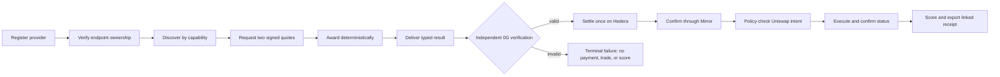

# AlphaDawg Pre-Hackathon Code Freeze and Change Map

> [!danger] Controlling rule
> Before the official ETHGlobal Lisbon hacking window opens, AlphaDawg work is **planning, research, access preparation, and evidence-template preparation only**. Do not edit product code, schema, migrations, tests, runtime configuration, deployment files, or generated artifacts. Do not commit, push, deploy, sign, broadcast, or spend.

> [!important] Verified repository state — 2026-07-16
> `/Users/barroca888/Downloads/Dev/Personal/ETH_Global_Cannes_2026` is clean at `bfa7bd37c573e2e49525d965f7f937210e170d72`. Local `main` and local `feat/lisbon-agent-commerce` are `0/0` commits apart. The pre-event implementation was removed at the user's direction. Nothing was committed, pushed, deployed, funded, or broadcast. The local pre-event branch has no product delta and must not become the submission branch.

## Freeze Boundary

| before official H0 | allowed? | rule |
|---|---|---|
| Read code, trace dependencies, inspect public state | Yes | Read-only; record findings in this research vault. |
| Research official rules, standards, SDKs, tracks, and supported networks | Yes | Prefer primary sources; revalidate at H0. |
| Draft architecture, schemas, state machines, tests, prompts, runbooks, evidence templates | Yes | Paper artifacts only; label every path `PLANNED`. |
| Arrange contributor consent, license, team approval, credentials, faucets, API access | Yes | Never place secrets in the vault or repository. |
| Run zero-value/read-only external checks | Only with existing authority | Record as pre-event preflight, never Lisbon implementation evidence. |
| Edit application, contracts, Prisma, tests, Docker/Fly/Vercel, package files, or generated artifacts | **No** | Wait until official H0 and live-rule recheck. |
| Commit, push, open PR, deploy, sign/broadcast transactions, or spend | **No** | Requires the event window plus the normal approval gates. |

## Target Outcome

Build one narrow, proof-carrying commerce loop during the official event window:



The legacy Cannes Arc x402 `$0.001` specialist path remains a disclosed compatibility regression. It is not the new Hedera settlement and must not be counted twice.

## Architecture Decision

```text
one AlphaDawg application service + one PostgreSQL database
  ├─ Agent Card / A2A-compatible task surface
  ├─ capability-based directory over existing MarketplaceAgent
  ├─ typed commerce orchestrator and append-only transition log
  ├─ strict 0G proof verifier and Storage receipt
  ├─ exactly-once Hedera settlement + Mirror reconciliation
  ├─ policy-bounded Uniswap API adapter
  └─ receipt/evidence API and minimal judge UI

one independently runnable external provider
  ├─ independent signer and settlement account
  ├─ variable atomic-unit quote
  ├─ caller-supplied task
  └─ real 0G-backed delivery
```

Do not create one VM/container per specialist, a second provider registry, a second database, a framework rewrite, or a broad marketplace redesign.

## Planned Change Inventory

Every row is a plan, not present Lisbon code.

| existing surface | planned treatment | event-window outcome | do not do |
|---|---|---|---|
| `MarketplaceAgent` Prisma model | Extend | Canonical cache of verified Agent Cards, capabilities, prices, signers, rails, and status. | Add a duplicate registry. |
| `src/config/agent-registry.ts` and role manifests | Retain for legacy | New commerce discovery bypasses source edits; legacy cycle remains isolated. | Rewrite the old cycle before core parity. |
| OpenClaw workspaces/prompts | Retain as Cannes content evidence | New runtime does not require an OpenClaw process or gateway probe. | Delete historical assets before parity. |
| OpenClaw/Fly per-agent deployment | Deprecate after parity | One shared runtime host; legacy scripts remain rollback-only. | Deploy a new per-agent fleet. |
| Arc x402 client/server | Retain and regression-test | Exact `$0.001` built-in payment behavior remains honest and isolated. | Trust a provider-supplied transaction string as payment proof. |
| Existing 0G inference/storage | Adapt behind strict seam | Real event-time proof fields are independently verified and task-bound. | Accept `teeVerified`, response IDs, local fallbacks, or arbitrary attestations as proof. |
| Existing Hedera SDK/HCS | Extend | Exactly-once Testnet transfer, signed-artifact persistence, Mirror finality, optional HCS anchor. | Mark submitted/broadcast as settled. |
| Existing Arc/custom swap code | Legacy only | New path uses a typed Uniswap API intent and route-specific status. | Use mock router, self-transfer, or generic tx hash as success. |
| Existing dashboard | Minimal adaptation after core | Show provider, quote, proof, settlement, execution, and receipt links. | Redesign the marketplace or hide failure states. |
| Root Docker/deployment | Change last | One application image plus independent provider example after build/fresh-clone gates. | Rewrite deployment before sponsor-critical core works. |

## Planned Module Boundaries

```text
src/a2a/
  card.ts              Agent Card runtime schema and signing metadata
  client.ts            bounded discovery, quote, task, status, cancellation
  server.ts            minimum interoperable server surface

src/commerce/
  schemas.ts           strict runtime records and atomic-unit validation
  state-machine.ts     legal and authorized transitions
  quote.ts             signatures, expiry, nonce, budget, deterministic award
  receipt.ts           canonical serialization and linked receipt hash
  orchestrator.ts      coordinates ports; no sponsor SDK internals
  index.ts             named reusable exports

src/providers/
  built-in-adapter.ts  compatibility seam for existing specialists
  external-provider.ts independently runnable provider example

src/og/
  inference.ts         current event-time 0G provider call
  verifier.ts          independent proof verification and binding
  storage.ts           verified receipt storage/retrieval

src/hedera/
  settlement.ts        prepare, persist, broadcast identical bytes, reconcile
  mirror.ts            finality and transaction evidence
  commerce-audit.ts    compact HCS hash anchor

src/uniswap/
  policy.ts            allowlists, caps, deadlines, slippage, spender/domain
  client.ts            approval, quote, simulation, execution, status
  executor.ts          exhaustive route-union handling

prisma/schema.prisma   additive commerce records and unique constraints
tests/                 pure, database, HTTP, recovery, sponsor, and E2E gates
docs/lisbon/           event-created provenance and evidence controls
```

## Canonical Records and Bindings

All value fields use integer atomic-unit strings at external boundaries and database integer types internally. Every economic record binds the same identity chain.

| record | minimum binding |
|---|---|
| Provider | card URL/hash, endpoint, capability, signer, rail/account, proof type, verification time, status |
| Task | schema version, task ID, authenticated requester, capability, input hash, atomic budget, deadline, proof/execution policy, idempotency key |
| Quote | task ID, quote ID, provider ID/signer, input hash, asset/network, atomic amount, endpoint, nonce, expiry, signature |
| Award | task ID, accepted quote hash, provider, selection evidence, time/expiry |
| Delivery | task/quote/provider IDs, input/output hashes, schema version, proof reference, expiry, provider signature |
| Verification | task/quote/delivery/provider IDs, hashes, verifier version/result, proof hash/root, expiry |
| Settlement | verification ID/hash, exact quote asset/amount/recipient, signed artifact hash, transaction ID, Mirror result/finality, expiry |
| Execution | settlement ID, typed intent hash, policy version, route, request ID, simulation, signed artifact, transaction/order/plan ID, final status |
| Reputation | verified delivery and settlement/execution result, feedback author, score/reason, canonical hash |
| Final receipt | stable references and hashes for every prior record |

No proof, receipt, or score may be authorized by a provider's output alone.

## State Machine

```text
REQUESTED -> QUOTING -> AWARDED -> RUNNING -> DELIVERED -> VERIFYING
  -> VERIFIED -> SETTLEMENT_PREPARED -> SETTLED
  -> EXECUTION_PREPARED -> EXECUTED -> SCORED

terminal: REJECTED | EXPIRED | CANCELLED | VERIFICATION_FAILED |
          SETTLEMENT_FAILED | EXECUTION_FAILED
```

Invariants:

1. Transitions are explicit, role/identity-authorized, version-checked, append-only, and idempotent.
2. The authenticated requester owns task creation, reads, and cancellation.
3. Provider transitions must match the awarded provider.
4. Missing, malformed, stale, mismatched, or false proof ends the delivery before economic preparation.
5. Exactly one settlement is permitted per delivery across all rails.
6. Signed settlement/execution artifacts are persisted before broadcast; ambiguous retries reuse identical bytes.
7. `SETTLED` requires public reconciliation/finality, not submission alone.
8. Execution accepts typed policy-validated intent, never provider calldata.
9. `HOLD` remains `HOLD`; malformed output fails instead of becoming a fallback success.
10. Reputation gain requires a current valid proof and linked outcome.

## Boundary and Abuse Controls

| boundary | planned control |
|---|---|
| Agent Card URL | HTTPS in deployed mode; loopback HTTP only for explicit local tests; private LAN/metadata/reserved destinations remain blocked. |
| DNS/redirect | Validate every resolved address, pin connection target, revalidate every redirect, bound redirect count. |
| HTTP | Timeouts, cancellation, response-size limits, exact content types, bounded concurrency/retry. |
| Authentication | Separate directory-admin, orchestrator, requester, and provider identities; never trust caller-supplied actor labels. |
| Budgets | Per-task and per-requester outstanding caps grouped by asset/network; maximum model calls. |
| Signers | Independent external-provider signer/account; no shared mnemonic derivation. |
| Logging | No tokens, private keys, private prompts, PII, signed raw artifacts, or secret prefixes. |
| Caching | Public Agent Cards only; never signed quotes, private tasks, deliveries, or tenant-specific data. |

## Database and Migration Plan

The Cannes repository has a Prisma schema but no complete migration history. Therefore:

1. At H0, confirm the actual production/test database provenance and schema version.
2. Create an event-window baseline migration generated from the immutable Cannes SHA, or formally baseline the existing database in Prisma's migration ledger.
3. Add the commerce migration separately and additively.
4. Test both paths on disposable PostgreSQL databases:
   - empty database -> full migration chain;
   - Cannes baseline schema -> baseline resolution -> commerce migration.
5. Compare the migrated database to the final Prisma datamodel with zero diff.
6. Run concurrency, uniqueness, restart reconstruction, and rollback-safe failure tests.

Never infer migration safety from `prisma validate` or a memory-store test.

## H0 Execution Order

| window | work | hard gate |
|---|---|---|
| H0–H2 | Revalidate clock/rules, rights/license/team, tracks, credentials, spend caps, clean SHA; create provenance/evidence controls. | No product code until H2 gate passes. |
| H2–H6 | Records, state machine, actor authorization, hashes/signatures, budgets, idempotency, migration chain, pure and DB tests. | Malformed/stale/replayed/unauthorized cases fail. |
| H6–H10 | Minimum A2A surface, two independent providers, ownership proof, SSRF controls, two comparable signed quotes, deterministic award. | No registry source edit; two-provider test passes. |
| H10–H17 | Real 0G inference, independent verification, task binding, Storage artifact, tamper matrix. | Valid passes; one-byte tamper creates no economic authority. |
| H17–H21 | Prepared-state Hedera settlement, identical-artifact retry, Mirror finality, HCS link. | Concurrent/replay/restart yields one final transfer. |
| H21–H26 | Typed Uniswap intent, policy, approval/Permit2, route union, simulation, execution/status. | Invalid intent signs nothing; real supported-testnet path completes. |
| H26–H30 | Final receipt, cancellation/recovery, Arc live regression, minimal UI. | All identifiers resolve; no fabricated evidence. |
| H30–H32 | Optional stretch only if core is green. | Hard feature freeze at H32. |
| H32–H36 | Fresh clone, full commands, redaction, videos, forms, track-specific evidence. | Submission remains blocked until every claimed gate passes. |

## Required Tests

### Offline and database

- Agent Card valid/invalid schemas and independent-client interoperability.
- SSRF matrix: IPv4/IPv6 private/reserved, mapped IPv6, metadata, credentials, redirects, DNS change, size/type/timeout.
- Ownership challenge nonce, expiry, replay, signer/card mismatch.
- Two-provider discovery and comparable signed quote selection.
- Quote tampering, expiry, nonce replay, asset/network mismatch, budget breach.
- Legal/illegal/unauthorized transitions and optimistic concurrency.
- Duplicate task, quote, delivery, settlement, execution, and feedback keys.
- Per-task/requester budget caps and model-call cap.
- Valid 0G proof and tampering of each bound field.
- Malformed provider output fails; explicit `HOLD` remains `HOLD`.
- HTTP timeout, retry, cancellation, and restart recovery.
- Prisma migration from empty and Cannes-baseline databases.
- Crash points before/after artifact persistence and broadcast.

### Live sponsor gates

- Real 0G success plus independent proof verification and retrievable Storage artifact.
- Same live delivery with a one-byte tamper produces no settlement/execution.
- Real Hedera Testnet settlement, Mirror finality, and replay/concurrency proof of one transfer.
- Real Uniswap supported-testnet quote/simulation/execution/status with invalid-intent no-sign proof.
- Real inherited Arc x402 `$0.001` regression from trusted buyer/facilitator evidence.

### Repository gates

Use the package manager selected from the event-time repository lockfile; do not create a second lockfile. Required outcomes:

- clean install and Prisma generation;
- lint exits 0;
- TypeScript exits 0;
- all tests exit 0;
- contract compile/tests exit 0 if contracts change;
- required legacy validators pass in an approved redacted environment;
- production build and start smoke pass;
- Docker/fresh-clone path starts without OpenClaw;
- browser/API/provider E2E passes;
- `git status` contains only intentional event-window work.

## Evidence Contract

For each success and failure scenario, capture:

1. event-time commit SHA and changed-file boundary;
2. redacted input plus canonical task/quote/delivery hashes;
3. provider Agent Card and signer identity;
4. 0G proof verifier result and Storage reference;
5. Hedera transaction, Mirror result, and optional HCS sequence;
6. Uniswap request ID, route, simulation, tx/order/plan ID, and status;
7. database state/event log showing idempotency;
8. negative assertion showing no downstream payment/signature/transaction/score;
9. public explorer links and timestamped screenshots/video;
10. exact test/command output and exit code.

Inherited Cannes identifiers are baseline evidence only and may not be relabeled as Lisbon evidence.

## Decisions Required Before H0

- [ ] Former-contributor consent and prize/credit treatment.
- [ ] OSI license agreed by rights holders.
- [ ] ETHGlobal changed-team and Continuity treatment in writing.
- [ ] Confirmed 0G classification and same-partner award rules.
- [ ] Confirmed Hedera regular-track eligibility and direct-SDK settlement acceptability.
- [ ] Confirmed Uniswap regular-track eligibility, API access, supported testnet path, and feedback form.
- [ ] Independent provider signer and Hedera account owner assigned.
- [ ] 0G, Hedera, Uniswap, Arc, database, and deployment access marked `SET/NOT_SET` without values.
- [ ] Testnet spend caps approved; no mainnet scope.
- [ ] Official H0 timestamp revalidated from live event sources.

## Cut Order

Cut in this order without weakening the core:

1. ERC-8004 writes and onchain reputation.
2. Streaming, push notifications, and extended Agent Cards.
3. Extra provider types, assets, pairs, and sophisticated auction scoring.
4. Hedera Tokenization and Cross-Chain automation.
5. Marketplace/UI redesign and deployment automation.

Never cut typed lifecycle, two-provider discovery, independent signing, strict 0G verification, exactly-once settlement, policy-bounded real execution, idempotency, Arc regression, failure E2E, or provenance/evidence.

## H0 Start Contract

At official H0:

1. Recheck the live clock and rules.
2. Confirm all stop gates.
3. Create one clean event worktree on the user-selected `developer` branch from the exact Cannes SHA.
4. Create and commit provenance/control documents first.
5. Reproduce the baseline and record inherited failures.
6. Run bounded credential/testnet smokes.
7. Freeze the claim matrix.
8. Begin H2 domain work only after the H2 gate passes.

Before official H0, this note is the deliverable. The product repository remains unchanged.

Related: [[00_Command_Center]], [[10_AlphaDawg_Current_Engineering_Audit]], [[11_Server_Agent_Target_Architecture]], [[12_Prize_Weighted_Sprint_Backlog]], [[13_E2E_and_Submission_Evidence_Plan]], [[16_Pre_Event_Clearance_Packet]], [[17_Kickoff_H0_Runbook]], [[18_Pre_Event_Prototype_Gap_Audit]].
