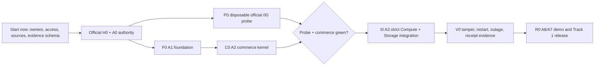

# AlphaDawg Track 1 — 0G Keep Ready Setup

> [!danger] Current boundary
> Track 1 means **0G Keep Building for AlphaDawg**. Product code, dependency installation, live probes, branches, and qualifying evidence begin only after official H0 and A0 authority/provenance pass. Right now we may prepare owners, access state, source/dependency locks, evidence schemas, and command cards without secret values.

This file controls the 0G lane, not the whole AlphaDawg project. The protected AlphaDawg core is **0G Keep + ENS Continuity**. ENSv2 maturity, dependency gates, and the separate A4 sprint are controlled by [[21_ENSv2_Devnet_Research_and_Implementation_Gate]].

Canonical contracts: [[ALPHADAWG_LISBON_MASTER#9.1 0G Keep Building — mandatory|0G implementation contract]], [[ALPHADAWG_LISBON_MASTER#9.2 ENS Continuity — mandatory second track|ENS implementation contract]], and [[ALPHADAWG_LISBON_MASTER#20.7A Sprint-By-Sprint Premortem And Track Achievement Playbooks|A0–A7 sprint premortems]].

## 1. Track Achievement

AlphaDawg passes Track 1 only when the Lisbon release proves all of this:

```text
immutable creator AgentVersion + exact buyer task
  -> one shared worker
  -> real 0G Compute / Private Computer inference
  -> exact attestation key and successful independent verification
  -> proof-bound 0G Storage upload and verified readback
  -> canonical receipt
  -> tamper, timeout, duplicate, and restart create zero unauthorized second effect
```

The submission also needs the prior-state SHA/page, dated Lisbon changelog, “What's next,” public repository/setup, live or runnable product, 0G feature explanation, applicable addresses/public IDs, contacts, and a demo video under three minutes.

## 2. Dependency Graph



Hard rule: `P0` and `F0` may run asynchronously after A0. `I0` cannot start until both `P0` and `C0` pass.

### AlphaDawg parallel sponsor lanes

| work | dependency | async rule | active implementation gate |
|---|---|---|---|
| Official ENS answer on ENSv2 devnet, branch/commit, addresses, and Continuity eligibility | ENS booth/official response only | Waits externally while `P0`/`F0` run; it does not consume a coding slot. | `BLOCKED_EXTERNAL` until written or timestamped official confirmation. |
| ENS client-readiness smoke | A0 plus one free WIP slot | May replace a completed `P0` or `F0` slot; never create a third active task. | Probe only; no product binding before A3. |
| ENS publication/runtime discovery | A3 `PASS_LIVE_0G` | A4 is sequential because it binds the stable marketplace receipt and worker. | H17–H21. |
| Direct ENSv2 hierarchical-registry prototype | Official ENS confirmation plus stable A4 green path | Optional subtask inside A4; cut first if it threatens clean publish/resolve evidence. | `PROBE_ONLY`, not release-critical. |

Team-wide WIP remains **two**. External waiting and prepared fixtures can be asynchronous; live code changes cannot bypass the A0–A4 join gates.

## 3. Start-Now Independent Work

| ID | task | depends on | output now | owner | status |
|---|---|---|---|---|---|
| `N0` | Confirm 0G Keep Continuity/partner admission and public-repo obligations. | Current official rules and sponsor page. | Timestamped source/decision row; unresolved wording remains `BLOCKED`. | `UNASSIGNED` | `NOW` |
| `N1` | Assign Track owner, backup, evidence reviewer, and cut authority. | Team decision only. | Named roster plus H2/H6/H11/H17/H31 alarms. | `UNASSIGNED` | `NOW` |
| `N2` | Fill access manifest using `SET`, `NOT_SET`, or `BLOCKED`; never secret values. | Account owners. | Compute, Storage, RPC, wallet/funds, provider, indexer, and spend-cap readiness. | `UNASSIGNED` | `NOW` |
| `N3` | Freeze the observed dependency and defect inventory. | Read-only Cannes baseline. | Versions, source URLs/commits, current failure list, migration decision questions. | `UNASSIGNED` | `NOW` |
| `N4` | Prepare evidence schemas and exact command cards. | This plan and master contracts. | Expected paths/fields for probe, verification, Storage, tamper, restart, and release. | `UNASSIGNED` | `NOW` |

### Access manifest

| boundary | variable/capability name | observed state | green when |
|---|---|---|---|
| Compute wallet | `OG_PRIVATE_KEY` | `UNKNOWN`; value must not enter this vault | Dedicated capped Testnet wallet is funded and available only to the permitted server/probe environment. |
| Compute provider | `OG_PROVIDER_ADDRESS` | `UNKNOWN` | Current provider/model is listed and one official verified call passes. |
| 0G RPC | `OG_RPC_URL` | Template/default exists | Event-time network endpoint is pinned and reachable. |
| Storage indexer | `OG_STORAGE_INDEXER` | Template exists | Upload plus proof-enabled download/readback passes. |
| Storage flow | `OG_FLOW_CONTRACT` | Template exists; requirement not yet verified | Current SDK example proves whether it is required and records the address/source. |
| Database | `DATABASE_URL`, `DIRECT_URL` | Names exist | Isolated Lisbon app/direct connections pass empty and upgrade migrations. |
| Spend | Compute/Storage Testnet cap | `UNASSIGNED` | Named human approves a numeric cap and low-balance stop. |
| Evidence | `docs/lisbon/evidence/track-0g/` | Must not be materialized before H0 | Paths, redaction rules, and release-SHA binding are approved. |

## 4. Observed Dependency Lock

Read-only Cannes baseline currently contains:

| dependency/surface | observed version/state | decision at H0 |
|---|---|---|
| Node | Repository engine requires Node 22 or later. | Record exact `node --version`; do not change runtime unless the official SDK requires and the change is approved. |
| Package manager | npm with committed `package-lock.json`. | Keep npm; no package-manager migration. |
| `@0glabs/0g-serving-broker` | `0.7.4` pinned. | Compare with current official Compute/Private Computer example and lock one compatible path. |
| `@0gfoundation/0g-ts-sdk` | `^1.2.1`. | Pin the installed lockfile resolution; verify current Storage upload/download APIs. |
| `ethers` | `6.13.1`. | Keep unless the selected official example proves a peer conflict. |
| Compute verification | Identifier source is not frozen and verification failure is non-fatal. | Pin the selected official service contract. Prefer `ZG-Res-Key`; accept only a fallback documented for that service. Missing identifier or `null`/false/error verification makes output unusable. |
| Storage readback | `download(..., false)` disables proof verification. | Enable supported proof verification and bind the readback root/payload to the receipt. |
| Concurrency | In-process limiter only. | Replace job authority with the database lease/idempotency contract before release. |

Do not install or upgrade packages from this table before H0. At H0, use pinned official examples and record package version, registry integrity, source repository commit, license, network, and copied example path before adaptation.

## 5. After-H0 Async Sprint Board

Effective WIP is **one mutating task plus one disposable probe, external wait, or read-only audit**. Evidence capture is part of each task, not a third workstream.

| lane | window | may run asynchronously with | work | exit evidence | stop/cut |
|---|---|---|---|---|---|
| `A0` authority/baseline | H0–H2 | Nothing before its signature | Capture H0, rights, approvals, immutable SHA/tree/lock hashes, separate worktree/access/spend state. | Signed `BUILD` decision and clean baseline. | Any fatal authority/provenance issue → `STOP_PROJECT`. |
| `P0` official 0G probe | After A0; target ≤60 minutes | `F0` | Run unchanged official Compute and Storage examples outside product integration; verify exact proof semantics, upload, proof-enabled readback, cost, latency, and failure. | Raw command log, versions, proof/run/root/transaction IDs, verifier/readback, redacted access state. | Missing/unknown verification or unaffordable access → `BLOCKED`; no invented adapter. |
| `F0` A1 foundation | H2–H6 | `P0` | Clean install, additive migration, typecheck/tests/build, boundary validation, CI, secret/license scan. | One all-green SHA on empty and upgraded database. | Red at H6 freezes product 0G integration. |
| `C0` A2 commerce | H6–H11 | No sponsor integration; one writer per module | Auth, immutable version, quote/order/job, canonical hashes, database lease/idempotency, one commission/receipt identity. | Forged input zero mutation; 20 duplicates produce one lifecycle/effect. | Red auth/state/uniqueness → `STOP_PROJECT`. |
| `I0-C` strict Compute | H11–H14 | Evidence review only, after `P0 + C0` join gate | Bind exact version/task/input/output/provider/model/deadline and require fatal independent verification. | Live verified run plus missing/invalid/one-byte-tamper refusal. | Any usable unverified fallback → `STOP`. |
| `I0-S` verified Storage | H14–H17 | Starts after `I0-C`; no second code writer | Store versioned redacted run receipt; proof-enabled readback; compare canonical payload/root hashes. | Upload/root/transaction IDs, verified download, equality/tamper tests. | Readback cannot be verified or bound → `STOP` Track 1 claim. |
| `V0` recovery/evidence | H17–H31 | ENS work only after A3; no optional track may steal core time | Worker kill/restart, timeout, duplicate, sponsor outage, canonical receipt, reset, same-SHA deployment, two rehearsals. | One job/receipt/effect; public IDs; failure and success demos. | Cut UI/optional work before weakening recovery/evidence. |
| `R0` release/submission | H31–H36 | No feature work | Fresh clone, full suite, live smokes, secret scan, public repo/live link, changelog, “What's next,” evidence index, ≤3-minute video. | `PASS_RELEASE` claim ledger for 0G Keep. | Missing mandatory artifact → remove claim; red core → `STOP`. |

## 6. Join Gates

| gate | all required | decision |
|---|---|---|
| `J0 READY_FOR_H0` | N0–N4 complete; owners and alarms named; no secrets in vault. | Wait for official H0. |
| `J1 READY_FOR_INTEGRATION` | A0 signed; P0 live probe green; F0/A1 green; C0/A2 green. | `BUILD I0` or `STOP`. |
| `J2 PASS_LIVE_0G` | Exact verified Compute result, verified Storage readback, strict failure paths, worker replay, same canonical receipt. | Continue to demo/release; no optional work while red. |
| `J3 PASS_RELEASE_0G_KEEP` | Fresh clone, same SHA, all tests, public evidence, prior-state/changelog/next-step disclosures, live/runnable product, video and submission fields. | `BUILD` claim or `NARROW` it away. |

## 7. Command Cards — Run Only After H0 And A0

### Baseline/worktree

```bash
git fetch origin --prune
git worktree add -b developer ../ETH_Global_Cannes_2026-lisbon bfa7bd37c573e2e49525d965f7f937210e170d72
cd ../ETH_Global_Cannes_2026-lisbon
git status --short --branch
git rev-parse HEAD
```

### Foundation/dependency inventory

```bash
node --version
npm --version
npm ci
npm ls @0glabs/0g-serving-broker @0gfoundation/0g-ts-sdk ethers
npm run lint
npx tsc --noEmit
npm run build
```

The repository has no trustworthy Track 1 smoke script yet. A1 must materialize `npm run smoke:0g` from the pinned official example and make it emit redacted, machine-checkable evidence. Until then, capture the exact official example command; do not guess a vendor API or report an ad-hoc call as product evidence.

## 8. Evidence Path Contract — Materialize After H0

```text
docs/lisbon/evidence/track-0g/
  access-manifest.md
  dependency-lock.json
  probe-compute.json
  probe-storage.json
  live-run.json
  storage-readback.json
  tamper-refusal.json
  restart-replay.json
  public-ids.json
  release-result.md
  claim-matrix.md
```

Every result records baseline SHA, release SHA, command, exit code, timestamp, network, provider/model, canonical task/version/input/output hashes, proof/root identifiers, observed assertion, evidence path, and expiration trigger. No keys, PII, private prompts, session tokens, or raw licensed payloads.

## 9. Ready-To-Start Card

```text
TRACK: 0G Keep Building
PROJECT: AlphaDawg
NOW: N0-N4 planning/access preparation
NEXT: official H0 -> signed A0 -> P0 and F0 in parallel
OWNER: UNASSIGNED
BACKUP: UNASSIGNED
CUT AUTHORITY: UNASSIGNED
WIP CAP: 1 mutating task + 1 disposable probe/external wait/read-only audit
PASS WHEN: J3 PASS_RELEASE_0G_KEEP
STOP IF: invalid H0/provenance, unverified usable inference, unverifiable Storage readback, duplicate effect, or missing mandatory submission evidence
```

## 10. Start-Now Checklist

- [ ] Name Track owner, backup, evidence reviewer, and cut authority.
- [ ] Record 0G Keep admission/Continuity status and exact official source timestamp.
- [ ] Fill every access row with `SET`, `NOT_SET`, or `BLOCKED`; store no secret values.
- [ ] Approve Compute/Storage Testnet spend cap and low-balance stop.
- [ ] Freeze dependency candidates and known defects without installing or editing product code.
- [ ] Approve P0/F0 owners, one-hour probe target, H2/H6 alarms, and evidence fields.
- [ ] Confirm that `I0` remains blocked until `P0 + C0` are green.

Current decision: `PREPARE_NOW`; product implementation remains `WAIT_H0`.

## Sources

- [ETHGlobal Lisbon prizes](https://ethglobal.com/events/lisbon2026/prizes)
- [ETHGlobal rules](https://ethglobal.com/rules)
- [0G Builder Hub](https://build.0g.ai)
- [0G documentation](https://docs.0g.ai)
- [[10_AlphaDawg_Current_Engineering_Audit]]
- [[17_Kickoff_H0_Runbook]]
- [[19_Pre_Hackathon_Code_Freeze_and_Change_Map]]
