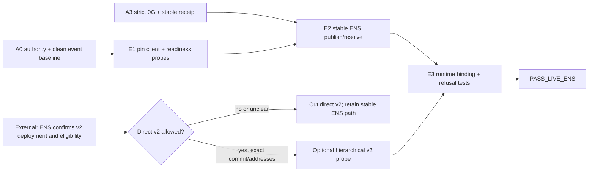

# AlphaDawg ENSv2 Devnet Research And Implementation Gate

> [!success] Decision
> Make AlphaDawg **ENSv2-ready through a supported client** after H0. Do **not** make an unmerged ENSv2 dev deployment a release dependency. Direct hierarchical ENSv2 registry work remains `PROBE_ONLY` until ENS confirms the exact repository, commit, network, addresses, API/ABI, and Lisbon Continuity eligibility.

> [!warning] Workshop update
> The user reports receiving green light to develop. Capture who authorized it, exact wording, time, and whether it covers qualifying pre-H0 code. This can clear A0 start authority, but it does not by itself supply the missing ENSv2 deployment packet.

The required ENS Continuity outcome remains stable and causal: an owner publishes an agent name, a clean client resolves its exact version/manifest/service/payout binding, the runtime uses that result, and forged, stale, transferred, or mismatched identity produces zero worker/provider/economic calls.

Related: [[20_Track_1_0G_Keep_Ready_Setup]], [[ALPHADAWG_LISBON_MASTER#9.2 ENS Continuity — mandatory second track]], and [[ALPHADAWG_LISBON_MASTER#A4 — ENS Publication And Runtime Discovery — H17–H21]].

## 1. What The Photograph Shows

The slide matches the published ENSv2 hierarchy:

```text
Root Registry
  -> .eth Registry
      -> creator Registry / UserRegistry proxy
          -> agent or service subnames
```

For AlphaDawg, the bounded interpretation is:

```text
<creator-owned parent>
  -> <creator>.<parent>
      -> <agent>.<creator>.<parent>
```

- Each parent registry controls its immediate children.
- A name needs a subregistry only when it creates subnames.
- A name needs a resolver only when records must resolve.
- ENSv2 registries are commonly ERC-1155 based, but the interface does not require that implementation.
- A parent can replace the registry below it, so a transferred/replaced subtree must be treated as stale until re-resolved.
- The photograph is an architecture explanation, not proof that a particular devnet deployment or address is stable.

Never hard-code the example namespace. Use only a parent name the team controls and record owner, resolver, registry, chain, block, and transaction evidence.

## 2. Official ENS GitHub Evidence

| source | observed official state at cutoff | AlphaDawg consequence |
|---|---|---|
| `ensdomains/docs` ENSv2 overview | The page says the information is work in progress while design and audits finalize. | Treat direct contract/API details as changeable. Pin a commit and recheck at H0. |
| `ensdomains/docs` ENSv2 readiness | Supported libraries can make most applications ready without deploying ENSv2 contracts. | Client readiness is mandatory and lower risk than importing a dev deployment. |
| `ensdomains/ens-contracts` | Public repository; default branch observed as `staging`. | Use only tagged/confirmed event-time artifacts for release. |
| `ens-contracts` PR `#537` | Open draft: `chore: sepolia dev deployment + update rocketh`; says `sepolia-dev` is intended for v2. | Useful probe evidence, not a stable qualifying dependency. |
| PR `#537` branch | Head `d234b3734fb47d218182b231236e9c14ca522d77`; chain ID `11155111`; dev Universal Resolver artifact lists `0xf8e7a86707ad360daac5d998fd1a6196a6a8823b`. | Record for booth confirmation only. Do not promote or hard-code until ENS confirms it. |
| `ens-contracts` PR `#541` | Merged; removed a proposed `requiresOffchain()` interface because ENSv2 no longer needed that Namechain assumption. | Confirms interfaces are still being simplified; do not build around removed proposals. |
| `ens-contracts` PR `#542` | Closed unmerged; proposed removing another non-standardized resolver interface. | Do not infer support from abandoned interfaces. |
| `ensdomains/ensjs` | Current main package observed at `4.3.1`; readiness minimum is `4.2.3`. | Supported option, but not needed if the existing viem path covers the MVP. |
| `ensdomains/ethers-patch` | Compatibility patch exists for older ethers; no GitHub release was observed. | Upgrade the real client first; use the patch only if an upgrade is blocked and ENS approves the path. |

### Research coverage

Reviewed official ENS organization repositories/pages affecting the decision: ENSv2 architecture, web readiness, `ens-contracts` deployment work, `ensjs`, and the official ethers compatibility patch. This is a decision-complete audit of the public implementation path, not a claim that every commit in the ENS organization was manually reviewed.

## 3. Supported Client Gate

Official readiness minimums observed at the source cutoff:

| client | minimum | AlphaDawg baseline | decision |
|---|---:|---:|---|
| viem | `>=2.35.0` | lockfile resolves `2.47.6`; manifest uses unsafe `"*"` | **Use this path.** Pin the exact tested version after H0. |
| ethers | `>=6.17.0` | `6.13.1` | Do not use for ENS until upgraded and regressed; do not upgrade solely for an unused path. |
| ENSjs | `>=4.2.3` | Not installed | Do not add initially. Add only if a required ENS operation is missing from viem. |
| web3.py | `>=7.16.0` | Not part of the selected web/runtime path | No action. |
| web3j | `>=5.0.3` | Not part of the selected web/runtime path | No action. |
| go-ens | Not published | Not used | Reject for the sprint. |
| web3.js | Deprecated | Not used | Reject. |

MVP rule: one pinned viem integration module, one resolver path, one record schema. No ENS SDK collection, custom registry framework, or client abstraction layer.

## 4. Mandatory Versus Optional Implementation

| layer | status | what must exist |
|---|---|---|
| ENSv2-compatible resolution | `MANDATORY_AFTER_H0` | Supported pinned client; official Universal Resolver behavior; correct chain and coin type; clean-client test. |
| ENS Continuity publication/discovery | `MANDATORY_A4` | Owner-controlled write/update, live resolve, runtime manifest comparison, public identifiers, removal test, booth proof. |
| Stable ENS name/subname path | `RELEASE_FALLBACK` | Use the officially supported Mainnet/Sepolia path available at H0. This is the qualifying path unless ENS directs otherwise. |
| Direct ENSv2 registry-per-name devnet | `PROBE_ONLY` | Build only after exact deployment and eligibility confirmation. It must never block the stable A4 path. |
| ENSIP-26 draft records | `CONDITIONAL` | Pin exact event-time mapping; use only records actually served. Keep application-specific bindings namespaced. |
| ENSIP-25 | `REJECT_MVP` | AlphaDawg does not yet have the compatible onchain agent registry needed to justify the claim. |

## 5. Dependencies, Non-Dependencies, And Async Work

### Can start now — planning only

| ID | task | depends on | output | status |
|---|---|---|---|---|
| `E-N0` | Freeze official URLs, repository branches/commits, readiness minimums, and PR states. | Official public sources. | This source ledger. | `DONE_AT_CUTOFF` |
| `E-N1` | Prepare the ENS booth question card. | None. | Exact confirmation questions in Section 10. | `READY` |
| `E-N2` | Freeze the application record schema and stale/transfer policy on paper. | A2 data contract, no code. | Section 7 schema. | `READY_FOR_OWNER` |
| `E-N3` | Prepare success, forged, stale, transfer, mismatch, and resolver-outage fixtures. | No live network. | Fixture names and expected zero-effect assertions. | `READY_FOR_OWNER` |
| `E-N4` | Assign namespace owner, writer wallet, backup, booth presenter, and cut authority. | Team decision. | Names plus `SET`/`NOT_SET` access states; no secrets. | `UNASSIGNED` |

No product file, dependency, lockfile, branch, contract, write, deployment, or live evidence may be created before official H0 and A0.

### After H0 — executable dependency graph



| sprint | window | dependency | may run asynchronously with | exit | sprint premortem / cut |
|---|---|---|---|---|---|
| `E0` official answer | Start now through H17 | ENS response only | External waiting may continue during A0–A3 without consuming a coding slot. | Timestamped answer or `BLOCKED_EXTERNAL`. | Informal or late answer is mistaken for approval → keep direct v2 blocked and proceed with stable ENS. |
| `E1` client readiness | First free slot after A0; timebox 45 min | A0 | One of `P0`/`F0` only after a WIP slot is free; cap remains two. | Supported version pinned; Universal Resolver and CCIP Read probes pass. | A package churns the foundation or still returns the old path → remove that client path; do not expand the timebox. |
| `E2` stable publish/resolve | H17–H19 | A3 green, namespace/writer ready, E1 green | Evidence capture only. | Owner write plus clean-client read and update are public and repeatable. | Wallet/name/gas/resolver access fails → use the pre-approved stable test namespace or drop the claim; no hard-coded success. |
| `E3` runtime binding/refusal | H19–H21 | E2 green and stable receipt schema | No optional sponsor feature. | Forged/stale/transfer/mismatch/outage tests make zero downstream calls. | Runtime still trusts PostgreSQL or cache → `DROP_TRACK:ENS`; do not weaken refusal tests. |
| `E-V2` direct devnet prototype | Inside A4 only if E0 is green | Exact official commit, addresses, API/ABI, eligibility, and E2 green | None if it threatens E3. | Create subregistry/subname, resolve, authorize, transfer/replace, and revoke with public evidence. | Deployment/API changes or consumes the E3 window → cut E-V2 immediately; stable A4 remains the release path. |

Direct ENSv2 is not an independent shortcut: it depends on official confirmation and the stable A4 path. The only genuinely asynchronous dependency is waiting for the external ENS answer.

## 6. ENSv2 Readiness Probes

Run only after H0, A0, and dependency pinning:

1. Resolve `ur.integration-tests.eth`; expected address: `0x2222222222222222222222222222222222222222`.
2. Treat `0x1111111111111111111111111111111111111111` as an old-path failure.
3. Resolve `test.offchaindemo.eth`; expected CCIP Read address: `0x779981590E7Ccc0CFAe8040Ce7151324747cDb97`.
4. Start resolution from Ethereum Mainnet for production/L2 names, or Sepolia for the test path.
5. Request the coin type matching the target chain; do not reuse Ethereum address semantics for every chain.
6. Capture client/package versions, chain, RPC, resolver, block, raw result, expected result, command, exit code, timestamp, and release SHA.

These probes prove client compatibility only. They do not prove AlphaDawg's live owner write, runtime causality, Continuity eligibility, or ENSv2 devnet stability.

## 7. Minimum AlphaDawg Record Contract

```text
name/node
owner
resolver
alphadawg.agent-id
alphadawg.version
alphadawg.manifest
alphadawg.payout
agent-context                  only if exact ENSIP-26 mapping is pinned
agent-endpoint[web]            only when the endpoint is live
agent-endpoint[a2a|mcp]        only when that protocol is actually served
```

The canonical manifest holds the 0G receipt/root and optional-track pointers. ENS holds stable discovery pointers, not job status, secrets, raw prompts, PII, or high-frequency reputation.

Acceptance rule:

```text
resolved owner + version + manifest + service + payout
  == immutable AgentVersion/order/receipt bindings
otherwise -> typed refusal before worker, 0G, signer, payment, or reputation calls
```

## 8. Premortem And Recovery

| failure story | early warning | prevention | recovery/cut |
|---|---|---|---|
| Devnet demo works, but ENS says the branch/address was unofficial or not qualifying. | Only evidence is draft PR `#537`; no booth answer. | Require E0 before direct v2 work. | Cut E-V2; demo the stable ENS Continuity path. |
| UI displays a name while the worker trusts PostgreSQL. | Removing ENS changes no runtime outcome. | Live resolve and manifest comparison gate `PUBLISHED` and execution. | `DROP_TRACK:ENS`; do not claim causality. |
| Existing ethers silently follows the old path. | ethers remains `6.13.1`; readiness fixture returns `0x111...`. | Use pinned viem first or upgrade ethers to `>=6.17.0` with regressions. | Remove the failing client path; never patch around a wrong result. |
| Parent transfer/replacement leaves a valid-looking stale subtree. | Cached owner/resolver survives a parent change. | Re-resolve from the trusted entrypoint and bind block/freshness policy. | Refuse and require authorized republish. |
| CCIP gateway or resolver is unavailable during demo. | Intermittent timeout or cached success. | Explicit timeout, bounded retry, no cache-as-proof, rehearsed evidence replay. | Show typed outage refusal and previously captured public IDs; do not call it live success. |
| Draft ENSIP records change. | Event docs and code use different keys. | Pin the mapping and source commit at H0. | Fall back to namespaced text records plus canonical manifest. |

## 9. Validation Matrix

| test | pass condition |
|---|---|
| Universal Resolver readiness | Expected `0x222...` result from the pinned client. |
| CCIP Read readiness | Expected `0x7799...` result and recorded gateway path. |
| Owner publish/update | Authorized writer changes the exact version/manifest and a clean client observes it. |
| Forged writer | Transaction or application request fails; zero publication/runtime/economic effect. |
| Stale/mismatch | Wrong owner/version/manifest/service/payout refuses before worker and 0G. |
| Parent transfer/replacement | Old subtree is not trusted after authority changes; explicit re-resolution/republish is required. |
| Duplicate/replay | One intended update and one canonical receipt; retries create no conflicting state. |
| Resolver/CCIP outage | Typed terminal/retryable state; no cached value promoted as live proof. |
| Optional direct v2 | Exact confirmed deployment supports create, resolve, permission denial, transfer/replace, and revocation. |
| Release | Fresh clone, same SHA, clean resolve, public IDs, video/live demo, Sunday booth presentation, and claim matrix pass. |

## 10. ENS Booth Questions

Ask before direct ENSv2 implementation:

1. Is ENSv2 direct registry-per-name integration expected or accepted for Lisbon ENS Continuity, or is ENSv2-compatible resolution plus a material ENS feature sufficient?
2. What exact official repository, branch/tag, commit, chain, deployment name, registry/resolver addresses, and ABI should teams use?
3. Is draft `ens-contracts` PR `#537` and its `sepolia-dev` deployment the intended hackathon target?
4. Will those addresses persist through judging, and what is the reset/faucet procedure?
5. Which client and minimum version do you recommend for write, subregistry/subname creation, resolution, transfer, and permissions?
6. Must a qualifying demo create a hierarchical registry, or can an owner-controlled subname and runtime-causal manifest satisfy the track?
7. Are ENSIP-26 draft records expected, and what exact event-time key mapping should be pinned?
8. Is Mainnet/Sepolia stable ENS the approved fallback if the v2 dev deployment changes or is unavailable?

Record responder, role, exact wording, timestamp, source/message link, and resulting `BUILD`, `NARROW`, or `STOP` decision. Do not convert an informal answer into a rule unless the sponsor accepts the written recap.

## 11. Ready Card

```text
PROJECT: AlphaDawg
TRACK: ENS Continuity
NOW: assign E-N2/E-N3/E-N4 owners; take booth questions; no product edits
AFTER H0: A0 -> E1 readiness -> A3 -> E2/E3 stable ENS
OPTIONAL: E-V2 only after exact official confirmation
WIP CAP: 2 team-wide
BUILD: supported-client readiness + causal owner publish/resolve/runtime binding
NARROW: stable ENS only; remove direct ENSv2 devnet
DROP TRACK: ENS is cosmetic, stale, unverifiable, or booth/release evidence fails
```

Current decision: `PREPARE_NOW`; stable ENS A4 is `WAIT_H0`; direct ENSv2 is `BLOCKED_EXTERNAL_PROBE_ONLY`.

## Sources

- [ENSv2 overview](https://docs.ens.domains/contracts/ensv2/overview/)
- [Preparing your app for ENSv2](https://docs.ens.domains/web/ensv2-readiness/)
- [ENS contracts repository](https://github.com/ensdomains/ens-contracts)
- [Draft ENSv2 Sepolia dev deployment PR #537](https://github.com/ensdomains/ens-contracts/pull/537)
- [Resolver interface change PR #541](https://github.com/ensdomains/ens-contracts/pull/541)
- [Resolver interface proposal PR #542](https://github.com/ensdomains/ens-contracts/pull/542)
- [ENSjs repository](https://github.com/ensdomains/ensjs)
- [ENS ethers compatibility patch](https://github.com/ensdomains/ethers-patch)
- [ethers v6.17.0 release](https://github.com/ethers-io/ethers.js/releases/tag/v6.17.0)
- [[10_AlphaDawg_Current_Engineering_Audit]]
- [[17_Kickoff_H0_Runbook]]
- [[19_Pre_Hackathon_Code_Freeze_and_Change_Map]]
