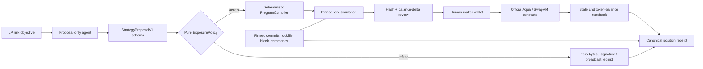
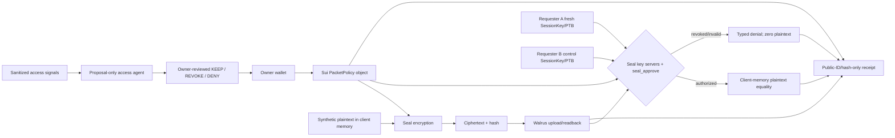
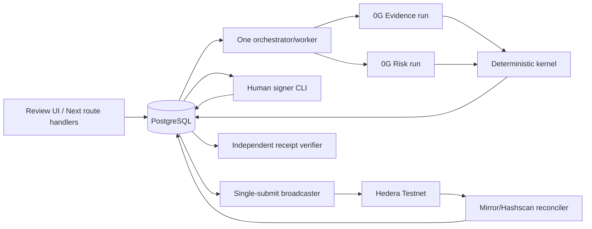

# Project B Lisbon 2026 Master Plan

> [!danger] H0 lock
> Project B is a from-scratch project. Before official H0, do not create its product repository, code, contracts, schemas, prompts, UI, generated assets, deployment, or qualifying tests. This master is planning only. Recheck the live clock and rules before creating the event repository.

> [!success] Portfolio decision
> **PRIMARY ProofRail:** Evidence and Risk run as two separately verified model agents; deterministic settlement/recovery, fixed treasury policy, and human approval alone authorize one direct Hedera Testnet payment. **FALLBACKS:** AquaSentinel, then SealSwitch. Run isolated sponsor-native probes after H0, select one by H3, and permit no pivot after H10.

This file remains the long-form Project B research master. Current official pages and [[10_2026-07-23_Prizes_and_Engineering_Delta|the 2026-07-23 H0 delta]] control current prizes and implementation where they conflict. The Graph and World are now published but not selected; both fail the current ProofRail removal test. Older three-model-agent, Storage/HCS/Schedule/HTS/Axelar/Uniswap, and $12,500-maximal sections are optional research, not the locked MVP.

Current execution tracking starts at [[#15. Premortem-Derived Sprint And Backend Control]].

## 0. Beginner Operator Card

> [!danger] Current verdict
> `H0_LOCKED / NOT_RUN`. Project B has strong researched ideas and zero implementation evidence by design. Do not create the product repo, code, prompts, contracts, UI, wallets, or qualifying tests before official H0. At H0, probe all three candidates, choose one by H3, and build only that product.

### 0.1 Why these three ideas survived

The `92/88/87` values are **idea-selection scores**, not implementation correctness, demand validation, prize probability, or money forecasts.

| rank | idea score | why suggested | why an agent is needed | decisive sponsor proof | largest flaw |
|---:|---:|---|---|---|---|
| 1 | **ProofRail — 92/100** | Strongest user loss, judge story, multi-agent disagreement, and 0G + Hedera causality. | Evidence and Risk separately reconcile/attack unstructured obligation evidence; deterministic code and a human retain payment authority. | Two distinct verified 0G outputs; forged invoice creates zero payment intent; valid invoice produces one human-approved Hedera payment and receipt. | Feasibility is only 5/12: proof, payment, signer isolation, and recovery can overrun 36 hours. |
| 2 | **AquaSentinel — 88/100** | Lowest remote dependency and easiest deterministic replay; one sponsor-native system can be shown deeply. | The agent translates a bounded risk objective into a typed proposal; policy/compiler—not the model—creates executable program bytes. | Official Aqua/SwapVM position, malicious proposal refusal, deterministic local-fork reset, and real token balance delta. | The agent may be only a form filler, and the custom position may look too similar to the starter. |
| 3 | **SealSwitch — 87/100** | Memorable authorized-then-denied security demo with deep Sui-native composition. | The agent synthesizes sanitized incident/access signals into a proposal; owner-signed Move policy controls fresh key release. | Seal encrypt -> Walrus ciphertext -> authorized decrypt -> Sui revoke -> fresh same-ciphertext denial, plus an authorized control request. | Revocation cannot erase plaintext already seen; normal cloud ACLs may solve the buyer problem more simply. |

Score classes must never be mixed:

- `Idea selection`: research quality and expected judge fit. Current: ProofRail 92, AquaSentinel 88, SealSwitch 87.
- `Delivery readiness`: implemented gates in the selected product repo. Current: **0/100 for all three** because the H0 lock correctly prevents a repo.
- `Prize claim readiness`: event-window code + tests + live sponsor state + evidence + submission artifacts. Current: **0/100 for all three**.
- `Demand status`: all three remain `DESK_RESEARCH_ONLY` until their interview/artifact gates pass.

Fatal gates override every score: invalid H0/provenance, ineligible track, mock sponsor path, model-held signer/bytecode authority, missing real state change, or no reproducible failure demo means `STOP` or `DROP_TRACK` regardless of total.

### 0.2 What “correctly implemented” means

Every selected product must prove this full chain:

```text
user loss fixture
  -> typed agent proposal
  -> deterministic validation/policy
  -> explicit authorized signer when value/access changes
  -> one sponsor-native state change
  -> independent readback/reconciliation
  -> canonical receipt
  -> adversarial input creates no unauthorized effect
  -> fresh clone and two demo replays match
```

`PASS` requires observed output, not planned assertions. Use only these statuses for **gate execution**. Artifact maturity is the separate four-state model in Section 14.1; source truth uses `CONFIRMED`, `CONDITIONAL`, `PENDING`, `BLOCKED`, or `REJECTED`. Never put a maturity or source-truth state into an execution-status field.

| status | meaning |
|---|---|
| `H0_LOCKED` | Test/action is forbidden before the official clock. |
| `NOT_RUN` | Allowed but not attempted. |
| `BLOCKED` | External access/rule/dependency prevents a valid attempt. |
| `FAIL` | Attempt ran and violated the expected assertion. |
| `PASS_FIXTURE` | Deterministic local logic passed; no sponsor qualification implied. |
| `PASS_LIVE` | Real sponsor-native state/identifier and independent readback satisfy the gate. |
| `DROP_TRACK` | Remove integration and every related claim from README/demo/submission. |

Initial results ledger:

| gate | current status | observed outcome required to change status |
|---|---|---|
| Official H0/from-scratch permission | `H0_LOCKED` | Saved official clock/rules snapshot and UTC baseline. |
| ProofRail 0G/Hedera probe | `H0_LOCKED` | After H0 set `NOT_RUN`; then require live 0G verification semantics and Hedera Testnet transaction/readback IDs. |
| Aqua official baseline probe | `H0_LOCKED` | After H0 set `NOT_RUN`; then require pinned commits/licenses, compile/tests, deterministic reset, and real token delta. |
| Seal/Sui/Walrus round trip | `H0_LOCKED` | After H0 set `NOT_RUN`; then require policy package/object, blob ID, and authorized decrypt equality assertion. |
| H3 product selection | `H0_LOCKED` | After H0 set `NOT_RUN`; one selected clean repo, with failed candidates recorded without copied code/evidence. |
| H10 selected thin slice | `H0_LOCKED` | After H0 set `NOT_RUN`; candidate-specific safe/failure assertion below. |
| Submission release | `H0_LOCKED` | After H0 set `NOT_RUN`; green quality suite, live evidence, fresh clone, two replays, and complete forms/videos. |

### 0.3 Glossary and stop levels

| term | meaning |
|---|---|
| H0 / H3 / H10 | Official start; three hours after start; ten hours after start. |
| Thin vertical slice | Smallest real path crossing input, policy, sponsor primitive, readback, and receipt. |
| Load-bearing | Removing the sponsor primitive breaks a named product guarantee. |
| First-slot cap | Highest individual award for a compatible track, not its total pool or expected winnings. |
| HCS / HTS | Hedera Consensus Service audit log / Hedera Token Service. HTS is optional for ProofRail. |
| GMP | General Message Passing through Axelar; optional ProofRail extension. |
| PTB | Sui Programmable Transaction Block. Validate sender, calls, objects, arguments, and value movement. |
| Seal / Walrus | Threshold encryption/onchain access approval / public decentralized blob storage. Store ciphertext only. |
| Aqua / SwapVM | 1inch shared-liquidity registry / programmable strategy execution environment. |
| Reconciliation | Query the network with the persisted identifier after ambiguity; do not create a replacement. |

- `REFUSE_INPUT`: reject one malformed or unauthorized request.
- `BLOCK_EFFECT`: prevent one payment, program activation, or decryption request.
- `DROP_TRACK`: remove one optional sponsor extension and all claims.
- `PIVOT_PROJECT`: archive the selected repo and create the next candidate's clean repo; permitted once, by H10 only.
- `STOP_PROJECT`: no candidate has a real core or provenance is invalid; do not submit prize claims.

### 0.4 First three hours after H0

One engineer runs strict timeboxes; do not debug a candidate past its slot. Probe directories are disposable and separate from the eventual product repo.

| time | action | pass evidence | failure action |
|---:|---|---|---|
| 0–15 min | Save H0/rules/track pages; create an event evidence ledger; record tool versions, account availability, spend cap, and `SET/NOT_SET` secrets manifest. | Provenance timestamp and no pre-H0 product artifact. | Invalid H0/rules -> `STOP_PROJECT`. |
| 15–75 min | ProofRail probe: one real verified 0G inference and one bounded Hedera Testnet transfer/readback with an isolated signer. | Proof semantics and transaction/readback identifiers bound to recorded inputs. | Any missing access or success-shaped fallback -> mark red; move on. |
| 75–135 min | Aqua probe: pin official commits/licenses, use the starter's package manager, compile/tests, reset twice, and observe one official-contract token transfer. | Same baseline hashes and balance assertion across resets. | Compile/license/reset/transfer red -> mark red; move on. |
| 135–180 min | SealSwitch probe: one-network Move policy build/test, Seal encrypt, Walrus store/read, and authorized decrypt equality assertion. | Package/object/blob IDs; plaintext equals original only after approval. | Network/key-server/policy mismatch -> mark red. |

At H3 select the highest-ranked fully green candidate. Create its new clean repository only then. Never combine candidates. If no probe is green, return `STOP_IDEATION_NOT_VALIDATED`.

### 0.5 H10 last-pivot gates

| selected candidate | H10 thin-slice pass | if red |
|---|---|---|
| ProofRail | Evidence and Risk run separately; both proofs verify; a disagreement produces a durable receipt and zero prepared payment/outbox effect. | Last permitted clean pivot to the next H3-green candidate. |
| AquaSentinel | Official baseline still passes; one safe typed proposal compiles deterministically; wrong token/app/opcode/over-allocation refuses before bytes/signature. | Last permitted clean pivot to SealSwitch if its H3 probe was green. |
| SealSwitch | Custom Move policy tests pass for owner/subject/version/expiry/revocation; real authorized decrypt from H3 still works; fresh custom-policy grant/revoke PTBs build with correct sender. | Stop or narrow; no lower-ranked candidate remains. |

After H10, do not switch projects. Remove optional scope, repair the selected core, or stop.

### 0.6 Command and outcome contract

Do not invent SDK signatures or commands before H0. Pin the current official starter/package versions, then record exact commands in the selected repo README and `evidence/commands/`. At minimum the selected repo must expose one-command gates with exit code `0` on the release SHA:

```bash
pnpm install --frozen-lockfile
pnpm lint
pnpm typecheck
pnpm test
pnpm test:integration
pnpm test:e2e
pnpm build
```

Exceptions follow the selected official starter: Aqua retains its Yarn lockfile/package manager and must run the starter's documented Hardhat compile/test commands; SealSwitch must additionally run `sui move build` and `sui move test`. A missing script is work to implement, never a skipped gate.

Required selected-candidate script contract:

| candidate | required command/script | expected outcome |
|---|---|---|
| ProofRail | `pnpm smoke:0g` | Evidence/Risk runs remain distinct and separately verifiable; one-byte/reused-output companion test grants zero authority. |
| ProofRail | `pnpm smoke:hedera` | Human-approved canonical intent produces one direct Testnet HBAR balance effect and Mirror/Hashscan identifiers; replay creates no replacement. |
| ProofRail | `pnpm test:e2e -- --case refusal` and `--case payable` | Forged obligation has zero economic preparation; valid obligation reaches one reconciled receipt. |
| AquaSentinel | starter-documented `npx hardhat compile` and `npx hardhat test` | Official baseline plus custom materiality/invariant tests pass. |
| AquaSentinel | `yarn test:e2e` | Two fork resets reproduce hashes; safe position transfers tokens; malicious proposal signs/broadcasts nothing. |
| SealSwitch | `sui move build` and `sui move test` | Policy compiles; owner/subject/version/expiry/revocation cases pass. |
| SealSwitch | `pnpm smoke:sui-seal-walrus` | Same-network ciphertext round trip passes; IDs/hashes are recorded and plaintext never reaches Walrus. |
| SealSwitch | `pnpm test:e2e -- --case revoke` | Authorized decrypt succeeds, owner revokes, fresh same-blob request is denied, authorized control proves provider availability. |

For every command record: `cwd`, prerequisite, exact command, UTC start/end, exit code, expected assertion, observed result, commit SHA, environment/network, evidence path, and public identifier. Do not retry a paid 0G inference unless the pinned provider exposes same-request reconciliation. Hedera ambiguity polls the persisted transaction ID; it never creates replacement bytes.

### 0.7 How this wins instead of becoming a sponsor tour

The demo must answer five questions in order:

1. **Who loses what today?** Name one buyer and one repeated failure.
2. **Why AI?** Show one semantic input a fixed form cannot handle; keep authority deterministic.
3. **What fails safely?** Lead with the forged/malicious/revoked case and prove zero unauthorized effect.
4. **What changed on the real sponsor stack?** Show the public identifier, independent readback, and balance/object/policy delta.
5. **Why will anyone use it after Sunday?** Name one adoption action and state demand evidence honestly.

One sentence per candidate:

- ProofRail: “Two separately verified agents may propose, but only deterministic policy and a human can release one canonical vendor payment.”
- AquaSentinel: “The model can suggest a strategy, but only our typed policy/compiler and deterministic Aqua simulation can produce bytes the maker signs.”
- SealSwitch: “The agent can recommend revocation, but current Sui policy—not our server—decides whether Seal key servers release fresh decryption shares.”

## 1. Executive BUILD / NARROW / STOP

### BUILD

- ProofRail's separately executed Evidence and Risk agents plus deterministic settlement/recovery.
- Task-bound 0G Compute/Private Computer verification.
- Deterministic veto/quorum, human approval, event-sourced state, idempotent effect preparation, and explicit recovery.
- One direct human-signed Hedera Testnet HBAR action plus public reconciliation after verified agreement.
- One visible forged/tampered refusal and one success receipt proving one canonical intent, at most one intentional public effect, and reconciliation of ambiguity.

### NARROW

- Core tracks: **0G Best AI Product + Hedera AI & Agentic Payments**.
- One synthetic invoice, purchase order, delivery artifact, vendor, policy, amount, and Testnet payment.
- Evidence and Risk agents execute separately; settlement compilation and recovery are deterministic.
- Cut 0G Storage, HCS, HTS, Schedule Service, Axelar, Uniswap, World, and The Graph from the locked MVP. Human approval over exact transaction bytes remains mandatory.

### STOP OR FALL BACK

- Select AquaSentinel at H3 if ProofRail's 0G/Hedera probes fail; select SealSwitch if both higher candidates fail and its Sui/Seal/Walrus probe is green.
- Permit one clean-repository pivot by H10 only; after H10, narrow or stop rather than switching products.
- Stop ProofRail if agents share a single run/output, a model vote authorizes payment, ambiguity can create a second effect, or qualifying evidence relies on mocks.
- Never collapse ProofRail into a generic one-agent escrow to preserve scope.

## 2. Live Track Truth

> [!warning] Superseded live ledger
> Use [[02_Lisbon_Live_Track_Ledger]] for the current 23-track, $88,000 snapshot and [[10_2026-07-23_Prizes_and_Engineering_Delta]] for the selected $6,000 ProofRail core. The historical tables below remain idea provenance only.

Accessed 2026-07-23 from the supplied official ETHGlobal Lisbon prize snapshot. Revalidate at H0 and submission. The snapshot shows **eight partners, $88,000, and 23 released tracks**. The Graph and World are published; neither is selected for the locked MVP.

### Global rules

- Select up to three partners per submitted project; selecting one partner can expose its tracks, but same-project same-partner multi-awards are not guaranteed.
- From-scratch project-specific code, design, prompts, and assets begin after official H0.
- Public starters/libraries may be used transparently; record exact source, commit, license, and event-window delta.
- Proper incremental Git history is required; a final-day single commit is unsafe.
- Generic demo target: 2–4 minutes; sponsor-specific limits override. ENS requires an in-person Sunday-morning booth presentation.
- Pools are competition exposure, not obtainable winnings. Prize floor is $0.

### Selected Sponsor Ledger

| partner / pool | track | first slot | mandatory native path | Project B decision |
|---|---|---:|---|---|
| 0G / $15,000 | Best AI Product | $3,000 | Working product using 0G Compute/Private Computer inference proof; public repo/setup, runnable/live build, <3-minute video | `BUILD` after H0 and live proof probe. |
| Hedera / $15,000 | AI & Agentic Payments | $3,000 | Multi-agent system performs a real Testnet financial action; public payment-flow README and <=5-minute video | `BUILD` direct human-signed HBAR transfer plus public reconciliation. |
| 1inch / $7,000 | Build an Aqua App | $2,500 | Official Aqua/SwapVM, sophisticated position, token transfer, proper history; local fork allowed | `FALLBACK_1` AquaSentinel. |
| Sui / $6,000 | Best App Built on Sui | $2,000 | Meaningful Sui stack plus Testnet/Mainnet demo | `FALLBACK_2` SealSwitch. |
| World / $15,000 | AgentKit New Use Cases | $4,000 | Human-backed status gates access/pricing/authorization/execution | `WATCH`; current human signer makes it removable. |
| The Graph / $15,000 | Best AI Use Case | $2,000 | AI acts on named live Graph data | `WATCH`; current synthetic evidence does not need chain data. |

Current blockers: live 0G proof semantics and access, Hedera Testnet account/faucet/Mirror path, Project B H0/clean-repo boundary, and mandatory submission artifacts. The Uniswap feedback form now resolves, but completion and a valid API-key-driven integration remain unproven. Hedera Tokenization wording remains internally inconsistent; it is outside the selected MVP.

### ProofRail prize arithmetic

Cap rules used throughout this file:

1. A track contributes its **highest individual award**, never its full pool and never that amount multiplied by the number of winners.
2. The **released conservative cap** counts at most one compatible award per partner.
3. The **conditional stack cap** may add multiple compatible tracks from one partner, but only as an architecture ceiling; same-project same-partner stacking is not confirmed.
4. Every idea has a real financial floor of **$0**. A cap is neither expected value nor evidence of demand.

| posture | tracks | first-slot cap | state |
|---|---|---:|---|
| Core | 0G Product + Hedera Agentic | **$6,000** | Selected build shape. |
| Third-partner watch: Graph | Core + Graph AI Use Case | **$8,000** | Not selected; live chain delivery would have to become contractually necessary. |
| Third-partner watch: World | Core + World AgentKit | **$10,000** | Not selected; current human signer makes AgentKit removable. |
| Selected conservative cap | 0G $3,000 + Hedera $3,000 | **$6,000** | Floor remains $0; no same-partner stacking assumed. |

## 3. Previous Winner Model

Official award metadata is evidence; showcase descriptions are entrant-authored and runtime claims remain `UNVERIFIED` unless repository/live evidence confirms them.

| comparable | pattern to use | mechanism to beat or avoid |
|---|---|---|
| [Alpha Dawg](https://ethglobal.com/showcase/alpha-dawg-fh6vm) | Memorable money/brain/truth story and dense multi-sponsor proof. | Do not clone trading swarm, marketplace, fail-open proof, or breadth. ProofRail is obligation control, not alpha. |
| [DIVE](https://ethglobal.com/showcase/dive-5hxbp) | Distinct agents, visible disagreement, and sponsor-owned guarantees. | Avoid oracle/committee framing and unbounded swarm scope. |
| [maki](https://ethglobal.com/showcase/maki-564eg) | Model cannot sign; deterministic simulation/policy is the product. | Do not build another natural-language DeFi copilot. |
| [Clawback](https://ethglobal.com/showcase/clawback-vpmw2) | Failure, dispute, refund, and reputation complete commerce. | Avoid generic agent escrow/dispute similarity. ProofRail prevents unsupported obligation before settlement. |
| [npmguard](https://ethglobal.com/showcase/npmguard-aeihd) | Portable trust artifact changes a real decision. | Reject package-audit derivatives such as RepoSentinel. |
| [Azimuth](https://ethglobal.com/showcase/azimuth-7w256) | Exceptional proof density and one job per sponsor. | Avoid hardware, multiple dashboards, or sponsor-tour complexity. |
| [Better Wallet](https://ethglobal.com/showcase/better-wallet-yvjdh) | Unsafe/safe contrast is tangible. | Copy clarity, not unavailable hardware. |
| [Proof-of-Human](https://ethglobal.com/showcase/proof-of-human-1cg2d) | Replay and deterministic reset are judge-legible. | Do not infer a current World track from old success. |

Tested model:

```text
one legible loss -> one replayable loop -> one sponsor-native state change
  -> one visible artifact -> one narrow adoption wedge
```

More sponsors do not improve the idea unless each owns a distinct, necessary invariant.

## 4. Twenty-Idea Portfolio

Status vocabulary: `GREEN` can be selected after H0/access checks; `CONDITIONAL` needs a named dependency; `WAIT` depends on unpublished tracks; `REJECT` should not be built; `MERGE` is absorbed into a stronger concept.

| ID / idea | status | buyer, repeated loss, and agentic need | released conservative cap | conditional stack cap | technical spine and decisive proof |
|---|---|---|---:|---:|---|
| B01 **ProofRail** | **GREEN_CORE / SELECTED** | DAO or small-company AP team can pay forged, duplicated, undelivered, stale, or ambiguous invoices. Evidence and Risk reconcile/challenge unstructured evidence; deterministic policy alone authorizes. | **$6,000** | **$6,000 selected** | 0G Product + Hedera Agentic. Two distinct 0G proofs, pure veto/quorum, direct human-signed HBAR payment, same-intent recovery. Disagreement creates zero economic preparation; success pays once. |
| B02 **AquaSentinel** | **GREEN / FALLBACK** | LP or strategy operator can execute unsafe generated strategy programs or drift outside inventory limits. The agent proposes; an allowlisted compiler and fork simulation decide. | **$2,500** | **$2,500** | 1inch Aqua. Typed AST, allowlisted compiler, official Aqua/SwapVM, deterministic fork, real token movement, malicious-program refusal. |
| B03 **SealSwitch** | **GREEN** | Security teams can leave incident packets decryptable after contractor/respondent access should close. An agent synthesizes incident signals; owner policy can only revoke or deny. | **$2,000** | **$2,000** | Sui new app. Move access object + Seal + Walrus. Authorized decrypt succeeds, revoke lands on Testnet, then a fresh request for the same ciphertext is denied. |
| B04 **ProofCart** | **REJECT_SIMILAR** | Small digital-work buyer risks paying for a missing or weak deliverable; agent evaluation is useful but subjective. | **$6,000** | **$6,000** | 0G Product + Hedera Agentic. Feasible, but too close to AlphaDawg/Clawback and weaker than ProofRail's independent objection mechanism. High cap does not rescue low differentiation. |
| B05 **RefundRaid** | **CONDITIONAL** | Paid indie-game operator must reconcile disconnects and invalid match results. The agent interprets logs; a fixed result/refund matrix controls. | **$2,000 core; $5,000 with Hedera** | **$5,000** | Prefer Sui-only: Move match object + Walrus replay. Add Hedera only for an objective, non-gambling refund that is genuinely necessary. |
| B06 **QueryBounty** | **CONDITIONAL_GRAPH** | DAO research buyer can pay for unsupported or duplicate onchain claims. Agent decomposes claims into queries; reproducible evidence and fixed thresholds control payment. | **$5,000** | **$5,000** | Hedera Agentic + Graph AI Use Case. Live query/result hash, deterministic verdict, real Testnet payment, duplicate refusal. Not selected because it is a different product. |
| B07 **HumanThrottle** | **REJECT_TRACK** | API vendor loses trials to bot farms. Agent assigns a bounded trial tier; uniqueness and quota remain deterministic. | **$1,500 ENS-only** | **$1,500** | World's AgentKit track expressly rejects simple API-call/discount benefits. ENS alone does not solve uniqueness. |
| B08 **RepoSentinel** | **REJECT_SIMILAR** | Maintainer can ship a compromised dependency. Agent explains cross-file behavior; CI policy blocks release. | **$3,500** | **$3,500** | ENS Creative + Sui. Technically viable, but materially duplicates npmguard/SENTINEL. |
| B09 **RouteReferee** | **CONDITIONAL** | Wallet or treasury user cannot safely inspect generated DeFi routes. Agent explains intent; deterministic target/spender/calldata policy authorizes. | **$4,000** | **$4,000** | Uniswap API. Approval -> quote -> swap -> status with exhaustive response narrowing, exact route policy, real execution, and feedback artifacts. |
| B10 **AquaHedge** | **MERGE_B02** | Market maker retains stale Aqua parameters. Agent recommends bounded re-parameterization; inventory rules decide. | **$2,500** | **$2,500** | 1inch Aqua. Merge `safeBalances`/`dock`/`ship` lifecycle into AquaSentinel; do not split effort. |
| B11 **ReceiptLens** | **CONDITIONAL_GRAPH** | Merchant agent can misclassify fulfilled, refunded, or duplicate onchain payments. | **$3,500** | **$3,500** | ENS Creative + Graph AI Use Case. Indexed live event normalization, deterministic receipt status, live ENS routing. Not selected. |
| B12 **HumanEscrow** | **REJECT_SIMILAR** | Small service disputes can be Sybil-prone, but an agent adds little safe authority. | **$7,000** | **$7,000** | Hedera Agentic + World AgentKit. Resembles DIVE/Clawback, adds escrow/legal risk, and human-backed status does not prove service delivery. |
| B13 **InvoiceMint** | **GREEN_ALTERNATE** | Supplier and buyer need a visible obligation lifecycle and duplicate-claim protection. Agent normalizes evidence; SDK state machine controls mint/redeem/burn. | **$1,500** | **$2,500** | Hedera Tokenization + conditional No Solidity stacking. SDK-only HTS + HCS/Schedule/Mirror; no RWA, lending, security, or legal-enforceability claim. |
| B14 **SuiQuestMaster** | **GREEN_ALTERNATE** | Indie-game operator can issue rewards for fabricated or replayed narratives. Agent interprets bounded quest input; Move capability decides once. | **$2,000** | **$2,000** | Sui new app. Move quest/reward capability + Walrus replay; injection/replay refuses. Clear demo, weaker buyer pain. |
| B15 **NameGuard** | **GREEN_ALTERNATE** | Self-hosted agent/API operator can leave clients pointed at a stale or compromised endpoint. Agent interprets health/security signals; owner policy signs rotation. | **$1,500 core; $3,000 with 0G** | **$3,000** | ENS AI Agents + optional 0G Infrastructure. Real record write/resolve, manifest binding, ownership challenge, unauthorized rotation refusal. |
| B16 **LiquidityButler** | **CONDITIONAL_GRAPH_UNISWAP** | LP can rebalance on gross fees while ignoring LVR, gas, and slippage. | **$6,000** | **$6,000** | Uniswap API + Graph AI Use Case. Live net-carry inputs, fixed threshold, real rebalance. Strong prior art and two access dependencies. |
| B17 **PayrollSentinel** | **CONDITIONAL_LOW** | Treasury automation can duplicate or misroute cross-chain payroll. Agent prepares a bounded batch; replay-safe contracts execute. | **$5,000 with Uniswap** | **$5,000** | Hedera Cross-Chain + optional Uniswap API. Schedule -> Axelar GMP -> destination guard. High timing risk and sponsor-suggested concept reduce priority. |
| B18 **ProofPresence Concierge** | **CONDITIONAL_WORLD** | Event operator can allocate scarce resources to bots or replays. | **$4,000** | **$4,000** | Sui + World Selfie Check. Liveness/nullifier plus Move inventory object and mandatory user/developer testing. Not selected. |
| B19 **GraphRecall** | **CONDITIONAL_GRAPH** | Research agent can repeat stale onchain claims without temporal provenance. | **$5,000** | **$5,000** | 0G Product + Graph AI Use Case. Query planner, live temporal evidence, verified inference, stale-answer refusal. Needs an action beyond an answer. |
| B20 **StockPolicy** | **REJECT** | Tokenized-stock request may be restricted or unsuitable; identity attributes add privacy/legal burden. | **$6,000** | **$6,000** | Uniswap API + World Identity Check. Asset availability, attribute necessity, testing, and legal risk dominate. Do not build. |

### Ranked shortlist

1. **ProofRail** — strongest problem/track causality; highest upside; highest scope risk; selected only with hard cuts.
2. **AquaSentinel** — lowest dependency, deterministic local-fork proof, strongest fallback.
3. **SealSwitch** — clearest visual security failure and strong Sui-native stack.
4. **InvoiceMint** — coherent SDK-only Hedera alternative with strict demonstrative framing.
5. **NameGuard** — narrow ENS-native incident recovery; booth and live write/resolve are hard gates.

Do not switch among the top five casually. Use the explicit activation gates in Section 11.

### Demand validation gate

Winner similarity proves judge-legible mechanics, not product need. Every idea begins as `DESK_RESEARCH_ONLY`, including ProofRail. It may become `USER_VALIDATED` only when the evidence folder records:

1. a named buyer/operator, repeated triggering event, current workaround, failure cost, and existing budget or authority;
2. at least three independent problem interviews, or one committed design partner who supplies a synthetic/replayable workflow;
3. one recent redacted artifact such as an invoice exception, access incident, strategy refusal, stale endpoint, or duplicate-payment case;
4. a reason an agent is required for unstructured synthesis, plus a deterministic answer to **who holds authority**;
5. a sponsor-removal test showing the product still has a coherent user loop when prize integrations are removed;
6. a replayable safe/failure demo and an adoption action after the event.

Concierge research, polished documents, community likes, sponsor enthusiasm, or resemblance to a winner do not prove willingness to pay. If ProofRail cannot pass items 1–3 before H0, retain it as the engineering selection but mark demand `UNVALIDATED`; do not make market-fit claims.

### Top-three engineering decision board

| rank | idea | actual user loss | narrow product | sponsor-native proof | first-slot cap | engineering posture |
|---:|---|---|---|---|---:|---|
| 1 | **ProofRail** | An accounts-payable operator pays a forged, duplicate, undelivered, stale, or policy-invalid obligation. | Independent Evidence, Risk, and Settlement agents can propose; verified agreement, deterministic policy, and human approval alone release one Hedera payment. | Three separately verified 0G runs plus one real Hedera Testnet payment bound to one canonical intent and reconciled without replacement. | **$6,000 core** | Highest differentiation and upside; highest dependency and recovery complexity. |
| 2 | **AquaSentinel** | An LP signs an unsafe generated liquidity program, over-allocates wallet inventory, or accepts unbounded execution parameters. | An agent proposes a two-leg inventory-aware position; a typed compiler, exposure policy, official Aqua/SwapVM contracts, fork simulation, and the LP signature control activation. | One custom SwapVM/Aqua position, one real local-fork token transfer, and one malicious-program refusal. | **$2,500** | Best reliability-adjusted fallback; one sponsor and deterministic local evidence. |
| 3 | **SealSwitch** | A security team keeps releasing decryption capability for a shared incident packet after a responder's access expires or is revoked. | An access-risk agent proposes `KEEP | REVOKE | DENY`; an owner-signed Sui policy controls fresh Seal key release for ciphertext stored on Walrus. | One authorized decrypt succeeds; after a real Sui Testnet revocation, a fresh request for the same ciphertext is denied while an authorized control request still works. | **$2,000** | Strongest visual security demo; key-server, faucet, indexing, and Testnet dependencies. |

Decision rule: select the idea with the strongest **green thin vertical slice**, not the largest prize cap. ProofRail remains primary only when its 0G and Hedera probes pass. AquaSentinel is first fallback because it avoids remote proof/payment coupling. SealSwitch is second fallback, not a feature inside either financial project.

### Common engineering contract for all three

1. One bounded user job, one decision authority, one sponsor-native state change, one refusal, and one canonical receipt.
2. The model returns a versioned proposal. Runtime schemas and deterministic policy validate it. The model never owns a signer, emits executable raw calldata/bytecode, or converts its own confidence into authority.
3. Every external effect has a canonical intent hash, uniqueness key, persisted request payload, public identifier, and reconciliation path. A timeout never creates a replacement effect.
4. Unknown provider responses, unavailable sponsors, stale chain state, malformed outputs, and partial execution fail closed. No mock or UI state can satisfy a live gate.
5. Each product has unit, contract/Move, integration, adversarial, and live-gated suites. A fresh clone must pass install, lint, typecheck, tests, build, secret scan, and two deterministic demo replays.
6. Product scope freezes after the selected thin slice passes. Sponsor additions must own a necessary invariant; otherwise they are cut.

### B01 ProofRail — problem and implementation dossier

#### Problem and product truth

The buyer is a DAO or small-company accounts-payable operator handling irregular vendor obligations. The repeated loss is not “invoice data entry.” It is authorization under contradictory evidence: the invoice may match the purchase order but not delivery, use a stale vendor destination, duplicate a prior payment, contain prompt injection, or require a route the treasury policy forbids. Existing automation either needs rigid structured inputs or gives a single model too much authority.

The user job is: **show me why this obligation is or is not payable, then create no more than one bounded payment only when independent evidence, policy, and human approval agree**. The agentic component is necessary for semantic reconciliation and adversarial interpretation. It is not allowed to decide payment authority.

MVP boundaries:

- one synthetic vendor, invoice, purchase order, delivery record, treasury policy, asset, amount, and prior-receipt set;
- separate Evidence, Risk, and Settlement 0G executions; Recovery only reconciles persisted network identifiers;
- one Hedera Testnet payment with HCS audit; HTS, Axelar, and Uniswap remain removable extensions;
- no production treasury, arbitrary vendor onboarding, accounting-system integration, legal invoice claim, mainnet, credit, escrow, or marketplace.

#### Core data and authority model

```text
EvidenceBundleV1
  invoice_hash, purchase_order_hash, delivery_hash, vendor_id,
  recipient, asset, amount_atomic, due_at, prior_receipt_root, policy_hash

AgentEnvelopeV1
  role, run_id, provider, model, prompt_hash, context_hash,
  input_hash, output_hash, schema_version, verdict, reason_codes,
  evidence_hashes, proof_reference, started_at, expires_at

PaymentIntentV1
  intent_id, evidence_root, quorum_hash, vendor, recipient,
  asset, amount_atomic, network, deadline, nonce, approval_policy_hash
```

`intent_id` is canonical and unique. Three agent roles cannot reuse a run, output, prompt, or proof identity. The pure quorum function consumes validated envelopes and returns `REFUSE | REVIEW | PAY_AUTHORIZED`; only `PAY_AUTHORIZED` may create an outbox effect. Human approval signs the exact persisted payment intent, never a mutable UI draft.

#### Lean module and sprint plan

| sprint | hours | implementation | exit evidence |
|---|---:|---|---|
| P0 — viability | H0–H3 | Pin current 0G/Hedera SDKs; run one verified 0G inference, Storage write/read, and one bounded Hedera transfer in disposable probes; record versions and IDs. | All three real probes green or ProofRail is not selected. |
| P1 — authority kernel | H3–H8 | Strict domain schemas, canonical hashing, isolated role contexts, pure quorum, event reducer, uniqueness, transactional outbox, and no-effect adversarial tests. | Tamper, disagreement, duplicate, timeout, and injection create zero prepared effect. |
| P2 — verified agents | H8–H14 | Evidence and Risk run separately with independent proof processing; settlement compilation is deterministic. | Two distinct verified runs; copied output/proof and one-byte tamper fail. |
| P3 — Hedera effect | H14–H18 | HCS decision record, exact payment intent, mandatory human approval, Hedera SDK transfer, Mirror reconciliation, restart recovery. Schedule Service is optional; approval is not. | One public balance effect; concurrent/replayed intent creates no intentional replacement. |
| P4 — optional depth | H16–H28 | If and only if the complete core reaches `PASS_LIVE` by H16, choose at most one load-bearing extension: HTS, Axelar/Schedule, or Uniswap. | The one retained extension has its own public ID, failure test, and product necessity; every other extension is absent from claims and critical path. |
| P5 — evidence freeze | H28–H36 | Minimal judge UI, receipt export, fresh clone, CI, secret scan, live smokes, README, videos, and two rehearsals. | Core evidence matrix complete; incomplete extensions removed from claims and demo. |

Detailed agent, state, track, and failure contracts continue in Sections 5–9.

#### Validation and ideation gates

- Problem proof: three AP/treasury interviews or one design partner plus a redacted invoice-exception artifact. Until then, demand remains `UNVALIDATED`.
- Agent proof: a rules-only baseline must fail at least one semantic fixture that the Evidence/Risk split handles; otherwise replace the agents with deterministic parsing.
- Product proof: forged delivery produces a visible veto and zero downstream identifiers; a valid bundle produces one verified receipt and one public payment.
- Kill: single-call role-play, unverifiable 0G output, any agent-held signer, payment before human/policy authorization, ambiguous restart creating another effect, or no real Hedera operation.

### B02 AquaSentinel — problem and implementation dossier

#### Problem and product truth

The buyer is an LP, market maker, or strategy operator using generated DeFi programs. Aqua keeps tokens in the maker wallet while tracking strategy-specific virtual balances; immutable strategies are activated with `ship`, removed with `dock`, and use `pull`/`push` only during swap execution. The failure is therefore broader than a bad quote: generated instructions can reference the wrong token/app, exceed a wallet-level utilization cap across positions, use unsafe fee or concentration parameters, omit a minimum output, or encode an operation the user never approved.

The user job is: **turn a natural-language risk objective into a reviewable, inventory-bounded Aqua position without ever trusting model-generated bytecode**. The hackathon position is a two-leg inventory-aware market-making program: a base leg provides normal liquidity; a defensive leg widens or constrains execution when inventory crosses a fixed band. Exact opcodes and program layout must be derived from the pinned official template after H0; the plan must not invent a SwapVM signature.

MVP boundaries:

- one maker, one token pair, one official Aqua deployment, one custom Aqua/SwapVM app, and two deterministic position legs;
- local fork is the canonical demo environment because the prize explicitly permits it;
- one human-signed activation and one real test swap with token balance deltas;
- no autonomous rebalancing daemon, raw model bytecode, arbitrary tokens/apps/recipients, mainnet, yield prediction, portfolio optimizer, MEV claim, or custody.

#### Proposal, compiler, and policy model

```text
StrategyProposalV1
  chain_id, maker, aqua, app, token0, token1,
  wallet_balances, utilization_bps, base_leg, defensive_leg,
  max_trade_atomic, min_out_bps, expires_at, salt

PositionLegV1
  side, allocation_atomic, fee_bps, inventory_floor_atomic,
  inventory_ceiling_atomic, decay_seconds, enabled_opcodes

CompiledProgramV1
  proposal_hash, template_commit, compiler_version,
  strategy_bytes_hash, program_bytes_hash, strategy_hash,
  simulation_block, expected_balance_deltas
```

The agent can populate only `StrategyProposalV1`. `ExposurePolicy` validates chain, maker, official Aqua, app, token pair, recipient, per-token aggregate allocation, utilization, fee, inventory bands, min-out, expiry, and opcode allowlist. `ProgramCompiler` deterministically produces the official strategy/program encoding. The UI never accepts raw program bytes from the model. The maker wallet signs only the compiled hash shown after a fork simulation.

#### Planned repository shape

| path | responsibility |
|---|---|
| `contracts/AquaSentinelApp.sol` | Minimal custom Aqua/SwapVM position logic derived from the pinned official template. |
| `contracts/opcodes/` | Only the custom instruction strictly required for the inventory band; cut if official opcodes suffice. |
| `src/domain/strategy.ts` | Strict proposal, leg, policy, compiled-plan, and receipt schemas. |
| `src/agent/propose-strategy.ts` | Proposal-only agent with no signer, RPC write, or bytecode tool. |
| `src/policy/exposure.ts` | Pure wallet/strategy exposure, token, app, parameter, deadline, and min-out checks. |
| `src/compiler/program.ts` | Deterministic typed proposal-to-ProgramBuilder encoding. |
| `src/aqua/read-state.ts` | `safeBalances`, active strategy, maker balance, allowance, and strategy-hash reads. |
| `src/aqua/build-transactions.ts` | Exact `ship`, `dock`, and test-swap transactions; no automatic signing. |
| `src/simulation/fork.ts` | Snapshot/reset, deployment, program execution, traces, and balance-delta assertions. |
| `src/receipts/position-receipt.ts` | Proposal, policy, compiler, simulation, signature, transaction, and balance evidence. |

#### State machine and recovery

```text
DRAFT -> PROPOSED -> POLICY_ACCEPTED -> COMPILED -> SIMULATED
  -> AWAITING_SIGNATURE -> SHIPPED -> TEST_SWAP_CONFIRMED -> ACTIVE

any pre-sign failure -> REFUSED
ship/dock/swap ambiguity -> RECONCILE_REQUIRED
re-parameterization -> DOCK_OLD_CONFIRMED -> SHIP_NEW_AWAITING_SIGNATURE
```

Never report the new position active because the old strategy was docked. Read official Aqua state and token balances after every transaction. A re-parameterization demo may use `dock -> ship`, but the first qualifying vertical slice should create and exercise a fresh position to avoid unnecessary partial-state risk.

#### Sprint and validation plan

| sprint | hours | implementation | exit evidence |
|---|---:|---|---|
| A0 — official baseline | H0–H3 | Pin Aqua and SwapVM template commits/licenses; install with the template's package manager; compile and run upstream tests; execute an unchanged local token-transfer smoke. | Official contracts compile and a real local balance delta is observable. |
| A1 — typed safety kernel | H3–H8 | Proposal schemas, exposure policy, deterministic compiler boundary, canonical hashes, malicious fixtures. | Wrong token/app/recipient, over-allocation, invalid band, stale expiry, min-out zero, and unknown opcode refuse before encoding/signing. |
| A2 — position app | H8–H15 | Implement the two-leg position with official contracts; add at most one necessary custom opcode; differential/formula and invariant tests. | Program output and balance conservation pass across edge inventories and both swap directions. |
| A3 — fork E2E | H15–H22 | Snapshot/reset fixture, maker approval, `ship`, safe balance read, real swap, receipt, duplicate/replay and ambiguous-transaction reconciliation. | Two clean resets produce the same strategy/program hashes and one onchain token transfer each. |
| A4 — agent and UX | H22–H28 | Agent proposal, diff view, policy reasons, simulation trace, explicit maker signature, position status, failure-first demo. | Agent cannot bypass policy or provide bytecode; signed bytes match reviewed compiled hash. |
| A5 — submission | H28–H36 | Full QA, gas report, fresh clone, history audit, README/architecture, test script/UI, video, two rehearsals. | 1inch requirements map to code, tests, token deltas, and timestamps. |

Mandatory tests include aggregate allocation overflow, unapproved token/app, raw opcode injection, invalid strategy hash, min-out zero, fee/band boundary, insufficient maker balance/allowance, callback reentrancy, wrong callback caller, partial `dock -> ship`, duplicate signature submission, fork drift, and token balance conservation. Fuzz strategy parameters and invariant-test that only the declared tokens and maker/recipient can change balances.

Materiality threshold: the submitted position must implement and test behavior absent from the unchanged starter. At minimum, crossing the configured inventory band must deterministically change the enabled leg or bounded execution parameters while preserving aggregate allocation/min-out policy; show the unchanged starter cannot express the same guarded transition. If no custom opcode is needed, do not invent one—depth is measured by product behavior, tests, and official execution, not opcode count.

Ideation gates:

- Interview two LP/strategy operators or one Aqua developer about program review and shared-wallet exposure; record the current workaround. Without evidence, call it a safety compiler demo, not validated demand.
- Compare against a form-only strategy builder. If the agent adds no value beyond filling known fields, remove it and compete as developer tooling rather than claiming autonomous strategy intelligence.
- Kill if official contracts cannot compile, the custom position is not materially more sophisticated than the starter, there is no real token transfer, model bytes can reach execution, or the fork cannot reset twice.

#### AquaSentinel four-minute demo

| time | moment | decisive evidence |
|---:|---|---|
| 0:00–0:25 | LP loss and authority rule | Generated program bytes never reach signing; only typed policy + compiler + simulation can. |
| 0:25–1:05 | Malicious proposal | Wrong app/token/opcode or over-allocation refuses before compilation/signature; show zero transaction/balance delta. |
| 1:05–1:45 | Safe proposal and review | Show typed two-leg plan, aggregate wallet exposure, deterministic program/strategy hashes, and exact maker approval. |
| 1:45–2:40 | Official execution | `ship`, `safeBalances`, and one real local-fork swap through official Aqua/SwapVM contracts. |
| 2:40–3:15 | Economic proof | Before/after token and virtual-balance deltas satisfy conservation/min-out assertions. |
| 3:15–3:40 | Replay/reset | Reset the fork and reproduce the same compiled hashes and expected transfer. |
| 3:40–4:00 | Differentiation | Show the custom inventory-band behavior the unmodified starter does not provide; state demand status honestly. |

Backup recording must use the same real fork script and assertions. A screenshot, mocked token transfer, or starter-only swap does not satisfy the demo.

### B03 SealSwitch — problem and implementation dossier

#### Problem and product truth

The buyer is a small security or incident-response team sharing a synthetic incident packet with a short-lived external responder. The repeated failure is stale access: the contract ends, the task changes, or a responder is removed, yet a link or long-lived decryption path remains usable. SealSwitch makes **fresh key release** depend on current Sui state while Walrus stores only ciphertext.

The product cannot claw back plaintext already seen or copied. Revocation means that a new decryption attempt against the same ciphertext is denied after an owner-authorized policy transition. Use a short-lived Seal `SessionKey`, expose that limitation in the UI, and never claim DRM, retroactive deletion, regulated-data suitability, or protection from an already authorized malicious reader.

The agentic job is limited but real: synthesize sanitized incident metadata, responder role, task status, expiry, and anomaly signals into `KEEP | REVOKE | DENY` with reason codes. Deterministic policy checks subject, packet, capability, version, expiry, and owner. The owner wallet signs `grant` or `revoke`; the agent never signs or sees key shares.

#### Sui-native object and encryption design

```text
PacketPolicy
  id, owner, packet_hash, ciphertext_hash, walrus_blob_id,
  policy_version, finalized, closed, grants

Grant
  subject, capability, packet_version, expires_at, revoked_at

AccessProposalV1
  policy_id, subject, packet_version, requested_capability,
  observed_signals, verdict, reason_codes, expires_at

AccessReceiptV1
  proposal_hash, policy_object_version, tx_digest,
  walrus_blob_id, ciphertext_hash, seal_identity_hash,
  requester, outcome, attempted_at
```

Create `PacketPolicy` first so its object ID becomes the namespace prefix for the Seal identity. Then encrypt locally under `policy_id || packet_version || nonce`, upload only ciphertext to Walrus, read it back, verify its hash, and finalize the policy with the blob ID/ciphertext hash. `seal_approve` must derive from the current official example and verify identity prefix, exact policy object, transaction sender, active grant, capability, packet version, expiry, and non-revoked/non-closed state.

The TypeScript client uses the current `SuiGrpcClient`, official Seal extension/SDK, official Walrus SDK or documented Testnet upload path, `tx.setSender(requester)`, and a short-lived `SessionKey`. Key servers, policy package, client, and network must match. `NoAccessError` is an expected denial, not a generic server failure.

#### Planned repository shape

| path | responsibility |
|---|---|
| `move/seal_switch/sources/policy.move` | `PacketPolicy`, grants, finalize, revoke/close, events, and `seal_approve`. |
| `move/seal_switch/tests/policy_tests.move` | Owner, subject, version, expiry, capability, repeat-revoke, and closed-policy tests. |
| `src/domain/access.ts` | Strict proposal, policy snapshot, request, and receipt schemas. |
| `src/agent/access-risk.ts` | Proposal-only metadata assessment; no plaintext, wallet, or key-server tools. |
| `src/policy/authorize.ts` | Pure client-side mirror checks before building an owner/requester transaction. |
| `src/sui/client.ts` | One Testnet `SuiGrpcClient` and generated type-safe Move bindings. |
| `src/sui/policy-transactions.ts` | Exact create/finalize/grant/revoke/close/PTB builders. |
| `src/crypto/seal.ts` | Encrypt, session creation, approval PTB bytes, decrypt, and typed denial mapping. |
| `src/storage/walrus.ts` | Ciphertext-only upload/readback, retry/backoff for propagation, and hash verification. |
| `src/receipts/access-receipt.ts` | Public object/transaction/blob identifiers without plaintext or secrets. |

#### State machine and end-to-end loop

```text
DRAFT_POLICY -> ENCRYPTED -> STORED -> FINALIZED
  -> GRANT_ACTIVE -> DECRYPT_ALLOWED
  -> REVOKE_PROPOSED -> OWNER_REVOKED -> FRESH_DECRYPT_DENIED

wrong subject/version/capability/expiry -> DENIED
unindexed policy/blob -> RETRYABLE_PENDING
hash mismatch or unknown key-server response -> TERMINAL_REFUSAL
```

The decisive demo uses one blob: responder A decrypts it while the grant is active; the agent cites an expired task and proposes revoke; the owner signs; the Sui object/event updates; responder A creates a fresh request for the same blob and receives a typed denial before plaintext. Show the unchanged blob ID beside the changed policy version.

#### Sprint and validation plan

| sprint | hours | implementation | exit evidence |
|---|---:|---|---|
| S0 — stack probe | H0–H3 | Pin Sui/Seal/Walrus packages; fund Testnet; build/publish official allowlist-derived smoke; encrypt, upload, read, and authorized-decrypt one synthetic message. | Same-network round trip returns original bytes and records object/blob IDs. |
| S1 — Move authority | H3–H9 | Implement `PacketPolicy`, grants, version/expiry/capability/revocation checks, events, Move tests, and generated TS bindings. | Unauthorized signer, stale version, expired grant, repeat revoke, and closed policy abort deterministically. |
| S2 — ciphertext lifecycle | H9–H15 | Two-phase create/encrypt/upload/readback/finalize, hash binding, propagation retry, short SessionKey, typed denial mapping. | Walrus contains ciphertext only; blob and policy hashes bind; mismatch refuses. |
| S3 — agent and revoke E2E | H15–H21 | Access-risk proposal, deterministic precheck, owner-signed revoke, fresh post-revoke decrypt, idempotent receipts. | Authorized decrypt then same-blob denial after a public Testnet transaction. |
| S4 — UX and adversarial | H21–H28 | Packet/policy/grant timeline, proposal diff, wallet steps, same-blob comparison, wrong-subject/version/capability and concurrent revoke tests. | No raw plaintext, secret, private key, SessionKey, or key share appears in logs/database/receipt. |
| S5 — submission | H28–H36 | Full QA, fresh clone, deployment manifest, setup, architecture, limitations, video, two live rehearsals. | Working Sui Testnet deployment and requirement-to-evidence matrix are complete. |

Mandatory tests include forged owner, wrong requester, wrong policy/packet/version/capability, expired grant, repeated/concurrent revoke, stale object version, ciphertext/blob hash mismatch, Walrus propagation delay, key-server timeout, network/package mismatch, PTB sender mismatch, pre-revoke session versus fresh post-revoke request, and plaintext sentinel leakage across logs/storage/receipts.

Ideation gates:

- Interview three security/IT operators or one incident-response design partner about contractor access expiry and current sharing/revocation workflow. Without this, market viability remains unproven.
- Compare against a normal expiring cloud link. The product must justify decentralized ciphertext storage plus independently enforced Sui policy for cross-organization sharing; otherwise a Web2 ACL is simpler and the idea should stop.
- Kill if the real same-ciphertext authorized-then-denied path is unavailable by H15, only a local allowlist changes, the UI implies past plaintext was revoked, Walrus receives plaintext, or Testnet/key-server state cannot be replayed twice.

#### SealSwitch four-minute demo

| time | moment | decisive evidence |
|---:|---|---|
| 0:00–0:30 | Stale-access loss and limitation | SealSwitch controls fresh key release; it cannot erase plaintext already seen. |
| 0:30–1:05 | Packet creation | Sui policy object exists first; Seal encrypts; Walrus stores only ciphertext; hashes and blob/object IDs bind. |
| 1:05–1:40 | Authorized access | Responder A uses a short-lived SessionKey and correct PTB sender; plaintext equality assertion passes. |
| 1:40–2:15 | Agent proposal and owner action | Agent proposes `REVOKE` from sanitized signals; owner signs exact Sui revocation; policy version/event changes. |
| 2:15–2:55 | Fresh denial | A new SessionKey/request for the unchanged blob receives typed policy denial before plaintext. |
| 2:55–3:20 | Outage control | Authorized responder B decrypts a control ciphertext/request, proving key servers/network are live and A's denial came from policy. |
| 3:20–3:45 | Adversarial checks | Wrong sender/version/capability and repeat revoke refuse; plaintext sentinel is absent from logs/receipts/Walrus. |
| 3:45–4:00 | Sui causality and wedge | Remove current Sui policy and fresh access cannot be decided; state cross-organization incident-sharing wedge and demand status. |

If the control request also fails, report `BLOCKED_PROVIDER`; do not claim the revoked request proves policy enforcement.

### Parked alternates

- **InvoiceMint:** technically coherent Hedera SDK-only lifecycle, but lower pain clarity and avoidable RWA/legal framing.
- **NameGuard:** credible ENS-native endpoint rotation, but the live write/resolve and Sunday booth are extra hard gates.
- **RouteReferee:** strong $4,000 Uniswap path, but the mandatory feedback route and supported live execution must be green before selection.

Do not start any parked alternate while one of the top three has a green sponsor-native slice.

## 5. ProofRail Product Contract

### Thesis

A mandatory Evidence/Risk/Settlement agent team independently reconciles obligation evidence, attacks the proposed decision, and bounds settlement. A deterministic coordinator verifies each output, applies veto/quorum and fixed treasury policy, then requires human approval. The Recovery Agent can reconcile identifiers but can never create or replace a payment intent.

### Evidence bundle

- Synthetic invoice, purchase order, delivery artifact, vendor identity, amount/asset, treasury policy, prior receipt set, deadline, and route availability.
- Canonical hashes bind every source. Invoice text is data and cannot change system prompts, tools, roles, policy, or destination context.

### Agent roles

| role | sees | output | prohibited |
|---|---|---|---|
| Evidence Agent | Invoice/order/delivery/vendor/history and evidence policy. | `PAY \| REFUSE \| REVIEW`, cited source hashes, confidence/reasons. | No keys, route, approval, or payment tool. |
| Risk Agent | Same canonical evidence plus Evidence result as untrusted input. | `CLEAR \| VETO \| REVIEW`, conflicts/injection/fraud hashes. | Cannot convert veto to payment or rewrite evidence. |
| Settlement Agent | Only normalized verified obligation and fixed route policy after Evidence/Risk proofs pass. | `EXECUTABLE \| BLOCKED`, bounded vendor/asset/chain/amount/deadline. | No arbitrary target/calldata/signing. |
| Recovery Agent | Persisted task, claim, schedule, transaction, GMP, API, and destination identifiers. | `PAID \| PENDING \| RECOVERY_REQUIRED`. | Cannot invent a new intent, nonce, quote, recipient, or effect. |
| Coordinator | Typed envelopes and independently verified proofs. | Pure veto/quorum/policy transition. | No model reasoning or discretionary override. |

Multi-agent means distinct executions, role contexts, run IDs, input/output/prompt/context hashes, and proofs. One model response role-playing several personas is rejected.

### Deterministic authorization

```text
PAY_AUTHORIZED =
  evidence.verdict == PAY
  AND risk.verdict == CLEAR
  AND settlement.verdict == EXECUTABLE
  AND all three task-bound 0G proofs verify independently
  AND every envelope/hash/schema/deadline matches
  AND no run/output/prompt identity is reused across roles
  AND treasury policy accepts the exact vendor/amount/assets/chains/deadline
  AND required human approval completes
```

Any missing proof, disagreement, `VETO`, `REVIEW`, `BLOCKED`, tamper, stale data, unknown vendor, policy mismatch, or timeout creates zero claim, approval, signature, bridge, conversion, or payment preparation.

## 6. ProofRail Architecture

```mermaid
flowchart LR
    B["Canonical evidence bundle"] --> EA["Evidence Agent on 0G"]
    B --> RA["Risk Agent on 0G"]
    EA --> V["Independent per-agent verification"]
    RA --> V
    V -->|verified and no veto| SA["Settlement Agent on 0G"]
    SA --> V2["Independent verification"]
    V2 --> Q{"Pure veto, quorum and policy"}
    Q -->|refuse/review| Z["Terminal zero-effect receipt"]
    Q -->|authorize| ST["0G Storage transcript root"]
    ST --> HC["HCS decision hash"]
    HC --> AP["Human-approved Hedera Schedule/payment"]
    AP --> CR["Core paid receipt"]
    AP -. optional .-> HTS["One-use HTS claim lifecycle"]
    AP -. optional .-> AX["Schedule-triggered Axelar GMP"]
    AX -. optional .-> UNI["Validated Uniswap API conversion"]
    UNI --> VP["Vendor payment"]
    CR --> REC["Recovery Agent reconciliation"]
    VP --> REC
    REC --> RC["Canonical receipt"]
```



### Trust boundaries and invariants

1. Invoice/vendor text, model output, proof metadata, callbacks, quote/calldata, and local booleans are untrusted.
2. Agents propose; deterministic code and named humans authorize.
3. No agent or web process holds unrestricted signing authority.
4. `intent_id = hash(domain, invoice_hash, purchase_order_hash, delivery_hash, vendor, amount, assets, chains, deadline, nonce)`.
5. Every transition is monotonic, append-only, version-checked, and idempotent.
6. Persist exact signed payload/hash/identifier before broadcast.
7. Timeout/restart reconciles the same intent, schedule, transaction, message, and destination effect.
8. Public network state proves economic completion; no partial path reports `PAID`.
9. Duplicate or out-of-order callbacks/messages no-op or remain recoverable.
10. No mainnet, production invoice, real treasury, legal enforceability, generalized marketplace, or arbitrary cross-chain router.

### State machine

```text
DRAFT -> EVIDENCE_BOUND
  -> EVIDENCE_AGENT_COMPLETE
  -> RISK_AGENT_COMPLETE
  -> SETTLEMENT_AGENT_COMPLETE
  -> QUORUM_VERIFIED
      -> REFUSED                         terminal; zero economic preparation
      -> REVIEW                          terminal; zero economic preparation
      -> PAY_AUTHORIZED
  -> POLICY_VERIFIED
  -> [optional] CLAIM_MINTED
  -> APPROVAL_SCHEDULED
  -> APPROVED
  -> SOURCE_EXECUTED
  -> [optional] GMP_PENDING -> DESTINATION_EXECUTED
  -> PAID

post-source ambiguity/failure -> RECOVERY_REQUIRED
Recovery Agent -> PAID | PENDING | RECOVERY_REQUIRED
```

### Planned modules

| path | responsibility |
|---|---|
| `src/domain/evidence.ts` | Strict evidence/policy schemas and canonical hashes. |
| `src/agents/protocol.ts` | Versioned discriminated agent envelopes and runtime validation. |
| `src/agents/evidence-agent.ts` | Proposal-only obligation reconciliation. |
| `src/agents/risk-agent.ts` | Independent conflict/injection/fraud challenge with veto. |
| `src/agents/settlement-agent.ts` | Least-privilege feasibility result without signing. |
| `src/agents/recovery-agent.ts` | Identifier-only reconciliation without intent creation. |
| `src/orchestration/coordinator.ts` | Isolated runs, timeouts, cancellation, durable lifecycle. |
| `src/orchestration/quorum.ts` | Pure deterministic veto/quorum/policy function. |
| `src/domain/state-machine.ts` | Legal transitions, versions, terminal/recovery states. |
| `src/domain/events.ts` | Append-only events and reducer. |
| `src/effects/outbox.ts` | Transactional effect preparation and same-artifact reconciliation. |
| `src/integrations/zero-g/{infer,verify,storage}.ts` | Separate inference, independent verification, Storage readback. |
| `src/integrations/hedera/{hcs,schedule,payment}.ts` | Audit, approval, financial action, Mirror reconciliation. |
| `src/integrations/hedera/hts.ts` | Optional one-use claim lifecycle. |
| `contracts/ProofRailSource.sol` | Optional Schedule-triggered bounded Axelar dispatch. |
| `contracts/ProofRailDestination.sol` | Optional source/replay/deadline/route validation and vendor effect. |
| `src/integrations/axelar/status.ts` | Optional reconciliation only; never a cron trigger. |
| `src/integrations/uniswap/api.ts` | Optional approval/quote/swap/status with exhaustive narrowing. |
| `src/policy/route.ts` | Target/spender/function/assets/recipient/min-out/deadline rules. |
| `src/receipts/canonical.ts` | One receipt joining every proof and network identifier. |
| `tests/adversarial/` | Impersonation, copied output, injection, disagreement, veto bypass, forged proof. |
| `tests/e2e/` | Success, refusal, replay, timeout, stale quote, duplicate message, recovery. |

Paths are proposals. At H0, match the chosen starter/framework structure and avoid a speculative monorepo.

## 7. Track Implementation Slices

### 7.1 0G Product — mandatory

1. Canonicalize and hash the evidence bundle.
2. Execute Evidence and Risk separately on 0G with immutable role contexts.
3. Verify each proof independently and bind role/run/provider/model/prompt/context/input/output/schema/deadline.
4. Execute Settlement only after both earlier proofs pass; give it normalized least-privilege context.
5. Verify Settlement independently; reject reused run/output/prompt identity.
6. Apply the pure veto/quorum rule outside the model.
7. Upload the redacted transcript manifest to 0G Storage and verify readback.
8. Prove disagreement and one-byte tamper stop before any economic preparation.

Qualifying evidence: three distinct real runs/proofs, typed envelopes, deterministic quorum, refusal trace, Storage root/readback, runnable product, repo/setup/addresses, <3-minute video.

### 7.2 Hedera Agentic Payments — mandatory

1. Write agent envelope hashes and quorum result to HCS.
2. For `PAY_AUTHORIZED`, build the exact bounded payment intent; otherwise build none.
3. Require human approval over the exact persisted intent. A direct wallet signature is sufficient for core; use Schedule Service only if retained as a load-bearing approval mechanism.
4. Execute one real Hedera Testnet financial action after verified approval.
5. Reconcile Schedule/transaction/HCS state through Mirror.
6. Prove duplicate, concurrency, restart, and ambiguity produce one balance effect.

Qualifying evidence: topic/sequence, agent hashes, schedule/signers if used, transaction, Mirror/Hashscan, balance delta, duplicate no-op, <=5-minute video.

### 7.3 Hedera Tokenization — conditional

- SDK-create an HTS NFT collection for synthetic obligation claims.
- Mint one serial with only a canonical metadata hash after proof/policy pass.
- Move it through approval/settlement; burn after confirmed payment or freeze/retain in explicit recovery.
- Cut the track if the token does not prevent duplicate settlement or clarify lifecycle.
- Never call it a legally enforceable invoice, security, investment, or RWA.

### 7.4 Cross-Chain Automation — conditional

- Use Hedera Schedule to trigger the source contract; no project bot/cron.
- Dispatch exact bounded intent via Axelar GMP.
- Destination validates source chain/address, intent, replay, vendor, assets, amount, minimum output, and deadline.
- Duplicate/expired messages no-op or enter recovery without a second payment.
- Cut if full source/message/destination public evidence is not green by H27.

### 7.5 Uniswap API — third-partner conditional

- Retain only when vendor-denominated conversion is necessary and the key/form/Testnet route pass.
- Obtain official approval/quote/swap/status data; parse variants exhaustively.
- Validate target, spender, function, tokens, recipient, amount, slippage, deadline, and minimum output before scheduling/signing.
- Execute exact approved route and reconcile API/onchain status.
- Cut if contract-origin execution cannot qualify or the mandatory feedback form remains unavailable.

## 8. ProofRail Validation Matrix

| test | required assertion |
|---|---|
| Valid payable obligation | Evidence=`PAY`, Risk=`CLEAR`, Settlement=`EXECUTABLE`; three proofs; one approval/effect/receipt. |
| Agent disagreement | Any `VETO`, `REVIEW`, or `BLOCKED` produces zero economic preparation. |
| Fake multi-agent | Same run/output/prompt reused across roles is rejected before quorum. |
| Agent timeout/cancellation | Durable review/pending state; late result cannot authorize. |
| Prompt injection | Invoice instructions cannot alter roles, tools, policy, or Settlement context. |
| Veto bypass attempt | Evidence `PAY` cannot override Risk `VETO`. |
| Forged/missing delivery | Refuse/review; zero claim, approval, signature, bridge, conversion, or payment. |
| One-byte proof/output tamper | Independent verification fails; no downstream rows/calls. |
| Duplicate/concurrent invoice | Same intent ID; one prepared and public effect. |
| Restart after broadcast timeout | Reconcile existing identifier; never create replacement payment. |
| Missing human approval | Schedule/policy remains pending; no execution. |
| Stale quote/deadline | Refuse before conversion; explicit recovery state. |
| Duplicate/out-of-order GMP | Destination processes once or remains pending. |
| Destination failure after source success | Never report `PAID`; recovery is visible and bounded. |
| Unknown Uniswap route/target/spender | Fail before signing/scheduling. |
| Sponsor unavailable | Cut affected track; no success-shaped mock. |
| Fresh clone | Install, lint, typecheck, tests, contract tests, build/start, live smokes, and both E2Es pass. |

## 9. ProofRail UX And Demo

### Minimal screens

1. **Obligation page:** invoice/order/delivery/vendor/policy hashes and synthetic-data label.
2. **Independent agent lanes:** Evidence, Risk, Settlement status with distinct run/proof IDs; no raw private reasoning.
3. **Quorum panel:** pure rule, current verdict, veto reason, and whether economic preparation exists.
4. **Approval/payment panel:** HCS, Schedule/human approval if used, transaction/Mirror/balance status.
5. **Optional route panel:** claim, Axelar, Uniswap request/route/status, vendor delta.
6. **Recovery panel:** pending/ambiguous identifiers and explicit prohibition on replacement intent.
7. **Receipt drawer:** canonical hash, public links, redacted export, code/commit pointers.

### Four-minute judge flow

| time | moment | decisive evidence |
|---:|---|---|
| 0:00–0:25 | Loss and rule | Agents cannot pay; only verified agreement + policy + human approval can. |
| 0:25–1:15 | Forged invoice | Evidence says `PAY`; Risk cites vendor/delivery conflict and returns `VETO`. |
| 1:15–1:35 | Zero-effect proof | No claim, schedule, signature, bridge, swap, or payment IDs. |
| 1:35–2:30 | Valid obligation | Three distinct 0G proofs verify; pure quorum authorizes; Storage root resolves. |
| 2:30–3:15 | Real financial action | HCS/approval/payment and public balance delta; optional claim/GMP/swap only if green. |
| 3:15–3:40 | Duplicate/restart | Recovery Agent returns same identifiers; no second effect. |
| 3:40–4:00 | Receipt and wedge | Canonical proof receipt; DAO/small-company accounts-payable wedge. |

No cold-start sponsor wait, hidden failure, hard-coded success, sponsor-logo tour, or production financial claim. Prepare funded Testnet accounts, synthetic fixtures, preflight health, and a recording of the same real run.

## 10. Candidate Activation And Isolation Contract

Waiting until H20 to choose a fallback leaves too little time for a clean implementation. Run only thin, sponsor-native probes from H0 to H3, lock one product, then stop exploring. Probe code starts after H0, remains outside the selected product repository, and may not be copied into it without recording source, license, commit, and event-window authorship.

| candidate | H0–H3 probe | selection requirement |
|---|---|---|
| ProofRail | One independently verified 0G inference, one 0G Storage write/read, and one bounded Hedera Testnet transfer/reconciliation. | All provider responses can be bound to canonical hashes and public IDs; no success-shaped fallback. |
| AquaSentinel | Pin official Aqua/SwapVM commits/licenses, compile, run upstream tests, reset a local fork twice, and observe a real official-contract token transfer. | Official baseline is reproducible and the intended position can be implemented without model-generated bytecode. |
| SealSwitch | Pin current Sui/Seal/Walrus packages; build/test the policy example; encrypt, store, read, and authorized-decrypt one synthetic payload on one network. | Policy package/key servers/client match; object/blob IDs and plaintext-equality assertion are captured. |

Selection at H3:

1. Select ProofRail when all three ProofRail probes are green.
2. Otherwise select AquaSentinel when its official compile, reset, and token-transfer probe is green.
3. Otherwise select SealSwitch when its real same-network encryption/decryption round trip is green.
4. Otherwise return `STOP_IDEATION_NOT_VALIDATED`.

Create the selected product's clean repository only after the H3 decision and record its empty baseline. Keep candidate wallets, dependencies, artifacts, and evidence separate. Never merge ProofRail, AquaSentinel, and SealSwitch into one multi-sponsor product.

One emergency pivot is permitted no later than H10 when the selected product's thin vertical slice fails and the next candidate's H3 probe remains green. Archive the failed repository read-only and create a new clean repository; do not carry product code, contracts, prompts, schemas, UI, transactions, or evidence across. After H10, narrow or stop instead of pivoting.

## 11. H0 Decision And 36-Hour Plan

### H0 decision tree

```text
rules/provenance fail -> STOP
H0-H3 sponsor-native probes -> rank viable candidates
ProofRail probes green -> select ProofRail
else Aqua probe green -> select AquaSentinel
else Seal probe green -> select SealSwitch
else STOP
selected thin slice red by H10 -> one clean-repo pivot to next green candidate
after H10 -> no project switch; narrow or STOP
ProofRail complete core PASS_LIVE by H16 -> protect it; permit one extension candidate
otherwise -> build no extension
one selected extension green by its gate -> retain only that extension
otherwise -> cut it and return to core evidence
```

### ProofRail hour gates

| gate | required green evidence | failure action |
|---|---|---|
| H3 | Candidate probes complete; one candidate selected; clean product repo/baseline, rules, license, accounts, track matrix, secrets/spend controls. | Select next green candidate or stop. |
| H8 | Agent protocol/isolation, pure quorum, event reducer, idempotent outbox, adversarial unit tests. | Cut UI and extra sources; repair core. |
| H10 | Thin vertical slice: one verified Evidence/Risk disagreement produces a durable zero-effect receipt. | Last permitted clean-repo pivot to the next green candidate. |
| H14 | Three separate 0G runs/proofs verify; disagreement/tamper/reuse grants zero authority. | No late pivot; narrow or stop. |
| H18 | HCS + mandatory human approval + real Hedera Testnet financial action reconcile publicly. | Stop ProofRail; do not fake or switch late. |
| H16 | Complete core is already `PASS_LIVE`: three verified runs, veto/quorum, human approval, HCS/payment, reconciliation, failure path, and receipt. | Build no optional integrations. |
| H20/H25/H28 | The single selected extension—HTS, Axelar/Schedule, or Uniswap—passes its native live/evidence gate. | Cut that extension; do not replace it with another. |
| H30 | Receipt, partial-failure recovery, judge UI, and hard feature freeze pass. | No new features/tracks. |
| H36 | Lint, typecheck, tests, build, secret scan, fresh clone, live smokes, evidence, two demos. | Drop any track lacking complete proof. |

Cut order: Uniswap -> Axelar/Cross-Chain -> HTS Tokenization -> UI polish/extra evidence sources. Never cut independent agents, per-agent proofs, pure veto/quorum, event state, idempotency, real Hedera payment/audit, recovery, provenance, or failure evidence.

## 12. Specialist Agent Operating Plan

| phase | custom agent | output |
|---|---|---|
| Live truth | `track-strategist` | Exact track ledger, blockers, first-slot arithmetic. |
| Idea checkpoint | `winner-pattern-ideator` | Revalidate shortlist only if tracks materially change. |
| Architecture | `blockchain-architect` | Freeze the selected ProofRail, AquaSentinel, or SealSwitch state/trust/module contract. |
| Implementation | `lean-implementation-engineer` | One H-gated task packet, one writer, tests/evidence. |
| Security | `smart-contract-security-auditor` | Independent authority/economic/cross-chain audit. |
| UX | `hackathon-ux-demo-director` | Failure-first operation/receipt UI and rehearsed scripts. |
| Reliability | `reliability-optimizer` | Measured replay/restart/provider-path stabilization after green core. |
| Qualification | `validation-submission-auditor` | Requirement-to-evidence matrix and GO/NO-GO. |
| Coordination | `hackathon-orchestrator` | Critical path, cuts, activation, final BUILD/NARROW/STOP. |

Every handoff must include `project_id: project_b`, new repo/worktree, event baseline SHA, selected track, allowed paths, evidence gate, deadline/hour gate, and blockers. Project B may not import AlphaDawg code, schemas, prompts, UI, database, wallet, accounts, transactions, or evidence.

## 13. Submission And Completion Contract

### Required evidence manifest

#### ProofRail

```text
evidence/proofrail/<intent-id>/
  provenance.json
  evidence-bundle.json
  evidence-agent.json
  risk-agent.json
  settlement-agent.json
  proof-verification.json
  quorum.json
  zero-g-storage.json
  hedera-hcs.json
  hedera-schedule.json          if used
  hedera-payment.json
  hts-claim.json               if claimed
  axelar-message.json          if claimed
  uniswap-execution.json       if claimed
  recovery.json
  receipt.json
  receipt.sha256
  commands/
  screenshots/
```

#### AquaSentinel

```text
evidence/aqua-sentinel/<strategy-hash>/
  provenance.json
  strategy-proposal.json
  exposure-policy.json
  compiled-program.json
  fork-manifest.json
  aqua-state-before.json
  ship-transaction.json
  swap-transaction.json
  balance-deltas.json
  malicious-program-refusal.json
  replay-reset.json
  receipt.json
  receipt.sha256
  commands/
  screenshots/
```

#### SealSwitch

```text
evidence/seal-switch/<policy-id>/
  provenance.json
  access-proposal.json
  policy-object-before.json
  grant-transaction.json
  seal-encryption.json
  walrus-upload-readback.json
  decrypt-before-revoke.json
  revoke-transaction.json
  policy-object-after.json
  decrypt-after-revoke.json
  plaintext-leak-scan.json
  receipt.json
  receipt.sha256
  commands/
  screenshots/
```

Every claimed track must satisfy:

```text
current official requirement -> event-window file/module -> deterministic test
  -> live public identifier/state -> demo timestamp -> submission field
```

At H36 report:

- selected and cut tracks plus honest first-slot caps;
- repository path, event baseline, commits, starter/license provenance, and clean status;
- lint, typecheck, test, contract test, build/start, secret scan, fresh clone, and live smoke results;
- selected-candidate live evidence: 0G/Hedera identifiers, Aqua strategy/transaction/balance identifiers, or Sui policy/transaction/Walrus identifiers;
- negative evidence: ProofRail veto/tamper/replay, Aqua malicious-program/over-allocation/replay, or SealSwitch wrong-subject/revoke/leakage assertions;
- README code pointers, architecture, setup, AI attribution, addresses, contacts, videos, and mandatory forms;
- unresolved eligibility, access, or runtime blockers.

Final verdict must be exactly one of:

- **BUILD:** core and each claimed extension have complete evidence.
- **NARROW:** core is complete; incomplete extensions are removed from code path, README claims, demo, and submission.
- **STOP:** none of ProofRail, AquaSentinel, or SealSwitch can prove its sponsor-native state change without mocks or pre-H0 work.

## 14. Beginner-Executable Operations Annex

This section is the canonical operating layer for Project B. Where an older paragraph suggests broader optional scope or a weaker status label, this section controls. It authorizes no pre-H0 product artifact.

### 14.1 Ownership, maturity, and time-sensitive truth

#### Canonical field ownership

Roles are the named owners until the event captain replaces them with human names at H0. One field has one owner; reviewers may challenge but may not silently edit another owner's field.

| field | canonical owner | reviewer | update trigger |
|---|---|---|---|
| Product selection and `BUILD/NARROW/STOP` | `hackathon-orchestrator` | Event captain | H3, H10, H16, H30, H36 |
| Idea score | `winner-pattern-ideator` | `hackathon-orchestrator` | New official track or disconfirming demand evidence |
| Delivery-readiness score | `lean-implementation-engineer` | `validation-submission-auditor` | Merged evidence-bearing commit only |
| Prize-claim readiness and track status | `validation-submission-auditor` | `track-strategist` | Official rule change or evidence gate result |
| Official source freshness and first-slot cap | `track-strategist` | `validation-submission-auditor` | H0, H24, and pre-submit |
| Architecture/invariants | `blockchain-architect` | `smart-contract-security-auditor` | Architecture decision record |
| Security blockers | `smart-contract-security-auditor` | `hackathon-orchestrator` | Audit or remediation re-test |
| Runtime metrics/budgets | `reliability-optimizer` | `lean-implementation-engineer` | Five-sample benchmark or provider change |
| UX/demo readiness | `hackathon-ux-demo-director` | `validation-submission-auditor` | Rehearsal |
| Daily decision log | `hackathon-orchestrator` | Event captain | End of each event day and every cut/pivot |

No score changes because prose improved. The owner links each increase to a commit SHA and evidence path; the auditor may only promote prize readiness.

#### Artifact maturity model

Gate execution status (`H0_LOCKED`, `NOT_RUN`, `BLOCKED`, `FAIL`, `DROP_TRACK`) remains separate from artifact maturity:

| maturity | exact meaning | minimum evidence |
|---|---|---|
| `PLANNED` | Described only; no implementation claim. | This master section. |
| `IMPLEMENTED` | Code exists on an event-window commit but has not passed its qualifying test. | Commit SHA and code path. |
| `PASS_FIXTURE` | Deterministic local/unit/fork fixture passed. | Command, exit `0`, observed assertion, evidence file, commit SHA. |
| `PASS_LIVE` | Sponsor-native operation passed with independent readback. | All fixture evidence plus public identifier, network, timestamp, readback, and failure companion. |

Promotion is monotonic only while evidence stays valid. Dependency drift, source expiry, failed replay, or changed code regresses maturity. A mock can reach neither `PASS_FIXTURE` for a sponsor gate nor `PASS_LIVE`.

#### Time-sensitive claim ledger

Every time-sensitive claim must have these fields. An unlisted claim is `PENDING`, not `CONFIRMED`.

| claim | state | last_verified_at | source | expires_at | owner |
|---|---|---|---|---|---|
| Lisbon event clock/from-scratch rule | `CONDITIONAL` | `2026-07-16` vault snapshot | Official event details and ETHGlobal rules linked below | Official H0; recheck before any artifact | `track-strategist` |
| Prize names, requirements, and first-slot caps | `CONDITIONAL` | `2026-07-16` vault snapshot | Official Lisbon prize page and sponsor docs | H0, H24, and pre-submit | `track-strategist` |
| ProofRail 0G/Hedera access and current SDK versions | `PENDING` | `NEVER` | Official docs, registries, and repos captured at H0 | Immediately | `lean-implementation-engineer` |
| Aqua/SwapVM commits, license, commands, and fork support | `PENDING` | `NEVER` | Official repositories captured at H0 | Immediately | `lean-implementation-engineer` |
| Sui/Seal/Walrus packages, network, key servers, and Testnet access | `PENDING` | `NEVER` | Official docs/registries captured at H0 | Immediately | `lean-implementation-engineer` |
| Wallet balances, API credits, faucet health, RPC/provider health | `PENDING` | `NEVER` | Redacted H0 access checks | Thirty minutes before each live run | `reliability-optimizer` |

### 14.2 H0 version lock and guarded probe-command templates

> [!danger] Run only after H0
> The following commands are templates for the official event window. Before H0 they remain prose. They must not create a Project B repository, package manifest, lockfile, contract, script, wallet, transaction, or test artifact.

At H0, the operator saves official pages, writes `official-inputs.json` from those pages, resolves versions/commits once, and freezes the resulting manifest. Package names and APIs must be copied from current official documentation; this plan deliberately invents none. A sequence becomes an **exact runnable command set** only after the materialization gate below passes; before then it is a guarded template.

`official-inputs.json` must contain `og_compute_package`, `og_storage_package`, `hedera_package`, `sui_package`, `seal_package`, `walrus_package`, `aqua_repository`, and `swapvm_repository`. It contains package/repository names only—never credentials.

```bash
export PROJECT_B_H0='2026-07-24T19:00:00Z'
node -e 'const h0=Date.parse(process.env.PROJECT_B_H0 ?? ""); if (!Number.isFinite(h0) || Date.now() < h0) { console.error("H0_LOCKED"); process.exit(1) }'

umask 077
export PROBE_ROOT="$PWD/.event-probes"
mkdir -p "$PROBE_ROOT"/{evidence,proofrail,aqua,sealswitch}
date -u +%FT%TZ | tee "$PROBE_ROOT/evidence/started-at.txt"
node --version | tee "$PROBE_ROOT/evidence/node-version.txt"
corepack --version | tee "$PROBE_ROOT/evidence/corepack-version.txt"

test -f "$PROBE_ROOT/evidence/official-inputs.json"
jq -e 'all(.og_compute_package,.og_storage_package,.hedera_package,.sui_package,.seal_package,.walrus_package,.aqua_repository,.swapvm_repository; type == "string" and length > 0)' \
  "$PROBE_ROOT/evidence/official-inputs.json" >/dev/null
```

Resolve package versions without assuming them:

```bash
for key in og_compute_package og_storage_package hedera_package sui_package seal_package walrus_package; do
  package_name="$(jq -r --arg key "$key" '.[$key]' "$PROBE_ROOT/evidence/official-inputs.json")"
  package_version="$(npm view "$package_name" version)"
  jq -n --arg key "$key" --arg package "$package_name" --arg version "$package_version" \
    '{key:$key,package:$package,version:$version}' > "$PROBE_ROOT/evidence/$key.json"
  npm view "$package_name@$package_version" dist.integrity dist.tarball --json \
    > "$PROBE_ROOT/evidence/$key-registry.json"
done
```

Materialize each probe before running it:

1. In the candidate probe directory, create the minimal manifest/config directly from the locked official example and install every resolved package at the recorded exact version. Add only the test runner/compiler required by that example.
2. Commit or hash `package.json`, the immutable lockfile, toolchain config, generated bindings if required, and each probe/verifier script. Save the official source URL, repository commit, package integrity, and copied example path in `../evidence/<candidate>-materialization.json`.
3. Run the official baseline command unchanged once. If it fails, record `FAIL`; do not patch around it and call the sponsor path healthy.
4. Require the following files before the command block is considered runnable:

```bash
test -f package.json
test -f pnpm-lock.yaml || test -f yarn.lock
test -f ../evidence/proofrail-materialization.json || \
  test -f ../evidence/aqua-materialization.json || \
  test -f ../evidence/sealswitch-materialization.json
```

ProofRail additionally requires `scripts/probe-0g-inference.ts`, `scripts/probe-0g-storage.ts`, `scripts/probe-hedera-transfer.ts`, and `scripts/verify-proofrail-probe.ts`. SealSwitch additionally requires `Move.toml`, Move sources/tests, `scripts/probe-seal-walrus.ts`, and `scripts/verify-seal-walrus-probe.ts`. Missing materialization is `BLOCKED`, not a failed SDK or live probe.

ProofRail probe, after implementing the three scripts directly from the locked official examples:

```bash
cd "$PROBE_ROOT/proofrail"
pnpm install --frozen-lockfile
pnpm exec tsx scripts/probe-0g-inference.ts | tee ../evidence/proofrail-0g-inference.log
pnpm exec tsx scripts/probe-0g-storage.ts | tee ../evidence/proofrail-0g-storage.log
pnpm exec tsx scripts/probe-hedera-transfer.ts | tee ../evidence/proofrail-hedera.log
pnpm exec tsx scripts/verify-proofrail-probe.ts ../evidence
```

The verifier exits nonzero unless it observes successful proof processing, Storage hash equality, a bounded Testnet payment, and independent Hedera readback. A response ID without verified proof, an upload without readback, or a transaction submission without reconciliation fails.

Aqua/SwapVM probe:

```bash
export AQUA_REPOSITORY="$(jq -r .aqua_repository "$PROBE_ROOT/evidence/official-inputs.json")"
export SWAPVM_REPOSITORY="$(jq -r .swapvm_repository "$PROBE_ROOT/evidence/official-inputs.json")"
git clone --filter=blob:none "$AQUA_REPOSITORY" "$PROBE_ROOT/aqua/aqua"
git clone --filter=blob:none "$SWAPVM_REPOSITORY" "$PROBE_ROOT/aqua/swapvm"
git -C "$PROBE_ROOT/aqua/aqua" rev-parse HEAD | tee "$PROBE_ROOT/evidence/aqua-commit.txt"
git -C "$PROBE_ROOT/aqua/swapvm" rev-parse HEAD | tee "$PROBE_ROOT/evidence/swapvm-commit.txt"
test -f "$PROBE_ROOT/aqua/aqua/LICENSE"
test -f "$PROBE_ROOT/aqua/swapvm/LICENSE"

cd "$PROBE_ROOT/aqua/swapvm"
corepack yarn install --immutable
npx hardhat compile
npx hardhat test
yarn test:e2e
yarn test:e2e
```

If the locked starter documents different baseline commands, replace these commands once in `evidence/commands/aqua-baseline.txt`, record the source URL/commit, and use that file unchanged thereafter. Both E2E runs must reset the same fork and reproduce the expected hashes and real token delta.

SealSwitch probe, after generating the Move/client files from the locked official example:

```bash
cd "$PROBE_ROOT/sealswitch"
pnpm install --frozen-lockfile
sui --version | tee ../evidence/sui-cli-version.txt
sui client active-env | tee ../evidence/sui-active-env.txt
sui move build
sui move test
pnpm exec tsx scripts/probe-seal-walrus.ts | tee ../evidence/seal-walrus.log
pnpm exec tsx scripts/verify-seal-walrus-probe.ts ../evidence
```

The verifier requires one-network package/object/blob identifiers, ciphertext hash equality, authorized plaintext equality, and a plaintext-sentinel scan. It fails on plaintext upload, network mismatch, or unclassified key-server response.

### 14.3 Candidate environment and access matrices

The `state` column is deliberately `NOT_SET` before H0. The operator updates state only to `SET` or `BLOCKED` and records no raw value. Required fields gate candidate selection; optional fields cannot delay core.

#### ProofRail

| field | class | state | custodian | non-secret test |
|---|---|---|---|---|
| `DATABASE_URL` | required/secret | `NOT_SET` | Database operator | Connect, migrate, insert/read/delete disposable health row; print status only. |
| `OG_RPC_URL` | required/public | `NOT_SET` | 0G adapter owner | Chain ID and latest block respond. |
| `OG_INFERENCE_PRIVATE_KEY` | required/secret | `NOT_SET` | Isolated 0G adapter | Derive address locally; run one capped inference; never print key. |
| `OG_STORAGE_PRIVATE_KEY` | required/secret | `NOT_SET` | Isolated Storage adapter | Upload/read one redacted probe and compare root/hash. |
| `HEDERA_NETWORK` | required/public | `NOT_SET` | Hedera adapter owner | Must equal Testnet in probe/demo. |
| `HEDERA_OPERATOR_ID` | required/public | `NOT_SET` | Human payment operator | Account lookup succeeds. |
| `HEDERA_OPERATOR_KEY` | required/secret for CLI probe only | `NOT_SET` | Human payment operator | Bounded Testnet transfer + readback; never exposed to app/agent. |
| Human wallet connection | required/access | `NOT_SET` | Human approver | Wallet shows and signs exact canonical intent/transaction. |
| Mirror/HCS endpoint | required/public | `NOT_SET` | Hedera adapter owner | Transaction/topic readback returns expected canonical hash. |
| `UNISWAP_API_KEY` | optional/secret | `NOT_SET` | Optional extension owner | Status-only API preflight after core extension gate. |
| Axelar/HTS/Schedule access | optional/access | `NOT_SET` | Optional extension owner | Sponsor-native smoke only after core extension gate. |

#### AquaSentinel

| field | class | state | custodian | non-secret test |
|---|---|---|---|---|
| Fork RPC URL | required/secret-or-public | `NOT_SET` | Fork operator | Pinned chain ID/block exists; snapshot/reset twice. |
| Pinned Aqua repository/commit/license | required/public | `NOT_SET` | Aqua engineer | Commit resolves, license saved, upstream compile/tests pass. |
| Pinned SwapVM repository/commit/license | required/public | `NOT_SET` | Aqua engineer | Commit resolves, lockfile immutable install succeeds. |
| Official Aqua deployment addresses | required/public | `NOT_SET` | Aqua engineer | Bytecode/codehash and expected read methods resolve on fork. |
| Maker browser wallet | required/secret in wallet | `NOT_SET` | Human maker | Reviews chain/target/hash and signs; key never reaches server/model. |
| Local-fork deployer | required/ephemeral | `NOT_SET` | Test harness | Dev-node account only; reset removes deployment/state. |
| Uniswap/provider API | optional | `NOT_SET` | None unless required by official baseline | Remove if official Aqua path does not require it. |

#### SealSwitch

| field | class | state | custodian | non-secret test |
|---|---|---|---|---|
| Sui Testnet gRPC endpoint | required/public | `NOT_SET` | Sui adapter owner | Network and latest checkpoint respond. |
| Sui CLI/current package lock | required/public | `NOT_SET` | Move engineer | CLI version recorded; `sui move build/test` pass. |
| Owner wallet | required/secret in wallet | `NOT_SET` | Policy owner | Signs publish/grant/revoke only after exact PTB review. |
| Requester A wallet | required/secret in wallet | `NOT_SET` | Revoked responder fixture | Authorized pre-revoke and denied fresh post-revoke request. |
| Requester B wallet | required/secret in wallet | `NOT_SET` | Control responder fixture | Authorized control decrypt proves provider availability. |
| Seal key-server configuration | required/public | `NOT_SET` | Seal adapter owner | Matches network/package; official health/authorized smoke passes. |
| Walrus publisher/aggregator endpoints | required/public | `NOT_SET` | Storage adapter owner | Ciphertext upload/readback hash equality. |
| Walrus credential, if current path requires one | conditional/secret | `NOT_SET` | Ciphertext uploader | Status-only check; uploader receives ciphertext only. |

Safe manifest command, run inside the selected repo after H3:

```bash
node -e 'for (const k of process.argv.slice(1)) console.log(`${k}=${process.env[k] ? "SET" : "NOT_SET"}`)' -- \
  DATABASE_URL OG_RPC_URL OG_INFERENCE_PRIVATE_KEY OG_STORAGE_PRIVATE_KEY \
  HEDERA_NETWORK HEDERA_OPERATOR_ID HEDERA_OPERATOR_KEY UNISWAP_API_KEY
```

### 14.4 Candidate repository scaffolds

Create exactly one scaffold after H3 in a new clean repository. Record empty baseline SHA first. No selected candidate imports another candidate's files.

#### ProofRail scaffold

```text
apps/web/                         review, approval, receipt UI; no private keys
apps/worker/                      durable jobs, outbox, reconciliation
packages/domain/                  schemas, hashes, state/events
packages/policy/                  pure quorum and treasury policy
packages/agent-evidence/          Evidence role prompt/tools/adapter
packages/agent-risk/              Risk role prompt/tools/adapter
packages/agent-settlement/        Settlement role prompt/tools/adapter
packages/adapter-0g/              inference/proof/storage boundary
packages/adapter-hedera/          HCS, transaction builder, readback
packages/db/                      SQL migrations and typed queries
tests/{unit,integration,e2e,live-gated}/
evidence/{commands,decisions,runs,rehearsals}/
```

#### AquaSentinel scaffold

```text
contracts/AquaSentinelApp.sol
contracts/opcodes/                only if official opcodes cannot express core
src/domain/                       typed proposal/compiled plan/receipt
src/agent/                        proposal only
src/policy/                       pure exposure and allowlist checks
src/compiler/                     deterministic official encoding
src/aqua/                         reads and unsigned transaction builders
src/simulation/                   pinned fork, snapshots, assertions
test/{unit,invariant,integration,e2e}/
evidence/{commands,decisions,runs,rehearsals}/
```

#### SealSwitch scaffold

```text
move/seal_switch/{Move.toml,sources/policy.move,tests/policy_tests.move}
src/domain/                       access proposal/receipt schemas
src/agent/                        sanitized-metadata proposal only
src/policy/                       pure mirror checks
src/sui/                          one client and generated Move bindings
src/crypto/                       Seal/session/typed denial boundary
src/storage/                      ciphertext-only Walrus adapter
src/receipts/                     public IDs/hashes; no plaintext
tests/{unit,integration,e2e,live-gated}/
evidence/{commands,decisions,runs,rehearsals}/
```

### 14.5 ProofRail PostgreSQL schema and migration sequence

PostgreSQL is the authority ledger; JSON is retained for exact payload evidence, while indexed authority fields remain typed. Monetary value uses `numeric(78,0)` atomic units. Hashes are 32-byte `bytea`; timestamps are `timestamptz`; IDs are UUIDs. No floating-point value is permitted.

| table | required columns | keys and invariant |
|---|---|---|
| `evidence_bundles` | `id`, `bundle_hash`, `schema_version`, `payload`, `created_at` | PK `id`; unique `bundle_hash`; immutable after insert. |
| `agent_runs` | `id`, `bundle_id`, `role`, `run_id`, `provider`, `model`, `prompt_hash`, `context_hash`, `input_hash`, `output_hash`, `proof_reference`, `proof_verified`, `verdict`, `payload`, `created_at` | FK bundle; role check `EVIDENCE/RISK/SETTLEMENT`; unique `(bundle_id, role)` and `(provider, run_id)`; distinct run/output/proof enforced before quorum. |
| `decisions` | `id`, `bundle_id`, `decision_hash`, `outcome`, `reason_codes`, `created_at` | Unique bundle and decision hash; outcome check `REFUSE/REVIEW/PAY_AUTHORIZED`. |
| `payment_intents` | `id`, `decision_id`, `intent_hash`, `recipient`, `asset`, `amount_atomic`, `network`, `deadline`, `approval_payload_hash`, `state`, `state_version`, `created_at` | Unique decision and intent hash; amount positive; state check; only `PAY_AUTHORIZED` decision may insert. |
| `human_approvals` | `id`, `intent_id`, `signer_account`, `signed_payload_hash`, `signature`, `created_at` | Unique intent; signed hash must equal intent approval hash; store signature, never private key. |
| `events` | `id`, `aggregate_type`, `aggregate_id`, `sequence`, `event_type`, `payload`, `created_at` | Unique `(aggregate_id, sequence)`; append-only. |
| `outbox_effects` | `id`, `intent_id`, `idempotency_key`, `kind`, `request_hash`, `signed_artifact`, `state`, `attempts`, `lease_until`, `public_id`, `last_error_code`, `created_at`, `updated_at` | Unique intent/kind and idempotency key; persist signed artifact before broadcast; ambiguity goes to reconcile, never new effect. |
| `receipts` | `id`, `intent_id`, `receipt_hash`, `payload`, `created_at` | Unique intent and receipt hash; payload binds proofs, decision, approval, effect, readback. |

Migration order is fixed:

1. `0001_prerequisites.sql`: UUID extension if selected migration tool requires it; database roles; no product tables.
2. `0002_evidence_agents.sql`: evidence bundles and agent runs, checks, foreign keys, uniqueness, immutable insert-only permissions.
3. `0003_authority.sql`: decisions, payment intents, human approvals, events, atomic-value and terminal-state constraints.
4. `0004_effects.sql`: outbox effects, leases, receipts, idempotency/public-ID indexes.
5. `0005_least_privilege.sql`: web role cannot broadcast or read signer material; worker can claim leased effects; auditor read-only; deny delete on evidence/events/receipts.
6. `0006_fixture.sql`: synthetic event fixture only, guarded against non-test database names; no network effect.

Migration verification: apply to empty database, run schema checks, seed fixture, run tests, roll back one revision, re-apply, then apply to a copy of the immediately previous schema. There is no Cannes backfill for Project B: from-scratch isolation forbids importing AlphaDawg data or schema.

### 14.6 Signer and key-custody boundaries

| candidate | signer/secret | may access | must never access | authorization rule |
|---|---|---|---|---|
| ProofRail | Human payer wallet | Exact reviewed intent/transaction bytes | Model prompts, worker memory, server logs | Human signs only after proof/quorum/policy are green. |
| ProofRail | 0G inference/Storage keys | Isolated adapter and capped provider balances | Web client, agent output, Hedera adapter | Adapter accepts typed hash-bound request only. |
| ProofRail | Hedera CLI probe key | Disposable H0 probe process only | Selected product runtime | Bounded Testnet viability probe; replace with human wallet path in product. |
| ProofRail | Database credential | Server/worker with separate least-privilege roles | Browser, model context | Parameterized typed queries only. |
| AquaSentinel | Maker wallet | Reviewed compiled hash and unsigned official transaction | Agent, compiler internals after signing, backend secrets | Human confirms chain, targets, tokens, amount, min-out, deadline. |
| AquaSentinel | Fork deployer | Local ephemeral node | Remote network, production wallet | Reset destroys its authority/state. |
| SealSwitch | Owner wallet | Publish/finalize/grant/revoke/close PTBs | Agent and key-server/session internals | Owner reviews exact object, subject, capability, version, expiry. |
| SealSwitch | Requester A/B wallets | Their own decrypt approval PTBs | Owner actions, other requester identity | Sender must equal active grant subject. |
| SealSwitch | Seal `SessionKey` | In-memory short-lived requester scope | Database, logs, receipts, agent | New session/request is required for post-revoke proof. |
| SealSwitch | Walrus uploader credential if required | Ciphertext bytes and public metadata | Plaintext, Seal key material, wallets | Hash ciphertext before upload and after readback. |

Models can call read-only typed tools and emit proposals. Models never receive a private key, sign, build arbitrary calldata/PTBs, choose an unallowlisted target, broadcast, or decide that an ambiguous transaction should be replaced.

### 14.7 Performance, cost, and retry budgets

At H0 the event captain sets provider caps `B_0G`, `B_HEDERA`, `B_AQUA`, `B_SUI`, `B_WALRUS` in atomic/provider units from actual balances and records them without secrets. A live operation is blocked if projected cost exceeds the remaining cap. Cost evidence records provider-native units and, when available, timestamped fiat equivalent; no stale price estimate controls authorization.

| primitive | latency target | cost/resource ceiling | retry/recovery rule |
|---|---|---|---|
| 0G inference/proof | p95 ≤30s per role; three-role workflow ≤90s over five live samples | Each case ≤20% of `B_0G`; at most three required role charges plus one explicitly recorded transient retry | One same-request retry before proof receipt; verification failure has zero retry with modified input and blocks authority. |
| Hedera HCS/payment/readback | submit response ≤10s; independent readback p95 ≤45s | Intended transfer equals persisted atomic amount; total fees ≤20% of `B_HEDERA` per rehearsal | Never rebroadcast on ambiguity; reconcile persisted transaction ID until terminal deadline. |
| Aqua local fork | compile/test warm run ≤60s; reset+E2E ≤90s; UI simulation ≤10s | No remote/mainnet spend; custom path gas ≤150% of comparable pinned starter transaction or explain/reduce | One clean reset/replay; hash drift is failure, not a retryable success. |
| Seal decrypt | authorized/denied request p95 ≤20s | Per rehearsal Sui actions ≤20% of `B_SUI` | One same-request transport retry; policy denial is terminal and expected. |
| Walrus upload/readback | ≤45s for ≤1 MiB synthetic ciphertext | Blob ≤1 MiB; rehearsal storage ≤20% of `B_WALRUS` | Two propagation polls with bounded backoff; hash mismatch is terminal refusal. |
| Sui grant/revoke/readback | transaction + checkpoint readback p95 ≤45s | Gas ≤2× median of three H0 policy operations and ≤20% of `B_SUI` | Ambiguous digest is reconciled; no replacement mutation. |

If any p95 is missed twice, the reliability owner removes nonessential calls and switches the demo to pre-created public setup plus one live decisive effect. A backup recording never upgrades a failed live sponsor gate.

### 14.8 Rules-only baselines and demand validation

#### Agent-necessity baselines

Run only for the selected product after H3. Freeze fixtures before comparing approaches.

| candidate | rules-only comparator | agent must add | pass threshold | failure action |
|---|---|---|---|---|
| ProofRail | Exact-field invoice/PO/delivery matcher with duplicate, amount, recipient, date, and allowlist rules | Resolve paraphrase, contradiction, missing-evidence, and injection fixtures while separate Risk attacks the conclusion | On ≥20 frozen fixtures, ≥15 percentage-point macro-F1 gain over rules-only on semantic cases, zero unauthorized payments, and no regression on deterministic checks | Drop “agents necessary”; use deterministic workflow or stop 0G claim. |
| AquaSentinel | Structured strategy form feeding the same deterministic policy/compiler | Convert free-text risk/inventory goals into typed proposals requiring less manual specification without bypass | On ≥10 frozen goals, ≥8 valid proposals, zero unsafe acceptance, and ≥30% fewer operator-entered fields than form-only | Remove agent claim and present developer tooling; do not claim AI differentiation. |
| SealSwitch | Fixed expiry/role/anomaly thresholds producing `KEEP/REVOKE/DENY` | Explain ambiguous cross-signal cases without receiving plaintext or authority | On ≥15 frozen cases, ≥15-point macro-F1 gain or ≥30% fewer manual triage fields, with zero false automatic revokes because owner signing remains mandatory | Remove agent or stop AI framing; Sui security demo may remain if track permits. |

#### Interview script

Ask without pitching first:

1. “Tell me about the last time this exact failure happened.”
2. “What evidence did you inspect, who approved the action, and how long did it take?”
3. “What was the cost or risk of a wrong action, duplicate, stale access, or unsafe program?”
4. “Which step requires interpretation rather than a fixed rule or form?”
5. “Show or describe the redacted artifact/workflow you use now.”
6. “Would you test a replayable prototype next week? What exact output would make that worthwhile?”

Candidate prompts:

- ProofRail: ask AP/treasury operators about mismatched invoice/PO/delivery evidence, duplicates, recipient changes, and approval audit.
- AquaSentinel: ask LP/strategy operators how generated programs, aggregate wallet exposure, simulation, and signatures are reviewed.
- SealSwitch: ask security/IT operators how external responder access expires, how ciphertext is shared, and what revocation can realistically guarantee.

Acceptance thresholds:

| candidate | minimum before saying “demand signal” | promotable wording |
|---|---|---|
| ProofRail | Three target-user interviews; two report the failure at least quarterly; one provides a redacted structure/fixture and agrees to prototype replay | `PROBLEM_SIGNAL`; only a scheduled test or active design partner becomes `DESIGN_PARTNER_SIGNAL`. |
| AquaSentinel | Two LP/strategy interviews or one Aqua developer; one confirms program-review/exposure pain and supplies a reproducible scenario | `WORKFLOW_SIGNAL`; otherwise “safety compiler demo.” |
| SealSwitch | Three security/IT interviews or one incident-response design partner; one confirms cross-organization stale-access pain and accepts fresh-key-release limitation | `PROBLEM_SIGNAL`; otherwise “Sui security demonstration.” |

No interview, waitlist, sponsor comment, or community like counts as payment or PMF.

### 14.9 Candidate error decoder

| candidate/symptom | classification | likely cause | required action | forbidden interpretation |
|---|---|---|---|---|
| ProofRail proof processing false/throws | `FAIL_PROOF` | Wrong provider/model/request binding or invalid response | Persist failed run; create no decision/effect; compare locked official example and hashes | Response ID means verified. |
| ProofRail Storage root/readback mismatch | `FAIL_INTEGRITY` | Wrong payload/root, incomplete propagation, corrupted readback | One bounded same-root read retry, then terminal refuse | Upload success means stored evidence is valid. |
| ProofRail duplicate agent role/output/proof | `FAIL_INDEPENDENCE` | Reused run or collapsed role execution | Block quorum; rerun only as a new complete case, never patch the envelope | Three labels mean three agents. |
| ProofRail Hedera submit timeout/unknown | `RECONCILE_REQUIRED` | Network/Mirror lag after possible acceptance | Query persisted transaction ID and account/topic state until deadline | Timeout means resend. |
| ProofRail unique/idempotency conflict | `DUPLICATE_INTENT` | Replay/concurrency | Load canonical intent/effect and return its state | Insert a replacement intent. |
| ProofRail approval hash mismatch | `REFUSE_APPROVAL` | UI/state changed after review or wrong signer | Re-render exact canonical intent and require fresh human review | Signature over any related payload is valid. |
| Aqua compile failure | `FAIL_BASELINE` | Commit/toolchain/API mismatch | Re-run pinned upstream command; if baseline red, drop candidate | Custom code is the cause without baseline proof. |
| Aqua fork/hash drift | `FAIL_REPLAY` | Unpinned block/state/dependency | Restore pinned block/commit and reset; two mismatches kill claim | Close-enough balances are deterministic. |
| Aqua policy refusal | `EXPECTED_REFUSAL` | Unsafe token/app/opcode/allocation/deadline | Display typed reason; sign/broadcast nothing | Agent/compiler failed. |
| Aqua simulated/actual delta mismatch | `FAIL_EFFECT` | Compiler/app/state/slippage bug | Dock/reconcile if needed; freeze signing; inspect trace | Transaction success means strategy correct. |
| Aqua ship/swap ambiguity | `RECONCILE_REQUIRED` | RPC timeout after possible broadcast | Read strategy hash and balances using persisted transaction hash | Submit a second signature. |
| Seal `NoAccessError` after revoke with green control | `EXPECTED_DENIAL` | Current policy refused fresh access | Record denial + control evidence | Provider outage. |
| Seal denied request and control both fail | `BLOCKED_PROVIDER` | Network/key-server outage or mismatch | Stop claim; repair access; rerun both | Revocation was proven. |
| Seal Walrus read returns missing | `RETRYABLE_PENDING` | Propagation delay | Two bounded polls for same blob ID | Re-upload plaintext or a different blob silently. |
| Seal ciphertext hash mismatch | `FAIL_INTEGRITY` | Wrong/corrupt blob | Terminal refuse before decrypt | Decrypt anyway. |
| Seal PTB abort/version mismatch | `REFUSE_POLICY_STATE` | Wrong sender/object/version/capability/expiry | Refresh object, rebuild for exact reviewed state, require wallet review | Retry old transaction automatically. |
| Any plaintext sentinel in log/DB/receipt/Walrus | `STOP_SECURITY` | Boundary violation | Stop, purge disposable environment, rotate affected access, fix and rerun from clean fixture | Redaction later cures leaked evidence. |

### 14.10 Live validation ledger

Keep one row per gate in `evidence/results.csv` after H3. Initial state is planning-only:

| candidate/gate | expected | observed | maturity | execution status | evidence | remediation |
|---|---|---|---|---|---|---|
| ProofRail 0G independence/proofs | Two distinct verified model-role receipts; tamper/reuse grants zero authority | `NOT_RUN` | `PLANNED` | `H0_LOCKED` | — | Run H0 probe, then selected-repo test. |
| ProofRail Storage | Redacted canonical payload root equals independent readback | `NOT_RUN` | `PLANNED` | `H0_LOCKED` | — | Lock SDK/example; run same-root probe. |
| ProofRail payment | Human-reviewed intent creates one reconciled Testnet effect; replay creates none | `NOT_RUN` | `PLANNED` | `H0_LOCKED` | — | Run bounded probe; implement outbox/reconciliation. |
| Aqua baseline/custom behavior | Official baseline passes; custom band behavior and token delta replay twice | `NOT_RUN` | `PLANNED` | `H0_LOCKED` | — | Pin commits/licenses/block; execute baseline then differential test. |
| Aqua refusal | Malicious proposal produces no bytes/signature/broadcast | `NOT_RUN` | `PLANNED` | `H0_LOCKED` | — | Implement typed boundary and zero-effect assertions. |
| Seal authorized/control/revoked | A succeeds before revoke; A fresh request denied after; B control succeeds | `NOT_RUN` | `PLANNED` | `H0_LOCKED` | — | Same-network probe; custom policy; public revoke/readback. |
| Seal confidentiality | Plaintext sentinel absent from Walrus, DB, logs, receipts | `NOT_RUN` | `PLANNED` | `H0_LOCKED` | — | Ciphertext-only adapter and scan. |
| Selected fresh-clone release | Install/lint/typecheck/tests/build/live smoke/two demos pass | `NOT_RUN` | `PLANNED` | `H0_LOCKED` | — | Fix red gates; cut claims that cannot pass. |

Observed must quote the exact assertion/result, not “works.” Evidence is a repo-relative path plus public identifier when applicable. A remediation names owner and next hour gate.

### 14.11 Hard ProofRail extension gate

No optional ProofRail integration work begins until **all** of these are `PASS_LIVE` by H16:

- three distinct 0G role runs and proof processing;
- redacted 0G Storage write/readback;
- pure veto/quorum and tamper/reuse refusal;
- exact persisted payment intent and mandatory human approval;
- HCS record, one bounded Hedera Testnet balance effect, independent readback;
- duplicate/restart/ambiguity reconciliation with no intentional replacement;
- canonical receipt and failure-first E2E.

If green by H16, the orchestrator selects **one** extension with documented user necessity, eligibility, access, and a native failure test. Every other extension is cut. If the chosen extension fails its gate, return to core evidence; do not start another. Schedule mechanics are not needed to prove human approval, and no sponsor count justifies extra scope.

### 14.12 Exact README and submission templates

Use these templates only in the selected event repository after H3. Replace every `<...>`; unresolved placeholders block submission.

```markdown
# <ProofRail | AquaSentinel | SealSwitch>

<One sentence naming the user, failure, bounded agent action, deterministic authority, and sponsor-native effect.>

## Current evidence status

- Release commit: `<sha>`
- Event baseline: `<sha and H0 timestamp>`
- Selected track(s): `<official names>`
- Maturity: `<IMPLEMENTED | PASS_FIXTURE | PASS_LIVE>`
- Known blocker: `<none or exact blocker>`

## Problem and non-goals

<Repeated user loss, current workaround, demand status, and explicit non-goals.>

## Why an agent

<Frozen rules-only baseline, agent result, metric, and authority the model never receives.>

## Architecture and trust boundaries

<Diagram; typed inputs; policy; signer; network; storage; recovery.>

## Sponsor-native implementation

| requirement | code | test | live ID/readback | status |
|---|---|---|---|---|
| <official requirement> | `<path>` | `<command>` | `<public ID>` | `<status>` |

## Run locally

<Exact prerequisites, SET/NOT_SET manifest, install, migrate, seed, start, test, and demo commands. Never include secrets.>

## Failure and recovery

<Tamper/refusal, replay/restart, partial failure, sponsor unavailable, and reconciliation behavior.>

## Demo and evidence

- Live script: `<path>`
- Backup recording: `<URL>`
- Evidence manifest: `<path>`
- Public identifiers: `<IDs/addresses/blob roots>`

## Security, limitations, and AI attribution

<Signer custody, value/access caps, privacy limits, no-mainnet statement, model/provider use, human-written/generated boundaries.>

## Built during ETHGlobal Lisbon 2026

<Baseline disclosure, starter commits/licenses, event-window commit range, and reused material: none or exact disclosure.>
```

Candidate opening lines:

- ProofRail: “ProofRail helps small treasury operators reconcile contradictory vendor evidence; separate verified agents may propose, but deterministic veto/quorum and a human-reviewed intent alone can create one reconciled Hedera Testnet payment.”
- AquaSentinel: “AquaSentinel turns an LP's risk objective into a typed proposal; fixed policy, a deterministic compiler, fork simulation, and the maker wallet alone can activate an official Aqua/SwapVM position.”
- SealSwitch: “SealSwitch lets incident teams propose access changes while current owner-signed Sui policy decides whether Seal releases fresh decryption shares for ciphertext stored on Walrus.”

```markdown
## Submission fields

- Project name: `<exact selected name>`
- One-line description: `<candidate opening line above>`
- User/problem: `<who loses what, how often, current workaround>`
- What it does: `<one replayable success loop and one refusal loop>`
- Why AI/agents: `<baseline metric and bounded semantic task>`
- How sponsor technology is load-bearing: `<remove primitive -> named guarantee fails>`
- Official track(s): `<exact current names>`
- Repository: `<public URL and release SHA>`
- Demo URL: `<public URL; four minutes maximum>`
- Deployment/public evidence: `<network, addresses, transaction/proof/blob IDs>`
- Built during event: `<H0 baseline, event commit range, starter/license disclosure>`
- Testing: `<exact commands and observed release results>`
- Security/limitations: `<signer boundary, caps, privacy, what product cannot guarantee>`
- Team/contact: `<required member fields>`
- Mandatory sponsor form/feedback: `<URL or NOT_REQUIRED with source>`
```

Submission status is `NARROW` until every claimed track row contains current official requirement, code, deterministic test, `PASS_LIVE` evidence, demo timestamp, and completed mandatory form.

### 14.13 AquaSentinel final planned architecture and evidence map



Evidence chain: `proposal_hash -> policy result -> compiler/template commit -> strategy/program hash -> fork block -> reviewed signature -> ship/swap transaction -> state/balance deltas -> reset replay`. The release fails if any arrow is represented only by UI state.

### 14.14 SealSwitch final planned architecture and evidence map



Evidence chain: `policy object/version -> Seal identity/ciphertext hash -> Walrus blob/hash readback -> authorized A decrypt -> owner revoke digest/event -> fresh A denial -> authorized B control -> plaintext sentinel scan`. Without the B control, the post-revoke result is `BLOCKED_PROVIDER`, not policy proof.

### 14.15 Daily decision log

Create `evidence/decisions/YYYY-MM-DD.md` after the selected repo exists:

```markdown
# Project B Decision — <UTC timestamp>

- Owner: `hackathon-orchestrator`
- Release/current SHA: `<sha>`
- Hour gate: `<H3 | H10 | H16 | H30 | H36>`
- Decision: `<BUILD | NARROW | PIVOT_PROJECT | DROP_TRACK | STOP>`
- Trigger: `<new evidence, failed gate, rule/source change>`
- Evidence: `<paths and public IDs>`
- Options considered: `<maximum three>`
- Selected option and why: `<user guarantee and critical path>`
- Scope removed: `<files/tracks/claims not to build>`
- Next owner/deadline: `<role, hour gate>`
- Reversal condition: `<specific new evidence; none after H10 for project pivot>`
```

Log every product selection, pivot, extension choice, track cut, score/status promotion, and unresolved live failure. Never rewrite an old decision; add a superseding entry.

### 14.16 Printable one-page H0 checklist

- [ ] Official H0 has passed; UTC/local timestamp and official rule/event pages saved.
- [ ] No pre-H0 Project B product repo/artifact exists; provenance statement recorded.
- [ ] Prize/track names, first-slot caps, requirements, forms, licenses, and submission limits rechecked.
- [ ] `official-inputs.json` contains current official package/repository names only.
- [ ] Node/package manager/CLI/package versions and repo commits/integrity saved; no floating dependency remains.
- [ ] Required access matrix updated `SET/NOT_SET/BLOCKED` without printing a value.
- [ ] Testnet/fork balances and provider spend caps recorded; mainnet and production value disabled.
- [ ] ProofRail probe records verified 0G, Storage readback, and bounded Hedera readback—or red reason.
- [ ] Aqua probe records commits/licenses, baseline compile/tests, two resets, real token delta—or red reason.
- [ ] Seal probe records Move tests, same-network policy/blob/encryption/decrypt equality—or red reason.
- [ ] H3 decision selects highest-ranked fully green candidate or `STOP_IDEATION_NOT_VALIDATED`.
- [ ] One new clean repository created only after selection; empty baseline SHA and license recorded.
- [ ] Non-selected probe/product artifacts remain isolated; no cross-candidate or AlphaDawg import.
- [ ] Owners, H8/H10/H16/H30/H36 deadlines, cut order, and one permitted H10 pivot recorded.
- [ ] Initial `evidence/results.csv` and daily decision log created in selected repo.

### 14.17 Submission rehearsal checklist

Run twice on the release candidate: once from the primary machine/network and once from a fresh clone or backup machine. Record total time and each segment.

| time | live action | primary evidence | backup if presentation surface fails |
|---:|---|---|---|
| 0:00–0:30 | Name user loss, limitation, and authority boundary | Problem fixture + architecture | README diagram and frozen fixture |
| 0:30–1:20 | Run malicious/forged/revoked path first | Zero-effect/typed-denial receipt | Recording of same real script + evidence JSON |
| 1:20–2:50 | Run one success path | Live sponsor operation and wallet review | Pre-recorded same-release run; public explorer/readback remains live |
| 2:50–3:25 | Independent readback and replay/restart | Public ID, state/balance/object/blob delta, canonical receipt | Explorer links and signed evidence manifest |
| 3:25–3:50 | Explain why agent and sponsor are load-bearing | Frozen baseline metric + remove-primitive guarantee | README requirement matrix |
| 3:50–4:00 | State honest status and wedge | Demand ledger and limitations | Submission text |

Before rehearsal passes:

- [ ] Demo seed/reset is deterministic; all data synthetic; account balances sufficient but capped.
- [ ] Exact release SHA, environment/network, commands, expected and observed assertions recorded.
- [ ] No secrets/plaintext/PII appear in terminal, browser, video, database export, or evidence bundle.
- [ ] Failure path creates zero unauthorized effect; success path has real public identifier/readback.
- [ ] Ambiguous effect uses reconciliation, not replacement.
- [ ] Backup recording, screenshots, explorer links, evidence JSON, and receipt hashes open without authentication where required.
- [ ] Cold provider wait is removed from the narrative but not misrepresented as live success.
- [ ] Every claimed track has code, test, live evidence, timestamp, form, and demo moment.
- [ ] Two complete runs finish in ≤4:00; the second starts from fresh clone/reset.
- [ ] Final auditor returns `BUILD`, `NARROW`, or `STOP`; all cut claims are removed everywhere.

## 15. Premortem-Derived Sprint And Backend Control

> [!important] Controlling ProofRail implementation
> This section replaces the older maximal ProofRail implementation order. The locked MVP is two model agents—Evidence and Risk—plus deterministic settlement/recovery, one PostgreSQL database, one isolated human signer, one direct Hedera Testnet HBAR effect, and one canonical receipt. It remains planning-only until official H0 and the H3 selection gate.

### 15.1 Outcome Goal And Definition Of Done

```text
synthetic obligation
  -> two separately executed and task-bound 0G reviews
  -> deterministic veto and treasury policy
  -> exact unsigned HBAR transfer bytes
  -> explicit human review/signature in isolated signer process
  -> signed artifact and transaction ID persisted before submit
  -> one Hedera Testnet submission
  -> Mirror/Hashscan reconciliation
  -> canonical receipt
```

`DONE` means the same release SHA proves:

- forged or injected evidence ends in `REFUSED`/`REVIEW` with zero payment intent, signed artifact, outbox row, or public effect;
- valid evidence creates two distinct verified 0G run records and one deterministic decision;
- one human-approved intent produces at most one matching HBAR balance delta;
- duplicate, timeout, crash, and restart reconcile the same persisted artifact/transaction ID;
- a fresh clone passes install, migrations, lint, typecheck, tests, build, live smokes, receipt verification, reset, and two timed demos.

### 15.2 Premortem Synthesis

It is submission morning and ProofRail failed.

| finding | failure mechanism | early warning | mandatory revision |
|---|---|---|---|
| Most likely failure | The team created types, modules, migrations, and UI before proving one official 0G verification and one reconciled Hedera transfer. | At H1 no archived live proof/transaction readback exists while repository/backend files are being created. | Run live disposable probes first; no selected repo until H3. |
| Most dangerous failure | Signer isolation and exactly-once behavior were documentation only; timeout/restart built new bytes or a new transaction. | Web/worker can read signing material, approval is only a mutable DB flag, or timeout changes bytes/identifier. | Signer CLI is the sole key holder; exact signed bytes/hash and transaction ID persist before one submit; later work polls only. |
| Validation failure | Local fixtures passed but proof binding, zero-effect refusal, public identifiers, fresh-clone reset, and same-SHA evidence were absent. | Any release row lacks `PASS_LIVE`, release SHA, public ID/readback, or observed zero outbox/payment effect. | Independent receipt verifier and two-machine/reset rehearsal are release gates. |
| Hidden assumption | Correct abstractions and local tests were assumed to compensate for delayed live sponsor validation. | Sponsor adapters expose unvalidated `unknown` data or success booleans before the kernel binds exact hashes. | Runtime validation and live task-bound evidence precede UI polish and extensions. |

### 15.3 Technology Lock And Dependency Ladder

After H3, create one TypeScript repository. Stop at the first working option:

1. Use the pinned official 0G and Hedera examples proven in H0–H1 probes.
2. Use Node 22, strict TypeScript, `pnpm`, one Next.js App Router application for the minimal UI/API, one worker entrypoint, and one signer CLI. Do not add Express/Fastify beside Next.
3. Use PostgreSQL with the existing `postgres` driver pattern and plain checked SQL migrations. No ORM, Redis, queue service, event bus, smart contract, or object store is needed for five tables.
4. Use one runtime schema library at external boundaries only; prefer the validator already required by the selected official starter. If none exists, add one and record why.
5. Use Node's test runner through `tsx`; add another runner only if an observed limitation blocks isolation.
6. Select exactly one official Hedera JavaScript SDK package at H0. Never install both legacy and renamed packages.

All versions, repository commits, registry integrity hashes, copied example paths, licenses, networks, and official source URLs are locked in `evidence/dependencies.json` before adaptation.

### 15.4 Minimum Backend Topology



Process boundaries:

| process | may access | prohibited |
|---|---|---|
| Web/API | PostgreSQL, authenticated operator session, validated synthetic case | 0G/Hedera keys, signing, broadcast, state promotion from UI input. |
| Orchestrator/worker | PostgreSQL, 0G adapter, deterministic kernel | Human signer key, arbitrary recipient/amount, direct `SETTLED` mutation. |
| Signer CLI | One persisted unsigned intent/bytes, human terminal, signer secret | Agent prompts/context, database mutation beyond signed-artifact return, broadcast. |
| Broadcaster | One persisted signed artifact/hash and precomputed transaction ID | Key access, rebuilding/editing/signing bytes, second artifact. |
| Reconciler | Exact transaction ID, Mirror/Hashscan reads | Signing, submission, replacement transaction. |
| Receipt verifier | Database export plus public 0G/Hedera evidence | Trusting UI or local `settled=true` without recomputation. |

### 15.5 Five-Table Backend Contract

| table | required fields and constraints | rule |
|---|---|---|
| `cases` | `id`, evidence hash, trusted vendor-policy hash, payer, recipient, amount tinybar, expiry, state, state version; unique evidence hash | Recipient/amount/network come from trusted policy, never invoice/model text. |
| `agent_runs` | case, role, run/provider response IDs, prompt/context/input/output/proof hashes, proof status; unique `(case_id, role)` and provider response ID | Exactly `EVIDENCE` and `RISK`; reused identity or failed proof blocks decision. |
| `payment_intents` | case/decision hash, deterministic intent ID, unsigned bytes/hash, human decision, signed bytes/hash, precomputed transaction ID, expiry; unique case and intent ID | Signed artifact must hash to the human-reviewed unsigned intent. |
| `outbox_effects` | intent, kind, deterministic effect key, signed-artifact hash, status, lease owner/expiry, submitted time; unique `(intent_id, kind)` and effect key | One row, one submit attempt, then reconciliation only. |
| `events` | aggregate type/id, monotonic sequence, prior/event hash, type, redacted payload, timestamp; unique `(aggregate_type, aggregate_id, sequence)` | Append-only audit and reducer input; never the sole proof of settlement. |

Required database invariants:

```text
UNIQUE(cases.evidence_hash)
UNIQUE(agent_runs.case_id, agent_runs.role)
UNIQUE(payment_intents.case_id)
UNIQUE(payment_intents.intent_id)
UNIQUE(outbox_effects.intent_id, outbox_effects.kind)
UNIQUE(outbox_effects.effect_key)
```

Atomic HBAR amounts are unsigned decimal tinybar strings. Hash domains and fixed field order are versioned. Do not hash raw `JSON.stringify`. All writes use parameterized SQL and one database transaction per legal state change. External calls occur outside transactions; their prepared artifact exists before the call.

### 15.6 State And Effect Rules

```text
DRAFT -> EVIDENCE_BOUND -> AGENTS_PENDING -> PROPOSALS_VERIFIED
  -> REFUSED | REVIEW                         terminal, zero effect
  -> POLICY_APPROVED -> AWAITING_HUMAN_APPROVAL
  -> HUMAN_REFUSED                            terminal, zero effect
  -> SIGNED_PERSISTED -> SUBMIT_STARTED -> RECONCILE_REQUIRED
  -> SETTLED | REJECTED_TERMINAL | UNRESOLVED_TERMINAL
```

- Evidence `REFUSE/REVIEW`, Risk `VETO/REVIEW`, failed proof, schema mismatch, stale deadline, unknown vendor, or missing human approval prevents `payment_intents.signed_bytes` and `outbox_effects` creation.
- The signer shows payer, recipient, HBAR amount, expiry, decision hash, and unsigned-bytes hash before explicit confirmation.
- `SIGNED_PERSISTED` requires durable signed bytes/hash and the transaction identifier derivable from those exact bytes.
- The broadcaster leases the one outbox row and submits the persisted bytes once. Any response—including timeout—moves to reconciliation.
- Restart reads the same row/artifact/transaction ID. It never rebuilds bytes, increments a nonce, or creates another effect.
- `SETTLED` requires public transaction success plus matching payer, recipient, asset, exact tinybar delta, memo/intent binding, and finality.

### 15.7 Environment, Account, And Evidence Buckets

| bucket | contents | authority/effect boundary | acceptance |
|---|---|---|---|
| `probe` | H0 disposable 0G/Hedera official examples and raw logs | Capped Testnet only; never copied as product code/evidence | Determines candidate viability by H3. |
| `local` | Local PostgreSQL, frozen synthetic fixtures, fake adapters | Zero external effect | Kernel, schema, constraints, receipt hash vectors. |
| `integration` | Isolated PostgreSQL DB/schema, official 0G sandbox/Testnet, capped Hedera payer/payee | Named live probes only | Adapter contracts, signer boundary, outbox, restart/reconcile. |
| `demo` | Dedicated B database, operator session, 0G account, Hedera accounts/funds | One capped payment per reset; never shares Project A accounts | Reset twice, exact public IDs, predictable balance budget. |
| `evidence` | `evidence/{dependencies,results,receipts,public-ids,commands,decisions}/` | Redacted append-only artifacts | Every row binds release SHA, case/intent/effect IDs, command, time, network, result, and public readback. |

Raw keys never enter the repo, database, logs, screenshots, videos, receipt, or web/worker environment. The signer secret exists only in the human-operated signer environment. Use separate Project A/B RPC accounts, wallets, databases, evidence roots, repos, and spend caps.

### 15.8 Outcome-Owned Sprint Plan

| sprint / time | owner and allowed scope | entry gate | exit evidence | cut/rollback |
|---|---|---|---|---|
| **B0 Live feasibility — H0–H1** | Probe owner; unchanged official examples only | Official H0/rules, dependency/access manifest, capped accounts | One archived verified 0G run and one direct HBAR Testnet transfer with transaction ID + Mirror balance readback | Either red → ProofRail red; no backend/product files. |
| **B1 Candidate selection — H1–H3** | `HO`; ProofRail/Aqua/Seal isolated probes and decision only | B0 result plus fallback probes | Signed H3 `BUILD ProofRail | PIVOT Aqua | PIVOT Seal | STOP`; selected clean repo/empty SHA created only after decision | No green candidate → `STOP_IDEATION_NOT_VALIDATED`. |
| **B2 Repository/backend foundation — H3–H6** | Backend owner; package lock, strict TS, five-table migration, CI, health/readiness, test harness | ProofRail selected; dependencies pinned | Frozen dependency manifest; empty/upgrade migration; lint/typecheck/unit/build green; no signer secret in web/worker | Red at H6 → `STOP` or H10-allowed clean pivot. |
| **B3 Deterministic refusal kernel — H6–H10** | Kernel owner; schemas, canonical hashes, state reducer, treasury policy, DB constraints | B2 green | Forged/injected/duplicate cases produce deterministic refusal and zero intent/outbox; 20 concurrent submissions create one case | Red at H10 → last clean pivot or `STOP`; no more project switching after H10. |
| **B4 Two live 0G agents — H10–H16** | 0G owner; Evidence/Risk contexts, runtime parsing, proof binding, no paid retry | B3 frozen; B0 proof semantics known | Two distinct live task-bound runs; copied/reused/tampered output fails; disagreement creates no intent/effect | Any unverified/local fallback → `STOP`. |
| **B5 Signer, outbox, Hedera — H16–H22** | Signer owner then effect owner; never simultaneous shared-file edits | B4 green; capped payer/payee | Human-reviewed exact bytes, durable signed artifact/transaction ID, one submit, Mirror-confirmed exact delta, replay no second outbox/effect | Key visible to web/worker or second bytes/ID possible → `STOP`. |
| **B6 Recovery and adversarial validation — H22–H27** | Reliability owner; kill/restart, timeouts, malformed external data, receipt verifier | B5 success frozen | Crash before/after submit, timeout, duplicate request, forged local settled flag, sponsor outage all reach correct terminal/recovery state | Cut all UI; unresolved exactly-once invariant → `STOP`. |
| **B7 Review UI and demo reset — H27–H31** | UX owner; four states only: review, refused, approval, receipt | B6 green | Deterministic seed/reset, failure-first and success flows, public IDs, no secret/PII, ≤4-minute rehearsal | Cut animation, dashboards, history, third partner. |
| **B8 Release/submission — H31–H36** | Release owner only; no features | B7 green | Fresh clone, full scripts, migrations, two environments/resets, receipt recomputation, secret scan, <3-minute 0G cut, README/evidence complete | Missing `PASS_LIVE` removes claim; red core → `STOP`. |

### 15.8A Sprint-By-Sprint Premortem And Track Achievement Playbooks

> [!danger] Achievement rule
> A sprint passes only when its project outcome, exact track contribution, failure proof, release SHA, and evidence target agree. Architecture, generated files, local success booleans, and completed tickets are not achievements by themselves.

#### B0 — Live Feasibility — H0–H1

- **Project achievement:** establish whether ProofRail's two mandatory external primitives are usable under event conditions before any product architecture is materialized.
- **Track contribution:** feasibility only—one official 0G verification proves the Product path is technically reachable; one direct bounded Hedera Testnet transfer and Mirror readback prove the payment rail is reachable. Neither is submission evidence.
- **Entry evidence:** official H0/rules captured; no pre-H0 Project B artifacts; separate capped 0G/Hedera accounts; dependency/access manifest; team WIP cap two.
- **Build packet:** run unchanged pinned official examples; archive commands, versions, network, response/proof semantics, transaction ID, balance readback, costs, latency, and failure behavior; do not create a product repo.
- **Premortem — failure story:** the team scaffolds Next.js and database files while official examples still fail. H1 arrives without a verifiable 0G proof or reconciled Hedera transfer, but sunk-cost pressure keeps ProofRail alive.
- **Hidden assumption:** SDK installation and a returned response/transaction ID prove the sponsor primitive works for the intended guarantee.
- **Early warnings:** any repository, lockfile, migration, prompt, or UI appears before both archived probes; a 0G result lacks independent proof semantics or a Hedera transfer lacks exact Mirror balance readback.
- **Prevention/recovery:** probes own the entire WIP window; classify unknown proof fields as `BLOCKED`; use capped disposable accounts; record red results immediately and move only to the predeclared fallback probe.
- **Pass evidence:** dependency manifest, raw redacted command logs, one verified 0G run/proof/readback, one Hedera transaction ID with payer/payee/amount/finality and Mirror delta, plus `GREEN | BLOCKED | REJECTED` decisions.
- **Exit:** record `BUILD` into B1 after classifying ProofRail `GREEN` only when both probes pass or `REJECTED` when either is red. Use `STOP` only when H0/provenance is invalid or no candidate can be probed. No product files exist yet.

#### B1 — Candidate Selection — H1–H3

- **Project achievement:** select exactly one evidence-backed candidate and create its clean repository only after the signed decision; freeze every rejected candidate.
- **Track contribution:** locks the only mandatory track pair for the chosen product. For ProofRail this is 0G Product + Hedera Agentic Payments; no World, Graph, or third-partner scope enters `NOW`.
- **Entry evidence:** B0 decision plus comparable AquaSentinel and SealSwitch probe cards; each card has owner, deadline, required live evidence, status, and cut reason.
- **Build packet:** score only observed probe results; apply highest-ranked fully green rule; count `BLOCKED` as red; sign `BUILD ProofRail | PIVOT_PROJECT AquaSentinel | PIVOT_PROJECT SealSwitch | STOP`; then create one public clean repo, baseline SHA, branch, evidence root, accounts, and spend cap.
- **Premortem — failure story:** all three candidates remain “nearly green,” so teammates keep debugging different stacks past H3. A ProofRail repo appears without a signed selection, and fallback research competes with its kernel until H10.
- **Hidden assumption:** optionality remains valuable after the decision deadline and lost probe time can be recovered later.
- **Early warnings:** more than two active tasks; no uniform candidate status at H2; repository creation begins before the H3 signature; rejected-candidate files continue changing.
- **Prevention/recovery:** enforce WIP two; make the H3 decision append-only; revoke/freeze rejected paths, accounts, and claims; allow one clean pivot only by H10 and never copy product artifacts across candidates.
- **Pass evidence:** three probe cards, signed decision with rejected options/reasons, selected public repo URL, empty baseline SHA, branch, dependency plan, owner roster, separate accounts/evidence roots, and exact `BUILD | PIVOT_PROJECT | STOP` result.
- **Exit:** `BUILD` selects ProofRail; `PIVOT_PROJECT` selects the highest-ranked green fallback; none green means `STOP` with reason `STOP_IDEATION_NOT_VALIDATED`.

#### B2 — Repository And Backend Foundation — H3–H6

- **Project achievement:** one reproducible strict-TypeScript repository with the five-table state/effect foundation, migrations, CI, health/readiness, and no signer secret in web or worker.
- **Track contribution:** creates the runnable product base required for both sponsor tracks, but makes no live 0G or Hedera claim.
- **Entry evidence:** signed B1 ProofRail selection; empty repo baseline; pinned official dependency/example manifest and licenses; one official Hedera SDK chosen.
- **Build packet:** materialize the minimum repository shape; strict TypeScript and runtime validation; plain checked SQL migrations; five tables and unique constraints; health/readiness; smallest test harness and CI; secret/config boundary checks.
- **Premortem — failure story:** the team adds frameworks, queues, ORMs, or two Hedera SDKs while migrations and clean install remain red. Signing material leaks into shared environment variables, and B3 begins on an unstable schema.
- **Hidden assumption:** generalized infrastructure reduces later risk even when the selected product has only one workflow and five tables.
- **Early warnings:** any dependency lacks a pinned source/version/license; empty and upgrade migrations differ; web/worker environment contains signer material; B3 files change before one all-green B2 SHA.
- **Prevention/recovery:** use one Next app, one worker, PostgreSQL, one signer CLI, one runtime validator, and the official proven packages; reject speculative infrastructure; freeze the schema before B3.
- **Pass evidence:** public commit history, `evidence/dependencies.json`, clean install, empty/upgrade migration logs, constraints, lint/typecheck/unit/build/CI results, readiness output, environment/process census, and secret scan on one SHA.
- **Exit:** `BUILD` starts B3 only on one green foundation SHA. Red at H6 triggers `STOP` or the single clean pivot allowed before H10.

#### B3 — Deterministic Refusal Kernel — H6–H10

- **Project achievement:** forged, injected, stale, duplicated, or policy-invalid obligations deterministically end in `REFUSED`/`REVIEW` with zero payment intent, signer call, outbox row, or public effect; valid synthetic evidence produces one canonical decision candidate.
- **Track contribution:** proves the safety and user-loss thesis that makes two verified 0G agents and Hedera settlement meaningful; it is not yet a sponsor claim.
- **Entry evidence:** B2 green and schema frozen; trusted vendor/recipient/amount/network/deadline policy; canonical encoding/hash version locked.
- **Build packet:** runtime schemas; versioned canonical hashes; pure reducer and transition table; trusted treasury policy; unique constraints; parameterized transactional writes; case/run/intent/effect identities; adversarial and 20-way concurrency tests.
- **Premortem — failure story:** model or invoice text controls recipient/amount, a mutable UI flag authorizes payment, or concurrent duplicates create multiple cases/intents. Happy-path fixtures pass while the zero-effect guarantee is false.
- **Hidden assumption:** deterministic code is safe without proving every untrusted boundary and database race.
- **Early warnings:** refusal still creates an intent/outbox row; raw `JSON.stringify` defines a hash; external text reaches policy fields; 20 duplicate submissions create more than one case or effect key.
- **Prevention/recovery:** source economic fields only from frozen trusted policy; validate at boundaries; assert zero call/mutation counters for every refusal; make database constraints the final concurrency guard.
- **Pass evidence:** canonical hash vectors, full transition tests, prompt-injection/forged/stale cases, before/after database snapshots and adapter counters, 20-way race output, one decision/intent identity, and independent review of the policy source.
- **Exit:** `BUILD` starts B4 only when every refusal is zero-effect and uniqueness holds. Red at H10 allows the final clean pivot or `STOP`; no project switching afterward.

#### B4 — Two Live Task-Bound 0G Agents — H10–H16

- **Project achievement:** Evidence and Risk execute as separate live model runs over the same canonical case, produce distinct verified proofs, and feed a deterministic veto/quorum; copied, reused, malformed, tampered, or disagreeing outputs prepare no effect.
- **Track contribution:** central 0G Product achievement—a working, demoable end-user agent product using 0G Compute/Private Computer for verifiable inference, not a framework or local simulation.
- **Entry evidence:** B3 frozen; B0 proof semantics pinned; role prompts, contexts, tool allowlists, timeout/retry policy, and spend cap approved.
- **Build packet:** implement two role adapters with runtime parsing; bind case/evidence/prompt/context/input/output/run/proof hashes; verify each independently; reject reused identity; store one immutable record per role; prevent automatic paid retry after timeout.
- **Premortem — failure story:** two JSON responses appear, but one call role-plays both agents, proofs are not independently verified, or local fallback fills a timeout. The UI shows consensus while the exact case-to-proof binding is missing.
- **Hidden assumption:** two outputs or provider response IDs prove independent verified agent work.
- **Early warnings:** role records share run/output/prompt identity; `PASS_LIVE` lacks public run/proof IDs and hash bindings; tamper or disagreement still creates a payment intent; timeout triggers another paid inference.
- **Prevention/recovery:** enforce distinct provider identities and contexts; verify exact bindings before state promotion; terminate timeout as `REVIEW` unless same-request reconciliation exists; make zero downstream effect observable.
- **Pass evidence:** two live run/proof IDs, provider/network/model, role/context/input/output/proof hashes, verifier logs, copied/reused/one-byte-tamper/disagreement results, zero intent/outbox/signer counters, release SHA, and public/runnable product pointer.
- **Exit:** record `PASS_LIVE_0G_PRODUCT`, then `BUILD` starts B5 only when both task-bound runs verify. Any unverified/local fallback means `STOP`.

#### B5 — Isolated Signer, Outbox, And Hedera Payment — H16–H22

- **Project achievement:** after verified agent results, deterministic policy, and explicit human review, one exact persisted artifact produces at most one bounded HBAR Testnet balance delta; ambiguity reconciles the same transaction identifier.
- **Track contribution:** central Hedera Agentic Payments achievement—an AI/multi-agent system executes a real payment or financial operation on Hedera Testnet using an allowed SDK/tool path.
- **Entry evidence:** B4 green; capped payer/payee funded; trusted amount/recipient/network/deadline visible; signer process and secret boundary approved.
- **Build packet:** create deterministic intent/effect IDs and unsigned bytes; show exact fields to the human; sign only in the isolated CLI; persist unsigned/signed hashes, signed bytes, and precomputed transaction ID before submit; lease one outbox row; submit once; reconcile with Mirror/Hashscan.
- **Premortem — failure story:** approval is only a mutable database flag, web/worker can read the key, or a timeout rebuilds bytes and submits again. Mirror shows no matching delta or two payments, invalidating the product and sponsor claim.
- **Hidden assumption:** human presence and an SDK call imply isolated authority and exactly-once settlement.
- **Early warnings:** signer secret appears in web/worker environment or logs; reviewed hash differs from signed hash; restart changes bytes/hash/transaction ID; a second outbox/effect row or public delta appears.
- **Prevention/recovery:** signer CLI is sole key holder; persist exact artifacts before broadcast; every response including timeout enters reconciliation; never construct replacement bytes blindly; cap balance and fail before agent calls when funds are low.
- **Pass evidence:** process/environment census, secret scan, human review transcript, unsigned/signed hashes, persisted bytes, transaction ID, one outbox/effect row, direct Mirror/Hashscan payer/payee/amount/finality readback, duplicate/replay no-op, and release-SHA code pointers.
- **Exit:** record `PASS_LIVE_HEDERA`, then `BUILD` starts B6 only when one exact delta and same-artifact replay pass. Key exposure or possible duplicate effect means `STOP`.

#### B6 — Recovery And Adversarial Validation — H22–H27

- **Project achievement:** every crash, timeout, malformed response, duplicate request, forged local settlement flag, and sponsor outage reaches an explicit recovery or terminal state without unauthorized or duplicate value.
- **Track contribution:** hardens both sponsor achievements into a credible product guarantee; prevents a happy-path-only 0G or Hedera demo from becoming a false claim.
- **Entry evidence:** B5 success frozen; exact signed artifact/transaction ID and one canonical case available; last known-green release retained.
- **Build packet:** kill before submit, after socket write, and before database acknowledgement; restart worker/reconciler; expire/reclaim leases; inject malformed 0G/Hedera/Mirror data; forge local `SETTLED`; simulate dependency outage; recompute the receipt independently.
- **Premortem — failure story:** only the happy path passes. A process kill produces an unknown state, so an operator clicks retry and sends a replacement effect; a local settled flag overrides public mismatch; outage handling displays success-shaped cached data.
- **Hidden assumption:** idempotency on request creation automatically covers broadcast ambiguity and public reconciliation.
- **Early warnings:** recovery code can create bytes, IDs, or outbox rows; terminal state comes from UI/database alone; any injected unknown response is coerced into success.
- **Prevention/recovery:** separate submit from reconcile; poll only the persisted transaction ID; fail closed on unknown schemas; retain last green release; cut all UI work until exactly-once recovery is proven.
- **Pass evidence:** kill-point matrix, before/after rows and public balances, same bytes/hash/transaction ID across restart, lease expiry/reclaim logs, malformed/outage refusals, forged-local-state rejection, canonical receipt verification, and zero-second-effect counters.
- **Exit:** `BUILD` starts B7 only when every ambiguity is reconciled or explicitly terminal. Unresolved exactly-once behavior means `STOP`.

#### B7 — Review UI, Value Proof, And Demo Reset — H27–H31

- **Project achievement:** a judge can understand the avoided loss and see four states—review, refusal, human approval, receipt—through one deterministic failure-first and success demo that resets without manual repair.
- **Track contribution:** makes the live 0G Product and Hedera payment causality visible; produces the ≤3-minute 0G cut and ≤5-minute Hedera-compatible payment proof from one release.
- **Entry evidence:** B6 green; core public IDs and receipt verifier frozen; no third partner; same-SHA deployment topology selected.
- **Build packet:** build only the four-state UI; deterministic synthetic case and reset/seed; show attempted, blocked, and paid atomic amounts; surface two 0G proof identities and one Hedera readback; rehearse refusal, approval/payment, replay, and outage; remove architecture dashboards and animation.
- **Premortem — failure story:** the demo opens with diagrams and green badges, but cannot show the forged amount blocked, two distinct live proofs, human-reviewed fields, one public delta, or replay no-op. Reset depends on manual database edits or drains demo funds.
- **Hidden assumption:** technical sophistication is self-explanatory to judges without a visible before/after user outcome.
- **Early warnings:** rehearsal exceeds four minutes; evidence IDs are opened from unrelated cases; attempted/blocked/paid amounts are absent; reset changes public history or requires manual intervention.
- **Prevention/recovery:** lead with the loss; use one canonical case and receipt; preflight funds/readiness; reset only namespaced synthetic local state; keep timestamped prior real-run evidence for live outages and label it.
- **Pass evidence:** two reset logs, two timed rehearsals, refusal and success receipt hashes, attempted/blocked/paid values, 0G and Hedera public IDs, same release SHA, readiness output, screenshots/videos without secrets or PII, and judge script.
- **Exit:** `BUILD` starts B8 only after two reproducible ≤4-minute runs. Otherwise `NARROW` UI/polish, never safety or evidence.

#### B8 — Release And Submission — H31–H36

- **Project achievement:** a public, fresh-clone-reproducible ProofRail submission whose code, README, live product, sponsor videos, public identifiers, and claim ledger all bind to the same release and canonical case.
- **Track contribution:** promotes only `PASS_RELEASE` for 0G Product and Hedera Agentic Payments. 0G requires a working live/runnable product, public repo/setup, 0G feature explanation, proof of Compute/Private Computer inference, deployment addresses, contacts, and a ≤3-minute demo. Hedera requires the real Testnet financial action, allowed SDK/tool use, public repo/architecture/payment-flow README, and ≤5-minute autonomous-payment video.
- **Entry evidence:** B7 green; feature freeze active; final release SHA and two-track claim list signed; public repo visibility confirmed.
- **Build packet:** fresh clone and pinned install; empty/upgrade migrations; full lint/typecheck/unit/integration/E2E/build/start; live 0G/Hedera smokes; receipt recomputation; secret/license/dependency scans; two environments/resets; README, architecture, evidence index, addresses, contacts, live link, videos, and submission fields.
- **Premortem — failure story:** the system works locally, but the public repo, setup, live link, proof IDs, Mirror readback, demo video, or payment-flow explanation is missing or references another SHA/case. A final patch invalidates previously captured evidence.
- **Hidden assumption:** rigorous architecture and a live stage performance compensate for incomplete or stale sponsor requirements.
- **Early warnings:** a claim row lacks requirement → file/commit → test → public evidence → demo timestamp → submission field; release SHA differs across web, worker, video, receipt, or public IDs; code changes after the final rehearsal.
- **Prevention/recovery:** release owner alone writes; no features after H31; every change expires and reruns affected evidence; remove unsupported claims from README, video, demo, and submission instead of explaining around them.
- **Pass evidence:** clean-clone transcript, all command results, migration/reset/replay proof, same-SHA deployment, secret scan, two 0G proof identities, one Hedera transaction/Mirror delta, canonical receipt, track checklists, public repo/live link, videos, contacts, and signed claim ledger.
- **Exit:** `BUILD` only when both rows reach `PASS_RELEASE`; `NARROW` removes any unsupported track claim; red core or irreproducible release means `STOP`.

No World, The Graph, 0G Storage, HCS, Schedule, HTS, Axelar, Uniswap, or Solidity task enters `NOW`. Those are `CUT` for this event unless the selected core is already `PASS_RELEASE`, which leaves no need to add them.

### 15.9 Validation Mechanisms And Evidence Gates

| gate | mechanism | required evidence |
|---|---|---|
| External-boundary validity | Runtime schema tests for HTTP, DB JSON, 0G output/proof metadata, signer exchange, Hedera/Mirror response | Unknown/malformed variants fail before state/effect mutation. |
| Agent separation | Distinct role prompts, contexts, run IDs, provider response IDs, input/output/proof hashes | Reuse/copy test fails and grants zero authority. |
| Refusal zero effect | Database snapshot and adapter/signer call counters before/after forged case | No payment intent signed fields, outbox row, signer invocation, or Hedera call. |
| Concurrency/idempotency | 20 simultaneous identical case submissions and two worker leases | One case, two role rows, one decision/intent/effect key, at most one public delta. |
| Signer isolation | Environment/process census, secret scan, signer CLI integration test | Web/worker cannot access key; signed hash matches reviewed unsigned hash. |
| Ambiguous broadcast | Kill process after submit socket write and before DB response; restart reconciler | Same signed bytes/hash and transaction ID; zero replacement construction/submission. |
| Public settlement | Direct Mirror/Hashscan read and canonical receipt verification | Exact payer/payee/HBAR amount/memo/finality on one transaction. |
| Fresh clone/demo | Second machine or clean directory, new DB, pinned install, seed/reset, both flows timed | Same release SHA, receipt vectors, refusal result, and exactly one demo payment. |

Status promotion is `NOT_RUN -> PASS_FIXTURE -> PASS_INTEGRATION -> PASS_LIVE -> PASS_RELEASE`. The submission claim matrix accepts only `PASS_RELEASE`. A dependency, adapter, network, schema, or release-SHA change expires downstream statuses.

### 15.10 Required Repository Shape After H3

```text
app/
  review/page.tsx
  api/cases/route.ts
  api/cases/[id]/route.ts
src/
  kernel.ts                    schemas, canonical encoding, hashes, policy, reducer
  orchestrator.ts              one workflow coordinator
  worker.ts                    leases and role/effect dispatch
  adapters/zero-g.ts           two role runs and proof processing
  adapters/hedera.ts           unsigned transfer, single submit, Mirror readback
  signer-cli.ts                human-only decode/review/sign boundary
  receipt.ts                   canonical receipt and public verifier
db/
  001_initial.sql
  migrate.ts
tests/
  unit/kernel.test.ts
  integration/database.test.ts
  integration/signer-outbox.test.ts
  e2e/refusal.test.ts
  e2e/payable-restart.test.ts
scripts/
  demo-reset.ts
  smoke-0g.ts
  smoke-hedera.ts
  verify-receipt.ts
evidence/
docs/
  BASELINE.md
  ARCHITECTURE.md
  TRACK-MATRIX.md
```

Do not create per-agent packages, a monorepo, generalized adapter interfaces, a contract workspace, or a second server framework.

### 15.11 Required Package Scripts After H3

```json
{
  "scripts": {
    "lint": "eslint .",
    "typecheck": "tsc --noEmit",
    "test": "tsx --test tests/unit/**/*.test.ts",
    "test:integration": "tsx --test tests/integration/**/*.test.ts",
    "test:e2e:refusal": "tsx --test tests/e2e/refusal.test.ts",
    "test:e2e:payable": "tsx --test tests/e2e/payable-restart.test.ts",
    "smoke:0g": "tsx scripts/smoke-0g.ts",
    "smoke:hedera": "tsx scripts/smoke-hedera.ts",
    "demo:reset": "tsx scripts/demo-reset.ts",
    "verify:receipt": "tsx scripts/verify-receipt.ts",
    "verify:release": "pnpm lint && pnpm typecheck && pnpm test && pnpm test:integration && pnpm test:e2e:refusal && pnpm test:e2e:payable && pnpm build"
  }
}
```

Exact framework-generated commands may replace placeholders only after the selected scaffold is pinned. Missing scripts are sprint failures, not waived checks.

### 15.12 Operations And Health Contract

- `/api/health` proves process liveness only. `/api/ready` checks database reachability, migration version, dependency configuration presence, worker heartbeat freshness, and signer separation; it performs no paid/live effect.
- Worker startup refuses unknown schema/policy/hash versions, missing spend caps, mainnet configuration, or signer-secret presence.
- Graceful shutdown stops claiming work, finishes/persists the current transition within deadline, releases/expires leases, closes database connections, and exits nonzero on unsafe state.
- Metrics are bounded: cases by state, agent-run latency/failure, refusal reason, outbox by state, oldest lease, reconciliation age, public-settlement mismatch, and duplicate constraint count. No prompts, invoice text, keys, PII, signed bytes, or raw provider responses enter logs.
- Demo funds have an explicit tinybar ceiling and pre-demo balance check. A low balance blocks the payable demo before agent calls.
- Database backup is a redacted fixture/export plus migration version; never copy a real/Project A database.

### 15.13 Sprint Packet And Backlog Contract

```markdown
## B# — <outcome>
- Owner / backup / cut authority:
- Allowed paths:
- Entry evidence:
- User-visible outcome:
- Kernel/database invariant:
- Live sponsor state change:
- Tests written first:
- Exact commands:
- Expected evidence/public IDs:
- Signer/spend/secret boundary:
- Crash/restart assertion:
- Rollback/pivot/cut action:
- Deadline and alarm:
- Exit decision: BUILD | NARROW | PIVOT_PROJECT | STOP
```

Backlog buckets are `NOW`, `NEXT`, `CUT`, and `BLOCKED_EXTERNAL`. Only the current sprint is `NOW`. A card without an owner, allowed paths, executable acceptance check, evidence target, and reversal action cannot start.

### 15.14 Release, Recovery, And Stop Rules

- Database migrations are forward-only during the event. Before release, verify an empty DB and one prior migration version. A failed migration restores the isolated demo snapshot or receives a corrective migration; no manual table edits.
- Web and worker deploy the same release SHA. A mismatch is `BLOCKED_RELEASE_SKEW`.
- The last known-green release remains available until the new release passes readiness and one refusal receipt. Do not roll code back across incompatible SQL.
- 0G paid timeout ends the case as `REVIEW` unless the pinned provider exposes same-request reconciliation. No automatic second paid inference.
- Hedera submit ambiguity always enters `RECONCILE_REQUIRED` for the exact persisted transaction ID. No second signed artifact or submit.
- `PIVOT_PROJECT` is allowed once, no later than H10, and starts a clean repo. No ProofRail file, wallet, transaction, or evidence is copied into the fallback.
- `STOP`: H0 provenance invalid; no verified 0G + reconciled Hedera probe by H3; refusal creates an effect; signer key reaches web/worker; receipt cannot prove exactly one public delta; fresh clone/replay fails after H31.
- `NARROW`: remove UI, history, deployment, or any non-core feature while preserving the two-agent refusal/payment loop.
- `BUILD`: only when the current sprint entry evidence is green and its packet is complete.

## Primary Sources And Supporting Notes

- [ETHGlobal Lisbon prizes](https://ethglobal.com/events/lisbon2026/prizes), [rules](https://ethglobal.com/rules), and [event details](https://ethglobal.com/events/lisbon2026/info/details)
- [1inch Aqua](https://github.com/1inch/aqua) and [SwapVM template](https://github.com/1inch/swap-vm-template)
- [0G docs](https://docs.0g.ai), [Builder Hub](https://build.0g.ai), and [Private Computer](https://pc.0g.ai)
- [Hedera Agent Kit](https://github.com/hashgraph/hedera-agent-kit), [HCS](https://docs.hedera.com/hedera/sdks-and-apis/sdks/consensus-service), [HTS](https://docs.hedera.com/hedera/sdks-and-apis/sdks/token-service), and [Schedule Service](https://docs.hedera.com/hedera/core-concepts/smart-contracts/system-smart-contracts/hedera-schedule-service)
- [Uniswap docs](https://developers.uniswap.org/docs) and [Developer Platform](https://developers.uniswap.org/dashboard)
- [Seal SDK](https://sdk.mystenlabs.com/seal), [Walrus data security](https://docs.wal.app/docs/data-security), [Walrus docs](https://docs.wal.app), [ENSIP-25](https://docs.ens.domains/ensip/25/), and [ENSIP-26](https://docs.ens.domains/ensip/26/)
- [[02_Lisbon_Live_Track_Ledger]], [[03_Previous_Winner_Patterns]], [[05_Project_B_20_AI_Agent_Ideas]], [[06_Project_B_Scorecard_and_Shortlist]], [[07_Final_Two_Project_Portfolio]], [[08_Two_Person_H0_Runbook]], [[09_Project_B_Blockchain_Track_Implementation_Contract]]
