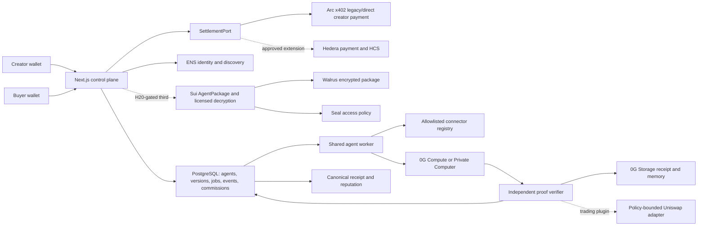
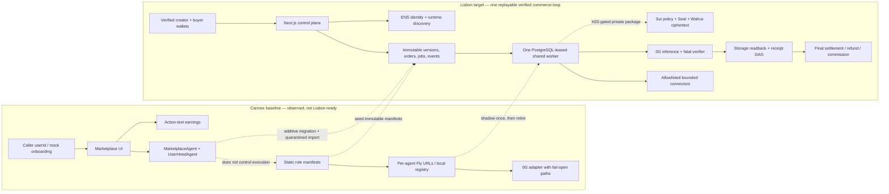
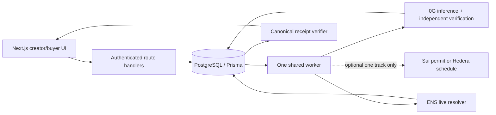
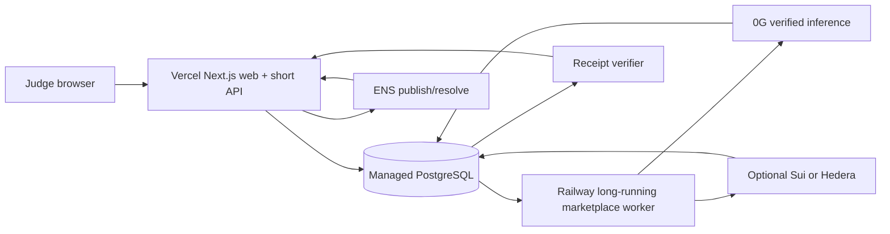

# AlphaDawg Lisbon 2026 Master Engineering Plan

> [!danger] Current state
> **Planning may continue; AlphaDawg product code remains frozen until the official H0 clock is revalidated.** Submission remains blocked by former-contributor consent, an agreed OSI license, changed-team/Continuity approval, credentials, Testnet readiness, and event-window evidence. This note does not authorize implementation, deployment, spending, organizer messages, or submission.

> [!warning] 2026-07-23 workshop green light
> The user reports that the workshop authorized development to start. A0 must archive the presenter/organizer, exact wording, timestamp, and scope before this changes the code-freeze boundary. If it explicitly authorizes qualifying product code before the published H0, that captured ruling controls; otherwise the live H0 dashboard remains the gate. See [[17_Kickoff_H0_Runbook]].

> [!important] Product decision
> AlphaDawg becomes a **creator-owned marketplace for verifiable financial agents**. A wallet user defines and publishes a bounded agent; the platform runs it in one shared multi-tenant runtime; another user discovers and hires it; 0G produces and verifies the result; the creator earns the service commission; and every task, payment, proof, outcome, and reputation update resolves through one receipt.

> [!success] Track decision
> **Build 0G Keep Building + ENS Continuity first, with a conservative core cap of $3,500.** Select at most one third Continuity track after its removal test: Sui raises the cap to $5,500 when package permission gates the real worker; Hedera raises it to $4,500 only when Schedule Service owns a genuine user-managed automation workflow. Otherwise submit only 0G + ENS.

This file controls the long-form AlphaDawg plan. Current official pages and [[../archive/research-vault/strategy/dual-project/10_2026-07-23_Prizes_and_Engineering_Delta|the 2026-07-23 H0 delta]] outrank it where they conflict. The latest snapshot exposes eight partners, **$88,000 and 23 released tracks**; World and The Graph are published but regular-track admission for AlphaDawg remains blocked without written approval.

Current execution tracking starts at [[17_Kickoff_H0_Runbook]] and [[#20. Premortem-Derived Sprint And Backend Control]].

## 0. Beginner Operator Card

> [!danger] Current verdict
> `BLOCKED_PRE_H0`. Do not edit the product yet. The plan is strong; the current repository and eligibility state are not submission-ready. First clear team/IP/license/Continuity access, confirm H0, then repair the repository before adding sponsor features.

### 0.1 What, why, and how it can win

| question | plain answer |
|---|---|
| What are we building? | A marketplace where a creator publishes one bounded financial agent, a buyer hires it, the shared worker executes it, 0G verifies the result, and the creator receives the settled service fee. |
| Why not keep the Cannes trading swarm? | Cannes proved a memorable multi-agent concept, but the current marketplace is mostly UI/database state. Lisbon should turn the strongest unproven promise—creator-owned agents—into one real end-to-end product. |
| Why is an agent necessary? | The agent interprets bounded financial evidence and produces a typed proposal. Deterministic schemas, policy, proof verification, and human approval retain authority. If a form or rules engine can do the job, remove the model. |
| Why 0G? | It must execute and independently verify the exact agent task/output; without 0G the product loses its proof guarantee. |
| Why ENS? | It must provide the runtime-resolved owner, agent identity, version, service endpoint, and payout pointer; without ENS the marketplace loses portable discovery. |
| Why Sui? | It may own private agent-package licensing: Walrus stores ciphertext and Seal/Sui policy decides whether the real worker may decrypt. Cut it if it does not gate execution by H20. |
| Why not Uniswap now? | It is a strong product extension but would exceed the three-partner limit unless it replaces Sui. The marketplace/proof/identity loop wins before trading breadth. |
| What is the winning demo? | A creator publishes; a buyer hires; one verified job settles; the creator commission appears; a tampered proof and replay create no second value; ENS resolves the live agent; optional Sui revocation blocks before decrypt/0G. |

Selection strength uses the same 100-point idea rubric as Project B; it is not win probability:

| criterion | score | reason |
|---|---:|---|
| User pain | 11/12 | Real creator deployment, discovery, trust, and monetization gaps. |
| Sponsor causality | 16/18 | 0G and ENS are load-bearing; Sui is conditional. |
| Agent necessity | 10/10 | Bounded semantic work remains, while authority is deterministic. |
| Inspectable proof | 12/12 | Paid task, proof DAG, commission, identity, refusal, and replay can be shown. |
| Demo clarity | 11/12 | Strong before/after loop, but several systems can create latency. |
| 36-hour feasibility | 6/12 | Existing code helps, but P0 repair and three integrations are heavy. |
| Novelty | 8/10 | Creator-owned verified agents are stronger than another fixed trading swarm. |
| Adoption wedge | 8/8 | Agent creators and buyers have a legible post-event use. This is not user validation. |
| Prior-project separation | 5/6 | Meaningful Lisbon delta, but Continuity disclosure must be exact. |
| **Selection score** | **87/100** | Strong idea; execution risk is the weakness. |

Current delivery readiness is a separate diagnostic based only on observed implementation:

| gate | current points | observed reason |
|---|---:|---|
| Eligibility/provenance | 0/10 | Consent, OSI license, changed-team/Continuity approval, and H0 remain blocked. |
| Repository health | 2/10 | Installable baseline exists; lint/typecheck/audit are red and tests/CI/migrations are missing. |
| Authentication/ownership | 1/10 | Wallet UI exists, but server authorization trusts caller-controlled identity. |
| Marketplace/shared runtime | 2/10 | UI and fixed agents exist; user-created/hired agents do not control real execution. |
| Strict 0G proof/storage | 2/10 | Integration exists, but verification/storage paths fail open or lack proof-bound readback. |
| ENS | 0/10 | Required Lisbon identity/discovery path is not implemented. |
| Sui | 0/10 | No Sui/Move/Walrus/Seal implementation exists. |
| Commerce/recovery | 1/10 | Activity records exist; real settled commission/idempotent recovery do not. |
| Tests/evidence | 1/10 | Ad hoc scripts exist; no executable regression/evidence contract. |
| Release/demo | 2/10 | Cannes UI exists; no Lisbon release SHA or green end-to-end replay. |
| **Current delivery readiness** | **11/100** | Do not confuse existing screens with a qualifying Lisbon implementation. |

`Prize claim readiness = 0/100` until H0 opens and every claimed track has event-window code, deterministic failure tests, a live sponsor-native identifier/state change, README pointers, and a demo timestamp. A high idea score never overrides a red fatal gate.

### 0.2 Repair order: the ten flaws that can lose the hackathon

| order | flaw now | why judges/engineering should care | minimum repair |
|---:|---|---|---|
| 1 | Team/IP/license/Continuity authority unresolved. | The project can be disqualified regardless of code quality. | Written clearance, OSI license, baseline SHA, changed-team/track approval. |
| 2 | Lint/typecheck/audit red; no test script, migrations, or CI. | New work cannot be distinguished from inherited breakage. | Green clean install, schema, lint, typecheck, tests, build, CI. |
| 3 | Caller-controlled wallet/user ownership. | Another user can potentially mutate creator/money resources. | One-time signed challenge, secure session, central ownership checks, cross-user denial tests. |
| 4 | “Create Agent” stores an active placeholder. | The main product claim is currently false. | Real shared-runtime dry run before `PUBLISHED`. |
| 5 | “Hire” creates only a relationship row. | No paid job, result, refund, commission, or receipt exists. | One canonical HireOrder -> Job -> Settlement -> Commission -> Receipt lifecycle. |
| 6 | Hired agents do not enter the real orchestrator. | Marketplace actions do not affect the demonstrated product. | Selection query uses active hires and immutable published versions. |
| 7 | 0G/network/payment failures become success-shaped HOLD output. | Unverified work can influence decisions and earnings. | Typed terminal failure; zero debate, reputation, commission, or action authority. |
| 8 | Proof/storage chain is not preserved or independently verified. | “TEE verified” becomes a UI claim rather than evidence. | Fatal verification, receipt DAG, proof-enabled Storage readback, hash binding. |
| 9 | Earnings sum activity rather than settled creator commissions. | Money shown in the UI is not economically true. | Finality-scoped atomic ledger bound to creator, payment, job, and refund. |
| 10 | Sui is absent and the Uniswap-named path is custom/mock-compatible. | Neither can qualify as claimed today. | Build only the selected real integration after the protected core is green. |

### 0.3 Glossary and stop levels

| term | meaning |
|---|---|
| H0 | Official hacking start. Event-window product edits begin only after this time. |
| H20 | Twenty hours after H0; final causal gate for keeping Sui. |
| Continuity | Approved track allowing an existing project with exact baseline/delta disclosure. |
| Load-bearing | Removing the sponsor primitive breaks a named product guarantee or runtime path. |
| Sponsor-native evidence | Public network/provider state produced by the real sponsor SDK/protocol, not a mock or UI badge. |
| Canonical intent | Stable hash-bound description of one requested economic action. |
| Reconciliation | Query the network using the persisted identifier after timeout; never blindly create a replacement. |
| Success-shaped fallback | A failure returned as a normal-looking result, price, transaction, or verified status. Forbidden. |
| `READY_TO_PUBLISH` | Core validation passed, but final ENS-backed publication has not. |
| `PUBLISHED` | Immutable executable version with verified dry run, payout configuration, and runtime-resolved ENS identity. |

Use precise stop language:

- `REFUSE_INPUT`: reject one malformed/unauthorized request; project continues.
- `BLOCK_EFFECT`: stop payment, commission, reputation, or execution for one intent; reconcile if ambiguous.
- `DROP_TRACK`: remove one sponsor from code-path claims, README, demo, and submission.
- `STOP_PROJECT`: do not submit AlphaDawg when provenance/H0 is invalid or the 0G + marketplace core cannot become real.

### 0.4 First 60 minutes after H0

Run from `/Users/barroca888/Downloads/Dev/Personal/ETH_Global_Cannes_2026`; preserve `npm` and `package-lock.json`.

| time | action | expected artifact/outcome | stop action |
|---:|---|---|---|
| 0–10 min | Record official H0, rules snapshot, allowed Continuity tracks, team/IP/license approvals, immutable Cannes SHA, new branch/worktree, and UTC time. | `evidence/provenance/h0.json` plus first small commit. | Any missing authority/H0 proof -> `STOP_PROJECT`; do not edit product code. |
| 10–25 min | Run `git status --short`, `git rev-parse HEAD`, `npm ci`, and record Node/npm/lockfile versions. | Clean baseline, expected SHA, successful deterministic install. | SHA mismatch or install failure -> block feature work and repair provenance/toolchain. |
| 25–45 min | Reproduce `npm run lint`, `npx tsc --noEmit`, `npm test`, and `npm audit --omit=dev`; save command, exit code, and log. | Known red baseline is reproduced honestly; no claim of passing. | Different/unexplained result -> investigate before changing code. |
| 45–60 min | Create the Sprint 1 checklist: generated-state clean command, real `test`/`typecheck` scripts, broken-script disposition, migration tests, typed env validation, CI, and advisory triage. | One atomic toolchain task list/commit; no sponsor feature code. | If clean-install repair cannot fit H0–H4, `STOP_PROJECT` for engineering-readiness claims. |

Known starting outcomes: lint has 23 errors/28 warnings; typecheck references stale generated routes; `npm test` is absent; production audit reports 73 findings. Reproducing those failures is a baseline pass, not a release pass.

### 0.5 Command and outcome rule

At every sprint, record `cwd`, command, UTC start/end, exit code, commit SHA, environment class, redacted log path, and public identifier when applicable. For the release SHA, every applicable command must exit `0`:

```bash
cd /Users/barroca888/Downloads/Dev/Personal/ETH_Global_Cannes_2026
npm ci
npm run clean:generated
npx prisma validate
npx prisma generate
npm run lint
npm run typecheck
npm test
npm run test:integration
npm run test:e2e
npm run build
```

Scripts that do not exist are Sprint 1 work, not commands to skip. A local fixture proves logic only. A sponsor gate additionally needs the real adapter smoke, live public state/identifier, negative no-effect assertion, and evidence file. Retry a network timeout once using the same persisted intent; repeated failure becomes `BLOCKED` or `DROP_TRACK`, never `PASS`.

Create these stable script names by the sprint that owns them:

| script | expected release outcome |
|---|---|
| `npm run smoke:0g` | Real inference verifies against the exact task/version/output envelope; tamper companion test fails before downstream execution. |
| `npm run smoke:0g-storage` | Upload ID/root is recorded; proof-enabled readback parses `RunReceiptV1` and matches canonical hashes. |
| `npm run smoke:ens` | Owner-controlled write resolves from a clean client; forged/stale/mismatched manifest refuses. |
| `npm run smoke:sui` | If selected, valid permit enables one worker decrypt/0G run; revoke rerun makes zero Seal/0G calls. |
| `npm run smoke:uniswap` | If selected, verified/user-approved intent reaches one real lifecycle; malformed intent keeps signer/broadcast counters at zero. |
| `npm run demo:reset` | Recreates only synthetic fixtures and returns the demo to its documented initial state without manual DB edits. |

### 0.6 Dependency order and judge proof

```text
clear provenance/H0
  -> Sprint 1 repository health
  -> Sprint 2 auth + immutable commerce schema
  -> Sprint 3 shared runtime + strict 0G
  -> Sprint 5 marketplace reaches READY_TO_PUBLISH
  -> Sprint 6 ENS makes the version PUBLISHED
  -> Sprint 7 release/evidence

Sprint 4 Sui is an H15–H20 parallel spike and is dropped if it does not gate the real worker.
Uniswap starts only after Sui is formally dropped or after the Lisbon release.
```

The judge-facing proof is not “we integrated three chains.” It is:

1. **Loss:** creators currently cannot publish and monetize an executable, trustworthy agent.
2. **Unsafe contrast:** the inherited placeholder/fail-open path is shown and then refused by the new system.
3. **Working loop:** creator -> immutable version -> ENS discovery -> paid hire -> shared worker -> verified 0G result -> commission -> receipt.
4. **Negative guarantee:** forged owner, tampered proof, failed paid run, and replay create no unauthorized value or reputation.
5. **Track causality:** remove 0G and proof disappears; remove ENS and publication/discovery fails; remove Sui and only private-package licensing disappears.

## 1. What AlphaDawg Is Trying To Accomplish

### Cannes product

AlphaDawg began as a verifiable trading swarm:

```text
user funds a Lead Dawg
  -> specialist agents sell market intelligence
  -> Alpha and Risk debate
  -> Executor proposes a decision
  -> user approves
  -> action and evidence are recorded across 0G, Hedera, Arc, and the dashboard
```

The memorable promise was **money, brain, and truth**: pay specialists, reason privately, and make the result auditable.

### Lisbon product

Lisbon should make the marketplace real:

```text
creator connects wallet
  -> defines a declarative agent and allowed tools
  -> proves ownership and publishes a version
  -> receives a persistent ENS identity
  -> shared runtime executes the agent through 0G
  -> buyer discovers, quotes, hires, and submits a task
  -> verified result is delivered
  -> creator receives the service commission
  -> evidence-backed reputation changes
```

AlphaDawg is no longer merely “our fixed swarm trades.” It is **infrastructure and a product for people to create, own, monetize, hire, and compose verifiable financial agents**.

### Users and jobs

| user | job | loss today | AlphaDawg outcome |
|---|---|---|---|
| Agent creator | Turn expertise or a strategy prompt into a sellable agent without deploying infrastructure. | Running one server/wallet/deployment per agent is expensive and brittle; marketplace ownership and payout are unclear. | Publish one bounded agent version to a shared runtime and earn per verified task. |
| Agent buyer | Find a specialist that can be trusted for a particular financial task. | Agent endpoints, capabilities, prices, provenance, and outcomes are hard to compare. | Resolve identity/capabilities, inspect proof-backed history, quote, hire, and receive a typed result. |
| Pack owner | Compose specialists into a trading/research workflow. | Current selection is hard-coded and the “hired pack” does not control the real cycle. | Active hires become actual eligible agents in the orchestrator. |
| Platform operator | Run many agents safely and cheaply. | One Fly app per agent duplicates compute, secrets, deployments, and health operations. | One shared worker service runs many declarative agent definitions with isolation, quotas, and evidence. |

### Product boundaries

- MVP agents are **declarative configurations**, not arbitrary user code.
- An agent contains a versioned system prompt, capability tags, allowlisted data connectors, output schema, proof policy, price, owner, and payout address.
- Users cannot upload JavaScript, shell commands, arbitrary URLs, private keys, or unrestricted tools.
- Models propose typed outputs; deterministic policy and explicit user approval control value-moving actions.
- AlphaDawg is a marketplace and execution firewall, not a fund manager, broker, investment adviser, guaranteed-return product, or production escrow.

## 2. BUILD / NARROW / STOP

### BUILD

1. One shared local/hosted agent runtime replacing per-agent Fly deployments and OpenClaw-era workspace identity.
2. A real creator flow: wallet ownership challenge -> draft -> validation -> dry run -> published version.
3. A real hiring flow: discover -> quote -> payment -> queued execution -> independent 0G verification -> delivery -> creator commission -> receipt.
4. Built-in and user-created agents using the same runtime contract and state machine.
5. 0G Compute/Private Computer as the execution/proof layer and 0G Storage as the run-receipt/memory layer.
6. ENS as persistent agent identity, discovery, version, service, and payout-pointer layer.
7. Fail-closed proof, payment, refund/recovery, replay, ownership, and tool-policy behavior.
8. Honest Cannes baseline/delta disclosure and complete submission evidence.

### NARROW

- One creator, one new agent, one buyer, one task schema, one price asset, one verified delivery, one real creator commission, one ENS subname, one tamper/refusal, and one replay/restart.
- One shared worker process in local development and one shared worker service in the deployed demo.
- Four to six allowlisted connectors; no arbitrary integrations.
- Platform fee is **0 bps in the MVP**. The creator receives the complete service fee, avoiding an unproven split/custody system.
- Current dual-project mode assigns one engineer to AlphaDawg. 0G + ENS are protected after the shared-runtime core. Sui is selected but loses its slot at H20 unless the real worker already depends on its license; no sponsor scope may consume the release window after a failed gate.

### STOP

- Stop if “Create Agent” still produces a database-only placeholder, if a hired agent cannot execute in the real cycle, or if creator earnings are calculated without a settled payment.
- Stop downstream economic authority if 0G proof is missing, false, stale, reused, or not bound to the exact task/version/output.
- Stop an external agent version if ownership, tool policy, output schema, dry run, or payout address fails.
- Stop any track claim lacking event-window code, deterministic tests, live sponsor-native state, and a demo moment.
- Never use a local fallback, mock router, fabricated transaction, UI status, inherited Cannes ID, or payment string as Lisbon proof.

## 3. Repository-Backed Current-State Audit

Product repository: `/Users/barroca888/Downloads/Dev/Personal/ETH_Global_Cannes_2026`  
Immutable Cannes baseline: `bfa7bd37c573e2e49525d965f7f937210e170d72`  
Current inspected branch: `feat/lisbon-agent-commerce`, clean on 2026-07-16.

### Important correction: OpenClaw is not the primary runtime blocker

The repository still contains `openclaw/**`, an OpenClaw gateway client, UI status, and a SOUL hash dependency. However:

- `src/agents/main-agent.ts` only pings the OpenClaw gateway and records display status; the gateway does not gate hiring or inference.
- `src/agents/specialist-server.ts` and `src/agents/fly-agent-server.ts` run TypeScript handlers and call 0G directly.
- `src/og/inft.ts` still reads `openclaw/main-agent/SOUL.md` for the inherited agent-NFT hash.

Therefore “remove OpenClaw” is necessary cleanup but not the product solution. The real work is to replace fixed process identity, static manifests, placeholder user agents, and non-settling marketplace records with a shared runtime and real economic lifecycle.

### Current gaps

| severity | current evidence | gap | required Lisbon correction |
|---|---|---|---|
| P0 | `app/api/marketplace/create/route.ts` stores `endpoint = local://user-created` while setting `active = true`. | “Deploy Agent” creates no executable runtime. | Publish only after a real dry run through the shared executor; no placeholder endpoint can be `PUBLISHED`. |
| P0 | `app/api/marketplace/hire/route.ts` only upserts `UserHiredAgent`. | Hiring is a relationship row, not a paid task or commission. | Create `HireOrder`, quote, payment, task, run, commission, and receipt records. |
| P0 | `UserHiredAgent` is used by marketplace/UI and chat pack count, while `src/agents/role-manifests.ts` selects fixed pools. | A user's hired pack does not control the real trading cycle. | Eligibility query must join active hires and published agent versions; orchestrator selection uses that set. |
| P0 | `createdBy` is accepted from request JSON and `name` is globally unique. | Creator ownership is caller-asserted; namespace and update authority are unsafe. | Authenticate the user, verify a wallet challenge, derive owner from the session, and use owner-scoped slug/version uniqueness. |
| P0 | `app/api/onboard/route.ts` returns existing users before signature verification, accepts absent/`"mock"` proofs for new users, and multiple money/cycle/marketplace routes trust body/path `userId`. | Wallet connection is not authorization; cross-user reads and mutations are structurally possible. | One-time domain/chain/action-bound wallet challenge, secure server session, central resource authorization, and cross-user negative tests before any sponsor/payment call. |
| P0 | `src/agents/fly-agent-server.ts` returns local fallback signals when 0G fails. | Paid, unverified output can look usable. | Any missing/failed 0G verification terminates the run and triggers refund/recovery; no semantic fallback. |
| P0 | The Fly server can disable its paywall when a mnemonic/address is unavailable and still serve `/analyze`. | An unpaid response can be counted as a paid hire. | Published paid agents must fail startup or remain `UNAVAILABLE` when settlement configuration is invalid. |
| P0 | `app/api/marketplace/earnings/route.ts` sums all `SPECIALIST_HIRED` action amounts; it does not require final settlement or allocate to `createdBy`. | Displayed earnings are an activity aggregate, not creator commissions or payouts. | Commission ledger derives only from confirmed payment and delivered/refunded state, then binds the owner/payout address and settlement ID. |
| P0 | `src/agents/hire-specialist.ts` converts missing agents, network/402 errors, and missing payment into priced HOLD-shaped results; raw `fetch` silently replaces x402. | Failure can become apparent intelligence and a nominal hire cost. | Discriminated terminal failure with zero paid/verified value; it cannot enter debate, earnings, reputation, or action. |
| P0 | `src/agents/main-agent.ts` hierarchical flattening overwrites every returned specialist proof with `teeVerified: false`. | The final debate cannot preserve a valid specialist proof chain even when a provider verified. | Typed receipt DAG binds specialist -> Alpha -> Risk -> Executor; any unverified/tampered node stops dependants. |
| P0 | `src/og/storage.ts` downloads canonical memory with Merkle-proof verification disabled and stores arbitrary unknown payload. | Root possession is displayed without a proof-enabled, schema-bound receipt readback. | Redacted `RunReceiptV1`, proof-enabled download, canonical payload hash/root comparison, and durable outbox reconciliation. |
| P0 | `contracts/MockSwapRouter.sol`, `contracts/AlphaDawgSwap.sol`, and `src/execution/arc-swap.ts` imitate a Uniswap V3 ABI but use a custom/mock AMM; swap failure can become a successful self-transfer. | The repo has no qualifying Uniswap integration despite Uniswap naming. | Actual official Uniswap infrastructure plus reusable proof-bound agent executor; no self-transfer, zero-slippage, copied-ABI, or custom-AMM claim. |
| P0 | No Sui/Move/Walrus/Seal code or dependencies exist; the local Sui CLI is absent. | Sui eligibility is currently zero. | Event-window SDK/CLI compatibility setup, Move `AgentPackage`/job permit, Walrus ciphertext, Seal approval, real worker gate, Testnet authorized/revoked proof. |
| P1 | `fly/deploy-agent.sh` and `fly/deploy-hierarchical.sh` create one `vm-<agent>` app and distribute a shared mnemonic. | Per-agent deployment duplicates infrastructure and broadens secret exposure. | One shared runtime with per-agent logical identity; a separate signer service owns settlement authority. |
| P1 | `src/agents/specialist-server.ts` starts ten fixed agents on ports 4001–4010. | Local mode is one process, but still hard-coded and cannot execute a user-created definition. | One port, one executor, `agentVersionId` routing, connector registry, worker leases, and bounded concurrency. |
| P1 | `src/config/agent-registry.ts` and role manifests encode fixed agents/URLs. | Dynamic marketplace entries cannot participate without source/config edits. | Database-backed discovery plus signed/canonical Agent Cards; static registry becomes a legacy adapter only. |
| P1 | `MarketplaceAgent.price` and action payment amounts are text such as `$0.001`. | Currency/network precision and comparisons are unsafe. | Store `amountAtomic`, `assetId`, `networkId`, and display decimals separately. |
| P1 | Instruction generation may return a deterministic fallback with `teeVerified = false`, after which creation still accepts the markdown. | An unverified generated definition can be advertised as deployed. | Require explicit user acceptance plus dry-run proof; label provenance and never infer verification from generation. |
| P1 | No `npm test` script and incomplete migration history. | The new lifecycle lacks an executable regression contract. | Add a real test entry, additive migrations, empty/Cannes-baseline database migration tests, and fresh-clone verification. |
| P1 | Installed 0G code uses `@0glabs/0g-serving-broker@0.7.4` and umbrella Storage SDK while current official docs expose split Compute/Storage packages. | Blind feature work risks coding against stale package names/signatures. | H0 compatibility spike, one active adapter, exact locked versions, current provider/Storage live smoke, and recorded migration decision. |

### Reproducible repository-health baseline

This is the 2026-07-16 local result at the immutable Cannes SHA, not an estimate:

| check | result | engineering consequence |
|---|---|---|
| Git | Clean local `feat/lisbon-agent-commerce`; live `origin/main`, local `main`, and HEAD point to `bfa7bd37c573e2e49525d965f7f937210e170d72`; the feature branch is not published; 356 tracked files. | Good provenance anchor, but there is no Lisbon implementation delta yet. |
| `npm run lint` | **FAIL:** 51 findings: 23 errors and 28 warnings. | Fix React 19 purity/ref/state errors and typed-script violations before feature work can be called stable. |
| `npx tsc --noEmit` | **FAIL:** ten stale `.next/types/validator.ts` imports reference removed A2A/commerce routes. | Clean generated output, reproduce, then fix real source errors if any remain. Generated `.next` state is not evidence. |
| `npm test` | **FAIL:** no `test` script. | Add a deterministic unit/integration/E2E test entry before new state machines. |
| `npm audit --omit=dev` | **FAIL:** 73 production findings: 11 low, 41 moderate, 20 high, 1 critical across 1,356 production packages. | Triage reachable paths; upgrade safe direct dependencies and lockfile; document accepted transitive risk. Never use `npm audit fix --force` during the event. |
| Package scripts | `migrate`, `setup-gateway`, and `validate-x402` reference missing files. | Restore or remove each broken command; every documented setup command must execute from a fresh clone. |
| Dependencies | Several runtime dependencies use `"*"`; Node requirement is `>=22`; project uses `npm` and `package-lock.json`. | Pin exact compatible ranges and preserve the existing package manager. |
| Configuration | Source/app references 52 distinct environment variables; `.env.example` contains 61 entries; no typed runtime validator. | Split web/worker/sponsor ownership and fail startup on missing required values without logging secrets. |
| Schema/history | Prisma schema exists, but no committed migration directory was found. | Establish an additive migration baseline and test both an empty database and a Cannes-shaped database. |
| License/consent | No root OSI license; two contributors appear in history. | Submission remains blocked until license and former-contributor authorization are recorded. |
| CI | No `.github/workflows` or equivalent verified gate was found. | Add one clean-install job for schema validation, lint, typecheck, tests, and build after H0. |

The vulnerability count is a triage input, not proof that every advisory is exploitable. Direct items needing immediate review include the installed 0G SDK/broker versions, `viem`, `uuid`, `ws`, and wallet/auth transitive dependencies.

### Current request-to-money trace

| user-visible action | current code path | actual effect | missing authoritative state |
|---|---|---|---|
| Connect wallet | `contexts/user-context.tsx` -> `app/api/onboard/route.ts` | Automatically submits `"mock"`; existing-user response precedes signature verification. | One-time challenge, verified session, rotation/expiry, server-derived owner. |
| Generate instructions | `app/api/marketplace/generate-instructions/route.ts` | May return deterministic fallback content with `teeVerified: false` while still returning a successful payload. | Provenance, strict verification, acceptance, version binding. |
| Create/deploy agent | `components/create-agent-modal.tsx` -> `app/api/marketplace/create/route.ts` | Inserts an active row with `local://user-created`, caller-supplied owner, and string price. | Authentication, executable version, dry run, immutable manifest, health. |
| Hire agent | `app/api/marketplace/hire/route.ts` | Upserts `UserHiredAgent`. | Quote, payment, task, job, proof, settlement, commission. |
| Use hired pack | `src/agents/role-manifests.ts` and `src/agents/main-agent.ts` | Selects hard-coded built-in pools and fixed Fly endpoints; user hires do not define execution eligibility. | Database-backed capability selection and exact version routing. |
| Execute specialist | `src/agents/hire-specialist.ts` -> `src/agents/fly-agent-server.ts` | Calls 0G but can return priced HOLD-shaped network/payment failure or HTTP success with unverified local fallback; paywall may be disabled. | Fatal payment/proof policy, exact task/version binding, one paid effect, no failure-as-opinion. |
| Show earnings | `app/api/marketplace/earnings/route.ts` | Sums text amounts from action rows, not creator-owned finalized settlements. | Creator commission ledger, refund state, asset/network precision. |
| Execute trade | `src/execution/arc-swap.ts` | Custom/mock-compatible router; failed swap may become a native self-transfer reported as success. | Approved canonical intent, real protocol adapter, receipt, and fail-closed outcome. |

### Current deployment and runtime reality

- `fly/deploy-agent.sh` creates one `vm-<agent>` app per specialist.
- `fly/deploy-hierarchical.sh` distributes a shared mnemonic, 0G private key, and fixed agent URLs across debate services.
- `src/agents/specialist-server.ts` starts ten hard-coded specialist ports; `lib/swarm-endpoints.ts` hard-codes the hosted Fly topology.
- The root Docker path already proves multiple agents can coexist in one container, but routing is still name/port based rather than `agentVersionId` based.
- `vercel.json` gives request handlers a 60-second ceiling, so the durable worker cannot live inside a serverless marketplace request.
- The safe target is one web control plane, one shared long-running worker service, and PostgreSQL. Local development runs all three locally; the demo may deploy web and worker separately from the same image/repo. Redis is unnecessary for the hackathon.

### What is already reusable

- Existing wallet/user onboarding and dashboard shell.
- `MarketplaceAgent` and `UserHiredAgent` as migration starting points.
- 0G inference/storage adapters, provided verification is made independent and fatal.
- Arc x402 client/server as a disclosed legacy settlement adapter.
- HCS/HTS/Schedule adapters as optional conditional settlement/audit components.
- Agent prompts, data connectors, reputation UI, and built-in specialists after converting them to versioned agent definitions.
- Existing user approval flow, after binding it to a canonical intent and signer policy.

## 4. Track Fit And Realistic Individual Prize Caps

The newest supplied official snapshot controls. “Cap” below means the highest **individual published placement**, not the full track pool. The floor is always $0. Multiple tracks from one partner are not summed unless that partner confirms multiple awards to one project.

[[#19.10 Canonical eligibility and claim table]] is the only mutable eligibility ledger. The tables and sponsor contracts in Sections 4, 9, and 17 explain product fit and required engineering; they cannot independently promote a track to eligible or claim-ready.

### Track-by-track decision

| partner / track | category | individual cap | product role | fit | decision |
|---|---|---:|---|---|---|
| 0G — Keep Building | Continuity | **$1,500** | Shared runtime executes private/verifiable agent calls; Storage preserves task-bound receipts and memory. | Indispensable and inherited. | **COMMIT.** |
| ENS — Best ENS Continuity Integration | Continuity | **$2,000** | Persistent creator/agent subnames, service discovery, version/payout pointers, and human-readable marketplace identity. | Directly solves the marketplace discovery/ownership gap. | **COMMIT.** Sunday booth is mandatory. |
| Sui — Existing App Integration | Continuity | **$2,000** | Move ownership/license registry; Walrus stores encrypted agent packages; Seal gates decryption by active license policy. | Coherent only if ownership/licensing and private agent IP are core. | **SELECTED THIRD, H20-GATED.** Never use Walrus as duplicate generic storage. |
| Hedera — Autonomous On-Chain Automation | Continuity | **$1,000** | User-managed scheduled creator payment/action executed by Schedule Service. | Coherent only if AlphaDawg becomes a real automation manager rather than adding a payment demo. | **ALTERNATE THIRD**, instead of Sui; cut when removal does not break the workflow. |
| Uniswap — Stack Contribution | Continuity | **$1,000** | Optional reusable `VerifiedAgentIntent -> UniswapExecution` adapter for trading agents. | Strong for the old trading loop, weak for creator marketplace commissions. | **ALTERNATE THIRD**, after core only. |
| Hedera — AI & Agentic Payments | From Scratch | **$3,000** | Post-verification creator payout, HCS audit, optional Schedule approval. | Good economic fit, but category admission is unresolved and it would exceed the three-partner portfolio. | **NOT SELECTED.** Keep inherited integration honest; do not spend Lisbon critical-path time on it. |
| Uniswap — API Integration | From Scratch | **$4,000** | Official API routing/execution for verified trade intents. | High cap but regular-track eligibility and feedback path are unresolved; not necessary for creator monetization. | Do not count; implement only after written admission and a trading-first decision. |
| ENS — AI Agents / Most Creative | From Scratch | **$1,500 each** | Same ENS identity/discovery surface. | Technically aligned, but AlphaDawg should use the larger Continuity category. | Do not sum or count absent written cross-category treatment. |
| 0G Product / Infrastructure | From Scratch | **$3,000 / $1,500** | Product or builder-kit classification. | Strong mechanism but AlphaDawg's safe published category is Keep Building. | Do not count absent approval; choose one classification if approved. |
| The Graph / World | Published regular tracks | **$0 counted** | Potential live performance data or human-backed-agent authority. | No AlphaDawg regular-track admission; neither is needed by the protected marketplace loop. | WATCH only; require written admission and removal-test failure. |
| 1inch Aqua / Sui New App / Hedera No Solidity | From Scratch | Varies | Require a different product or incompatible repo boundary. | Weak/invalid for this Continuity submission. | REJECT. |

### Portfolio options

| posture | selected partners | realistic individual-cap ceiling | product coherence | decision |
|---|---|---:|---|---|
| Core / lowest risk | 0G Keep + ENS Continuity | **$3,500** | Brain/proof + identity/discovery. Both explicitly Continuity. | **Protected plan.** |
| All-Continuity maximum | 0G Keep + ENS Continuity + Sui Existing App | **$5,500** | Brain/proof + identity/discovery + private ownership/licensing. | **Recommended maximum only if Sui is load-bearing by H20.** |
| Automation Continuity alternate | 0G Keep + ENS Continuity + Hedera Automation | **$4,500** | Brain/proof + identity/discovery + user-managed scheduled action. | Use instead of Sui only if Schedule Service is causal. |
| Regular commerce, conditional | 0G Keep + ENS Continuity + Hedera Agentic | **$6,500** | Brain/proof + identity/discovery + real creator payout. | `NOT_PROMOTABLE` without written regular-track admission. |
| Trading Continuity | 0G Keep + ENS Continuity + Uniswap Stack | **$4,500** | Brain/proof + identity/discovery + bounded trade execution. | Use only if the demo remains trading-first. |
| Regular-track upside | 0G Keep + ENS Continuity + Uniswap API | **$7,500** | Technically possible architecture. | `NOT_PROMOTABLE`: regular-track admission and mandatory feedback path unresolved. |

### Eligibility contract from the current supplied snapshot

Do not maintain a second requirement table here. [[#19.10 Canonical eligibility and claim table]] owns current entry conditions, sources, expiry, selection, and live evidence status. Section 9 below owns only the engineering needed to satisfy those rows. All Continuity submissions still disclose the Cannes baseline and substantive event-window work through incremental version-control history; a late bulk commit, inherited live ID, or pre-event prototype is not qualifying evidence.

### Sui versus ENS versus Uniswap

- **ENS makes sense now.** A marketplace needs stable agent identity and discovery. The exact Continuity track pays more than Uniswap Stack and directly matches the new product.
- **Sui is selected but conditional on causality.** Use it for creator-owned encrypted agent packages and revocable execution licenses. If removing Sui does not break a real licensed run by H20, cut the Sui claim.
- **Uniswap remains part of the product roadmap, not the selected Lisbon portfolio.** Build it after submission, or substitute it for Sui before the lock if the Sui gate fails and every Uniswap eligibility requirement is available.
- **Hedera is an alternate, not selected at lock.** Its Continuity automation track may replace Sui only when Schedule Service owns a genuine user workflow. Regular Agentic Payments still requires written admission.

## 5. Target User Journeys

### Creator: create and publish an agent

1. Connect wallet and sign a nonce bound to domain, chain, account, expiry, and action.
2. Enter name/slug, description, capability tags, task/output schema, selected allowlisted tools, price asset/amount, and payout address.
3. Generate or write instructions; show whether 0G generated them and whether generation proof verified.
4. Save `DRAFT`; no marketplace visibility and no runtime activation.
5. Validate schema, prompt size, tools, payout network, owner signature, and policy.
6. Run a synthetic dry-run task through the same shared runtime and strict 0G verifier.
7. Publish immutable `AgentVersion` and ENS records; publish the Sui package/license state when the H20-selected path remains green.
8. Status becomes `PUBLISHED`; marketplace shows real health, version, price, proof policy, and owner.

### Buyer: discover and hire

1. Search by capability, price, proof type, live health, owner identity, and evidence-backed outcomes.
2. Resolve ENS service/version/payout pointers and compare them with the database manifest hash.
3. Request a signed quote bound to buyer, agent version, task/input hash, asset, amount, expiry, and nonce.
4. Accept quote and settle through the chosen `SettlementPort`.
5. Create a durable job; shared worker claims it once and executes the exact agent version.
6. Independently verify 0G proof and output schema.
7. Deliver result; finalize creator commission or enter refund/recovery.
8. Export one receipt. The buyer may add the agent to their pack only after one successful dry/live run.

### Pack owner: use hired agents in a cycle

1. Query active `UserHiredAgent` rows joined to `PUBLISHED` healthy versions.
2. Filter by required capability and proof/price policy.
3. Rank with evidence-backed outcome reputation plus deterministic task fit.
4. Hire selected versions through the same order/runtime contract.
5. Debate consumes only verified typed results; a failed agent is excluded, not replaced with synthetic HOLD content.

## 6. Target Architecture



### Deployment topology

| environment | topology | invariant |
|---|---|---|
| Local development | Next.js control plane + one Node worker on one port + local/disposable PostgreSQL. | No agent-specific process or port. |
| Deployed demo | Existing web deployment + one shared long-running worker service + PostgreSQL. | Agent identity is data/version, not a container. |
| Scale-out later | Multiple identical workers claiming jobs by lease. | At-most-one active lease per job/version; signed effects remain idempotent. |

Use PostgreSQL as the hackathon queue/outbox; do not add Redis. Workers claim rows using a transaction and `FOR UPDATE SKIP LOCKED`, set a lease owner/expiry, heartbeat, and recover expired leases. Long 0G calls do not run inside serverless request lifetimes.

### Shared runtime contract

One endpoint routes by version, never by deployment:

```text
POST /v1/agent-jobs
GET  /v1/agent-jobs/:jobId
POST /v1/agent-jobs/:jobId/cancel
GET  /.well-known/agent-card.json?agent=<owner/slug>
```

The worker:

1. Loads immutable `AgentVersion` and owner/tool/proof/price policy.
2. Rechecks status, version hash, task schema, payment state, quota, and optional license.
3. Fetches only allowlisted connector data through bounded adapters.
4. Constructs a canonical prompt envelope; user task text cannot redefine system policy or tools.
5. Calls 0G and independently verifies the exact response.
6. Writes append-only events and a redacted Storage receipt.
7. Finalizes delivery/commission or refund/recovery.

Concurrency defaults to four jobs per worker. Apply per-owner, per-buyer, per-agent, and global quotas. Bound prompt/input/output size, connector duration, model calls, retries, and total cost.

## 7. Canonical Data Model

Extend the existing Prisma model; do not build a second registry.

| model | essential fields and constraints |
|---|---|
| `MarketplaceAgent` | `id`, authenticated `ownerUserId`, owner-scoped `slug`, display name, status, current version, created/updated timestamps; unique `(ownerUserId, slug)`. |
| `AgentVersion` | agent/version, instructions hash or encrypted reference, tool-policy hash, capability tags, input/output schema, model/provider, proof policy, price policy, payout address, manifest hash, immutable status. |
| `AgentIdentity` | agent/version, ENS name/node, owner, resolver, record hash, last verified block/time; optional Sui object/blob/license references. |
| `HireOrder` | buyer, agent/version, task/input hash, quote hash, asset/network/amount atomic, payout address, expiry, nonce, idempotency key, state/version. |
| `AgentJob` | order, exact agent version, state, lease owner/expiry, attempt, input/output hashes, proof reference/result, error code, started/finished timestamps. |
| `CommerceEvent` | aggregate ID/type, expected version, transition, actor, canonical evidence hash, timestamp; append-only. |
| `Settlement` | order, rail, exact prepared artifact hash, payer/payee, asset/network/amount atomic, tx/status/finality, refund ID/status. |
| `CommissionEntry` | owner, order/settlement, gross/net/platform atomic amounts, asset/network, state; unique order commission. |
| `ReputationEvent` | agent/version, task/outcome class, evaluator/evidence, score delta, proof/settlement/run references. User likes are separate social signals. |
| `Receipt` | canonical references/hashes for owner, identity, version, task, quote, payment, run, proof, output, commission, refund, outcome, and public links. |

Never store money as `$0.001` or floating point. Use atomic integer strings at boundaries and database integer/decimal types with explicit asset decimals.

### Exact relational and authentication invariants

- Add `AuthChallenge(id, walletAddress, chainId, domain, action, nonceHash, expiresAt, consumedAt)`. Store only the nonce hash; unique `(walletAddress, nonceHash)`; consume it in the same transaction that creates the authenticated session.
- Verify an EIP-4361-compatible signed message server-side. The session wallet—not `createdBy` request JSON—sets `MarketplaceAgent.ownerUserId`, payout-change authority, and publish authority.
- `MarketplaceAgent`: unique `(ownerUserId, slug)`; no globally unique display name. One nullable `currentVersionId`, updated only after the identity publication transaction succeeds.
- `AgentVersion`: unique `(agentId, version)` and unique `manifestHash`; published fields are immutable. Connector IDs reference a code-owned allowlist, not database URLs.
- `HireOrder`: unique `(buyerUserId, idempotencyKey)` and unique `quoteHash`; optimistic `stateVersion` prevents stale transitions.
- `AgentJob`: unique `orderId`; lease acquisition changes `stateVersion`; `attempt` does not change effect identifiers.
- `Settlement`, `CommissionEntry`, and `Receipt`: unique `orderId`. Refund and commission are mutually exclusive finalized effects.
- `CommerceEvent`: unique `(aggregateId, transition, effectId)` so worker restarts cannot append the same economic transition twice.
- Add foreign keys and restrictive delete behavior for economic evidence. Agents can be archived, never cascade-delete paid history.

The current `Cycle(userId, cycleNumber)` index should become a uniqueness constraint if one cycle number per user is the intended identity. Confirm existing data before migration.

### Publication state machine

```text
DRAFT -> OWNERSHIP_VERIFIED -> VALIDATING -> DRY_RUN_PENDING
  -> DRY_RUN_FAILED
  -> READY_TO_PUBLISH -> PUBLISHED -> SUSPENDED -> ARCHIVED
```

- Only the authenticated owner can create versions, publish, suspend, or change payout policy.
- A published version is immutable; edits create a new version.
- `PUBLISHED` requires a real executable shared-runtime path, valid payout configuration, one verified dry run, and exact manifest hash.
- ENS publication failure leaves the version at `READY_TO_PUBLISH`; Sui failure drops the Sui claim and private-agent listing. Neither creates an undefined partial-success state.

### Hire/run/commission state machine

```text
REQUESTED -> QUOTED -> PAYMENT_REQUIRED -> PAYMENT_CONFIRMED
  -> QUEUED -> RUNNING -> PROOF_VERIFYING
      -> VERIFICATION_FAILED -> REFUND_REQUIRED -> REFUNDED
      -> VERIFIED -> DELIVERED -> COMMISSION_FINALIZED -> RECEIPTED

other terminal/recovery: QUOTE_EXPIRED | CANCELLED | PAYMENT_FAILED |
                         EXECUTION_FAILED | REFUND_FAILED | RECOVERY_REQUIRED
```

Invariants:

1. The order binds buyer, owner, exact version, task/input, price, payout, asset/network, expiry, and nonce.
2. One order can create at most one settled payment, delivered result, commission, refund, and reputation outcome.
3. Persist exact payment/refund/signed artifacts and identifiers before broadcast; retries reconcile them.
4. A paid run that fails after settlement must complete a real refund or remain visibly `REFUND_REQUIRED`; it cannot count as creator earnings.
5. `COMMISSION_FINALIZED` requires a verified delivery and final non-refunded settlement.
6. Missing 0G proof yields no delivery, commission, positive reputation, or downstream trade authority.

### Demand, selection, performance, and reputation

The marketplace must rank agents on task fit and verified outcomes, not popularity or a hard-coded role manifest.

1. **Eligibility first:** exact capability intersection, active hire or public availability, `PUBLISHED` version, healthy runtime, compatible input/output schema, proof policy, asset/network, price ceiling, and valid optional Sui license.
2. **Cold-start prior:** new agents receive a neutral prior and a visible `NEW` label; they do not inherit the creator's social score or another version's execution score.
3. **Evidence score:** use settled, independently verified jobs only. Keep social likes/reviews in a separate presentation score.
4. **Deterministic rank:** for the MVP, compute a documented weighted score from task fit, a conservative reliability estimate, normalized p95 latency, normalized price, and freshness. Store the feature vector and selected version in the receipt.
5. **Conservative reliability:** use a Beta prior, for example `(verifiedSuccesses + 2) / (verifiedAttempts + 4)`, plus a minimum-sample penalty. Never advertise a 100% rate from one task.
6. **Demand signals:** track quote requests, accepted quotes, verified deliveries, repeat buyers, cancellations, refunds, and unfilled capability searches. Do not use page views as proof of demand.
7. **Owner economics:** creator dashboard separates pending, finalized, refunded, and withdrawable amounts by asset/network. A row is not earnings until settlement and delivery are final.

Selection emits a typed trace:

```ts
type SelectionTrace = Readonly<{
  taskCapability: string;
  consideredVersionIds: readonly string[];
  rejected: readonly { versionId: string; reason: string }[];
  ranked: readonly {
    versionId: string;
    taskFit: number;
    reliability: number;
    latencyScore: number;
    priceScore: number;
    freshnessScore: number;
    total: number;
  }[];
  selectedVersionId: string;
}>;
```

The weights are config with one version/hash, not user-editable values. Change them only through a new scoring-policy version so receipts remain replayable.

## 8. Creator Commission Engineering

### MVP rail

Use the existing Arc x402 path only as a disclosed legacy-compatible `SettlementPort`:

- Generate the payment challenge dynamically from the immutable agent version's creator payout address; do not deploy one server per payee.
- Set platform fee to `0 bps`; the creator receives the entire service price.
- Require a real settlement identifier and payer/payee/asset/network/amount match before `PAYMENT_CONFIRMED`.
- If inference/proof fails after payment, execute a same-asset refund adapter and reconcile its real identifier before `REFUNDED`.
- If dynamic payee or refund cannot be proved, do not claim creator commissions; show the order as blocked.

### Future Hedera rail — outside the selected Lisbon portfolio

After the selected Lisbon release, Hedera may become a settlement rail if category and product authority are separately approved:

- HCS anchors agent version, task, quote, proof, and settlement hashes.
- A bounded Testnet transfer pays the creator only after verified delivery; Schedule may collect required human approval.
- Mirror/Hashscan proves finality and exact balance movement.
- Replay/concurrency/restart must yield one creator payment.

Never let Arc and Hedera settle the same order. `SettlementPort` chooses exactly one rail before the payment artifact exists.

## 9. Sponsor-Specific Implementation Contracts

### 9.1 0G Keep Building — mandatory

Current defects to remove:

- `src/og/inference.ts` does not freeze the identifier contract for the selected service and treats missing/failed verification as non-fatal. Current official chatbot docs prefer `ZG-Res-Key` but permit `data.id`/`data.chatID` fallback; the defect is usable unverified output, not every documented fallback.
- `src/agents/fly-agent-server.ts` can return locally generated content with `teeVerified: false`, and `src/agents/main-agent.ts` can continue the debate with it.
- `src/agents/main-agent.ts` overwrites hierarchical specialist `teeVerified` values to `false`, so upstream proof cannot survive into the receipt graph.
- `src/og/storage.ts` calls `indexer.download(..., false)`, disabling proof verification on readback, and accepts arbitrary unknown receipt data.
- Installed code uses `@0glabs/0g-serving-broker@0.7.4` plus the umbrella Storage SDK while current official docs expose split Compute/Storage packages; compatibility must be tested rather than assumed.
- The in-process concurrency cap is not a cross-worker lease or quota.

Lisbon implementation:

1. At H0, inspect current official exports/peer requirements and choose one locked, live-tested SDK migration/compatibility path. Migrate built-in and user-created execution to one `VerifiedInferencePort`; do not maintain dual 0G adapters.
2. Canonicalize and bind owner, agent/version, task, input, connector snapshot, prompt/tool-policy versions, output schema/hash, provider/model, deadline, and verifier version before the provider call.
3. Require the real response attestation key and successful SDK verification. Never substitute response ID, `teeVerified`, HTTP 200, or provider metadata.
4. Return a discriminated failure with no usable content on missing key, invalid proof, schema failure, timeout, or provider mismatch. Preview-only unverified generation must be visibly separate and cannot publish, pay, or act.
5. Store a versioned redacted run manifest/receipt in 0G Storage; retain upload transaction/root; download with proof enabled; parse schema and compare canonical payload/root hashes with the database receipt.
6. Persist evolving outcome memory by agent version, but do not store secrets, private prompts, wallet data, or PII.
7. Bind the inter-agent DAG: Alpha names specialist receipt hashes, Risk names Alpha/defensive hashes, Executor names Alpha/Risk/tiebreaker hashes. Prove one-byte output, version, prompt-policy, connector snapshot, upstream edge, or proof tampering produces zero dependent execution, delivery, commission, reputation, or action.
8. Submit prior state/SHA, dated Lisbon changelog, What's Next, public repo/setup, addresses, live/runnable link, and video under three minutes.

0G owns **execution proof and run memory**. If Sui is retained, Sui owns **private creator package/licensing**; do not duplicate the same artifact without a clear boundary.

### 9.2 ENS Continuity — mandatory second track

Publish one creator namespace and real agent subnames, for example:

```text
<agent>.<creator>.alphadawg.eth
```

Minimum records/pointers:

- address record for owner/payout only where that chain/address meaning is correct;
- ENSIP-26 draft `agent-context` for one canonical agent-card/manifest URL;
- ENSIP-26 draft `agent-endpoint[web]` for the shared runtime web endpoint;
- `agent-endpoint[a2a]` or `agent-endpoint[mcp]` only when AlphaDawg actually serves that protocol;
- namespaced text records such as `alphadawg.agent-id`, `alphadawg.version`, `alphadawg.manifest`, and `alphadawg.payout` for the application-specific bindings;
- optional 0G Storage root and Sui package pointer inside the canonical manifest, not duplicated across many mutable text records.

Rules:

- ENSIP-26 is currently a draft: pin the event-time record mapping in code and docs. Resolve `agent-context` first, then protocol endpoints.
- Do **not** claim ENSIP-25 initially. It maps an onchain agent registry ID to ENS; AlphaDawg's Prisma marketplace is not an onchain registry. Add ENSIP-25 only if a real compatible registry is deployed and the record survives the ownership-transfer/staleness checks.
- Runtime discovery resolves ENS and compares the record hash with the database manifest before accepting an external hire.
- Owner rotation creates an authorized, auditable state change; forged rotation fails.
- ENS stores stable pointers, not high-frequency job status or secrets.
- Demo is functional and non-hardcoded, with Sunday-morning booth presentation.

The decisive ENS moment is: publish a new creator agent, resolve it from the marketplace without source/config edits, change one authorized version pointer, and reject an unauthorized update.

ENS verdict:

- `GO`: event-window owner-controlled write + clean-client resolve + authorized update + forged/stale/transfer/mismatch refusal all pass; runtime publication/discovery depends on the resolved manifest; public identifiers, README/video/form, and Sunday booth are complete.
- `NARROW`: name/write/resolve works but runtime/manifest binding is not causal. Keep the engineering, remove the ENS prize claim, and do not call the version fully `PUBLISHED` under this plan.
- `NO_GO`: hard-coded/profile-only name, no real update, runtime ignores ENS, unauthorized update is untested, or any mandatory booth/video/form artifact is missing.

### 9.3 Sui Existing App — selected, H20-gated all-Continuity third

Retain only if this exact ownership/IP guarantee is implemented:

```text
creator publishes encrypted AgentVersion package to Walrus
  -> Move AgentPackage object binds owner/version/blob/policy
  -> buyer grants a job-bound ExecutionPermit to the dedicated worker address
  -> Seal policy lets shared runtime decrypt only for package/version/task/worker
  -> owner revokes or supersedes version
  -> same ciphertext can no longer execute under revoked authority
```

Implementation surfaces:

- Use current Sui TypeScript SDK v2 in ESM mode with `SuiGrpcClient`; JSON-RPC is deprecated. Extend the client with the current `@mysten/walrus` and `@mysten/seal` plugins rather than inventing REST wrappers.
- Use two-phase publication: create an `AgentPackage` draft for a stable object/encryption ID; Seal-encrypt against that ID; upload ciphertext; finalize the object with blob/ciphertext hashes. Finalized versions are immutable.
- Deploy one minimal Move package with a shared `AgentPackage` object containing owner, immutable AlphaDawg version/manifest hashes, Walrus blob ID, ciphertext hash, active/finalized flags, and policy version.
- Add a job-bound `ExecutionPermit` containing package, buyer, dedicated worker address, task/job hash, allowed capability, expiry, and revoked state. `seal_approve` validates transaction sender plus package/version/task/worker/expiry/revocation/active state.
- Encrypt the declarative package client-side before Walrus upload. Walrus blob IDs are public and are not access control. Never upload raw prompts, connector credentials, or secrets.
- The worker obtains a short-lived Seal `SessionKey` only after permit resolution, decrypts in job scope, compares the canonical manifest hash, and discards plaintext/session material after execution. Downstream agents receive typed verified output and receipt hashes, never the private prompt.
- Capture Sui Testnet package/object/transaction IDs, Walrus blob ID/readback, authorized decryption/run, revoked/expired denial, and manifest-hash comparison.

Minimal onchain ownership boundary:

```move
public struct AgentPackage has key {
    id: UID,
    owner: address,
    version_hash: vector<u8>,
    manifest_hash: vector<u8>,
    walrus_blob_id: vector<u8>,
    ciphertext_hash: vector<u8>,
    policy_version: u64,
    finalized: bool,
    active: bool,
}
```

Keep fast marketplace state, prices, jobs, and reputation in PostgreSQL. Sui is authoritative only for package ownership and license/decryption permission.

The required integration test selects the private Sui-backed specialist for Alpha, permits the shared worker, decrypts and executes it through 0G, then revokes the permit and reruns the identical package/task. The second run must stop before Seal/0G, and a plaintext sentinel must be absent from Prisma, logs, 0G, and Walrus.

Cut Sui if Move/Seal/Walrus does not gate the real shared runtime by H20. Uploading a receipt/profile blob, licensing only the buyer while the worker bypasses the policy, or checking revocation only in Prisma is cosmetic and fails the track-removal test.

### 9.4 Uniswap Stack — alternate trading third

The Lisbon published category is **Stack Contribution**, not the higher-cap regular API category. An ordinary API call is useful product work but may not qualify as a reusable stack contribution. Retain a track claim only if the result is usable outside AlphaDawg:

- A standalone `packages/uniswap-agent-executor` with `VerifiedAgentIntent` schema/canonical hash and no import from AlphaDawg database/UI modules.
- Policy module for chain, token, recipient, amount, slippage, deadline, spender, target, function, and route.
- Adapter for `/check_approval`, `/quote`, Permit2 signature, `/swap` or `/order`, wallet broadcast where required, and `/swaps` or `/orders` status. Keep the API key server-side.
- Exhaustive handling of `CLASSIC`, order/UniswapX, `CHAINED`, and unknown response variants.
- Explicit routing policy for `CLASSIC`, `DUTCH_V2`, `DUTCH_V3`, `PRIORITY`, `WRAP`, `UNWRAP`, `BRIDGE`, and `CHAINED`; unknown variants fail closed. CHAINED uses the plan flow rather than pretending it is one swap.
- The user's wallet signs approval/Permit2/order/transaction artifacts. The model, worker, and connector never hold unrestricted wallet keys.
- `examples/uniswap-verified-agent` consuming named exports; one real supported-network transaction or order lifecycle.
- Public repo, `FEEDBACK.md`, mandatory form, README code pointers, and compliant video.

`contracts/MockSwapRouter.sol` and `contracts/AlphaDawgSwap.sol` are not Uniswap integrations: matching the V3 `exactInputSingle` ABI does not make a custom Arc AMM part of the Uniswap stack. Exclude them from the claim. Remove the current `src/execution/arc-swap.ts` success-on-self-transfer behavior from any authoritative path. A reverted/failed swap remains failed. Policy must bind chain, token in/out, exact recipient, amount ceiling, slippage, deadline, spender, target, non-empty transaction data, calldata selector, quote/request ID, and route before asking the wallet to sign.

Preflight the required feedback form before committing; a missing or inaccessible form makes the track `NO-GO`. Do not select Uniswap merely because AlphaDawg trades. The $1,000 Continuity cap does not justify displacing the shared runtime, commissions, ENS, or a causal Sui integration.

### 9.5 Hedera Agentic Payments — inherited, not selected

Retain only with written Continuity/regular-track admission:

- Creator is the payee of a real Hedera Testnet financial action.
- Agent/version, task, quote, 0G proof, approval, payment, and commission hashes are linked in HCS.
- Prepare once, persist exact signed artifact, broadcast/reconcile through Mirror, and prevent duplicate payouts.
- Public repo/README explains architecture/payment flow; <=5-minute video shows autonomous creator payment.

If admission fails, preserve the settlement adapter as future engineering but make no Hedera Lisbon claim.

## 10. OpenClaw And Per-Agent Deployment Migration

### Target rule

**One logical agent is one immutable database version, not one directory, port, container, mnemonic-derived wallet, or OpenClaw session.**

### Migration sequence

1. **Inventory and freeze:** record every built-in prompt, data connector, role manifest, OpenClaw file, Fly URL, wallet derivation, and runtime caller at the Cannes SHA.
2. **Canonical manifest:** create `AgentVersion` and import built-ins without changing behavior. Hash prompt/tool/data/output/proof policies.
3. **Shared executor:** add one worker service; execute one built-in by `agentVersionId`; match its typed output against the legacy endpoint.
4. **Dual-read shadow:** run legacy and shared paths on the same synthetic task without double payment; compare output schema, proof binding, and connector evidence.
5. **User-created execution:** replace `local://user-created` with draft/publish states and a real shared-runtime dry/live path.
6. **Pack integration:** make active user hires define the eligible runtime set; retain static manifests only as fallback fixtures.
7. **Payment migration:** dynamic creator payee, commission/refund ledger, exact settlement reconciliation.
8. **OpenClaw removal:** delete gateway ping/status from the new path, replace SOUL-file reads with versioned manifests, archive `openclaw/**` as historical baseline evidence.
9. **Fly retirement:** stop deploying `vm-<agent>` apps after parity; keep scripts as rollback-only until two complete shared-runtime demos pass.
10. **Remove legacy fallback:** after parity and evidence, disable local semantic fallbacks and unpaywalled serving in production.

Never delete the Cannes assets before event-window provenance and regression evidence are captured.

## 11. Planned Repository Changes

```text
src/auth/
  wallet-challenge.ts  one-time domain/chain/action-bound ownership proof

src/agent-runtime/
  manifest.ts          strict declarative AgentVersion schema
  execute.ts           connector -> prompt -> 0G -> verifier pipeline
  verified-inference.ts fatal verification boundary
  worker.ts            PostgreSQL lease/heartbeat/recovery/cancellation loop
  worker-entry.ts      one long-running shared worker process
  connector-registry.ts allowlisted bounded data tools
  agent-card.ts        canonical discovery document
  selection.ts         capability/health/performance/price ranking trace

src/commerce/
  schemas.ts           quote/order/payment/job/commission/receipt schemas
  state-machine.ts     pure legal transitions and actor authorization
  quote.ts             owner/version/task/price/expiry/signature binding
  settlement.ts        one-rail prepare/confirm/refund/reconcile contract
  commission.ts        final non-refunded creator earnings only
  receipt.ts           canonical evidence export

src/identity/ens/
  records.ts           pinned ENSIP-26/custom-record mapping and hashes
  publisher.ts         owner-authorized subname/record writes
  resolver.ts          live resolution and DB-manifest comparison

src/integrations/sui/
  types.ts             package/permit/decision boundaries
  client.ts            SuiGrpcClient plus Walrus/Seal extensions
  package.ts           two-phase AgentPackage publication client
  walrus.ts            encrypted package upload/readback
  seal.ts              short-lived license-gated decryption
  execution-permit.ts  package/version/task/worker/expiry/revocation gate

packages/uniswap-agent-executor/ alternate or post-submission
  src/types.ts         VerifiedAgentIntent and route unions
  src/canonicalize.ts  stable serialization and intent hash
  src/policy.ts        signer firewall and exact intent checks
  src/client.ts        approval/quote/swap/order/status transport
  src/execute.ts       prepare -> user sign -> submit -> reconcile
  src/status.ts        swap/order terminal-state reconciliation

examples/uniswap-verified-agent/ standalone package consumer

app/api/auth/challenge/route.ts
app/api/auth/verify/route.ts
app/api/agents/route.ts
app/api/agents/[agentId]/versions/route.ts
app/api/agents/[agentId]/publish/route.ts
app/api/agent-jobs/route.ts
app/api/agent-jobs/[jobId]/route.ts
app/api/marketplace/quotes/route.ts
app/api/marketplace/orders/route.ts
app/api/marketplace/commissions/route.ts
app/.well-known/agent-card.json/route.ts

move/alphadawg_license/ minimal AgentPackage and seal_approve policy
prisma/migrations/      additive baseline plus Lisbon schema migrations
tests/unit/             manifest, state machine, policy, canonical hashing
tests/integration/      Prisma, worker lease/restart, auth, sponsor adapters
tests/e2e/              creator -> publish -> hire -> verify -> commission
docs/lisbon/            provenance, track matrix, evidence, changelog, feedback
.github/workflows/ci.yml clean install and verification gate
docker-compose.yml      local PostgreSQL + web + one worker
```

Match actual event-time code and avoid empty interfaces. `Settlement` needs a port because a legacy rail exists; 0G/ENS/Sui can remain focused modules until a second implementation genuinely needs an abstraction. Built-ins use the same runtime rather than a parallel compatibility framework.

### Current-file disposition

| current path | event-window change |
|---|---|
| `app/api/marketplace/create/route.ts` | Reduce to authenticated draft creation or replace with `/api/agents`; never set `active`/`PUBLISHED`, endpoint, owner, or price from untrusted JSON. |
| `app/api/marketplace/hire/route.ts` | Keep only “add to pack” semantics after a successful run, or replace with quote/order/job creation. Hiring cannot mean one upsert. |
| `app/api/marketplace/earnings/route.ts` | Query finalized `CommissionEntry` by authenticated owner and asset/network; remove action-text summation. |
| `app/api/marketplace/generate-instructions/route.ts` | Return explicit `VERIFIED`, `UNVERIFIED_PREVIEW`, or `FAILED`; unverified preview cannot satisfy publish preconditions. |
| `components/create-agent-modal.tsx` | Replace one “Deploy” illusion with visible Draft -> Validate -> Dry Run -> Publish steps and real error/proof states. |
| `contexts/user-context.tsx` and `app/api/onboard/route.ts` | Remove automatic `"mock"` signatures outside an explicit test fixture; bind server sessions to verified wallets. |
| `src/agents/role-manifests.ts` | Convert built-ins into seed manifests. Do not use the file as live marketplace eligibility. |
| `src/agents/main-agent.ts` | Replace fixed Fly role selection with `selection.ts`; consume only verified typed results and store the selection trace. |
| `src/marketplace/registry.ts` | Remove process-local registry authority and fixed localhost seeding; Prisma becomes authoritative. |
| `src/agents/fly-agent-server.ts` | Legacy shadow comparator only, then retire. No semantic fallback or unpaywalled production serving. |
| `src/og/inference.ts` | Require the real attestation key and fatal verification; expose through `VerifiedInferencePort`. |
| `src/og/storage.ts` | Store/read back redacted canonical receipts; optional memory failure cannot weaken proof. |
| `src/execution/arc-swap.ts` | Delete success-on-self-transfer semantics; legacy Arc settlement and Uniswap action execution remain separate concepts. |
| `fly/**` and `lib/swarm-endpoints.ts` | Freeze as Cannes provenance/rollback during shadow parity; remove from production runtime configuration after cutover. |
| `openclaw/**` and OpenClaw gateway status | Preserve baseline evidence, then archive/remove from active execution and replace SOUL-file hashing with `AgentVersion.manifestHash`. |

### Core TypeScript contracts

The verification boundary must make fail-open use difficult to express:

```ts
type VerificationFailureCode =
  | "MISSING_ATTESTATION"
  | "INVALID_PROOF"
  | "ENVELOPE_MISMATCH"
  | "OUTPUT_SCHEMA_INVALID"
  | "PROVIDER_FAILURE"
  | "TIMEOUT";

type VerifiedInferenceResult<T> =
  | Readonly<{
      ok: true;
      value: T;
      envelopeHash: `0x${string}`;
      outputHash: `0x${string}`;
      attestationKey: string;
      storageRoot: string;
    }>
  | Readonly<{
      ok: false;
      code: VerificationFailureCode;
      retryable: boolean;
      safeMessage: string;
    }>;

interface VerifiedInferencePort {
  execute<T>(request: CanonicalInferenceRequest<T>): Promise<VerifiedInferenceResult<T>>;
}
```

The manifest is data, never executable code:

```ts
type AgentManifest = Readonly<{
  schemaVersion: 1;
  agentId: string;
  version: number;
  ownerAddress: `0x${string}`;
  instructions: string;
  capabilities: readonly string[];
  connectorIds: readonly string[];
  inputSchema: Readonly<Record<string, unknown>>;
  outputSchema: Readonly<Record<string, unknown>>;
  model: Readonly<{ provider: "0g"; modelId: string }>;
  proofPolicy: Readonly<{ requireVerifiedInference: true; storeReceipt: true }>;
  price: Readonly<{
    networkId: string;
    assetId: string;
    amountAtomic: string;
    decimals: number;
  }>;
  payoutAddress: string;
}>;
```

Parse and normalize this once at the HTTP boundary using one direct runtime-schema dependency or explicit type guards. Hash canonical serialized bytes; never hash raw JSON property order.

### Worker algorithm and effect safety

1. In one short transaction, claim the oldest eligible job using `FOR UPDATE SKIP LOCKED`, set `leaseOwner`, `leaseExpiresAt`, and `RUNNING`, and append one transition event.
2. Outside the transaction, load the immutable version and validate ENS/Sui identity, payment, quota, and connector policy.
3. Execute bounded connectors and 0G inference with one absolute job deadline and cancellation signal.
4. Re-enter a transaction, lock the same job, verify the lease/state version, and persist hashes/proof/storage result.
5. Prepare every external economic effect with a deterministic `effectId = hash(orderId, effectType, stateVersion)` before broadcast. Reconcile that ID after timeouts; never create a fresh payment/refund on retry.
6. Finalize exactly one delivery and commission, or enter explicit refund/recovery. A worker crash leaves an expired lease, not an ambiguous success.

For one worker, a database lease is still valuable because it proves restart behavior. For multiple workers later, the same algorithm scales without a new queue system.

### Package, configuration, and local-runtime changes

- Pin wildcard runtime dependencies to reviewed compatible versions. Upgrade direct dependencies in small groups with lockfile and adapter smoke tests.
- Add `clean:generated`, `typecheck`, `test`, `test:integration`, `test:e2e`, and `worker` scripts. Restore or remove the three commands whose target files are absent.
- Add typed `webEnv` and `workerEnv` loaders. Classify every variable as required/optional and web/worker/sponsor/test; fail before listening when a selected-track secret/config is absent.
- Use one root `docker-compose.yml` with `postgres`, `web`, and `worker`. The same repository/image runs distinct commands; no agent-specific containers, ports, or wallet derivations.
- Deploy the long-running worker to the existing general-purpose service target or another approved host; keep serverless web handlers short. Do not choose a new vendor merely to replace Fly branding.
- Add graceful shutdown: stop claiming jobs, abort within deadline, release/expire leases safely, close Prisma, and exit non-zero on invalid startup configuration.

## 12. Security And Reliability Contract

| boundary | mandatory control |
|---|---|
| Creator authentication | Session-bound wallet nonce with domain/chain/account/action/expiry; one-time use; derive owner server-side. |
| Agent definition | Runtime schema, prompt/tool/output size limits, immutable versions, no code upload, no arbitrary URLs, no secret values. |
| Connector execution | Fixed registry, least-privilege credentials, per-connector timeout/response cap, SSRF-safe HTTP adapters, cancellation and quotas. |
| Prompt isolation | System/version policy separated from buyer task; connector data and user text are untrusted delimited inputs. |
| Runtime isolation | Per-job context, no cross-tenant memory, bounded concurrency/cost, lease expiry, cancellation, no shared mutable prompt state. |
| Proof | Independent verification and exact task/version/input/output binding; failure is terminal before delivery/commission/action. |
| Payment | One rail/order, atomic amounts, fixed payee, exact artifact persistence, public reconciliation, refund/recovery after paid failure. |
| Signers | Agents and workers never receive unrestricted private keys; a narrow signer validates canonical policy before signing. |
| ENS/Sui writes | Owner-authorized, version-bound, replay-safe; compare onchain record/object hashes with the database manifest. |
| Logging | No tokens, mnemonics, private keys, private prompts, connector secrets, PII, signed raw artifacts, or secret prefixes. |
| Reputation | Only verified, paid/delivered/refunded outcomes affect economic reputation; likes remain separate. |

## 13. Validation And Evidence Matrix

| scenario | required assertion | authoritative evidence |
|---|---|---|
| Create draft | No runtime/marketplace visibility before validation. | DB state and marketplace absence. |
| Forged creator | Caller-supplied owner/payout change fails. | Signature/auth test and unchanged version. |
| Invalid tool or arbitrary URL | Publication refuses before dry run. | Validation result and zero connector call. |
| Verified dry run | Exact version executes on the shared worker through 0G. | Job/events, proof verifier, Storage root/readback. |
| 0G tamper | One-byte task/version/input/output/proof change yields no delivery/commission/action. | Verifier trace and zero downstream rows/calls. |
| 0G Storage tamper | Wrong root or one-byte receipt mutation fails proof-enabled readback and cannot finalize receipt. | Upload tx/root, verified download, canonical hash mismatch trace. |
| Marketplace publish | Agent resolves through ENS and runs without source/config edits. | ENS resolution, manifest comparison, live job. |
| Pack hire | Active hired agent becomes eligible in the actual cycle. | Selection trace proving database hire set, not static manifest. |
| Real commission | Buyer payment reaches exact creator payee once. | Settlement ID, payer/payee/amount, commission row, public balance delta. |
| Paid run failure | No earnings; real refund or visible unresolved recovery. | Failure/refund IDs and commission absence. |
| Duplicate/concurrent order | One payment, job, commission, refund, and receipt. | Unique keys, event log, public count. |
| Worker crash/restart | Expired lease resumes same job/effect IDs. | Heartbeat/lease trace and identical identifiers. |
| ENS stale/forged record | Runtime refuses manifest mismatch. | Resolved record and policy refusal. |
| Sui inter-agent authorized/revoked, if claimed | Alpha selects the private specialist; exact job permit enables one decrypt/0G receipt; revoked/expired/wrong-worker permit blocks before decrypt/0G. | Package/permit/blob IDs, transactions, Seal result, 0G call counters, Alpha receipt edge. |
| Uniswap invalid intent, if claimed | Wrong target/token/recipient/deadline signs nothing. | Policy trace and signer-call counter. |
| Fresh clone | Install, generate/migrate, lint, typecheck, tests, contracts if changed, build/start, browser/API/worker E2E. | Exact commands, exit codes, clean commit/status. |

### Evidence tree

```text
evidence/<order-id>/
  provenance.json
  owner-challenge.json
  agent-manifest.json
  agent-version.json
  ens-resolution.json
  sui-package-license.json       if claimed
  quote.json
  payment.json
  job-events.json
  connector-manifest.json
  zero-g-proof.json
  zero-g-verification.json
  zero-g-storage.json
  delivery.json
  commission.json
  refund.json                    when applicable
  hedera-settlement.json         if claimed
  uniswap-execution.json         if claimed
  receipt.json
  receipt.sha256
  commands/
  screenshots/
```

Every track claim maps:

```text
official requirement -> event-window module -> deterministic test
  -> live public state/identifier -> demo timestamp -> submission field
```

No live identifier means no live claim.

## 14. UX And Judge Demo

### Creator experience

1. Connect wallet and show verified owner.
2. Define agent, output contract, tools, price, and payout.
3. Preview provenance: authored/generated, model/provider, proof status.
4. Run validation and dry run with visible failure reasons.
5. Publish version and ENS identity; include the Sui package/license while its H20 gate remains green.
6. Creator dashboard shows only settled commissions, pending refunds, health, runs, and evidence-backed outcomes.

Rename “Deploying to Marketplace” to match state: `Save Draft`, `Validate`, `Run Dry Test`, and `Publish`. Never call a database insert a deployment.

### Buyer experience

1. Discover agents by real capability, price, owner, proof, and health.
2. Resolve and display ENS identity/service/version.
3. Inspect one evidence-backed outcome, task schema, and payout asset.
4. Quote and hire.
5. Watch payment -> queue -> 0G inference -> verification -> delivery -> commission.
6. Open canonical receipt and optionally add the agent to the active pack.

### Four-minute live demo

| time | moment | proof |
|---:|---|---|
| 0:00–0:25 | Cannes limitation and Lisbon promise | Show fixed Fly agents and `local://user-created`, then shared-runtime architecture. |
| 0:25–1:10 | Creator publishes | Wallet challenge, bounded tools, verified dry run, ENS subname/version. |
| 1:10–1:35 | Malicious version/tamper | Invalid tool or changed output is rejected; no publish/payment/commission. |
| 1:35–2:10 | Buyer discovers and hires | Resolve ENS, quote exact version/task/price, settle to creator. |
| 2:10–2:50 | Shared runtime executes | One worker, allowlisted connector, 0G proof, Storage readback. |
| 2:50–3:20 | Commission and pack | Creator balance/commission finalizes; agent becomes eligible in buyer's real pack. |
| 3:20–3:45 | Sui causal proof | Licensed package decrypts and runs; revoking the same license blocks the same ciphertext. |
| 3:45–4:00 | Receipt and delta | Canonical IDs, event commit, before/after, What's Next. |

Use funded Testnet fixtures, synthetic tasks, preflight health, pre-opened explorer tabs, and a recording of the same real run. No hard-coded agent, fake progress, or cold-start dependency in the pitch.

## 15. Gated Engineering Sprints

The schedule assumes one primary AlphaDawg engineer. It is intentionally fail-closed: finishing a sprint means its code, tests, live evidence, and commit are green. A UI screen or SDK import is not completion.

> [!danger] Before H0 — research and clearance only
> Run Sprint 0 and the printable checklist in [[#19.12 One-page printable H0 checklist]]. Do not create product scripts, migrations, fixtures, branches, deployments, transactions, or sponsor-native state before the revalidated official H0.

> [!success] At or after H0 — event-window engineering
> Run packets `S1.*` through `S7.*` only after the H0 evidence record and event branch exist. Every status starts `PLANNED`; commands, code, UI, or a local fixture cannot become `PASS_LIVE` without the public sponsor-native identifier and negative no-effect proof.

After Sprint 1 creates the missing scripts, every later sprint ends with at least:

```bash
npm ci
npm run clean:generated
npx prisma validate
npx prisma generate
npm run lint
npm run typecheck
npm test
```

Add migration, integration, E2E, Move, production build/start, and live sponsor smokes when that sprint touches those surfaces. Record command, exit code, commit SHA, environment class, and evidence path; never record secrets.

### Sprint 0 — pre-H0 clearance and immutable baseline

**Window:** before the official coding clock; documentation/read-only validation only.

**Work**

1. Revalidate event clock, latest rules/snapshot, three-partner limit, 0G/ENS/Sui exact submission fields, and Uniswap feedback/form access.
2. Obtain contributor consent, select an OSI license, record team change/Continuity approval, and verify repository visibility.
3. Record Cannes SHA, tree, screenshots, route/file inventory, hosted endpoint state, dependency lock hash, prior showcase, and current failing quality baseline.
4. Verify access without recording secrets: PostgreSQL, 0G, ENS name/resolver/writer, Sui Testnet gas, Walrus, Seal key-server config, wallet, deployed web/worker host.
5. Freeze the chosen demo task, creator wallet, buyer wallet, price asset, ENS namespace, and Sui license semantics.

**Exit gate:** all legal/category/access blockers are green and H0 is recorded. Otherwise remain `BLOCKED_TEAM_IP_AND_ACCESS_PRE_EVENT`; do not change product code.

### Sprint 1 — repository health and deterministic toolchain

**Window:** H0–H4.  
**Owner:** foundation engineer.  
**Allowed paths:** `package.json`, lockfile, generated-clean script, lint/type config, `tests/**`, `.github/workflows/**`, Prisma migration baseline, typed env loader, Lisbon docs.

**Work**

1. Create the event branch/worktree and first provenance commit after H0.
2. Remove stale generated `.next` state through a documented command; rerun typecheck and fix source failures only.
3. Resolve all 23 lint errors; triage warnings without sweeping unrelated formatting.
4. Add Vitest or the smallest TS-compatible runner, `test`, `typecheck`, `clean:generated`, and `worker` scripts. Restore/remove broken scripts.
5. Pin wildcard runtime dependencies. Upgrade only reviewed direct dependencies; record audit decisions and adapter smoke results.
6. Add additive Prisma migration history and validate empty plus Cannes-shaped database upgrades.
7. Add typed web/worker environment validation and a clean-install CI gate.

**Tests/evidence:** clean install, `prisma validate/generate`, migration tests, lint, typecheck, unit smoke, audit ledger, no-secret scan.  
**Exit gate:** lint/typecheck/tests pass from a clean generated state. If red at H4, stop sponsor feature work and submit no engineering-readiness claim.

### Sprint 2 — authenticated ownership and immutable commerce domain

**Window:** H4–H9.  
**Owner:** domain/data engineer.  
**Allowed paths:** `src/auth/**`, `src/commerce/**`, `prisma/**`, auth/agent API routes, focused tests.

**Work**

1. Implement one-time signed wallet challenge/session; derive owner/payout-change authority server-side and eliminate production mock onboarding.
2. Add `AgentVersion`, `AgentIdentity`, `HireOrder`, `AgentJob`, `CommerceEvent`, `Settlement`, `CommissionEntry`, `ReputationEvent`, and `Receipt` with exact unique/idempotency constraints.
3. Implement pure publication and commerce transition functions with expected actor/state version.
4. Implement atomic money representation and canonical hashing/serialization.
5. Import current built-ins as versioned seed manifests without changing live behavior.

**Tests/evidence:** forged owner, replayed nonce, expired challenge, illegal transition, concurrent duplicate order, immutable published version, empty/baseline migration.  
**Exit gate:** untrusted JSON cannot choose owner, payout, published state, or a second economic effect.

### Sprint 3 — one shared runtime and strict 0G

**Window:** H9–H15.  
**Owner:** runtime/0G engineer.  
**Allowed paths:** `src/agent-runtime/**`, `src/og/**`, built-in seed adapters, worker entry, focused API/tests.

**Work**

1. Build the single PostgreSQL-leased worker and declarative manifest parser.
2. Register only four to six bounded real connectors; mock source data can exist only as an explicit test fixture, never a successful production result.
3. Route one built-in and one newly created synthetic definition by `agentVersionId`, not port/name/URL.
4. Make 0G attestation verification fatal; bind canonical task/version/input/policy/output envelope.
5. Write/read back a redacted receipt through 0G Storage.
6. Shadow one legacy Fly result without payment or action, then run the same task entirely without Fly/OpenClaw.
7. Prove worker lease expiry/restart and deterministic effect IDs.

**Tests/evidence:** invalid connector, prompt injection boundary, missing attestation, proof/output/version tamper, timeout/cancel, concurrent claim, crash/restart, Storage mismatch.  
**Exit gate:** one new declarative agent executes through one shared worker and strict 0G; proof failure yields no usable output. Otherwise stop marketplace/sponsor extensions.

### Sprint 4 — Sui load-bearing licensing spike

**Window:** H15–H20.  
**Owner:** Sui engineer or the primary engineer after Sprint 3.  
**Allowed paths:** `move/alphadawg_license/**`, `src/integrations/sui/**`, runtime license hook, focused tests/evidence.

**Work**

1. Deploy the minimal Move package and create one `AgentPackage` bound to the exact AlphaDawg version/manifest hash.
2. Encrypt one declarative package, upload it to Walrus, and prove ciphertext readback.
3. Implement Seal approval from active package/license/version/expiry/sender state.
4. Make the real shared worker require successful license validation/decryption for this private agent.
5. Revoke or expire the license and rerun the identical blob/task.

**Tests/evidence:** deployed package/object/transaction IDs, blob ID, authorized decrypt/run, unauthorized wallet denial, version mismatch, revoked/expired denial, no plaintext/secrets in DB/logs/Walrus.  
**H20 gate:** removing the Sui license check must change the real execution result from allowed to denied. If not, cut Sui immediately and preserve 0G + ENS; do not relabel generic storage as integration.

### Sprint 5 — real marketplace, commission, and pack selection

**Window:** H20–H26.  
**Owner:** commerce/runtime engineer.  
**Allowed paths:** agent/marketplace routes and UI, `src/commerce/**`, selection, settlement adapter, focused tests.

**Work**

1. Replace “Deploy” with Draft -> Validate -> Dry Run -> Publish and expose real proof/errors.
2. Implement discover -> quote -> one-rail payment -> job -> verified delivery -> creator commission -> receipt.
3. Generate the payee from the immutable creator payout policy; platform fee remains zero.
4. Implement real refund or explicit `RECOVERY_REQUIRED` after paid failure; never count failed work as earnings.
5. Replace static role selection with eligible hired versions and stored ranking traces.
6. Make commission UI query finalized ledger entries by authenticated creator/asset/network.

**Tests/evidence:** exact payer/payee/asset/amount, duplicate submit, payment timeout reconciliation, paid proof failure/refund, one final commission, active hire affects the real cycle, user-created agent needs no source/config edit.  
**Exit gate:** one canonical paid task produces at most one intentional creator commission and one verified shared-runtime result; ambiguous settlement is reconciled without a replacement payment, and a failed paid task has no commission.

### Sprint 6 — ENS identity and runtime discovery

**Window:** H26–H30.  
**Owner:** ENS engineer.  
**Allowed paths:** `src/identity/ens/**`, publish/resolve UI and API, runtime identity gate, evidence/docs.

**Work**

1. Create/publish a real creator agent subname under the controlled namespace.
2. Write the pinned ENSIP-26 draft records and namespaced manifest/version/payout bindings.
3. Resolve the agent dynamically in marketplace/runtime and compare manifest/owner/version.
4. Update one version pointer through authorized ownership and reject forged/stale/mismatched records.
5. Prepare the Sunday-morning booth flow and exact record/transaction evidence.

**Tests/evidence:** resolution from a clean client, no hard-coded agent, authorized update, unauthorized update, name-transfer/stale-record behavior, endpoint/manifest mismatch refusal.  
**Exit gate:** removing ENS resolution breaks external discovery or runtime acceptance. Cosmetic display-only naming is `NO-GO`.

### Sprint 7 — freeze, adversarial validation, and submission

**Window:** H30–H36.  
**Owner:** whole team; one release owner.  
**Allowed paths:** fixes, tests, docs, evidence, demo data; no new features.

**Work**

1. Run clean install, generated clean, schema validation/migrations, lint, typecheck, unit/integration/E2E, production build/start, web/API/worker flow, contracts, secret/license scan, and dependency review.
2. Test replay, duplicate payment, worker crash, 0G tamper, ENS mismatch, Sui revoke, paid failure/refund, and fresh database.
3. Produce `LICENSE`, `CHANGELOG-LISBON.md`, pre-existing/new-work map, What's Next, setup, architecture, contract/record/object IDs, screenshots, receipts, and track-specific evidence matrix.
4. Record the generic demo and sponsor-specific cuts; rehearse live twice from reset fixtures.
5. Lock the exact three claims: 0G + ENS + Sui only if every relevant row is green.

**Exit gate:** all required commands pass on the release SHA, the repository is clean, every claim has live evidence, and the demo can reset without manual database repair. Drop any red sponsor claim.

### Uniswap implementation sprint — alternate or immediately post-submission

Uniswap is not squeezed into the selected three-track submission. Use one of these mutually exclusive modes:

- **Replacement mode:** at the H20 track lock, Uniswap may replace **Sui only** (submit 0G + ENS + Uniswap) when the marketplace/0G core is green, the reusable contribution scope is frozen, and the feedback/form gate is accessible. ENS remains mandatory because final marketplace publication and runtime discovery depend on it. Remove the Sui claim and sprint explicitly.
- **Product mode:** after the Lisbon release SHA, run a separate one-to-two-day sprint for `VerifiedAgentIntent`, Permit2/approval/quote/swap/order/status, wallet-signing firewall, one real transaction/order, reusable example, and failure tests. It becomes AlphaDawg's first value-moving agent capability without making a fourth Lisbon prize claim.

### One-engineer cut order

1. Uniswap event sprint; keep it post-submission.
2. Sui at the H20 causal gate; fall back to 0G + ENS.
3. Platform fee/split; keep creator share at 100%.
4. Advanced reputation, Agentic ID, ERC-8004, auctions, extra assets, extra connectors.
5. Marketplace visual redesign and deployment automation.

Never cut real user-agent execution, owner authentication, shared runtime, strict 0G verification, real creator commission/refund, hired-pack integration, ENS identity/discovery, idempotency, provenance, or evidence.

### Two-engineer ownership, if available at H0

- Engineer A: Sprints 1–3 and 5—toolchain, domain, database, worker, 0G, commerce, selection.
- Engineer B: after Sprint 1 contracts are frozen, Sprint 4 and Sprint 6—Sui, ENS, evidence UI/docs.
- Pair at H4, H9, H15, H20, H26, H30, and H34. One writer per module; shared schemas are changed only at a gate.
- Uniswap still waits unless Sui is formally cut; extra capacity is first used for tests, recovery, and evidence.

## 16. Specialist Agent Operating Plan

| phase | custom agent | required result |
|---|---|---|
| Track lock | `track-strategist` | Revalidate 0G/ENS/Sui exact Continuity requirements, individual caps, three-partner limit, and Uniswap replacement gates. |
| Architecture | `blockchain-architect` | Freeze shared-runtime, ownership, commission, track, and recovery contracts. |
| Implementation | `lean-implementation-engineer` | One H-gated task packet and allowed path set; tests/evidence included. |
| Security | `smart-contract-security-auditor` | Review ownership, tools, tenant isolation, proof, payment, refund, signing, and optional onchain paths. |
| UX | `hackathon-ux-demo-director` | Creator/buyer flow, failure-first proof, commission and receipt UI. |
| Reliability | `reliability-optimizer` | Measure worker lease, 0G latency, duplicate/restart, and demo reset after core is green. |
| Qualification | `validation-submission-auditor` | Requirement-to-evidence matrix and track-specific GO/NO-GO. |
| Coordination | `hackathon-orchestrator` | Enforce hour gates, the Sui H20 decision or Uniswap replacement, cuts, and final BUILD/NARROW/STOP. |

Every task packet includes `project_id: alphadawg`, product repository/worktree, baseline SHA, selected track, allowed paths, acceptance evidence, hour gate, and blockers. Read-only audits may run in parallel; one writer owns a module at a time.

## 17. Submission Checklist

### Global / Continuity

- [ ] Contributor consent, agreed OSI license, changed-team approval, event baseline SHA, clean event branch, incremental history.
- [ ] Public repo/setup, architecture diagram, exact deployed addresses/IDs, AI/prompt/spec attribution.
- [ ] Prior showcase/SHA, pre-existing map, dated Lisbon changelog, What's Next.
- [ ] Generic 2–4 minute video, sponsor-specific durations, live/runnable demo, team/contact fields.
- [ ] No secrets, PII, private prompts, or inherited proof represented as Lisbon work.

### Sponsor claims

Do not copy sponsor requirements into this checklist. At H0 and before submission, update [[#19.10 Canonical eligibility and claim table]] from its named sources. Section 9 supplies implementation depth; Section 19.11 supplies observed evidence. Submit only rows promoted to `PASS_LIVE` by `VA`, and remove every dropped row from the README, video, forms, and verbal pitch.

## 18. Risk Register And Final Contract

| risk | decision |
|---|---|
| Marketplace ambition exceeds 36 hours | Protect one creator/agent/buyer/task/payment/proof/ENS flow; cut every extra agent, rail, and UI surface. |
| OpenClaw removal becomes a rewrite | Migrate through immutable AgentVersion and shared executor; archive legacy only after parity. |
| User prompt becomes arbitrary code/tool access | Declarative definitions and fixed connector registry only. |
| Commission paid before failed work | Mandatory refund/recovery; failed run cannot count as earnings. |
| ENS becomes cosmetic | Runtime discovery/version/payout binding must depend on resolved records. |
| Sui duplicates 0G | Sui owns private package/licensing; 0G owns inference proof/run memory. Otherwise cut Sui. |
| Uniswap distracts from marketplace | Treat it as optional trading plugin and lower-priority $1,000 Continuity track. |
| Inherited Hedera scope distracts | Keep it outside the selected Lisbon portfolio; use only the disclosed one-rail settlement path required by the core. |
| Same-partner multi-award ambiguity | Count only the highest individual award per partner. |
| Sponsor/network outage | Show previously captured real evidence, mark current outage, never fabricate success. |

Final decision:

- **BUILD:** creator-owned shared agent runtime, real publish/hire/commission loop, strict 0G, ENS identity/discovery, recovery, receipt, and evidence.
- **NARROW:** one declarative agent and one verified paid task. The creator receives 100% of the MVP service fee.
- **SELECT:** 0G Keep + ENS Continuity + Sui Existing App, maximum realistic individual-cap ceiling **$5,500**.
- **H20 RULE:** keep Sui only if its ownership/license policy causally gates the real worker. Otherwise submit 0G + ENS, or replace Sui with Uniswap Stack only when the core, contribution, form, and evidence are green.
- **UNISWAP:** implement as a replacement track or post-submission product sprint; never claim it as a fourth partner.
- **STOP:** database-only agents, UI-only earnings, static-pack selection, unverified fallbacks, per-agent infrastructure expansion, cosmetic sponsor use, or any claim outrunning live evidence.

## 19. Operator Appendices — Ownership, Data, Failure, And Proof

This section converts the architecture into an operator contract. It does **not** report event-window implementation. Until the official H0 record exists, every implementation row remains `PLANNED` or `BLOCKED`.

### 19.1 Canonical owner, clock, and status contract

Operational role names are stable. The private repositories and authenticated GitHub account identify `@elbarroca` as the **provisional named owner** for event engineering and release decisions; H0 must confirm that this handle is an eligible participant with authority to execute. If not, the affected packets become `BLOCKED` until a replacement is recorded. One person may fill several roles, but no row may have two accountable owners.

| role ID | accountable owner | human at this snapshot | owns | cannot self-approve |
|---|---|---|---|---|
| `E1` | Primary Engineer | `@elbarroca` — provisional | Product code, tests, migrations, worker, commerce | Live sponsor qualification |
| `E2` | Track Engineer | `@elbarroca` — provisional | Sui and ENS adapters after shared contracts freeze | Track retention |
| `RO` | Release Owner | `@elbarroca` — provisional | Release SHA, build, demo reset, deployment, rehearsal | Security findings |
| `HO` | `hackathon-orchestrator` | `@elbarroca` — final human cut authority | Project state, hour gates, cuts, delivery-readiness score | Evidence it did not inspect |
| `TS` | `track-strategist` | Agent role | Official source, category, cap, eligibility expiry | Product implementation state |
| `SA` | `smart-contract-security-auditor` | Agent role | Blocking security findings | Repairs |
| `VA` | `validation-submission-auditor` | Agent role | Requirement-to-evidence status and prize-claim readiness | Product repairs or track selection |

Canonical states are ordered and evidence-scoped:

| state | exact meaning | permitted evidence |
|---|---|---|
| `PLANNED` | Documented only; no product implementation claim. | Plan/issue/task packet. |
| `IMPLEMENTED` | Code exists on a named SHA but required tests have not all passed. | Diff plus commit SHA. |
| `PASS_FIXTURE` | Deterministic local tests pass; no live sponsor claim. | Command log, exit `0`, fixture ID, SHA. |
| `PASS_LIVE` | Real sponsor/network path and required negative no-effect test pass on the same SHA. | Public ID/record/object/transaction, redacted log, SHA. |
| `BLOCKED` | Required authority, access, dependency, or evidence is unavailable. | Blocker, owner, next check time. |
| `FAIL` | Executed acceptance check failed. | Observed failure and remediation packet. |
| `DROP_TRACK` | Track removed from code-path claims, README, video, and submission. | `HO` decision with failed gate evidence. |

Every mutable score, track, access, implementation, or evidence row must carry:

```yaml
field_owner: HO | TS | VA | E1 | E2 | RO
last_verified_at: ISO-8601 timestamp with timezone
source: official URL | repository path@SHA | command-log path | public identifier
expires_at: ISO-8601 timestamp | ON_SHA_CHANGE | AT_H0 | BEFORE_SUBMISSION
```

- `TS` owns idea/track-fit inputs and prize caps; recheck official rules at H0 and before submission.
- `HO` owns project status and delivery-readiness scoring; it may move points only from evidence accepted by the named field owner.
- `VA` owns prize-claim readiness. It remains `0/100` until at least one selected track is `PASS_LIVE` and every global fatal gate passes.
- Repository facts expire on SHA change. Credential/access checks expire at H0 and H30. Official rules/prizes expire at H0 and before final submission. Live identifiers do not expire, but their binding to the release SHA must be rechecked.
- A later row supersedes an earlier row; history is append-only. Never rewrite `FAIL`, `BLOCKED`, or `DROP_TRACK` into a green narrative.

### 19.2 Packet ownership and hard deadlines

Absolute deadlines derive from official H0 `2026-07-24 21:00 WEST / 20:00 UTC`; `HO` must replace them if the live dashboard changes. The packet IDs map one-to-one to the numbered work items in Section 15. “Owner” means accountable, even when another specialist assists.

| packet IDs | exact scope | owner | hard deadline | independent acceptance owner | red action |
|---|---|---|---|---|---|
| `S0.1–S0.5` | Rules, consent/license, baseline, access, frozen demo inputs | `HO` | H0 / Jul 24 20:00 | `TS` for tracks; `VA` for provenance | `STOP_PROJECT` |
| `S1.1–S1.7` | Event branch, generated state, lint, scripts/tests, pins, migrations, typed env/CI | `E1` | H4 / Jul 25 00:00 | `RO` | Stop sponsor work |
| `S2.1–S2.5` | Wallet auth, commerce schema, transitions, money/hash, built-in import | `E1` | H9 / Jul 25 05:00 | `SA` | Block all owner/economic effects |
| `S3.1–S3.7` | Worker, connectors, version routing, strict 0G, Storage, shadow, restart | `E1` | H15 / Jul 25 11:00 | `VA` | `STOP_PROJECT` if no verified core |
| `S4.1–S4.5` | Move package, Walrus ciphertext, Seal approval, worker gate, revoke rerun | `E2` (fallback `E1`) | H20 / Jul 25 16:00 | `SA` + `VA` | `DROP_TRACK:SUI` |
| `S5.1–S5.6` | Real publish, paid job, creator payee, recovery, selection, ledger UI | `E1` | H26 / Jul 25 22:00 | `SA` + `VA` | `STOP_PROJECT`; a marketplace without real commission/refund violates the core contract |
| `S6.1–S6.5` | ENS subname/records, live resolve, update/refusal, booth evidence | `E2` (fallback `E1`) | H30 / Jul 26 02:00 | `TS` + `VA` | Drop ENS claim; `PUBLISHED` unavailable |
| `S7.1–S7.5` | Full verification, adversarial suite, docs/evidence, rehearsal, claim lock | `RO` | H36 / Jul 26 08:00 | `HO` + `VA` | Drop every red claim; preserve one-hour submission margin |
| `U1.1–U1.6` | Uniswap replacement package only after formal Sui cut | `E2` | H30 if replacement selected | `TS` + `VA` | `DROP_TRACK:UNISWAP` |

At H0, create `docs/lisbon/owners.json` **after the clock starts** with each role, confirmed human, timezone, backup, and acknowledgement. Confirm or replace the provisional handle before Sprint 1. A missing confirmed `E1`, `RO`, or `HO` assignment blocks Sprint 1; a solo participant records the same confirmed person explicitly for all three.

### 19.3 Repository-backed environment and access matrix

Snapshot source: product repository `.env.example`, `process.env` references, and file inventory at baseline `bfa7bd37c573e2e49525d965f7f937210e170d72`, inspected 2026-07-16. The product repository contains `.env.example` but no `.env` or `.env.local`; therefore every runtime credential/access row is `NOT_SET` from repository evidence. A sample URL/address in `.env.example` is documentation, not proven access. Never commit or paste values into this ledger.

| exact key(s) / access | requirement after H0 | runtime owner | repo-local state | safe test method; never print value |
|---|---|---|---|---|
| `DATABASE_URL`, `DIRECT_URL` | Required: app/worker plus direct migrations | `E1` | `NOT_SET` | Presence/format validation, `npx prisma validate`, read-only `SELECT 1`, then shadow migration. |
| `SERVER_ENCRYPTION_KEY`, `AGENT_MNEMONIC` | Required only while inherited encrypted proxy/hot-wallet paths remain | `E1` | `NOT_SET` | Length/format check in typed env loader; derive a public test address only. Do not log or document secret material. |
| `OG_RPC_URL`, `OG_PRIVATE_KEY`, `OG_PROVIDER_ADDRESS`, `OG_STORAGE_INDEXER`, `OG_FLOW_CONTRACT` | Required for selected 0G Compute/Storage path; exact subset locked against current SDK at H0 | `E1` | `NOT_SET` | RPC chain ID, public signer address/balance, provider discovery, one inference proof, one proof-enabled Storage readback. |
| `NEXT_PUBLIC_OG_PROVIDER_ADDRESS`, `NEXT_PUBLIC_OG_EXPLORER_URL`, `NEXT_PUBLIC_OG_STORAGE_INDEXER` | Optional display links only; never proof authority | `E1` | `NOT_SET` | Render link, compare displayed identifier to server receipt; app still derives truth server-side. |
| `NEXT_PUBLIC_DYNAMIC_ENVIRONMENT_ID`, `NEXT_PUBLIC_WALLETCONNECT_PROJECT_ID` | Required only for the chosen browser wallet connector | `E1` | `NOT_SET` | Connect creator and buyer; assert chain/account change invalidates session and forged wallet is denied. |
| `NEXT_PUBLIC_SITE_URL`, `NEXT_PUBLIC_API_URL`, `APP_URL` | Required for deployed callbacks; `NEXT_PUBLIC_API_URL` remains empty on same-origin Vercel | `RO` | `NOT_SET` | Health request, same-origin API request, callback URL check; reject unexpected origin. |
| `NEXT_PUBLIC_HCS_TOPIC_ID`, `NEXT_PUBLIC_TELEGRAM_BOT_USERNAME`, `NEXT_PUBLIC_INFT_CONTRACT`, `INFT_CONTRACT_ADDRESS` | Optional inherited display/evidence links; never runtime authority | `RO` | `NOT_SET` | Resolve public identifier/code and compare it to the server-owned receipt; hide feature when unconfigured. |
| `ARC_RPC_URL`, `ARC_UNISWAP_ROUTER`, `ARC_WETH_ADDRESS`, `USDC_ARC_ADDRESS`, `USDC_BASE_SEPOLIA_ADDRESS` | Conditional legacy settlement compatibility; not Uniswap eligibility | `E1` | `NOT_SET` | Chain/code lookup and zero-value simulation; never treat self-transfer as swap success. |
| `CIRCLE_API_KEY`, `CIRCLE_ENTITY_SECRET`, `CIRCLE_WALLET_SET_ID`, `X402_FACILITATOR_URL` | Conditional if Circle/x402 is the single real settlement rail | `E1` | `NOT_SET` | Redacted account/wallet lookup, test quote/payment/reconciliation; exact payee/asset/amount assertion. |
| `OPERATOR_ID`, `OPERATOR_KEY`, `HCS_AUDIT_TOPIC_ID`, `HTS_FUND_TOKEN_ID`, `HEDERA_EVM_ACCOUNT_ID`, `HEDERA_EVM_PRIVATE_KEY`, `NARYO_AUDIT_CONTRACT_ADDRESS` | Optional inherited Hedera evidence only; not selected Lisbon scope | `E1` | `NOT_SET` | Public account/topic/contract lookup plus one explicit opt-in smoke; absence must not block the selected core. |
| `TELEGRAM_BOT_TOKEN`, `TELEGRAM_WEBHOOK_SECRET`, `CRON_SECRET` | Optional demo channel/cron; never core authority | `RO` | `NOT_SET` | Token introspection without output, signed webhook rejection test, unauthorized cron returns denial. |
| `ENABLE_BACKGROUND_WORKERS`, `NEXT_START_BOT`, `SERVER_PORT`, `PORT` | Required local process configuration; one worker path only | `RO` | `NOT_SET` | Start one worker, assert one claimant/heartbeat, assert duplicate background worker configuration fails startup. |
| `AGENT_URL_*`, `OPENCLAW_WORKSPACE`, `OPENCLAW_GATEWAY_PORT`, `OPENCLAW_GATEWAY_TOKEN`, `USE_REMOTE_DEBATE`, `USE_HIERARCHICAL_HIRING` | Legacy shadow/rollback only; forbidden as new marketplace authority | `E1` | `NOT_SET` | Shadow one synthetic task with payment/action disabled; prove release path succeeds with all legacy endpoints absent. |
| `AGENT_EXECUTION_CHAIN`, `AGENT_MASTER_SEED`, `AGENT_NAME`, `ARC_DEPLOYER_PRIVATE_KEY`, `ARC_USDC_ADDRESS`, `DASHBOARD_URL`, `HEDERA_JSON_RPC_URL`, `MOCK_ORACLE_ADDRESS`, `SPECIALIST_SELLER_ADDRESS` | Source-referenced legacy/deploy keys absent from `.env.example`; classify or delete only after H0 code tracing | `E1` | `NOT_SET` | Typed loader reports names/classes only; focused adapter smoke or explicit dead-config test. Never alias similarly named keys silently. |
| `COINGECKO_API_URL`, `COINGECKO_API_KEY`, `ETHERSCAN_API_URL`, `ETHERSCAN_API_KEY`, `ETHERSCAN_PRO_API_KEY`, `CRYPTOPANIC_API_KEY`, `FRED_API_KEY`, `FNG_API_URL`, `TWITTER_BEARER_TOKEN` | Optional allowlisted connectors | `E1` | `NOT_SET` | Startup classifies optional; connector returns typed `UNAVAILABLE`, never fabricated market data. |
| `TEST_USER_ID`, `DEMO_*`, `DEBATE_*`, `AMOUNT_USD`, `ASSET` | Test/demo controls; never production identity or money authority | `RO` | `NOT_SET` | Typed test-only loader rejects use when `NODE_ENV=production`; reset/assert scripts verify namespace. |
| ENS namespace, owner wallet, resolver/writer access; proposed `ENS_CHAIN_ID`, `ENS_RPC_URL`, `ENS_PARENT_NAME` | Required for ENS selection; keys absent from current template/source | `E2` | `NOT_SET` | Read owner/resolver from a clean client, make one owner-authorized Testnet write, prove unauthorized write fails. |
| Sui Testnet gas/wallet, package, Seal key servers, Walrus endpoints; proposed `SUI_NETWORK`, `SUI_GRPC_URL`, `SUI_PACKAGE_ID`, `SUI_WORKER_ADDRESS`, `SEAL_KEY_SERVER_IDS`, `WALRUS_NETWORK` | Required only while Sui remains selected; keys absent from current template/source | `E2` | `NOT_SET` | `sui client active-env/address/gas`, Move build/test, authorized decrypt/run, revoke rerun, public object/blob IDs. |
| Uniswap API/form access; proposed `UNISWAP_API_KEY` and selected chain/RPC keys | Required only if Uniswap formally replaces Sui; absent from template/source | `E2` | `NOT_SET` | API auth/preflight, official quote/simulation, signer counter, one real lifecycle, feedback/form evidence. |
| OSI license, former-contributor consent, changed-team/Continuity approval | Required before H0 implementation | `HO` | `NOT_SET` / no file evidence in product repo | Written evidence path and immutable baseline record; never infer consent from repository access. |

At H0, `E1` creates a typed allowlist—not a generic “all variables required” check. Selected-track variables fail startup in the service that uses them; optional connectors return typed unavailable states. Client-prefixed values are public by definition and cannot authorize payments, ownership, proof, or decryption.

### 19.4 Cannes Prisma migration, backfill, and rollback contract

All commands and scripts below are **to be created/run after H0**. Never test a migration first against the Cannes/production database.

| phase | exact event-window action | verification and stop rule |
|---|---|---|
| `M0_CAPTURE` | Record baseline SHA/schema hash; export schema and encrypted local backup outside Git; record row counts for `users`, `cycles`, `agent_actions`, `marketplace_agents`, `user_hired_agents`, `pending_cycles`, and `chat_messages`. Restore into a disposable shadow database. | Restore and counts match. Any mismatch -> `BLOCKED`; no migration generation. |
| `M1_BASELINE` | Generate `prisma/migrations/<H0>_cannes_baseline/migration.sql` from the exact Cannes schema. Empty database: `npx prisma migrate deploy`. Existing Cannes-shaped shadow only: `npx prisma migrate resolve --applied <H0>_cannes_baseline`. | `npx prisma migrate status` clean on empty and restored shadow; schema diff is empty. Never resolve an unapplied schema. |
| `M2_ADDITIVE` | Add `AuthChallenge`, `AgentVersion`, `AgentIdentity`, `HireOrder`, `AgentJob`, `CommerceEvent`, `Settlement`, `CommissionEntry`, `ReputationEvent`, `Receipt`, and `OutboxEffect`. Add nullable `ownerUserId`, `slug`, `status`, `currentVersionId` to `MarketplaceAgent`; add indexes/FKs but defer `NOT NULL`/new uniqueness. | Existing routes still read. Empty + shadow migration pass. No column/table drop, rename, cascade, or data rewrite. |
| `M3_BACKFILL` | Create `scripts/migrate-lisbon-commerce.ts --dry-run|--apply`. Match `createdBy` to normalized unique `User.walletAddress`; unmatched/ambiguous rows become `LEGACY_UNCLAIMED`. Generate collision-safe owner-scoped slugs. Import each legacy agent as immutable version `1`, status `LEGACY_IMPORTED`, using canonical prompt/tool/payout/proof hashes; never auto-publish. Preserve `UserHiredAgent` rows but exclude imports from execution until ownership, dry run, and ENS publication pass. | Dry-run JSON reports candidates/quarantine/collisions/hashes without writes. Apply is transactional and idempotent; second apply changes zero rows. Row conservation and per-row hash report pass. |
| `M4_CONSTRAIN` | Quarantine invalid rows; add unique `(ownerUserId, slug)`, `(agentId, version)`, `manifestHash`, `(buyerUserId, idempotencyKey)`, order/effect constraints, restrictive economic FKs, and valid state/atomic-value checks. Make fields non-null only where every eligible row is valid. | Constraint probes reject duplicate order/version/effect, invalid state, negative/decimal atomic strings, and cascade deletion of paid history. |
| `M5_CUTOVER` | Dual-read imported versions, shadow one task, then switch marketplace/runtime reads to the new tables. Keep old JSON/columns read-only for release rollback; record cutover SHA/time. | Old vs new identity/version selection matches for every imported row; release E2E passes on fresh and upgraded DB. |
| `M6_RETIRE_LATER` | After Lisbon, remove deprecated columns/routes in a separate reviewed migration. | Explicitly out of hackathon scope. No destructive Lisbon migration. |

Required post-H0 commands/scripts:

```bash
npx prisma format
npx prisma validate
npx prisma migrate diff --from-empty --to-schema-datamodel prisma/schema.prisma --script
npx prisma migrate deploy
npx prisma migrate status
npm run migrate:lisbon -- --dry-run
npm run migrate:lisbon -- --apply
npm run test:migrations
```

Rollback rules:

- Before any live order/economic write, application rollback may point the release to the previous SHA because Lisbon changes are additive; preserve new tables.
- After the first live order/payment/commission, use a forward fix. Never roll back by dropping tables, restoring an old database over economic history, changing an intent ID, or replaying a payment.
- A timed-out migration is `BLOCKED` until `prisma migrate status`, database locks, and migration-table state are inspected. Never rerun destructive SQL blindly.
- A failed backfill restores the shadow database, fixes the deterministic script, and repeats from `M0`; production is untouched until empty/shadow tests and backup restore pass.

### 19.5 Demo seed, reset, and expected fixtures

Create these only after H0: `scripts/demo/seed-lisbon.ts`, `scripts/demo/reset-lisbon.ts`, `scripts/demo/assert-lisbon.ts`, and package scripts `demo:seed`, `demo:reset`, `demo:assert`. All synthetic rows carry `fixtureNamespace = "lisbon-demo-v1"` or a dedicated metadata/event tag. The scripts accept public wallet addresses; they never generate, read, print, or seed private keys.

```bash
npm run demo:reset -- --namespace lisbon-demo-v1
npm run demo:seed -- --namespace lisbon-demo-v1
npm run demo:assert -- --phase initial
# run the four-minute flow
npm run demo:assert -- --phase completed
```

| fixture | initial expected state after reset/seed | completed expected state |
|---|---|---|
| Creator and buyer | Exactly two synthetic users bound to the two configured public test wallets; neither can act as the other. | Same two users/sessions; cross-user denial evidence retained. |
| Agent | One creator-owned `DRAFT` version with one allowlisted connector and fixed schemas; no fake proof badge. | Exact version is `PUBLISHED` only after verified dry run and ENS binding. |
| Sui private package | Absent unless Sui is selected and its live preflight passes. | One ciphertext/blob/package/permit set; revoke rerun is denied before 0G. |
| Orders/jobs | Zero active or finalized orders/jobs. | Exactly one canonical order/job/delivery; replay references the same intent and creates no new effect. |
| Settlement/commission | Zero synthetic settlement, commission, refund, or earnings rows. | Exactly one finalized settlement and creator commission **or** one refund/recovery terminal path—never both commission and refund. |
| Proof/receipt | Zero run receipts for the new demo nonce; retained prior public evidence is not deleted. | One verified 0G receipt/Storage root plus one deliberately tampered local request with zero downstream effects. |
| ENS | Controlled namespace access preflighted; no hard-coded successful lookup. | One live name/record set resolving exact owner/version/manifest/payout binding. |

Reset deletes only database rows tagged with the requested synthetic namespace, in FK-safe reverse order, and refuses an unknown/non-demo namespace or production database URL. It cannot erase onchain/Walrus/0G state; each rehearsal uses a new nonce/version while retaining prior identifiers as evidence. `demo:assert` fails on count, ownership, hash, state, or orphan mismatch. Keep a redacted `evidence/demo/<run-id>/manifest.json` with release SHA, fixture namespace, public identifiers, expected/observed counts, and command exits.

### 19.6 Failure decoder

| surface / signal | likely class | inspect without secrets | permitted recovery | forbidden response |
|---|---|---|---|---|
| 0G missing response/proof or `processResponse` false | Provider, funding, model, or proof-envelope failure | Chain/provider/model IDs, HTTP/status class, canonical request/output hashes, signer public address/balance | One retry for a documented transient error using the same job/intent; otherwise `VERIFICATION_FAILED` -> refund/recovery | Return HOLD/price/analysis as verified; award reputation/commission |
| 0G Storage root/readback mismatch | Wrong payload/root/indexer or proof-disabled read | Stored root, content hash, proof-enabled flag, network/indexer | Re-read once; mark receipt blocked and retain exact uploaded root | Rewrite receipt to match downloaded bytes or claim memory proof |
| ENS resolves empty/stale/wrong owner/version/hash | Wrong chain/resolver/name, propagation, unauthorized/stale write | Chain ID, namehash, owner/resolver, transaction/record block, resolved record hash | Reconcile the existing write; remain `READY_TO_PUBLISH`; authorized corrected version update | Hard-code endpoint/owner or mark `PUBLISHED` |
| Sui Move/Seal denial | Package/version/task/sender/expiry/revocation mismatch, gas, key-server outage | Transaction digest, object/package/version/task hashes, sender/worker, policy decision, key-server class | Fix input/config before effect; retry outage once with same permit; availability control distinguishes outage from revocation | Bypass `seal_approve`, decrypt in web/API, expose plaintext |
| Walrus blob unavailable/hash mismatch | Upload not finalized, wrong network/blob, corrupted ciphertext | Blob ID, network/epoch, ciphertext hash/size | Read once from alternate approved aggregator if policy permits; keep job blocked | Upload plaintext or substitute unbound blob |
| Prisma `P1001/P1002` or connection exhaustion | Database unavailable/timeout/pool misuse | Error code, host class, pool metrics; never URL | Stop claims, let lease expire, reconnect with bounded backoff | Treat write as successful or spawn duplicate job |
| Prisma `P2002/P2025` | Unique/idempotency conflict or stale/missing row | Constraint name, aggregate/effect hash, expected state version | Load canonical row and reconcile; return idempotent existing result or legal conflict | Generate new idempotency/effect ID |
| Wallet signature rejected | Wrong account/domain/chain/action/nonce, expiry, or replay | Public address, SIWE fields, nonce hash/expiry/consumed state | Issue a new challenge after clean denial; invalidate prior session on account/chain change | Accept `mock`, caller `userId`, or client `createdBy` |
| Wallet transaction rejected/dropped/replaced | User refusal, nonce, gas, wrong chain, ambiguous broadcast | Prepared artifact hash, public sender/nonce, transaction hash/status | Respect refusal; reconcile known hash/nonce before asking for new approval | Sign server-side for user or broadcast a fresh economic intent blindly |
| Worker stuck/duplicate/lease loss | Crash, long call, clock/heartbeat failure, competing claimant | Job/state version, lease owner/expiry, attempt, effect IDs, heartbeat | Abort stale claimant; new worker resumes same job/effects after lease expiry | Mark both successful or create new order/payment |
| Worker config invalid | Missing selected-track config or duplicate background runtime | Variable names/status only, process role, startup log | Exit non-zero before listening; correct config | Start degraded production and emit success-shaped fallback |

Every failure UI shows safe error code, terminal/retry state, whether money moved, reconciliation status, and evidence link. It never exposes provider payloads containing secrets or raw private agent instructions.

### 19.7 Performance, cost, and retry budgets

These are acceptance budgets, not measured claims. `reliability-optimizer` records p50/p95/max, sample count, environment, SHA, provider/network, and cost basis after the green path exists.

| surface | release budget | measurement | breach action |
|---|---|---|---|
| API validation/quote, excluding sponsor calls | p95 <= 500 ms over 50 fixture requests | Server monotonic timer | Profile query/serialization; no cache before correctness |
| Worker queue claim | p95 <= 250 ms from eligible row to lease over 100 fixture jobs | DB event timestamps | Add/verify indexes and short claim transaction |
| Worker heartbeat/recovery | Heartbeat <= 5 s; expired lease reclaimed <= 15 s; zero duplicate finalized effects | Kill worker during 20 fixture jobs | Fix lease/state/effect logic; block release |
| Local bounded connector | p95 <= 2 s each; absolute timeout 5 s; max 4 connectors/job | Per-connector spans | Drop slow connector or narrow agent capability |
| 0G verified inference | Warm p95 <= 30 s over >=10 live Testnet calls; absolute job deadline 45 s | Request/proof timestamps | Prewarm, reduce input/output, then narrow model/task; never bypass proof |
| 0G Storage receipt | p95 upload + proof-enabled readback <= 10 s over >=10 live calls | Upload/readback timestamps | Make storage post-delivery visible/blocked; do not weaken inference proof |
| ENS resolve | Warm p95 <= 2 s over >=20 clean-client reads; write reconciled within 60 s or `BLOCKED` | Client timer plus transaction block | Cache only with block/version binding; keep `READY_TO_PUBLISH` |
| Sui/Walrus/Seal gate | Warm fetch + approve + decrypt p95 <= 15 s over >=10 runs; revoked denial <= 5 s and zero 0G calls | Worker spans/counters | Narrow payload; if causal proof misses H20, `DROP_TRACK:SUI` |
| End-to-end paid verified job | Warm p95 <= 60 s over >=10 rehearsals; four-minute demo completes with >=60 s margin | Order-to-receipt events | Preflight/warm provider, cut optional screens/connectors/track |
| Shared worker capacity | `maxConcurrency=4`; >=4 simultaneous fixture jobs complete; 100-job fixture has zero lost/duplicate terminal events | Integration load test | Reduce concurrency if provider/DB caps; correctness outranks throughput |
| Per-job provider/storage cost | <=40% of service price and <=USD 0.10 Testnet-equivalent, recorded separately from gas subsidies | Provider/network receipts and quoted conversion source/time | Reprice or narrow; never call subsidized Testnet funds creator revenue |
| Retries | Max 1 transient sponsor call retry; max 2 total job attempts; 0 blind economic rebroadcasts | Attempt/effect ledger | Terminal failure/refund/recovery; investigate repeated class |

Prompt/input/output limits, quote expiry, payment cap, and absolute job deadline are named policy constants and part of the manifest hash. Cost figures expire when provider pricing changes and must be remeasured before any production claim.

### 19.8 Current versus target architecture



The migration is complete only when removing Fly/OpenClaw/static-role configuration does not break the release demo and a user-created version changes the real worker selection/result.

### 19.9 Repository file-to-packet map

“Create” means event-window planned; it is not current file evidence.

| packet | existing files inspected or changed | planned files created | exact completion check |
|---|---|---|---|
| `S1` | `package.json`, `package-lock.json`, `.env.example`, `prisma/schema.prisma`, ESLint/TS config | `.github/workflows/ci.yml`, generated-clean helper, `tests/**`, additive migrations, typed env loader | Clean install -> schema -> lint -> typecheck -> tests -> build all exit `0` |
| `S2` | `app/api/onboard/route.ts`, `contexts/user-context.tsx`, marketplace mutation routes, `prisma/schema.prisma` | `src/auth/**`, `src/commerce/schemas.ts`, `state-machine.ts`, migration/backfill tests | Forged/cross-user/replay denied; duplicates create one canonical row/effect |
| `S3` | `src/agents/main-agent.ts`, `hire-specialist.ts`, `fly-agent-server.ts`, `role-manifests.ts`, `src/og/inference.ts`, `storage.ts` | `src/agent-runtime/**`, worker entry, 0G/Storage unit/integration smokes | User version routes through shared worker; tamper yields zero downstream calls |
| `S4` | No Sui/Move/Walrus/Seal baseline code exists | `move/alphadawg_license/**`, `src/integrations/sui/**`, `tests/integration/sui/**` | Valid permit runs once; revoked same package/task makes zero decrypt/0G calls |
| `S5` | `app/api/marketplace/{create,hire,earnings}/route.ts`, `components/create-agent-modal.tsx`, selection/reputation code | Quote/order/job/settlement/commission APIs and `src/commerce/**` | One real paid delivery -> one creator commission/receipt; failure -> refund/recovery |
| `S6` | No qualifying ENS runtime path exists | `src/identity/ens/**`, publish/resolve API/UI, evidence tests | Clean-client live resolve gates exact owner/version/hash/payout; forged/stale refuses |
| `S7` | Existing README/docs plus all release surfaces | `docs/lisbon/**`, evidence manifests, demo scripts, CI/release checks | Fresh DB and upgraded DB E2E, production start, two timed rehearsals, clean SHA |
| `U1` | `src/execution/arc-swap.ts`, mock-compatible contracts are non-qualifying | `packages/uniswap-agent-executor/**`, standalone example, `FEEDBACK.md` | Only after formal selection: official API/Permit2 lifecycle, signer firewall, public ID |

### 19.10 Canonical eligibility and claim table

This table is append-only at H0 and before submission. `TS` owns eligibility fields; `VA` owns evidence/status; `HO` owns selection. A prize cap is not expected winnings.

| track ID | selected role / first-slot cap | mandatory causal implementation | required live evidence | current state | source | field owner | last verified | expires |
|---|---|---|---|---|---|---|---|---|
| `0G_KEEP` | Mandatory Continuity / $1,500 | Exact user version/task/output goes through real 0G; independent verification is fatal; proof-bound Storage receipt/readback | Provider/model/network, response/proof binding, Storage root, tamper -> zero delivery/commission | `BLOCKED` pre-H0/access | [Lisbon prizes](https://ethglobal.com/events/lisbon2026/prizes) + [0G docs](https://docs.0g.ai) | `TS` eligibility; `VA` evidence | 2026-07-16 | `AT_H0` |
| `ENS_CONTINUITY` | Mandatory Continuity / $2,000 | Runtime discovers and accepts exact creator/agent/version/manifest/payout through owner-controlled ENS records | Name/node, owner/resolver, write transaction/block, clean resolve, forged/stale denial, booth requirement | `BLOCKED` pre-H0/access | [Lisbon prizes](https://ethglobal.com/events/lisbon2026/prizes) + [ENS docs](https://docs.ens.domains/) | `TS` eligibility; `VA` evidence | 2026-07-16 | `AT_H0` |
| `SUI_EXISTING_APP` | Selected third / $2,000, H20-gated | Sui object/license and `seal_approve` gate the real worker's decrypt of Walrus ciphertext before 0G | Package/object/transaction/blob IDs, allowed run, revoke same task -> zero decrypt/0G, outage control | `BLOCKED`; no baseline implementation/access | [Lisbon prizes](https://ethglobal.com/events/lisbon2026/prizes) + [Sui clients](https://sdk.mystenlabs.com/sui/clients) + [Seal](https://sdk.mystenlabs.com/seal) | `TS` eligibility; `VA` evidence | 2026-07-16 | `H20` |
| `UNISWAP_STACK` | Alternate third / $1,000 | Standalone reusable verified-intent executor using qualifying official stack; user signing and reconciliation | Public package/example, feedback/form, one real lifecycle, malformed/tampered -> zero sign/broadcast | `BLOCKED`; not selected and feedback gate unresolved | [Lisbon prizes](https://ethglobal.com/events/lisbon2026/prizes) + [Uniswap developers](https://developers.uniswap.org/docs) | `TS` eligibility; `VA` evidence | 2026-07-16 | `H20_TRACK_LOCK` |
| `HEDERA_AGENTIC` | Not selected / $0 counted | No Lisbon implementation required; inherited state disclosed only | None for selected portfolio | `REJECTED` for AlphaDawg Lisbon claim | [Lisbon prizes](https://ethglobal.com/events/lisbon2026/prizes) | `HO` | 2026-07-16 | `ON_RULE_CHANGE` |

Portfolio invariant: at most three partner claims. AlphaDawg submits 0G + ENS + Sui only if all three rows reach `PASS_LIVE`; otherwise drop Sui or formally replace it with Uniswap at H20. Never convert an announced pool, inherited integration, local fixture, or pending form into eligibility.

### 19.11 Live results ledger and daily decision log

Create the first event-window ledger at `docs/lisbon/live-results.md` after H0. Until then, this planning snapshot is authoritative:

| result ID | expected | observed now | status | evidence/source | remediation | field owner | last verified | expires |
|---|---|---|---|---|---|---|---|---|
| `R-REPO` | Clean install/lint/typecheck/test/build on release SHA | Known baseline lint/typecheck/audit red; no test script | `BLOCKED` | Section 3 baseline@`bfa7bd3…` | `S1.*` | `E1` | 2026-07-16 | `ON_SHA_CHANGE` |
| `R-AUTH` | Forged/cross-user/replayed wallet creates zero mutation | Caller-controlled identity paths observed | `PLANNED` | Section 3 audit@`bfa7bd3…` | `S2.1` | `E1` | 2026-07-16 | `ON_SHA_CHANGE` |
| `R-0G` | Verified run plus tamper no-effect proof | Fail-open paths observed | `PLANNED` | `src/og/**@bfa7bd3…` | `S3.4–S3.5` | `E1` | 2026-07-16 | `ON_SHA_CHANGE` |
| `R-SUI` | Permit run then revoke same task before decrypt/0G | No implementation/access evidence | `BLOCKED` | File/dependency inventory@`bfa7bd3…` | `S4.*` or `DROP_TRACK` | `E2` | 2026-07-16 | `H20` |
| `R-COMMERCE` | One paid delivery, one final creator commission, replay no second effect | Hire/earnings are relationship/action-derived | `PLANNED` | Marketplace routes@`bfa7bd3…` | `S5.*` | `E1` | 2026-07-16 | `ON_SHA_CHANGE` |
| `R-ENS` | Clean live resolution gates publication/runtime | No qualifying implementation/access evidence | `BLOCKED` | File/dependency inventory@`bfa7bd3…` | `S6.*` | `E2` | 2026-07-16 | `AT_H0` |
| `R-RELEASE` | Fresh/upgraded DB, two rehearsals, evidence-complete release | No Lisbon release SHA | `BLOCKED` | Pre-H0 planning snapshot | `S7.*` | `RO` | 2026-07-16 | `AT_H0` |

Append this exact row shape after each executed gate:

```markdown
| result_id | expected | observed | status | evidence_path_or_public_id | remediation_packet | field_owner | release_sha | last_verified_at | source | expires_at |
```

Daily decisions are append-only in `docs/lisbon/decision-log.md` after H0:

```markdown
## YYYY-MM-DD HH:mm WEST — D-### — short decision
- owner: HO
- project_id: alphadawg
- release_sha: <sha-or-NOT_YET>
- gate: H#
- decision: BUILD | NARROW | DROP_TRACK | STOP_PROJECT
- evidence: <paths/public identifiers>
- options_rejected: <option and reason>
- scope_added: <none unless matched by an equal-or-larger cut>
- scope_cut: <files/features/track removed from implementation and claims>
- next_check: <owner + timestamp + command/evidence>
```

### 19.12 One-page printable H0 checklist

> [!danger] Stop before coding if any fatal box is red
> **Authority:** [ ] official H0/timezone captured [ ] former contributors consented [ ] OSI license agreed [ ] changed-team/Continuity approval recorded [ ] public-repo requirement understood.
> **Baseline:** [ ] clean Cannes SHA `bfa7bd3…` verified [ ] tree/lock hash captured [ ] prior showcase/deploy/screenshots archived [ ] failures reproduced [ ] event branch/worktree created only after H0.
> **People:** [ ] real human assigned to `E1` [ ] `RO` assigned [ ] `HO` assigned [ ] one writer per module [ ] emergency cut authority explicit.
> **Core access:** [ ] Postgres app/direct [ ] creator + buyer test wallets [ ] 0G RPC/funded signer/provider/Storage [ ] web + long-running worker host.
> **Track access:** [ ] ENS namespace/owner/resolver/writer/booth [ ] Sui CLI/Testnet gas/Walrus/Seal—or Sui marked `BLOCKED` [ ] Uniswap alternate form/API checked without adding a fourth claim.
> **Safety:** [ ] no secret printed/committed [ ] no mainnet value [ ] spend caps approved [ ] one payment rail [ ] signer isolated [ ] synthetic fixture namespace frozen.
> **Plan:** [ ] one creator [ ] one buyer [ ] one agent/task/connector [ ] one price/asset/network [ ] typed success/refusal/replay outcomes [ ] H4/H9/H15/H20/H26/H30/H36 alarms set.
> **GO signature:** `HO=<human> TS=<agent/human> VA=<agent/human> H0=<ISO time> baseline=<full SHA> decision=BUILD|STOP_PROJECT`.

If authority/H0/baseline is red: `STOP_PROJECT`. If a sponsor access row is red: mark that track `BLOCKED`; do not fake it. If Sui is red at H20: `DROP_TRACK:SUI`.

### 19.13 Submission rehearsal and backup evidence

Run twice from `demo:reset` on the release candidate SHA: rehearsal A by H32 and rehearsal B by H34. `RO` times each segment and `VA` verifies every claim independently.

| time | live action | primary evidence | backup when sponsor/UI is unavailable |
|---:|---|---|---|
| 0:00–0:25 | State creator loss and Cannes limitation | Baseline screenshot + immutable SHA | Local baseline recording with SHA overlay |
| 0:25–1:05 | Creator connects, validates, dry-runs, publishes | Auth denial test, version/manifest, 0G proof, ENS write/resolve | Pre-opened explorer/record pages plus redacted real-run clip |
| 1:05–1:35 | Buyer resolves/discovers and hires exact version | ENS clean resolution, quote/order IDs | Cached read labeled with block/time; never a hard-coded success claim |
| 1:35–2:35 | Shared worker runs paid task | Job/event stream, 0G verification, Storage root | Redacted real receipt JSON and provider/explorer page |
| 2:35–3:05 | Settlement/creator commission finalizes | Exact payer/payee/asset/amount/finality + ledger row | Previously captured real finality evidence; state live outage explicitly |
| 3:05–3:35 | Tamper/replay refusal | Zero signer/broadcast/commission counters; canonical existing intent | Deterministic fixture test log on the same release SHA |
| 3:35–3:55 | Sui allowed then revoked run, only if selected | Object/blob/permit/digest; revoke causes zero Seal/0G calls | Real prior run clip + public IDs + outage control; otherwise omit track |
| 3:55–4:00 | Show receipt and Lisbon delta | Evidence index + release SHA | Static evidence index |

Rehearsal acceptance:

- [ ] `demo:reset`, `demo:seed`, and both phase assertions exit `0`; no manual DB edits.
- [ ] Total <=4:00 with >=60 seconds outside the pitch for network recovery/submission margin.
- [ ] Creator/buyer wallets, agent version, job, payment, proof, ENS record, optional Sui object/blob, commission/refund, and receipt resolve to the same canonical intent/release SHA.
- [ ] Tamper, replay, wrong owner, worker restart, sponsor unavailable, and paid failure show explicit terminal/recovery states and no unauthorized value.
- [ ] Backup is evidence from a prior **real** run, timestamped and labeled; it is never a mock passed off as live.
- [ ] Videos contain no secrets, PII, private instructions, wallet pop-up recovery phrases, or unrelated tabs.
- [ ] Final README and submission list only the tracks whose canonical eligibility rows are `PASS_LIVE`.

### 19.14 Judge objection sheet

| objection | answer in one breath | proof to show | answer that fails |
|---|---|---|---|
| **Why blockchain?** | The product needs portable creator ownership/discovery, independently checkable execution evidence, and a payment receipt that neither marketplace party can silently rewrite. PostgreSQL remains the fast control plane; blockchain is used only at trust boundaries. | ENS owner/version/service/payout resolution, verified 0G receipt/readback, exact settlement identifier, tamper/replay refusal. | “Because it is a Web3 hackathon,” token incentives, or a transaction that does not change the guarantee. |
| **Why agents?** | A creator defines a bounded specialist that interprets an open-ended task and connector evidence; deterministic schemas, policies, and signers retain authority. We compare it with a rules-only baseline and remove the agent claim if it adds no measured semantic value. | Frozen agent-versus-rules fixtures, distinct task/agent version, tool trace, schema result, and zero-authority failure. | A chatbot wrapper, fixed form, or model directly choosing calldata, keys, payment, or policy. |
| **Why three sponsors?** | Each retained primitive owns one non-overlapping guarantee: 0G verifies execution, ENS makes the creator/version discoverable and owner-controlled, and Sui—only if it survives H20—licenses private package decryption in the worker. Removing a primitive must break its named guarantee. | Three remove-the-primitive tests plus the canonical eligibility rows. If Sui is removable, show the cut decision and submit 0G + ENS. | “More tracks means more money,” duplicate storage, badges, or four partner claims. |
| **Why not centralized?** | Most of the system is intentionally centralized for speed. Centralization alone cannot give an external buyer portable owner-controlled discovery plus independently inspectable sponsor receipts. If users do not value those guarantees, the honest product should be a simpler hosted marketplace. | Same job resolved from ENS in a clean client, external proof/readback, public settlement reconciliation, and clear database-versus-chain boundary. | Claiming decentralization of the worker/database, claiming privacy Sui/0G does not provide, or putting every state transition onchain. |

The pitch uses the answer only when its proof row is `PASS_LIVE`. Otherwise state the limitation and narrow the claim.

## 20. Premortem-Derived Sprint And Backend Control

> [!important] Controlling execution order
> This section converts the current 0G + ENS core into outcome-owned sprints. It supersedes older sprint order where they conflict. It remains planning-only until official H0, rights/provenance, baseline, access, and spend gates are green.

### 20.1 Outcome Goal And Definition Of Done

The release goal is one replay-safe creator-to-buyer job:

```text
authenticated creator
  -> immutable AgentVersion
  -> owner-controlled ENS publication and clean-client resolution
  -> authenticated buyer quote/order/job
  -> one PostgreSQL-leased shared worker
  -> strict task-bound 0G verification
  -> one terminal delivery/commission receipt
  -> duplicate, tamper, or restart creates no second effect
```

`DONE` requires the same release SHA to pass clean install, database migration, lint, typecheck, unit/integration/E2E tests, build, live 0G/ENS smokes, adversarial failure cases, fresh-clone replay, secret scan, and two timed demos. A screen, HTTP 200, provider response ID, database `success` flag, or inherited transaction is not completion.

### 20.2 Premortem Synthesis

It is submission morning and AlphaDawg failed.

| finding | failure mechanism | early warning | mandatory revision |
|---|---|---|---|
| Most likely failure | Sponsor files changed while install, migrations, auth, state transitions, and worker concurrency remained red. | Any foundation command red at H4 while `src/og/**`, `src/identity/**`, or optional-track files are changing. | Freeze sponsor work until Sprint A1 is fully green. |
| Most dangerous failure | A retry/restart produced conflicting jobs, receipts, commissions, or economic effects. | Duplicate request or worker kill creates more than one `Job`, `Effect`, or terminal receipt by H10. | Database uniqueness + deterministic effect IDs + same-artifact reconciliation are release blockers. |
| Evidence failure | ENS/0G identifiers existed but removing the primitive did not change authorization or delivery; event-window authorship was ambiguous. | Evidence index lacks the product baseline SHA, release SHA, clean-client read, public IDs, and no-second-effect proof. | Each sponsor needs one remove-the-primitive test and one event-window evidence row. |
| Hidden assumption | Inherited behavior and polished UX were assumed to compensate for nondeterministic backend state. | UI can show success before a canonical receipt independently verifies it. | Receipt verification—not UI state—becomes the terminal authority. |

### 20.3 Observed Backend Baseline At The Frozen Cannes SHA

| surface | observed state | event-window decision |
|---|---|---|
| Runtime/package manager | Node `>=22`, npm, committed `package-lock.json`, TypeScript ESM | Keep npm; do not introduce pnpm or migrate frameworks during the event. |
| Web/API | Next.js App Router plus a separate Express entrypoint | Retain existing Next routes; use one long-running worker entrypoint only. Do not create a second API framework. |
| Database | PostgreSQL through Prisma 6; many business fields stored as JSON | Add one normalized, additive Lisbon migration; do not rewrite Cannes tables wholesale. |
| Migrations | No committed `prisma/migrations/` baseline found | Sprint A1 must create and verify the baseline/event migration before sponsor work. |
| Quality scripts | `lint` and `build` exist; no `typecheck` or `test` script | Sprint A1 adds the smallest runnable checks using existing TypeScript/`tsx` capabilities. |
| CI | No workflow found | Add one clean-install verification workflow after local commands are deterministic. |
| Containers | Naryo-only Compose exists | Do not extend it into the core. Use the approved PostgreSQL target plus web + one worker. |

### 20.4 Minimum Backend Topology



Backend rules:

1. PostgreSQL is authoritative for workflow uniqueness; sponsor networks are authoritative only for their named public state.
2. API routes authenticate wallet ownership, validate external input once, and enqueue work; they do not run long inference or payment flows.
3. One worker claims jobs with a database lease, absolute deadline, heartbeat, and version check. No Redis or second queue is added.
4. The worker and model never receive unrestricted signing keys. Optional Sui/Hedera authority remains isolated and user-controlled.
5. The receipt verifier recomputes hashes and independently reads sponsor state. The UI consumes its result; it cannot promote status itself.

### 20.5 Normalized Data And Invariants

Add only the records needed by the selected loop:

| record | minimum fields and constraints | authority |
|---|---|---|
| `AgentVersion` | creator, agent, version, manifest hash, instructions hash, tool policy hash, output schema hash, price atomic, asset/network, payout, ENS name/record hash; unique `(agentId, version)` and `manifestHash` | Immutable published version. |
| `Quote` | version, buyer, task hash, amount atomic, asset/network, expiry, quote hash; unique `quoteHash` | Exact commercial offer. |
| `Order` | quote, buyer, idempotency key, state version; unique `quoteId` and `idempotencyKey` | One accepted purchase. |
| `Job` | order, version, input hash, status, state version, lease owner/expiry, deadline; unique `orderId` | One execution lifecycle. |
| `JobEvent` | job, sequence, prior hash, event type, payload hash, created time; unique `(jobId, sequence)` | Append-only transition history. |
| `Effect` | deterministic effect ID, job, kind, exact artifact hash, public identifier, state; unique `(jobId, kind)` and `effectId` | One external/economic effect. |
| `CommissionEntry` | order, creator, amount atomic, asset/network, final/refunded state; unique `(orderId, creatorId, asset, network)` | Final creator earnings only. |
| `Receipt` | job, canonical intent hash, event root, 0G proof/output identifiers, ENS block/record hash, optional-track IDs, terminal state; unique `jobId` and `intentHash` | Terminal evidence export. |

Value uses atomic decimal strings; no `Float`. Status changes require current state version and actor authorization. Published versions and terminal receipts are immutable. An additive migration must pass empty-database, Cannes-shaped fixture, upgraded fixture, and rollback/recovery rehearsal before it is accepted.

### 20.6 Environment, Data, And Evidence Buckets

| bucket | data/network | allowed effects | acceptance |
|---|---|---|---|
| `local` | Local/sandbox PostgreSQL; deterministic fixtures; fake adapters | None | Unit/state/concurrency tests only; never sponsor evidence. |
| `integration` | Isolated PostgreSQL database/schema; official test/fork endpoints; synthetic users | Capped test actions | Adapter contracts, migrations, worker kill/restart, tamper/replay. |
| `demo` | Dedicated database, creator/buyer wallets, ENS namespace, capped sponsor accounts | Selected live Testnet writes only | Reset/seed twice; exact public IDs; no shared state with Project B. |
| `evidence` | Redacted JSON/CSV/Markdown under `docs/lisbon/evidence/` | Append-only metadata only | Every row binds baseline SHA, release SHA, command, result, timestamp, network, and public ID. |

Secrets stay in environment-specific secret stores. `.env.example` contains names only. Logs, screenshots, fixtures, receipts, and videos must exclude raw keys, PII, private prompts, session tokens, and plaintext licensed packages.

### 20.7 Outcome-Owned Sprint Plan

| sprint / time | outcome owner and allowed scope | entry gate | exit evidence | cut/rollback |
|---|---|---|---|---|
| **A0 Authority and immutable baseline — H0–H2** | `HO`; provenance, saved rules, baseline/worktree, access/spend manifests only | Official H0; rights/license/team approval | Full product SHA/tree/lock hashes, clean worktree, current rules, `SET/NOT_SET/BLOCKED` access ledger | Any authority/provenance failure → `STOP_PROJECT`; no product edit. |
| **A1 Deterministic foundation — H2–H6** | Foundation owner; package scripts, one additive Prisma migration, CI, boundary validator, test harness | A0 green | `npm ci`, Prisma validate/generate/migrate, lint, typecheck, tests, build on empty and upgraded DB | Any gate red at H6 → cut UI/sponsor breadth; sponsor code remains frozen. |
| **A2 Commerce kernel — H6–H11** | Commerce owner; normalized records, pure state machine, auth, canonical hashes, idempotency | A1 green | Forged/cross-user input causes zero mutation; illegal transitions fail; 20 concurrent duplicates yield one order/job/effect key | Red uniqueness/auth/state at H11 → `STOP_PROJECT`. |
| **A3 Worker, Crawbot cleanup, and strict 0G — H11–H17** | Runtime owner; one lease worker, connector allowlist, legacy OpenClaw/Telegram isolation, strict proof verification, receipt binding | A2 schema frozen; live 0G probe | Verified success plus missing/invalid/tampered proof; worker kill/restart yields one terminal job; release boots with OpenClaw/Telegram variables absent | Strict verification or legacy-free boot red → `STOP`; no local fallback. |
| **A4 ENS publication/discovery — H17–H21** | ENS owner; owner write, clean-client resolve, version/manifest comparison, stale/forged refusal | A3 green; namespace/writer access | Live publish/resolve/update IDs; runtime rejects forged/stale/mismatched record | Red/uncausal ENS → remove ENS claim and reassess product; never fake with DB cache. |
| **A5 Optional third track — H21–H25** | One owner; **Sui is selected**. Hedera requires a signed pre-A5 substitution; never both | A3/A4 green; explicit removal-test contract | Sui: permit then revoke identical rerun before 0G; substituted Hedera: user-managed real scheduled action plus reconciliation | Not green and causal by H25 → `DROP_TRACK`; core remains 0G + ENS. |
| **A6 Receipt UX and adversarial E2E — H25–H31** | Integration owner; one creator/buyer UI seam, receipt verifier, reset/seed | Core live IDs green | Success, refusal, tamper, duplicate, worker restart, sponsor outage; UI state matches receipt verifier | Cut polish, charts, reputation, multi-agent breadth. |
| **A7 Release and submission — H31–H36** | Release owner only; no feature work | A6 green | Fresh clone, migration both directions/recovery, full quality suite, secret scan, two ≤4-minute demos, complete README/changelog/evidence/forms | Any claim lacking `PASS_LIVE` is removed; red core → `STOP`. |

Effective WIP is **one mutating task plus one disposable probe, external wait, or read-only audit**. `P0` may overlap A1 because it cannot edit product files. ENS and Sui probes may use the free probe slot, but no two product-code writers run concurrently and Sui product code cannot start before A4 passes.

### 20.7A Sprint-By-Sprint Premortem And Track Achievement Playbooks

> [!danger] Achievement rule
> Completed tickets do not pass a sprint. The named user-visible outcome, exact track contribution, failure test, release SHA, and evidence target must agree. Each sprint starts by assuming its gate has already failed and preventing that specific story.

#### A0 — Authority And Immutable Baseline — H0–H2

- **Project achievement:** establish a legally usable, event-window-separated AlphaDawg baseline. This creates eligibility and provenance only; it earns no sponsor claim.
- **Track contribution:** unlocks the possibility of 0G Keep Building and ENS Continuity by proving the pre-Lisbon state, Lisbon delta, Continuity authority, and open-source treatment.
- **Entry evidence:** official H0 timestamp/rules snapshot; no pre-H0 product mutation; Cannes SHA `bfa7bd37c573e2e49525d965f7f937210e170d72` independently verified.
- **Build packet:** record full SHA/tree/lock hashes; archive prior showcase/deploy state; obtain contributor, license, changed-team, Continuity, and partner admission decisions; assign owner/backup/cut authority; create redacted access/spend/evidence manifests.
- **Premortem — failure story:** sponsor review finds an ambiguous baseline, missing contributor authority, or a Lisbon feature committed before H0. The team cannot prove which work is new, so later technical evidence becomes non-promotable.
- **Hidden assumption:** a prior ETHGlobal showcase and repository history automatically prove reuse rights and Continuity eligibility.
- **Early warnings:** any product diff exists before the signed A0 decision; a consent/admission field is verbal, missing, or lacks a timestamp/source.
- **Prevention/recovery:** one human signs the A0 decision; preserve full hashes and source captures; keep product work frozen until every fatal field is green. Missing authority is not recoverable through more engineering.
- **Pass evidence:** `git rev-parse HEAD`, clean worktree output, tree/lock hashes, rules snapshot, provenance matrix, access ledger, owner roster, and `BUILD | STOP_PROJECT` decision under `docs/lisbon/evidence/provenance/`.
- **Exit:** `BUILD` starts A1 only when all authority fields are green; otherwise `STOP_PROJECT`.

#### A1 — Deterministic Foundation — H2–H6

- **Project achievement:** one reproducible release base that installs, migrates, validates, tests, builds, and starts on both an empty database and a Cannes-shaped upgrade fixture.
- **Track contribution:** substantive 0G Keep production hardening and user readiness, but not yet a live 0G or ENS claim.
- **Entry evidence:** A0 signed green; clean event worktree; pinned existing npm lockfile; database targets separated from Cannes and Project B.
- **Build packet:** materialize `typecheck`, unit/integration/E2E, database, reset, and release scripts; create one additive Prisma migration; add external-boundary validation; make CI reproduce local commands; repair only foundation blockers.
- **Premortem — failure story:** individual commands pass on different commits while the migration fails on a clean or upgraded database. Sponsor modules start anyway, multiplying failures on a moving schema.
- **Hidden assumption:** scripts, CI files, and a successful local build equal a reproducible foundation.
- **Early warnings:** sponsor directories change before one archived all-green run; migration success requires manual table edits or a developer's existing database.
- **Prevention/recovery:** freeze sponsor work; test empty and upgraded fixtures from the same SHA; treat missing scripts or migration recovery as sprint failure; cut UI breadth before reducing checks.
- **Pass evidence:** one command ledger with exit codes, release SHA, install/build/start logs, Prisma validate/generate/deploy results, empty/upgrade migration evidence, CI URL, secret/license scan, and failing-before/passing-after tests.
- **Exit:** `BUILD` starts A2 only on one all-green SHA. Red at H6 means `NARROW` to foundation repair; continued red blocks sponsor work.

#### A2 — Commerce Kernel — H6–H11

- **Project achievement:** one authenticated creator can publish one immutable version; one authenticated buyer can accept one quote and create exactly one order/job/effect lifecycle; final earnings derive from one terminal commission record.
- **Track contribution:** creates the real product seam that 0G must execute and ENS must discover. It is meaningful Lisbon functionality, not sponsor qualification by itself.
- **Entry evidence:** A1 green and schema frozen; actor, amount, asset, network, deadline, and idempotency policies recorded.
- **Build packet:** implement wallet challenge/session and resource authorization; normalized records and canonical hashes; legal state reducer; parameterized/transactional writes; unique constraints; deterministic idempotency/effect IDs; atomic-unit accounting.
- **Premortem — failure story:** polished routes create rows, but caller-controlled identity, illegal transitions, or concurrent retries create duplicate jobs or commissions. “Hire” still means a relation, not a replayable paid outcome.
- **Hidden assumption:** endpoint success and database activity prove commerce correctness.
- **Early warnings:** UI state can promote success without a terminal receipt; 20 identical concurrent requests yield more than one order, job, effect key, or commission.
- **Prevention/recovery:** make the pure state machine and database constraints authoritative; test forged/cross-user/expired/duplicate paths before the happy path; never derive value from action text or floating point.
- **Pass evidence:** auth denial tests, legal/illegal transition vectors, canonical hash fixtures, empty/upgrade migration results, 20-way concurrency output, one creator-to-buyer replay, and database snapshots showing zero unauthorized mutation.
- **Exit:** `BUILD` starts A3 only when one bounded lifecycle and every zero-effect refusal pass. Red auth, uniqueness, or state at H11 means `STOP_PROJECT`.

#### A3 — Shared Worker, Crawbot Cleanup, And Strict 0G — H11–H17

- **Project achievement:** the buyer's exact task is executed by one leased worker using the creator's immutable version; verified 0G output and proof-bound receipt/readback become mandatory for delivery; legacy OpenClaw/Telegram processes no longer own execution.
- **Track contribution:** primary 0G Keep Building achievement—verifiable inference, error recovery, robust state management, and a substantive Lisbon delta over the inherited Cannes path.
- **Entry evidence:** A2 green; official live 0G probe archived; exact provider/network/model/proof semantics and spend cap pinned.
- **Build packet:** bind version/task/input/output hashes to the 0G request and verification; persist proof/Storage identifiers; reject unknown or missing proof; implement lease/heartbeat/deadline/reclaim; replace static specialist endpoints; remove OpenClaw status authority and Telegram polling from release boot.
- **Premortem — failure story:** two provider responses and a local `verified=true` flag look convincing, but no independent verifier binds the exact task and output. A restart runs the job twice, while hidden legacy processes still choose the specialist.
- **Hidden assumption:** provider metadata, SDK use, or an HTTP success proves 0G's guarantee and the marketplace's new runtime.
- **Early warnings:** delivery can finish when proof/readback is absent; release boot requires OpenClaw, Telegram, specialist ports, or per-agent processes; restart changes the job/effect identity.
- **Prevention/recovery:** fail closed on verification; persist exact identifiers before promotion; test missing/invalid/tampered proofs and kill/restart; keep legacy code archived but outside the claimed loop until replacement parity passes.
- **Pass evidence:** live 0G run/proof/output/Storage IDs, independent verification log, one-byte tamper zero-delivery/commission result, worker kill/restart output, one terminal receipt, environment/import/process census proving legacy-free boot, and event-window code pointers.
- **Exit:** record `PASS_LIVE_0G`, then `BUILD` starts A4 only when strict verification and one-worker replay pass. Either red at H17 means `STOP`; never substitute a local fallback.

#### A4 — ENS Publication And Runtime Discovery — H17–H21

- **Project achievement:** a creator publishes an owner-controlled ENS record for the exact agent version, manifest, service endpoint, and payout; a clean client resolves it; the worker refuses forged, stale, or mismatched records.
- **Track contribution:** primary ENS Continuity achievement—a meaningful new identity/discovery capability built during Lisbon, functional and non-cosmetic.
- **Entry evidence:** A3 green; ENS owner/resolver/writer access; exact record schema and freshness/version policy frozen; Sunday booth obligation assigned.
- **Build packet:** implement owner write, clean-client resolve, update, and expiry/staleness handling; compare resolved owner/version/manifest/service/payout to the order and receipt; prohibit database cache from satisfying live proof; add forged-owner and stale-record refusal.
- **Premortem — failure story:** the UI displays an ENS name, but runtime still trusts cached database values or hard-coded endpoints. Removing ENS changes presentation only, so the integration fails the Continuity and causality test.
- **Hidden assumption:** a successful name lookup is automatically meaningful agent identity or discovery.
- **Early warnings:** worker success is unchanged when ENS is unavailable or mismatched; evidence lacks write transaction/block, owner/resolver, clean-client output, or a failing removal test.
- **Prevention/recovery:** require live resolution before publication/runtime acceptance; bind record hashes into the canonical receipt; rehearse the booth proof; record outage behavior as refusal/recovery, not cached success.
- **Pass evidence:** ENS name/node, owner/resolver, write transaction and block, before/after record hashes, clean-client resolve, forged/stale/mismatch tests with zero worker/provider/economic calls, booth plan, and release-SHA code pointers.
- **Exit:** record `PASS_LIVE_ENS`, then `BUILD` starts A5 when the removal test fails closed. Red or cosmetic ENS means `DROP_TRACK:ENS` and immediate portfolio reassessment; no silent relabeling.

#### A5 — One Optional Third Track — H21–H25

- **Project achievement:** add exactly one new user guarantee that the 0G + ENS core cannot provide; the other optional track remains cut.
- **Track contribution:** either Sui Existing App or Hedera Automation Continuity—never both and never a decorative SDK call.
- **Entry evidence:** A3 and A4 `PASS_LIVE`; core receipt stable; written removal-test contract; selected track access, owner, spend cap, and deadline green.
- **Build packet — Sui:** store ciphertext on Walrus; bind owner/subject/version/expiry; require valid onchain permit and Seal approval before worker decryption/0G; revoke the identical rerun; scan for plaintext leakage.
- **Build packet — Hedera:** expose a user workflow to create, approve, manage, and reconcile one real future/conditional Testnet action through Schedule Service; persist the exact schedule/transaction identifier; use no bot/keeper as execution authority.
- **Premortem — failure story:** the team implements both branches or adds a Sui blob/Hedera transaction that does not gate the real worker. Core stabilization loses four hours, and the optional claim still fails its removal test.
- **Hidden assumption:** adding another sponsor surface increases winning odds even when it does not change the product guarantee.
- **Early warnings:** both optional directories change; the core receipt is still unstable at H21; removing the primitive leaves the same authorized outcome.
- **Prevention/recovery:** choose once; freeze the rejected branch; timebox the live state change first; reuse the core intent/receipt; protect A6 time and drop immediately on missed causal evidence.
- **Pass evidence:** Sui package/object/transaction/blob IDs plus allow/revoke results and leakage scan, **or** Hedera schedule/transaction/Mirror IDs plus create/approve/execute/reconcile results; same release SHA, canonical intent, and removal-test no-effect proof.
- **Exit:** record `PASS_LIVE_OPTIONAL` and `BUILD`, or `DROP_TRACK` by H25 and continue with 0G + ENS. Optional failure never weakens the core.

#### A6 — Canonical Receipt UX And Adversarial E2E — H25–H31

- **Project achievement:** a judge can see one failure-first and one success journey from creator publication to buyer delivery/commission, with every UI state derived from an independently verified canonical receipt.
- **Track contribution:** binds 0G, ENS, and any optional primitive into one judge-readable guarantee and proves none is removable; still not submission-ready until A7.
- **Entry evidence:** mandatory tracks `PASS_LIVE`; optional track either green or removed from code, README, demo, and claims; one release candidate SHA selected.
- **Build packet:** implement the minimum creator/buyer seam; canonical receipt verifier; deterministic reset/seed; same-SHA Vercel/Railway/PostgreSQL readiness; success, forged owner, one-byte tamper, duplicate, timeout, worker restart, sponsor outage, and optional removal E2Es.
- **Premortem — failure story:** components pass separately, but public IDs belong to different jobs or SHAs, the UI trusts local status, reset requires manual database repair, or the demo spends four minutes explaining infrastructure before showing user value.
- **Hidden assumption:** individually green integrations naturally compose into one credible receipt and demo.
- **Early warnings:** receipt recomputation disagrees with UI state; rehearsal cannot show creator win, buyer protection, and no-second-effect inside four minutes; backup evidence is mock or from another SHA.
- **Prevention/recovery:** freeze features; make receipt verification the sole terminal authority; cut charts/history/reputation; rehearse twice with the same reset; keep timestamped prior real-run evidence for outages and label it honestly.
- **Pass evidence:** two reset logs, failure/success/replay receipts, public identifier links, database/effect counters, same-SHA readiness, timed scripts, screenshots/video without secrets, and independent verifier output.
- **Exit:** `BUILD` starts A7 only after two ≤4-minute rehearsals and all adversarial paths pass. Otherwise `NARROW` to the smallest green live claim or `STOP` on core failure.

#### A7 — Release, Track Claims, And Submission — H31–H36

- **Project achievement:** one reproducible public submission whose code, event-window history, live product, videos, booth proof, and claim matrix all describe the same verified release.
- **Track contribution:** promotes only `PASS_RELEASE` tracks. 0G Keep requires the prior-state link, dated Lisbon changelog, “What's next,” public repo/setup, live/runnable product, 0G feature explanation, and ≤3-minute sponsor video. ENS requires the functional non-hard-coded Lisbon feature, video/live demo, and Sunday booth presentation. Optional claims retain their own mandatory evidence.
- **Entry evidence:** A6 green; feature freeze active; final release SHA and selected track list signed.
- **Build packet:** run fresh-clone install, empty/upgrade migrations, complete quality suite, build/start, live smokes, receipt verification, secret/license/dependency scans, and two resets; finish README, architecture, baseline/changelog, evidence index, addresses, contacts, forms, videos, and submission fields.
- **Premortem — failure story:** the app works, but the public repo, changelog, live link, sponsor-specific video, ENS booth step, contract/public IDs, or event-window code pointers are missing or reference another SHA. A rushed final fix expires the evidence.
- **Hidden assumption:** a strong live demo compensates for incomplete or stale qualification artifacts.
- **Early warnings:** any claim row lacks requirement → code → test → public evidence → demo timestamp → submission field; code changes after rehearsal without rerunning affected evidence.
- **Prevention/recovery:** release owner alone controls the branch; no features after H31; re-run the full affected gate after any change; remove unsupported tracks from every surface rather than explaining around them.
- **Pass evidence:** clean-clone transcript, all check outputs, migration/replay results, same-SHA deployment, redacted secret scan, public IDs/readbacks, final receipt bundle, 0G and ENS artifact checklists, videos/forms/booth evidence, and signed claim ledger.
- **Exit:** `BUILD` only for fully `PASS_RELEASE` claims; `NARROW` removes every unsupported claim; red core or irreproducible release means `STOP`.

No sprint starts early. Unused time repairs the current sprint or increases replay reliability; it does not add scope.

### 20.8 Validation Mechanisms

| layer | mechanism | minimum pass |
|---|---|---|
| Static | ESLint, `tsc --noEmit`, Prisma validation/generation, secret/license scan, `git diff --check` | Zero errors on release SHA. |
| Unit | Pure state transitions, canonical serialization/hash vectors, actor policy, amount parsing, receipt verifier | Success and every illegal/refusal branch asserted. |
| Database | Empty/upgrade migration, constraints, 20-way duplicate race, lease expiry/reclaim, transaction rollback | One legal row/effect; no orphan or partial terminal state. |
| Adapter contract | Frozen 0G/ENS request-response fixtures plus runtime validation and unknown-variant refusal | Malformed/unknown external data fails before state/effect mutation. |
| Live sponsor | One official 0G verification; one ENS owner write and clean-client read; optional-track state only if selected | Public/task-bound identifiers and independent readback. |
| Adversarial | Forged owner, prompt injection, one-byte tamper, stale record, timeout, crash after external response, duplicate callback | Zero unauthorized effect; explicit recovery/terminal state. |
| Release | Fresh clone, clean DB and upgraded DB, full loop twice, timed demo, backup evidence | Same release SHA and canonical intent across every artifact. |

Promotion is monotonic: `NOT_RUN -> PASS_FIXTURE -> PASS_INTEGRATION -> PASS_LIVE -> PASS_RELEASE`. A local pass cannot promote a sponsor claim. Any code or dependency change after `PASS_RELEASE` expires the affected evidence.

### 20.9 Required Package Scripts After H0

Use the existing npm lockfile. Sprint A1 materializes these names with the smallest existing tooling; commands shown here are contracts, not pre-H0 implementation:

```json
{
  "scripts": {
    "typecheck": "tsc --noEmit",
    "test": "tsx --test tests/unit/*.test.ts",
    "test:integration": "tsx --test tests/integration/*.test.ts",
    "test:e2e": "tsx --test tests/e2e/*.test.ts",
    "db:validate": "prisma validate && prisma generate",
    "db:migrate": "prisma migrate deploy",
    "demo:reset": "tsx scripts/demo-reset.ts",
    "verify:release": "npm run lint && npm run typecheck && npm test && npm run test:integration && npm run test:e2e && npm run build"
  }
}
```

If Node/`tsx` test discovery cannot support the required isolation, add one test runner only after the baseline proves the need. Missing scripts are Sprint A1 failures, not skipped checks.

### 20.10 Sprint Packet And Backlog Contract

Every sprint begins with one card:

```markdown
## A# — <outcome>
- Owner / backup / cut authority:
- Allowed paths:
- Entry evidence:
- User-visible outcome:
- Backend invariant:
- Sponsor-native state change:
- Tests written first:
- Exact validation commands:
- Expected evidence paths/public IDs:
- Spend and secret boundary:
- Rollback/drop-track action:
- Deadline and alarm:
- Exit decision: BUILD | NARROW | DROP_TRACK | STOP
```

Backlog buckets are `NOW` (current sprint only), `NEXT` (next gate only), `CUT`, and `BLOCKED_EXTERNAL`. A task cannot enter `NOW` without an owner, allowed paths, executable acceptance check, and rollback/cut action. Optional-track tasks remain `BLOCKED_EXTERNAL` until A4 passes.

### 20.11 Release And Rollback Gates

- Database changes are additive. Before migration, capture schema/version and a redacted logical backup; after migration, verify row counts, constraints, and canonical hashes. Recovery restores the snapshot or rolls forward with a corrective additive migration—never ad hoc production DDL.
- Deployment is one release SHA across web and worker. If they differ, status is `BLOCKED_RELEASE_SKEW`.
- A failed deploy retains the last known-green release and database compatibility; do not roll back code across an incompatible schema.
- A sponsor outage after a prior real run may use timestamped backup evidence labeled as such. It cannot change current runtime state to `PASS_LIVE`.
- Any ambiguous external/economic result becomes `RECONCILIATION_REQUIRED`; retries query the persisted artifact/identifier and never manufacture a replacement.

### 20.12 Final Sprint Stop Rules

- `STOP_PROJECT`: provenance/rights/H0 invalid; deterministic commerce kernel or strict 0G verification misses its deadline; duplicate effects remain possible.
- `DROP_TRACK:ENS`: live resolution does not control publication/runtime or booth/evidence obligations fail.
- `DROP_TRACK:SUI|HEDERA`: optional primitive is removable, late, unavailable, or lacks public state/readback.
- `NARROW`: core works but optional track, broad marketplace, reputation, trading, or polished UI does not.
- `BUILD`: only the current sprint's entry gate is green and its owner/acceptance/rollback packet is complete.

### 20.13 “Crawbot” / OpenClaw / Telegram Cleanup Contract

There is no repository symbol named `Crawbot`. This plan treats the name as the legacy OpenClaw plus Telegram/bot runtime surface. Cleanup is required, but deletion before parity would destroy Cannes provenance and rollback evidence.

| current surface | observed role | event-window action |
|---|---|---|
| `src/openclaw/gateway-client.ts` | Local gateway client; auto-disables and falls back to direct 0G | Remove from the release execution path after shared-runtime parity. No gateway ping may affect job state. |
| `src/agents/main-agent.ts` OpenClaw probe/status | Writes an `active/offline` display field; does not authorize inference | Remove the probe/status from canonical `Job`/receipt output and the release UI. |
| `app/dashboard/page.tsx` OpenClaw badge | Cosmetic legacy status | Remove from marketplace demo; replace with verified job/receipt status only. |
| `src/og/inft.ts` SOUL-file read | Hashes `openclaw/main-agent/SOUL.md` | Replace with immutable `AgentVersion.manifestHash`; retain old file/hash only in baseline evidence. |
| `openclaw/**`, `fly/**`, `lib/swarm-endpoints.ts` | Per-agent workspace/port/deployment identity | Archive as Cannes baseline. Release selection comes from PostgreSQL `AgentVersion`, never directory, URL, port, or process identity. |
| `docker-entrypoint.sh` | Starts ten specialist servers and advertises “14 OpenClaw agents” | Replace release boot with one worker. No per-agent processes or ports. |
| `src/telegram/bot.ts`, `src/index.ts`, webhook route | Long polling, webhook, and lazy send-only modes share one module | Marketplace demo does not require Telegram. Disable it by default; if retained, webhook-only and outside job authority. |
| `naryo/**` and Naryo Mongo Compose | Legacy multichain listener/audit surface | Exclude from marketplace core and demo boot. Preserve as disclosed inherited infrastructure only. |

Cleanup sequence:

1. **Freeze evidence:** record hashes of `openclaw/**`, gateway client, SOUL/IDENTITY files, static endpoints, Fly files, bot commands, Docker entrypoint, and current runtime outputs at the Cannes SHA.
2. **Create the replacement authority:** immutable `AgentVersion`, database-backed selection, one shared worker, task-bound 0G result, and canonical receipt must pass before removing legacy behavior.
3. **Run parity once:** execute one synthetic task through the legacy shadow with payment/action disabled, then through the new runtime. Record differences; legacy output is comparison evidence, not release authority.
4. **Replace identity:** all active SOUL/workspace hashes become `AgentVersion.manifestHash`, `instructionsHash`, `toolPolicyHash`, and owner/version identifiers.
5. **Remove active dependencies:** delete OpenClaw imports, gateway ping/status propagation, dashboard badge, static endpoint selection, per-agent startup, and release environment requirements.
6. **Isolate Telegram:** remove `startBot()` from the core worker boot. Default `MARKETPLACE_TELEGRAM_ENABLED=false`. If the team retains notifications, use exactly one webhook mode; Telegram can notify but cannot create, approve, resolve, or settle a job without the same authenticated API/state machine.
7. **Prune deployment:** Vercel runs web/API; one long-running worker runs marketplace jobs. No OpenClaw gateway, specialist port fleet, Fly agent fleet, Naryo/Mongo, polling bot, or legacy heartbeat is required for the demo.
8. **Archive, then delete:** move baseline-only assets to provenance documentation or tag/branch history. Delete them from release packaging only after the checks below pass.

Cleanup acceptance:

- [ ] Web and worker boot with `OPENCLAW_*`, `AGENT_URL_*`, `USE_REMOTE_DEBATE`, `USE_HIERARCHICAL_HIRING`, and `TELEGRAM_BOT_TOKEN` unset.
- [ ] Release imports contain no `src/openclaw/gateway-client.ts`; canonical API/receipt types contain no OpenClaw status.
- [ ] No release process binds per-agent ports or derives identity/wallets from a directory/process slot.
- [ ] A user-created `AgentVersion` changes real worker selection, 0G input, output, and receipt.
- [ ] Telegram disabled produces no warning/error and no missing-token readiness failure.
- [ ] If webhook notifications remain, duplicate webhook delivery is idempotent and long polling is absent.
- [ ] Fresh clone, build artifact, logs, demo UI, and submission make no active OpenClaw/Crawbot capability claim.
- [ ] Cannes files and behavior remain recoverable from the immutable baseline SHA.

If replacement parity is red at H17, keep the legacy code archived but out of the claimed marketplace loop; do not spend the release window on a full historical cleanup.

### 20.14 Marketplace Demo Infrastructure And Runbook

The demo needs one boring, observable deployment—not a fleet.



| component | responsibility | readiness gate | prohibited |
|---|---|---|---|
| Vercel web/API | Wallet challenge/session, creator/version forms, quote/order/job APIs, receipt/status UI | Same release SHA, DB migration version, worker heartbeat, configured public endpoints | Long inference, polling bot, signer key, job execution. |
| Managed PostgreSQL | Canonical marketplace/state/event/effect/receipt records | App and direct migration URLs, constraints, backup, pool limits, migration hash | Secrets, prompts beyond required encrypted/redacted fields, floating money. |
| Railway worker | Claim one job, resolve ENS, execute strict 0G, persist receipt/effect state | Same release SHA as Vercel, lease/heartbeat green, graceful shutdown, capped concurrency | Serving user auth/UI, Telegram polling, per-agent servers, unrestricted signer. |
| 0G/ENS | Execution proof and owner-controlled discovery | Live task-bound result/readback and live record write/resolve | Local booleans, cached DB value as sponsor proof. |
| Optional Sui/Hedera | One H20-selected guarantee only | Public state/readback and remove-primitive test | Both tracks, mainnet, replacement effects. |
| Evidence bundle | Release manifest, commands, receipts, public IDs, screenshots/video | Same baseline/release SHA and canonical intent across all artifacts | Secrets, PII, mock presented as live. |

Minimum API surface:

```text
POST /api/auth/challenge
POST /api/auth/verify
POST /api/agents
POST /api/agents/:id/versions
POST /api/agents/:id/publish
POST /api/marketplace/quotes
POST /api/marketplace/orders
GET  /api/jobs/:id
GET  /api/receipts/:id
GET  /api/health
GET  /api/ready
```

The demo must not call the current `create -> active placeholder`, `hire -> relation upsert`, or `earnings -> text/double aggregation` behavior authoritative. Those routes are replaced or reduced to adapters over the normalized state machine. Creator earnings come only from final, non-refunded atomic-unit `CommissionEntry` rows.

Demo namespace and seed:

- one dedicated creator wallet, buyer wallet, ENS namespace, PostgreSQL demo database/schema, 0G account/provider, and optional-track account;
- one immutable agent/version, one allowlisted connector, one fixed atomic price, one payable fixture, one tampered fixture, and one replay request;
- `demo:reset` deletes only the namespaced synthetic orders/jobs/events/effects/receipts, restores the known ENS/version pointer when safe, verifies balances/gas/spend caps, and never edits public history to imitate a reset;
- `demo:seed` is idempotent and prints only IDs/hashes, never secrets;
- public network writes use new deterministic intent IDs per rehearsal while the fixture content/hash relationship remains documented.

Boot and deploy order after H0:

1. Apply the additive migration and verify the migration hash/constraints.
2. Deploy the worker and require heartbeat/readiness without Telegram/OpenClaw variables.
3. Deploy Vercel from the identical SHA; `/api/ready` must see the expected migration and worker heartbeat.
4. Run `demo:reset`, `demo:seed`, auth refusal, duplicate request, worker restart, strict 0G smoke, ENS clean-client resolve, and optional-track smoke if selected.
5. Run the failure-first and success demos twice; capture public IDs and canonical receipts.
6. Freeze the release SHA. Any later code/config/dependency change expires readiness and the affected evidence.

Marketplace demo pass matrix:

| scenario | expected UI | backend/network assertion |
|---|---|---|
| Forged creator/session | Typed refusal | Zero `AgentVersion`, order, job, worker, or sponsor call. |
| Publish | `PUBLISHED` only after live resolution | ENS owner/version/manifest matches database and receipt fields. |
| Hire/order | Exact price/version/task displayed | One quote, order, job, idempotency key; no relation-only “hire success.” |
| Verified execution | Progress then receipt | One leased worker; strict 0G proof; task/version/input/output hashes match. |
| Tamper | Explicit `VERIFICATION_FAILED` | Zero delivery, commission, optional effect, or replacement job. |
| Replay/restart | Existing receipt/recovery state | One job/effect/commission/receipt; same persisted identifier. |
| Legacy services absent | No legacy badge/error | OpenClaw, Telegram, Naryo, Fly agent fleet, and per-agent ports are not required. |
| Sponsor outage | Honest blocked/recovery state | Backup shows a timestamped prior real run; no success-shaped mock. |

Infrastructure is `PASS_DEMO` only when Vercel and Railway report the same SHA, the database migration matches, readiness is green, `demo:reset` is reproducible, and both rehearsals complete in four minutes with one canonical evidence chain.

## Primary Sources And Supporting Notes

- [ETHGlobal Lisbon prizes](https://ethglobal.com/events/lisbon2026/prizes), [rules](https://ethglobal.com/rules), and [event details](https://ethglobal.com/events/lisbon2026/info/details)
- [Alpha Dawg showcase](https://ethglobal.com/showcase/alpha-dawg-fh6vm)
- [0G inference](https://docs.0g.ai/developer-hub/building-on-0g/compute-network/inference), [0G Storage SDK](https://docs.0g.ai/developer-hub/building-on-0g/storage/sdk), [Builder Hub](https://build.0g.ai), and [Private Computer](https://pc.0g.ai)
- [ENS docs](https://docs.ens.domains/), [ENSIP-25](https://docs.ens.domains/ensip/25/), and [ENSIP-26](https://docs.ens.domains/ensip/26/)
- [Sui TypeScript SDK v2 clients](https://sdk.mystenlabs.com/sui/clients), [Seal SDK](https://sdk.mystenlabs.com/seal), [Walrus SDKs](https://docs.wal.app/docs/typescript-sdk/sdks), and [Walrus access control](https://docs.wal.app/docs/sites/security/access-control-options)
- [Uniswap Trading API integration](https://developers.uniswap.org/docs/trading/swapping-api/integration-guide), [Developer Platform](https://developers.uniswap.org/dashboard), and [Uniswap AI](https://github.com/Uniswap/uniswap-ai)
- [Hedera Agent Kit](https://github.com/hashgraph/hedera-agent-kit), [HCS](https://docs.hedera.com/hedera/sdks-and-apis/sdks/consensus-service), and [HTS](https://docs.hedera.com/hedera/sdks-and-apis/sdks/token-service)
- [[00_Command_Center]], [[09_Lisbon_Live_Track_and_Eligibility_Audit]], [[10_AlphaDawg_Current_Engineering_Audit]], [[11_Server_Agent_Target_Architecture]], [[12_Prize_Weighted_Sprint_Backlog]], [[13_E2E_and_Submission_Evidence_Plan]], [[16_Pre_Event_Clearance_Packet]], [[17_Kickoff_H0_Runbook]], [[18_Pre_Event_Prototype_Gap_Audit]], [[19_Pre_Hackathon_Code_Freeze_and_Change_Map]], [[../archive/research-vault/prompts/lisbon-dual-project/01_GOAL_AlphaDawg_Continuity_H0]], [[../archive/research-vault/strategy/dual-project/04_AlphaDawg_Continuity_Gap_and_Bounty_Map]]
